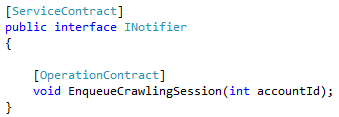
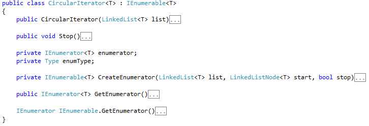

# Comunicazione intra-ruolo Web-Worker e bilanciamento del carico

#### Di [Roberto Freato](https://mvp.microsoft.com/it-it/PublicProfile/4028383) – Microsoft MVP

*Aprile 2012*

In questo articolo verranno discussi i seguenti argomenti:
-   Windows Azure Hosted Services
-   Web e Worker Roles

E le seguenti tecnologie:
-   Windows Communication Foundation
-   C\#

Una peculiarità e, se vogliamo, un differenziale del Cloud è
rappresentato dalla possibilità di scalare. Intendiamo la possibilità di
“attaccare” a run-time un servizio per avere più potenza computazionale,
esattamente come per anni abbiamo fatto in diversi ambiti
tecnico/pratici in prima persona.

Mi riferisco ad esempi di vita quotidiana, come l’aumento della potenza
erogata dal nostro impianto domestico di corrente alternata; per restare
sull’argomento energia, un esempio di scalabilità “domestica” si ha
quando per sopperire ad una mancanza di luminosità ambientale si
potenzia una lampadina (scale-up) oppure se ne aggiunge una o più
(scale-out). Nel Cloud computing e in Windows Azure questa è la norma.

Ma in questo articolo siamo qui per risolvere un problema di scalabilità
che è necessario formalizzare prima di procedere alla proposta di una
sua risoluzione.

Internal Endpoint
-----------------

In WA un servizio (o più propriamente, un ruolo) può avere degli
External Endpoint (InputEndpoint) come anche degli Internal Endpoint.
Sebbene a livello di configurazione non stiamo che indicando poco più di
un parametro di un firewall, c’è una informazione intrinseca nella sua
definizione. Infatti i primi sono aperture verso l’esterno, ovvero verso
l’Internet pubblico (un External Endpoint sull’80 corrisponde infatti a
rendere accessibile il servizio Web dall’esterno su HTTP); i secondi
sono delle aperture verso l’interno, ovvero verso altri ruoli dello
stesso Hosted Service.

Questa differenza, declinatasi nell’atto pratico a qualche riga di
configurazione come sotto, evidenzia la possibilità di fare comunicare
ruoli via TCP/IP.

Figura 1 - Esempio di Endpoint esterno su HTTP(s)

Figura 2 - Esempio di Worker Role con InternalEndpoint accessibile
    dal ruolo web

Ne emerge che potremmo implementare una qualche logica di comunicazione
tra ruoli al fine di gestire in modo push un genere di comunicazioni
che, in una architettura complessa, sorgono quasi sempre: è il caso
delle elaborazioni asincrone.

Sebbene il conoscitore zelante di WA possa pensare che le Azure Storage
Queues o l’AppFabric Service Bus siano la soluzione più “giusta” per
gestire la problematica (oltre che per disaccoppiare sistemi), potrebbe
talvolta essere un pleonasmo architetturale. È infatti vero che un
sistema a code disaccoppia molto di più che un sistema di
chiamata/interazione diretta: non è invece sempre vero che sia la
soluzione più performante o, nel caso di Azure, quella più
cost-effective.

Definizione del problema
------------------------

Introdotto quindi il contesto, vogliamo analizzare il seguente problema,
all’interno di un Hosted Service:

-   Il ruolo ServiceA, di tipo Web e con External Endpoint
    (aka InputEndpoint) di tipo HTTP/HTTPS, riceve dall’utente richieste
    di elaborazioni complesse.
-   A questo proposito ServiceA prende in carico la richiesta e la gira
    ad un worker role che, ricevuto il messaggio, si attiverà
    a soddisfarla.
-   Il WorkerRole, noto anche come ServiceB, dovrà essere in ascolto di
    rete (su una qualsiasi porta e su un qualsiasi
    protocollo supportato) in attesa dei messaggi da ServiceA.
-   ServiceB riceverà i messaggi e li elaborerà secondo la
    logica definita.

Si vuole raggiungere questa soluzione senza, ovviamente, l’utilizzo di
code e garantendo che il sistema sia bilanciato nel caso di WorkerRole
(ServiceB) multipli.

Bozza di soluzione
------------------

Per iniziare è necessario configurare i due servizi nel CSDEF, come
sopra, in modo da permettere la comunicazione. Una volta predisposta
l’apertura di porte, la soluzione (forse banale) si basa
sull’attivazione di un endpoint WCF lato ServiceB, con accesso via Proxy
lato ServiceA.

Per fare ciò procediamo, nel Worker, con:

Figura 3 - Attivazione di un WCF self-hosted sul WorkerRole

Figura 4 - Contratto del servizio di ricezione notifiche (1)

Lato client, una volta implementato il servizio, sarà necessario
generare il proxy con Visual Studio o come si preferisce, procedendo poi
alla chiamata al servizio:

Figura 5 - Attivazione del proxy WCF su TCP per la chiamata al
    Worker

Fino a qui la soluzione è banale, ma che indirizzo IP inseriamo
all’interno del CreateChannel?

    *Nota:* Il contratto del servizio di ricezione notifiche è un
    contratto preso da un progetto reale in cui la notifica genera una
    sessione di HTML-crawling long-running.

Assenza del bilanciamento su InternalEndpoint
---------------------------------------------

Come il titolo già largamente fa intendere, non c’è un indirizzo di
bilanciamento del carico per gli endpoint interni. Questo significa che,
sebbene per gli InputEndpoint (esterni) il nome del servizio
(x.cloudapp.net) così come l’IP siano quelli del load balancer, per gli
endpoint interni non esiste questo servizio.

Una prima banale e sbagliata soluzione potrebbe essere quella di
impostare la chiamata ad una e una sola istanza del ruolo ServiceB, di
fatto bypassando ogni logica di scalabilità nel caso sussistano più
istanze per il servizio. Per questo, la soluzione è costruirsi un
proprio bilanciatore software.

Bilanciamento intra-role tra diverse istanze di un WorkerRole
-------------------------------------------------------------

Anche qui, come già introduce bene il titolo, siamo arrivati a voler
definire un nostro bilanciatore. A tal proposito facciamo qualche
premessa:

-   Dobbiamo fare in modo che le varie istanze Web possano inviare un
    messaggio ad un “generico” servizio che a runtime sia poi
    effettivamente gestito da tutte le istanze del ruolo ServiceB
-   Non vogliamo implementare un bilanciatore di rete “professionale”
    e/o comunque con euristiche basate sul carico reale:
    -   Procederemo con l’implementazione di un Round-Robin sulle
        istanze worker.

In primo luogo, rispondiamo alla domanda: “come faccio ad ottenere a
runtime, la lista di tutte le istanze del mio ServiceB?”. La risposta
sta nell’oggetto RoleEnvironment che, come sappiamo, gestisce tutta la
scaffalatura del servizio Azure, compresa la conoscenza della topologia
di runtime.

Figura 6 - Ottenimento di tutti gli indirizzi degli endpoint delle N
    istanze di ServiceB

Ora dovremmo implementare una qualche struttura che ci consenta di
ciclare su questi endpoint e scegliere ad ogni chiamata l’endpoint
“successivo”. A questo proposito si propone l’implementazione di una
coda circolare (CircularIterator):

Figura 7 - L'iteratore circolare continua a enumerare sulla lista di
    partenza, riprendendo dall'inizio ad ogni terminazione

Ne consegue che a questo punto basterà tenere in memoria una istanza
condivisa di questo iteratore e wrappare la chiamata al servizio
specifico di un N-esimo ServiceB, dentro una chiamata generica, in modo
da rendere l’operazione su ServiceA il più trasparente possibile.

Figura 8 - Codice di inizializzazione dell'iteratore circolare con
    gli endpoints ottenuti precedentemente

Conclusioni
-----------

Abbiamo introdotto il problema del bilanciamento del carico su
InternalEndpoint proponendo uno scenario reale di utilizzo. Abbiamo
visto come, per sopperire alla mancanza di questa funzionalità, sia
possibile però ottenere la topologia del nostro ruolo e delle sue
istanze ed infine, come poter implementare un rudimentale bilanciatore
round-robin.

#### di Roberto Freato - Microsoft MVP

