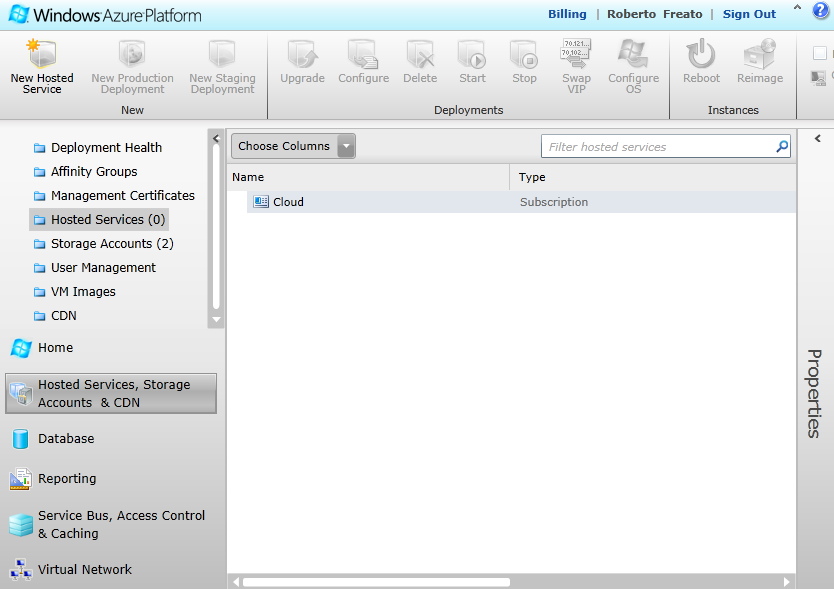
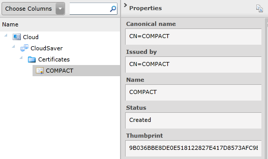
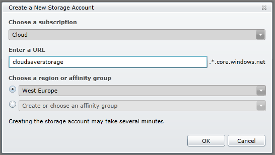
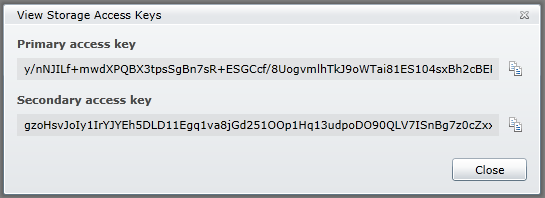
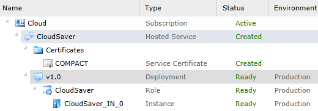
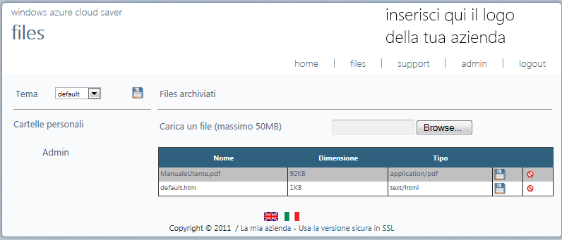
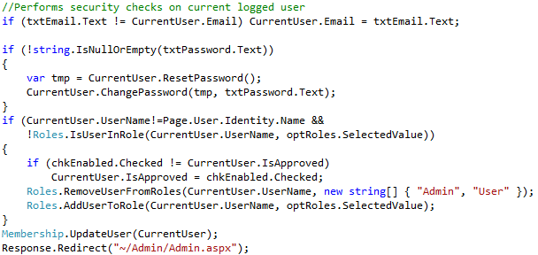
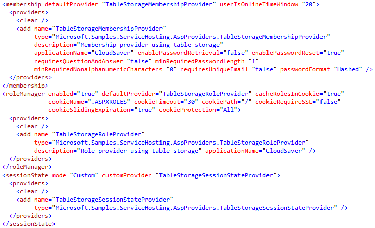

# Esempio di storage efficace privato su Azure con CloudSaver

#### Di [Roberto Freato](https://mvp.support.microsoft.com/profile=9F9B3C0A-2016-4034-ACD6-9CEDEE74FAF3)

*Marzo 2012*

In questo articolo verranno discussi i seguenti argomenti:

- Il problema dello storage nel cloud
- La soluzione

E le seguenti tecnologie:

- Windows Azure Storage
- Windows Azure Hosted Services
- ASP.NET

In questo articolo si parlerà del problema dello storage e di una sua
possibile chiave di lettura in ottica cloud computing. Inoltre,
sfruttando l’apertura a riguardo, si mostrerà come con Windows Azure sia
possibile accedere allo storage, navigando nel codice di un tool
(realizzato in collaborazione con Microsoft) che permette
l’archiviazione provata su cloud pubblico: CloudSaver.

Il problema dello storage
-------------------------

Ci hanno abituato a pensare che, siccome oggi lo storage costa poco, sia
diventato un problema “minore” in termini di impatto sul TCO di un
progetto. Ma, sebbene anche questo punto possa essere confutabile
(vedesi il problema dell’allagamento dei magazzini degli HD dell’estremo
oriente, con conseguenza impennata dei prezzi) rimane sempre il problema
di gestire grosse quantità di dati, gestirne il backup, la
delocalizzazione, la replica: tutto questo per venire incontro alle
esigenze di disaster recovery e di altà affidabilità/disponibilità del
dato, necessità sempre più crescente nello scenario odierno di
applicazioni sempre connesse.

Da questo punto di partenza si scende velocemente ad una conclusione: il
dato, sebbene sia veroche non costi poi così tanto, comparandolo ad
altri fattori molto più dispendiosi quali risorse di memoria o di
calcolo, è da gestire almeno al pari delle attenzioni che poniamo nel
gestire le altre risorse, se non con particolare cura. Infatti è nello
storage che risiedono i dati sensibili delle applicazioni: è lo storage
che potenzialmente può “bloccare” un flusso applicativo (senza il dato
spesso il software si blocca o si comporta in modo poco prevedibile) e
infine è il dato, stavolta inteso come risorsa binaria generica, su cui
il 95% di internet si fonda.

Basti infatti pensare a quante risorse vengano scaricate simultaneamente
per ogni pagina web richiesta ad un qualsiasi URL su internet, per
capire che anche solo con il 10% delle richieste di risorse fallite,
avremmo un Internet pieno di “buchi”, zone con immagini non
renderizzate, interi siti e applicazioni completamente inutilizzabili e
tutto perchè potenzialmente un server su cui milioni di utenti
richiedono la tale risorse CSS, in quel momento ha troppo carico o,
semplicmente, si sta riavviando.

A partire da questo scenario ci sono molte combinazioni di eventualità
che possono portare ad un disservizio o ad un problema generico per
colpa della non disponibilità del dato: più o meno tutti i problemi
legati al disaster recovery oggi sono infatti fortemente correlati
all’archiviazione fisica e alla topologia della rete.

La soluzione con il cloud storage
---------------------------------

Ogni tanto sento dire che “il cloud è storage” per definizione, strano
modo per dire che in effetti, una declinazione molto riuscita (se non la
più riuscita in assoluto) del cloud computing, sia la delegazione remota
dello storage, demandato da quello o quell’altro vendor in uno dei suoi
enormi datacenter.

Sebbene il problema di fondo rimanga, ovvero che può sempre avvenire un
evento catastrofico che faccia perdere il fatidico collegamento tra
l’utente e il suo dato (basti pensare alla server farm di Aruba in
fiamme nel 2011, al downtime di 4 giorni del datacenter della Virginia
di Amazon AWS oppure al down di qualche ora che ogni tanto “affligge” i
server di SQL Azure), il problema questa volta è quasi completamente del
fornitore del servizio. Lo SLA lo vincola a prendere le dovute
precauzioni per rendere sempre altissima la disponibilità del dato e
l’affidabilità dei sistemi: se il sistema salta, il fornitore di cloud
computing si troverà a pagare una penale, motivo più che efficace per
esternalizzare una parte così onerosa della propria “vita applicativa”.
Se poi inoltre pensassimo al vantaggio intrinseco della delocalizzazione
del dato “in-the-cloud”, si avrebbe alla luce un altro vantaggio: un
dato “lontano” dalla propria azienda è un dato necessariamente più
sicuro.

Non c’è bisogno di spiegare il perchè, ma vediamo in breve perchè
poterlo affermare con sicurezza. Qualsiasi siano le politiche adottate
da una qualsiasi azienda nel gestire il proprio dato all’interno delle
proprie strutture, nel caso di un evento disastroso il dato e il suo
backup si troveranno quasi sicuramente nella stessa location fisica,
annullando di fatto la precauzione dovuta al backup o alle multiple
strategie di gestione del rischio. Sebbene infatti una realtà possa
assicurare i propri dati in server con crittografia end-to-end e backup
continui, la delocalizzazione può risultare difficile, soprattutto per i
costi dovuti al trasferimento continuo di grandi quantità di dati in
datacenter remoti.

Ma se il dato fosse già, in partenza, sul datacenter remoto? La nostra
governance sarà esclusivamente sulla applicazione, vedendo lo storage
come “servizio” (con le opportune considerazioni sulla banda impegnata).
Non a caso, negli ultimi anni, soluzioni di Cloud Backup della leader
EMC (leggasi MozyHome) o analoghi prodotti come DropBox, Mesh e via
dicendo, sono diventati una tentazione troppo forte per chi fosse stanco
di dover gestire il problema del backup (in tal caso però rimarebbe il
problema della disponibilità).

Premesso questo, ora vedremo qualche internals di CloudSaver, un comodo
tool, disponibile qui: <http://cloudsaver.codeplex.com/> che permette di
creare un ponte Web tra l’utente e lo storage di Azure, fornendo nè più
nè meno un servizio di storage privato su autenticazione.

CloudSaver, dritti all’installazione
------------------------------------

Si può decidere di procedere all’installazione in due modalità:

- Dal codice sorgente
- Dal programma già compilato ed assemblato

Partendo dal codice sorgente si ha la possibilità di modificare a
piacimento le funzionalità di CloudSaver; utilizzando il prodotto già
compilato si può effettuare subito il deploy senza entrare nel merito
del codice del progetto.

#### Modifica del sorgente

Il progetto si può aprire direttamente da Visual Studio 2010 a patto di
avere installato l’SDK di Windows Azure, disponibile qui:

<http://www.microsoft.com/download/en/details.aspx?displaylang=en&id=28045>

Il progetto è realizzato in ASP.NET 4 Web Forms e utilizza:

- .NET Framework 4
- ELMAH
- AJAX Toolkit
- AspProviders

Una volta personalizzato il prodotto, si può fare tasto destro sul
progetto cloud e poi cliccare “Package”. Questo genererà un pacchetto
.cspkg e un file .cscfg pronti da distribuire su Windows Azure. Riguardo
alle modalità di modaifica dei sorgenti, c’è una sezione *più sotto*,
mentre il processo di deployment è descritto nella sezione seguente.

#### Installazione del pacchetto pre-compilato 

Se non si avesse ancora un account Windows Azure, è necessario crearlo
(per maggiori informazioni riguardo il processo di creazione, vedere la
guida su
<http://www.microsoft.com/online/help/it-it/helphowto/f9a74cd3-c940-4946-9095-433708a74552.htm>).

Attivata la sottoscrizione, la procedura è abbastanza intuitiva:

- Andare sul portale <https://windows.azure.com>
- Nella sezione “Hosted Services, Storage Accouts & CDN”, selezionare “Hosted Services”.

Figura 1 - Sezione "Hosted Services" del pannello di controllo
        di Azure

- Ora si deve creare un nuovo spazio di servizio, cliccando su
        “New Hosted Service”
    - Specificando il nome, l’alias dell’url e la regione di deploy

 Figura 2 - Pagina di creazione di un "Hosted Service"

   
- Successivamente si può procedere all’upload del certificato SSL
        preventivamente creato ed esportato insieme alla chiave privata
        (se non se ne possiede uno, si può procedere alla generazione
        seguendo la breve guida in 4.14.1):

Figura 3 - Upload del certificato SSL

- È necessario annotarsi il thumbprint del certificato,
        disponibile nella barra laterale nel pannello, dopo l’upload
        dello stesso:

Figura 4 - Certificato caricato, annotazione del Thumbprint

- Ci spostiamo ora nella sezione “Storage Accounts” e creiamo un
        nuovo servizio di storage (“New Storage Account”) come in
        figura:

Figura 5 - Creazione di un nuovo "Storage Account" e scelta
        della regione

   
- Annotiamo anche in questo caso il nome che abbiamo dato allo
        storage account e una delle sue chiavi di accesso (sempre nella
        barra laterale a destra):

Figura 6 - Finestra "Copia/Incolla" con le chiavi di accesso
        allo Storage

   
-  Ora dobbiamo modificare il file ServiceConfiguration.cscfg
        fornito con i seguenti parametri:
    - Nome account di storage (parametro {0})
    - Chiave di accesso allo storage (parametro {1})
    - Thumbprint del certificato SSL (parametro {2})
- *Alternativamente* , si può anche utilizzare il Tool
        **Microsoft.CloudSaver.Configurator.exe** per creare un file
        cscfg già compilato con i parametri necessari:

Figura 7 - Tool di autogenerazione del file CSCFG

   
-  A questo punto possiamo tornare negli “Hosted Services” e creare
        un deployment. Clicchiamo su “New Production Deployment”, diamo un
        nome (es. “v1.0”) e specifichiamo la location del pacchetto di deploy e
        del file di configurazione precedentemente modificato:

Figura 8 - Schermata di Deployment su Azure del pacchetto

- Se tutto è andato a buon fine, vedrete dopo pochi minuti una
        situazione del genere:

Figura 9 - Stato dell'applicazione caricata

#### Utilizzo

Dopo l’installazione, il prodotto è online e disponibile ad un indirizzo
nella forma: **\[tuaApp\].cloudapp.net**.

Ci rechiamo quindi all’indirizzo attivato e eseguiamo il primo accesso;
dopo qualche secondo in cui l’applicazione applicherà un autosetup,
vedremo la pagina principale:

Figura 10 - Schermata principale di CloudSaver

Il primo login è da effettuarsi con le credenziali amministrative di
default:

    Username: Admin
    Password: Passw0rd!

Nella modalità Amministratore (ovvero per tutti gli utenti con ruolo
“Admin”) si ha a disposizione una pagina “admin” in cui è possibile
creare nuovi utenti, modificarne i permessi, resettare le password e
gestire le impostazioni di sistema. Vediamo per esempio come aggiungere
un utente normale e come impostare il nostro logo e il nome della nostra
azienda:

Figura 11 - Inserimento di un nuovo utente (modo Admin)

Figura 12 - Modifica delle impostazioni di sistema

#### Processo di salvataggio dei files

Ogni utente (Admin o User) ha una sua personale cartella di salvataggio
files. Nella pagina “files” è possibile caricare, scaricare e cancellare
i propri documenti. Infine ogni utente può cambiare il suo tema
preferito con il menù a tendina sulla sinistra:

Figura 13 - Aggiunta/Rimozione del files nello storage sicuro

CloudSaver, dritti al codice
----------------------------

In questa sezione vedremo in rassegna quali sono i punti salienti di
questa semplice applicazione web che la abilitino a girare su Azure,
utilizzando il servizio di Blob Storage.

Figura 14 - Esempio di azione sullo storage allo scattare del login
    utente

Figura 15 - La creazione del profilo consiste nella creazione di un
    container e di alcune settings nel Table Storage

Figura 16 - Come si evince, si può utilizzare il RoleManager con
    provider sul Cloud

Figura 17 - La sicurezza, nonostante il provider sia on-the-cloud,
    rimane gestita in modo "classico"

Figura 18 - Procedura per listare i blobs di un particolare
    utente/container

Figura 19 - Procedura per scaricare tutti i blob da un blob storage
    pubblico su CloudSaver

Figura 20 - Riferimenti ai provider compatibili con Azure
    (necessitano di una connectionstring apposita)

Conclusioni
-----------

In questo articolo abbiamo analizzato il problema dello storage,
incrociandolo con una risoluzione basato sul Cloud Storage di Microsoft
Windows Azure. La soluzione CloudSaver presa in esempio mostra come sia
immediato integrare i servizi di storage all’interno di una applicazione
web e di come sia possibile configurarne anche altri aspetti,
utilizzando il Cloud.

Riferimenti
-----------

Tutti gli screenshot utilizzati in questi articolo sono liberamente
utilizzabili e reperibili al sito:
[http://cloudsaver.cloudapp.net](http://cloudsaver.cloudapp.net/).

#### di Roberto Freato ([blog](http://dotnetlombardia.org/blogs/rob/default.aspx)) - Microsoft MVP

