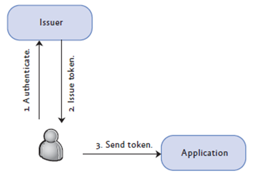
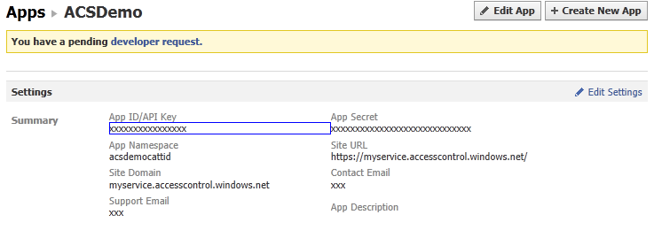
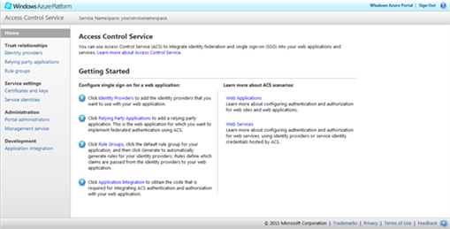
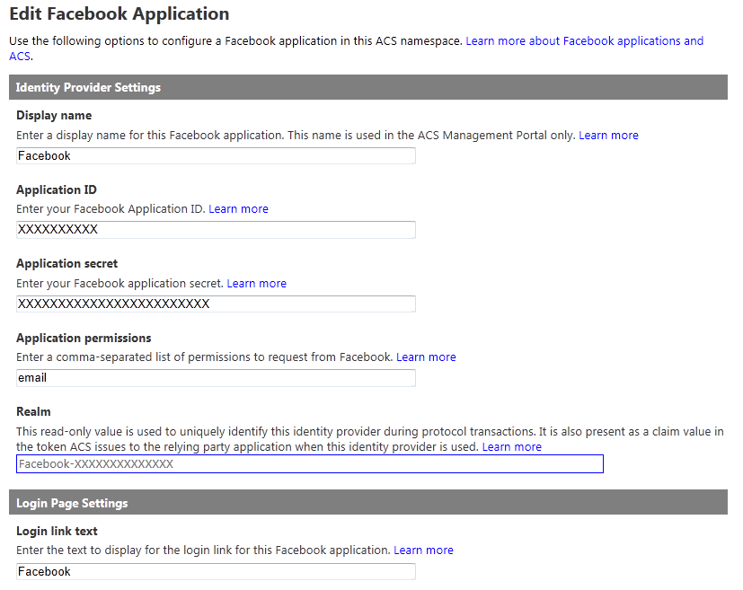
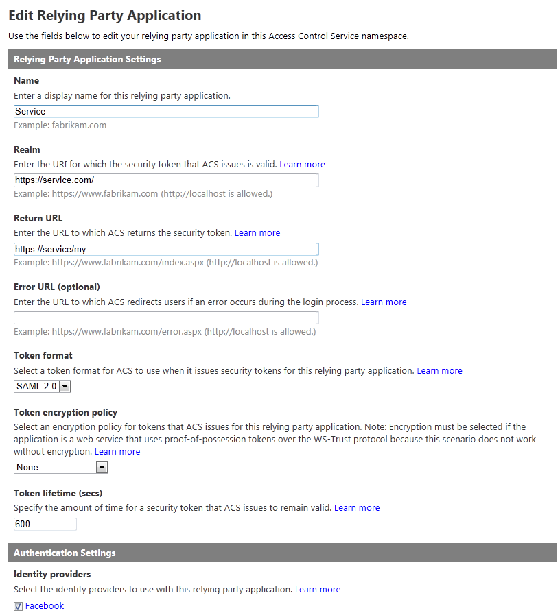
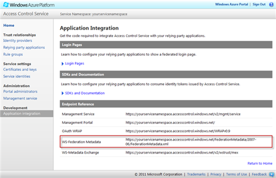

# Autenticazione login Facebook in app Web con ACSV2 

#### Di [Roberto Freato](https://mvp.microsoft.com/it-it/PublicProfile/4028383?fullName=Roberto%20%20Freato) – Microsoft MVP

*Maggio 2012*

In questo articolo verranno discussi i seguenti argomenti:
- Windows Azure Access Control Service (ACSV2)
- Facebook Development

E le seguenti tecnologie:
- Windows Identity Foundation
- ASP.NET

Sommario
--------

[Claim-based security](#claim-based-security)

[Creazione di una applicazione
Facebook](#creazione-di-una-applicazione-facebook)

[Configurazione di AppFabric Access Control
Service](#configurazione-di-appfabric-access-control-service)

[Conclusioni](#conclusioni)

È passato quasi un anno da quando ho parlato per la prima volta sul mio
blog di Access Control Service e da allora è uno degli argomenti se fa
più “stragi” (positive, si intende) di interesse ai seminari e negli
incontri con la community.

Il motivo penso sia semplice: non è banale poter integrare
l’autenticazione e talvolta l’autorizzazione di providers “famosi”
(quali LiveID, Google, Yahoo e Facebook) con un procedimento alla
stregua del Wizard (next, next, .. ) in poco più di 30 minuti. Ed in
effetti ACSV2 di AppFabric, fa esattamente questo.

Claim-based security
--------------------

L’autenticazione Claim-based, o più generalmente la gestione
dell’Identity tramite claims è un argomento insolitamente ostico ai
molti, che probabilmente già hanno utilizzato o implementato il pattern
a loro insaputa. Partiamo dalla necessità: autenticazione,
autorizzazione, varie ed eventuali. Oggi funziona così:

1. Il sistema custom chiede user-name e password (authentication)
2. Autentica verso la sorgente dati
3. Stabilisce i permessi (authorization)
4. Permette all’utente di procedere nelle operazioni

Lo svantaggio dei sistemi di autenticazione custom è che sono appunto
custom e che isolano l’applicazione invece di integrarla con altri
sistemi (a meno di procedure più o meno complesse per gestire il single
sing-on). Inoltre supponiamo di utilizzare Kerberos per
l’autenticazione: Kerberos durante il colloquio ci fornisce identità e
gruppi, ma se avessi bisogno di altri dati? Per esempio una email?

Allora dovrei certamente andare a fare query su AD (in caso di
autenticazione Windows) e comunque dovrei gestire la problematica
puntualmente.

Il concetto di Claims è un pò diverso:
1.  Un soggetto T vuole accedere alla risorsa X
2. Il gestore della risorsa X dice al soggetto T che ci vuole una certa autorizzazione per procedere
3. Il soggetto T si rivolge a Y chiedendo di erogare un documento valido per X
4. Y eroga il documento e T lo presenta al gestore di X per ottenere l’accesso (il gestore potrà così verificare che T abbia tutti i permessi per procedere)
 

Rispieghiamo tutto partendo dall’ormai celebre esempio del volo aereo.

Una persona che deve prendere una aereo oggi non deve recarsi
all’imbarco con una speciale smartcard che lo identifichi, erogata dalla
compagnia aerea, ovvero con una coppia di credenziali “custom” per
compagnia. Il processo attuale è infatti abbastanza claim-based:
- Una persona si reca ai banchi di check-in dove viene fatta una sorta di identificazione (con ID, Patente, Passaporto)
- A quel punto il personale consegna una carta di imbarco che, oltre a
    rappresentare l’autorizzazione a salire a bordo contiene molte
    informazioni
- Il personale al gate può, leggendo sulla carta di imbarco, ottenere
    dati di interesse riguardo al passeggero

Questo processo è una mappatura quasi 1:1 di ciò che avviene nel modello
Claim-based. Ora che sappiamo il meccanismo, ecco una immagine che
ispirerà i prossimi post a riguardo:

Figura 1 - Scenario e attori coinvolti in un processo di
    autenticazione CB

Abbiamo capito come si presenta lo scenario Claims-based e chi fa cosa
nel processo generale di gestione dell’identità. Ora però portiamo ad
esempio un’ulteriore e voluta complicazione: se non fosse più uno solo
il “tipo” di client da autenticare? Meglio: se ci fossero diverse entità
in gioco, con diversi sistemi di autenticazione, che si debbano
avventurare verso la nostra applicazione? Allora non potremmo più
dirigere tutte le richieste non autenticate ad un solo STS (Security
Token Service), ma dovremo gestirne più di uno.

In uno scenario più semplice, possiamo supporre che all’utente venga
chiesto con che provider proseguire (del tipo: LiveID, Facebook, Google
Account, etc) e utilizzare quindi diversi STS che però tornino alla
stessa applicazione target. A questo punto si introduce un problema: il
token generato dai vari STS sarà uguale? Al 90% no, come è giusto che
sia, in uno scenario in cui ogni attore può fornire dati diversi e in
diverso formato.

Ulteriore ed ultima domanda: come fa l’applicazione a gestire
l’eterogeneità dei vari token? Deve prevedere un meccanismo di
discernimento ad-hoc? E allora non stiamo ritornando ad una soluzione
custom?

La risposta a tutto questo è l’aggiunta di un ulteriore layer di
servizio che chiamiamo Federation Provider (FP in seguito). Un FP ha il
compito di prendere in ingresso N tipi di token diversi e generare una
trasformazione comune da inviare all’applicazione target. *AppFabric
Access Control Service* è proprio un FP su cui possiamo specificare la
logica di trasformazione e il trust per i nostri token e applicazioni.
ACS risolve anche il problema della scelta dei provider di
autenticazione, presentando all’utente un elenco dei provider
supportati.

Creazione di una applicazione Facebook
--------------------------------------

Il modello di interoperabilità di Facebook si basa sul concetto di
applicazioni. Lanciando una vera e propria best-practice, Facebook
necessita di una “applicazione” che venga creata sul portale ufficiale a
cui gli utenti “concedano” il permesso di usare i propri dati personali.

Per cominciare è necessario andare su:
<http://developers.facebook.com/apps>

Sarà poi necessario creare una nuova App, come in figura:

Figura 2 - Creazione di una App Facebook

Che poi dovrà essere configurata con le seguenti opzioni:

Figura 3 - Si dovrà sostituire "myservice" con il namespace che
    genereremo su ACS

A questo punto dovremo creare un namespace su ACS (chiamato “myservice”,
nel nostro caso) e configurarlo con API Key e App Secret.

Configurazione di AppFabric Access Control Service
--------------------------------------------------

A questo punto:

1.  Ci rechiamo sul pannello di controllo di ACS, ovvero su
    <http://windows.azure.com> nella sezione “Service Bus, Access
    Control & Caching”.
2.    Ci interessa l’ACS, quindi selezioneremo Access Control e poi “New
    namespace”
3.    Un volta scelto il nome del namespace (globalmente univoco), la
    regione e la Connection Pack Size (di cui rimandiamo
    l’approfondimento alla parte licensing), avremo creato il nostro
    namespace AppFabric sia per ACS che per SB.
4.    Ora andiamo nel portale relativo alla gestione di ACS, cliccando su
    Access Control Service nella schermata precedente.

Figura 4 - Schermata principale del servizio di ACSV2

Ora non ci resta che aggiungere tutti gli Identity Providers che
intendiamo supportare nella nostra applicazione: nel nostro caso,
procediamo con Facebook.

Facebook tuttavia ha “bisogno” di una applicazione per poter esporre le
proprie API di autenticazione, per cui procediamo ad inserire nei campi
in figura, le informazioni prese precedentemente dalla configurazione
dell’applicazione Facebook:

Figura 5 - Configurazione dell'Identity Provider

Ora bisogna stabilire il trust con l’applicazione locale che andiamo a
creare, andando a definire nella sezione “Relying party applications”,
le seguenti impostazioni (dove “service.com” è l’URL a cui risponderà la
nostra applicazione):
    
    **Nota:** In fase di test, l’URL potrà essere nella forma http://localhost/...

Figura 6 - Configurazione della nostra applicazione verso ACSV2

Automaticamente abbiamo generato un nuovo gruppo di regole, presente ora
nella sezione Rule Groups del pannello. Ora possiamo recarci lì,
selezionare il gruppo appena creato che avrà un formato simile a
“Default Rule Group for \[AppName\]”, e generare le regole di default
per tutti i provider selezionati (nel nostro caso avremmo abilitato solo
Facebook). Per finire, andiamo a prendere nota dei vari endpoint che ACS
ha impostato per il servizio di federazione (sotto Application
Integration):

Figura 7 - Definizione degli endpoint per i metadati di federazione

Per l’integrazione web, possiamo partire dalla costruzione di una
applicazione Web sulla base del template standard di Visual Studio 2010,
rimuovendo:

- La parte di login e il menu dalla master page

- Le seguenti sezioni dal Web.config
    - connectionStrings
    - system.web/authentication
    - system.web/membership
    - system.web/profile
    - system.web/roleManager
  

Avendo “pulito” la soluzione da tutti i fronzoli di autenticazione,
possiamo applicare l’STS alla nostra soluzione, cliccando con il destro
nel Solution Explorer e poi “Add STS Reference” (per poterlo fare è
necessario avere installato il WIF SDK). Si aprirà il wizard e dovremo
inserire:

- La configurazione della applicazione (il web.config)
    dell’app corrente.
- L’application URI
- L’endpoint STS (diremo “Use an existing STS”), specificando l’Url
    annotato prima sotto “WS-Federation Metadata”.
- Disabiliteremo la validazione della catena dei certificati (unico
    modo per procedere in fase di test, a meno di non utilizzare un
    certificato valido)
- Disabiliteremo l’encryption
- Confermeremo i Claims disponibili

A questo punto possiamo far partire la soluzione e ci verrà chiesto di
autenticarci con Facebook.

Conclusioni
-----------

Abbiamo visto come integrare l’autenticazione Claim-based all’interno di
una applicazione web, come supportare il meccanismo di autenticazione
basato su provider Facebook e di conseguenza come creare e configurare
una applicazione Facebook allo scopo.

#### di Roberto Freato - Microsoft MVP

