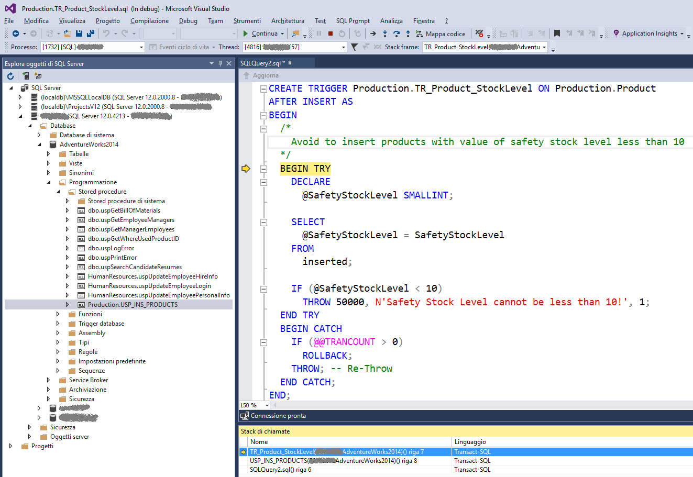

# Come effettuare il debug di un Trigger in SQL Server

Autore: Sergio Govoni (Microsoft Data Platform MVP)

Blog:
[*http://sqlblog.com/blogs/sergio\_govoni*](http://sqlblog.com/blogs/sergio_govoni)

Microsoft MVP Profile:
[*http://mvp.microsoft.com/it-it/mvp/Sergio%20Govoni-4029181*](http://mvp.microsoft.com/it-it/mvp/Sergio%20Govoni-4029181)

Twitter: *[@segovoni](https://twitter.com/segovoni) *

Introduzione
============

I più importanti linguaggi di programmazione hanno strumenti di debug
integrati direttamente nell’IDE. Il debugger ha tipicamente
un’interfaccia grafica che consente di esaminare i valori che assumono
le variabili durante l’esecuzione, il flusso del programma step-by-step
e permette di definire punti di interruzione in corrispondenza dei quali
fermare l’esecuzione del programma.

Ogni sviluppatore ama gli strumenti di debug, specialmente quando deve
capire perché un programma genera un errore o quando viene effettuato un
calcolo errato.

Pensiamo ora ad un Trigger definito su una tabella SQL Server e
supponiamo che tale Trigger esegua codice T-SQL talmente complesso da
mettere in difficoltà persino l’autore. In presenza di un bug, segnalato
ad esempio dal cliente presso il quale abbiamo installato il Trigger in
questione, come possiamo intervenire? È possibile eseguire il debug di
un Trigger? Se è possibile, come possiamo farlo?

Come effettuare il debug di un Trigger (T-SQL)
==============================================

Il debug di un Trigger è possibile attraverso l’ambiente di sviluppo
Microsoft Visual Studio.

Consideriamo il Trigger (di esempio) TR\_Product\_StockLevel definito
sulla tabella Production.Product del database AdventureWorks2014, il
seguente frammento di codice T-SQL ne implementa la creazione. Lo scopo
del Trigger è quello di impedire l’inserimento di nuovi prodotti aventi
come “Scorta di Sicurezza” valori minori di dieci.

```SQL
USE [AdventureWorks2014];
GO

CREATE TRIGGER Production.TR\_Product\_StockLevel ON Production.Product
AFTER INSERT AS
BEGIN
    /*
    Avoid to insert products with value of safety stock level lower than
    10
    */
    BEGIN TRY
    DECLARE @SafetyStockLevel SMALLINT;
    SELECT @SafetyStockLevel = SafetyStockLevel FROM inserted;
    IF (@SafetyStockLevel < 10)
        THROW 50000, N'Safety Stock Level cannot be lower than 10!', 1;
    END TRY

    BEGIN CATCH
        IF (@@TRANCOUNT > 0)
            ROLLBACK;
        THROW; -- Re-Throw
    END CATCH;
END;
```
Probabilmente, avrete già notato che il Trigger TR\_Product\_StockLevel
non è stato pensato per lavorare su più righe, l’autore (io in questo
caso) non ha considerato che la tabella virtuale “Inserted” potrà
contenere più righe nello stesso momento, per la stessa attivazione del
Trigger. Solo quando la tabella virtuale “Inserted” conterrà una sola
riga, il Trigger lavorerà correttamente e impedirà l’inserimento di
nuovi prodotti con valori della Scorta di Sicurezza non coerenti.

Il cliente presso cui abbiamo installato il Trigger lamenta però la
presenza di Prodotti, appena inseriti, con valori minori di dieci nella
colonna SafetyStockLevel. Vorremmo quindi poter effettuare il debug del
Trigger nello stesso modo in cui uno sviluppatore è abituato ad eseguire
il debug del codice di un’applicazione.

La prima cosa da fare, quando si desidera effettuare il debug di un
Trigger, è creare una stored procedure che sia in grado di innescare il
Trigger in questione. In questo esempio, trattandosi di un Trigger
attivo sull’evento “ON INSERT” della tabella Production.Product, è
necessario creare una stored procedure che contenga il comando di INSERT
per la tabella Production.Product.

Il seguente frammento di codice T-SQL implementa la creazione della
stored procedure USP\_INS\_PRODUCTS nel database AdventureWorks2014.
```SQL
USE [AdventureWorks2014];
GO

CREATE PROCEDURE Production.USP_INS_PRODUCTS AS 
BEGIN
    /*
    INSERT statement to fire Trigger TR_Product_StockLevel
    */

    INSERT INTO Production.Product
    (
    Name, ProductNumber, MakeFlag, FinishedGoodsFlag, SafetyStockLevel,
    ReorderPoint, StandardCost, ListPrice, DaysToManufacture,
    SellStartDate, rowguid, ModifiedDate
    )
    VALUES
    (
    N'BigBike8', N'BB-5388', 0, 0, 10 /* SafetyStockLevel */,
    750, 0.0000, 78.0000, 0, GETDATE(), NEWID(), GETDATE()
    ),
    (
    N'BigBike9', N'BB-5389', 0, 0, 1 /* SafetyStockLevel */,
    750, 0.0000, 62.0000, 0, GETDATE(), NEWID(), GETDATE()
    );
END;
```

Dopo aver creato la stored procedure in grado di attivare il Trigger,
dovremo eseguirla attraverso l’IDE di Microsoft Visual Studio come
descritto di seguito.

-   Eseguire Microsoft Visual Studio

-   Accedere alla finestra “Esplora oggetti di SQL Server” e collegare
    l’istanza SQL Server che ospita il database nel quale risiedono il
    Trigger e la Stored Procedure appena creata

-   Espandere il ramo relativo al database AdventureWorks2014

-   Espandere i rami “Programmazione” e “Stored procedure” per
    individuare la stored procedure USP\_INS\_PRODUCTS

-   Premere il tasto destro del mouse in corrispondenza della stored
    procedure USP\_INS\_PRODUCTS, verrà visualizzato un menu pop-up,
    selezionare quindi la voce “Debug Procedura…”. Verrà aperta
    automaticamente una nuova pagina di query pronta per eseguire il
    debug della stored procedure selezionata

La figura seguente illustra la pagina di query creata automaticamente
per effettuare il debug della stored procedure.


Figura 1 – Debug della stored procedure che scatena l’attivazione
    del trigger

Il puntatore è posizionato sulla prima istruzione dello script T-SQL
generato automaticamente dal debugger di Visual Studio. Utilizzando
l’esecuzione “passo-passo” (tasto funzione F11), sarà possibile eseguire
tutte le istruzioni dello script e della stored procedure fino al
comando di INSERT che attiverà il Trigger; a quel punto, premendo F11
sul comando di INSERT, l’**execution pointer verrà trasferito sulla
prima istruzione contenuta nel Trigger**, come illustrato nella figura
seguente.



Figura 2 – Debug del Trigger TR\_Product\_StockLevel

Continuando con l’esecuzione “passo-passo” (F11) sarà possibile eseguire
tutto il codice T-SQL contenuto nel Trigger. Osservando il valore
assunto dalle variabili si intuisce facilmente l’anomalia presente nel
codice. La variabile @SafetyStockLevel potrà contenere e verificare
soltanto una delle righe interessate dal comando di INSERT, assumendo
valide o non valide tutte le altre in funzione del risultato ottenuto
per la prima riga… abbiamo trovato il bug!!

Si osservi la finestra “Stack di chiamate”, mostra la catena di chiamate
che hanno portato ad attivare il Trigger, è molto utile in presenza di
Trigger multipli sulla stessa tabella o di Trigger nidificati.

Il seguente frammento di codice T-SQL corregge l’anomalia emersa nella
fase di debug.

```SQL
USE [AdventureWorks2014];
GO

ALTER TRIGGER Production.TR_Product_StockLevel ON Production.Product
AFTER INSERT AS
    BEGIN
    /*
    Avoid to insert products with value of safety stock level less than
    10
    */

    BEGIN TRY
        -- Testing all rows in the "Inserted" virtual table
        IF EXISTS (
            SELECT ProductID
            FROM inserted
            WHERE (SafetyStockLevel < 10)
        )
        THROW 50000, N'Safety Stock Level cannot be less than 10!', 1;
    END TRY

    BEGIN CATCH
        IF (@@TRANCOUNT > 0)
            ROLLBACK;
        THROW; -- Re-Throw
    END CATCH;

END;

GO
```

Gli esempi contenuti in questo articolo si basano sul database di
AdventureWorks2014 che è possibile scaricare dal sito CodePlex a questo
[*link*](http://msftdbprodsamples.codeplex.com/releases/view/125550).


