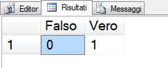
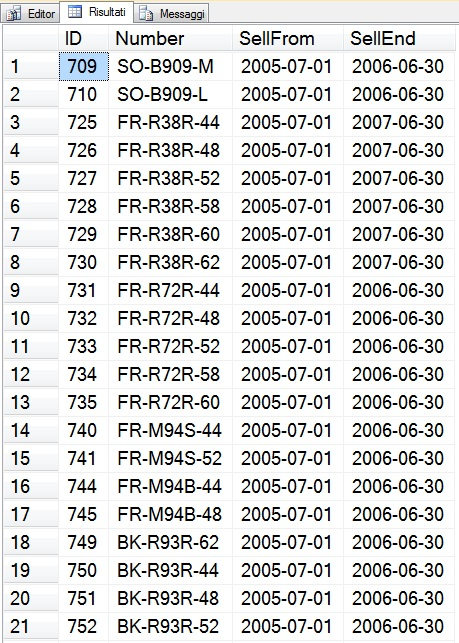

# EXECUTE statement in SQL Server 2012

#### Di [Sergio Govoni](https://mvp.microsoft.com/en-us/PublicProfile/4029181?fullName=Sergio%20Govoni) – Microsoft Data Platform MVP

English Blog: <http://sqlblog.com/blogs/sergio_govoni/default.aspx>

UGISS Author: <https://www.ugiss.org/author/sgovoni>

Twitter: [@segovoni](https://twitter.com/segovoni)


*Dicembre, 2012*

Introduzione
============

In questo articolo parleremo del nuovo gruppo di opzioni RESULT SETS implementate per la clausola WITH del comando [EXECUTE](http://msdn.microsoft.com/en-us/library/ms188332(v=SQL.110).aspx) in SQL Server 2012.

Quante volte avete avuto la necessità di utilizzare il result-set restituito, ad esempio, da una stored procedure? E quante volte il result-set restituito era esattamente come ve lo aspettavate? Pensando alle risposte a queste domande probabilmente vi ricorderete le situazioni in cui avete dovuto "adeguare" il result-set restituito in output dal comando EXECUTE, e uno dei workaround più tipici per risolvere il problema è quello di memorizzare tale result-set in una tabella temporanea per poterlo adeguare alle vostre esigenze.

L'opzione RESULT SETS garantisce metadati specifici per i result-set di una stored procedure o di un batch T-SQL implementando un "contratto" tra il comando EXECUTE (chiamante) e la relativa stored procedure o batch T-SQL (chiamato).


Le opzioni supportate da RESULT SETS
====================================

RESULT SETS supporta le seguenti opzioni:

- UNDEFINED
- NONE
- (&lt;result\_set\_definition&gt;)


RESULT SETS UNDEFINED 
=====================

L'opzione **RESULT SETS UNDEFINED** rappresenta il default; specificando questa opzione oppure omettendo RESULT SETS, il comando EXECUTE mantiene il comportamento che aveva nelle precedenti edizioni di SQL Server ovvero fino all'edizione 2008 R2. By default, lo statement EXECUTE **non** fornisce garanzie sui metadati restituiti dall'esecuzione di una stored procedure o di un batch T-SQL.

Nel seguente frammento di codice si osserva che i due statement EXECUTE restituiscono lo stesso output dimostrando che l'opzione RESULT SETS UNDEFINED rappresenta il comportamento di default.

```SQL
USE [tempdb];
GO

EXECUTE('SELECT ''MSDN ITA - Articoli tecnici''');
GO

-- RESULT SETS UNDEFINED (default)
EXECUTE('SELECT ''MSDN ITA - Articoli tecnici''') WITH RESULT SETS UNDEFINED;
GO
```

L'output è illustrato in Figura 1.


Figura 1 – L'opzione RESULT SETS UNDEFINED rappresenta il default

RESULT SETS NONE 
================

L'opzione **RESULT SETS NONE** garantisce che non vengano restituiti result-set per il comando EXECUTE. Verrà generato un errore qualora la stored procedure o il batch, invocati con EXECUTE, tentino la restituzione di un result-set. Nel seguente frammento di codice viene utilizzata l'opzione RESULT SETS NONE per garantire al chiamante che nessun result-set venga restituito.

```SQL
USE [tempdb];
GO

-- RESULT SETS NONE
-- Garantisce che non venga restituito alcun result-set
EXECUTE('SELECT ''MSDN ITA - Articoli tecnici''') WITH RESULT SETS NONE;
GO
```

L'output è illustrato in Figura 2, il batch T-SQL tenta di restituire al chiamante una colonna con il testo "MSDN ITA - Articoli tecnici", ma vista la presenza dell'opzione RESULT SETS NONE, che garantisce non vengano restituiti result-set, l'esecuzione verrà respinta con un errore.


Figura 2 – L'opzione RESULT SETS NONE garantisce che non vengano restituiti result-set

RESULT SETS ({…}) 
=================

L'opzione **RESULT SET (&lt;result\_set\_definition&gt;)** permette di definire esattamente i metadati attesi per tutti i result-set restituiti dal comando EXECUTE; garantisce che i metadati restituiti siano in accordo, per numero e tipo, con quelli definiti. Nel seguente frammento di codice, vengono definiti metadati specifici per l'unico result-set restituito dallo statement EXECUTE.

```SQL
USE [tempdb];
GO

-- RESULT SETS ({...})
-- Definisce i metadati per uno o più result-set
-- Garantisce che i metadati restituiti siano in accordo con quelli attesi
EXECUTE('SELECT 0 AS False, 1 AS True')
    WITH RESULT SETS
    (
        (
        [Falso] SMALLINT
        ,[Vero] SMALLINT
        )
    );
GO
```

L'output è illustrato in figura 3.



Figura 3 – L'opzione RESULT SET ({…}) definisce esattamente i metadati per il result-set

Nel prossimo esempio vedremo cosa accade quando si tenta di violare il "contratto", stabilito con l'opzione RESULT SET, tra chiamate e chiamato che individuiamo rispettivamente nel comando EXECUTE e nell'oggetto eseguito, sia esso una stored procedure o un batch T-SQL.

```SQL
USE [tempdb];
GO

-- Contratto violato: differente numero di colonne
EXECUTE('SELECT 0 AS False, 1 AS True')
 WITH RESULT SETS
  (
    (
      [Falso] SMALLINT
    )
  );
GO

-- Contratto violato: colonna NOT NULL
EXECUTE('SELECT 0 AS False, 1 AS True, NULL AS Col1')
  WITH RESULT SETS
  (
    (
      [Falso] SMALLINT
      ,[Vero] SMALLINT
      ,[ColA] BIGINT NOT NULL -- !!
    )
  );
GO
```

L'output è illustrato in Figura 4.


Figura 4 – Violazione del "contratto" definito tra chiamante e chiamato

Entrambi gli statement in Figura 4, sono stati respinti; il primo statement ha restituito un result-set composto da due colonne, la colonna "False" e la colonna "True", attraverso l'opzione RESULT SETS, la prima colonna è stata rinominata in "Falso" e il relativo tipo di dato convertito in SMALLINT, della seconda colonna però non vi è traccia nella definizione del risultato, da qui la violazione del "contratto" e la generazione dell'errore. Nel secondo statement, invece, il numero delle colonne attese è uguale al numero delle colonne restituite, una di essere però, la colonna "ColA" è definita NOT NULL mente il batch eseguito tenta proprio la restituzione di un NULL, anche in questo caso il "contratto" è stato violato.

EXECUTE... WITH RESULT SETS in azione 
====================================

Nel prossimo esempio, utilizzeremo la stored procedure *Production.uspGetProductForSell* che interroga la tabella *Production.Product* del database di esempio *[AdventureWorks](http://msftdbprodsamples.codeplex.com/releases/view/55330)*.

La stored procedure può restituire in output due result-set; il primo result-set, sempre presente, è rappresentato dai prodotti vendibili, dall'azienda, alla data passata nel parametro *@vDate*. Il secondo result-set, la cui presenza è condizionata da valori maggiori di zero nel parametro *@vPrice*, restituisce i prodotti vendibili, dall'azienda, alla data passata nel parametro *@vDate* e che hanno Prezzo di Listino minore o uguale al valore passato in *@vPrice*.

Prendiamo confidenza con i dati memorizzati nella tabella *Production.Product* del database *AdventureWorks*, la Figura 5 illustra alcuni dei record presenti in tabella.


Figura 5 – Dati contenuti nella tabella Production.Product

Definiamo ora la stored procedure *Production.uspGetProductForSell* utilizzata dagli operatori commerciali per conoscere i prodotti vendibili in un determinato momento. Come accennato precedentemente, la stored procedure accetta in input due parametri: *@vDate* rappresenta il giorno per il quale si desidera conoscere i prodotti vendibili e *@vPrice* rappresenta il parametro di filtro sulla colonna ListPrice. Il seguente frammento di codice implementa la CREATE della stored procedure nel database di esempio *AdventureWorks*.

```SQL
USE [AdventureWorks];
GO

CREATE PROCEDURE Production.uspGetProductForSell
(
  @vDate AS DATE
  ,@vPrice AS DECIMAL(8, 2) = 0
)
AS
BEGIN
  /*
  Stored procedure di esempio
  Restituisce i prodotti vendibili alla data passata come parametro
  */

  IF (ISNULL(@vDate, '') = '')
  BEGIN
    PRINT ('Errore: Valore del parametro @vDate non valido')
    RETURN
  END

  -- Primo result-set
  -- Prodotti vendibili alla data passata come parametro
  SELECT
    ProductID
    ,ProductNumber
    ,SellStartDate
    ,SellEndDate
  FROM
    Production.Product
  WHERE
    (@vDate BETWEEN SellStartDate AND SellEndDate)

  -- Secondo result-set
  -- Prodotti vendibili alla data passata come parametro
  -- con prezzo di listino minore o uguale al valore
  -- passato come parametro
  IF (ISNULL(@vPrice, 0) > 0)
  BEGIN
    SELECT
      ProductID
      ,ListPrice
    FROM
      Production.Product
    WHERE
      (ListPrice <= @vPrice)
      AND (@vDate BETWEEN SellStartDate AND SellEndDate)
  END
END;
GO
```

Eseguiamo ora la stored procedure *Production.uspGetProductForSell* per ottenere in output gli articoli vendibili al 31/12/2005, utilizzeremo il comando EXECUTE specificando la clausola RESULT SETS per assegnare un nome ed un tipo di dato specifico ad ogni colonna restituita.

```SQL
EXECUTE Production.uspGetProductForSell @vDate = '20051231'
WITH RESULT SETS
(
  -- Primo result-set
  -- Definizione dei metadati
  (
    ID VARCHAR(20)
    ,Number VARCHAR(40)
    ,SellFrom DATE
    ,SellEnd DATE
  )
);
```

L'output ottenuto è illustrato in Figura 6 dove si può osservare come le colonne della query eseguita all'interno della stored procedure siano state rinominate in accordo con quanto specificato nel comando EXECUTE.



Figura 6 – Prodotti vendibili al 31/12/2005, metadati specifici per il risultato

Oltre agli articoli vendibili ad una certa data, nel prossimo esempio desideriamo ricevere in output anche il secondo un result-set, che deve contenere, come nel caso del primo, gli articoli vendibili alla data passata in *@vDate*, ma che hanno Prezzo di Listino minore o uguale al valore passato nel parametro *@vPrice*. Nel prossimo esempio, illustriamo come sia possibile definire nome delle colonne e tipi di dato, anche per il secondo result-set.

```SQL
EXECUTE Production.uspGetProductForSell
    @vDate = '20051231'
    ,@vPrice = 400.00
    WITH RESULT SETS
    (
        -- Definizione dei metadati
        -- Primo result-set
        (
            ID VARCHAR(20)
            ,Number VARCHAR(40)
            ,SellFrom DATE
            ,SellEnd DATE
        ),

        -- Secondo result-set
        (
            ProductID VARCHAR(20)
            ,PriceLess400$ DECIMAL(8, 2)
        )
    );
GO
```

L'output ottenuto è illustrato in Figura 7.


Figura 7 – Prodotti vendibili al 31/12/2005 con prezzo di listino minore di 400,00\$, metadati specifici

Pulizia database 
================

```SQL
USE [AdventureWorks];
GO

IF OBJECT_ID('Production.uspGetProductForSell', 'P') IS NOT NULL
    DROP PROCEDURE Production.uspGetProductForSell;
GO
```

Conclusioni 
===========

L'opzione RESULT SETS implementata per il comando EXECUTE in SQL Server 2012, permette di definire **metadati specifici** per tutti i result-set restituiti; implementa un "contratto" tra il comando EXECUTE (chiamante) e i risultati restituiti da stored procedure o batch T-SQL (chiamato). L'Engine di SQL Server respingerà l'esecuzione dello statement qualora il "contratto" venga violato.

#### Di [Sergio Govoni](https://mvp.microsoft.com/en-us/PublicProfile/4029181?fullName=Sergio%20Govoni) – Microsoft Data Platform MVP

English Blog: <http://sqlblog.com/blogs/sergio_govoni/default.aspx>

UGISS Author: <https://www.ugiss.org/author/sgovoni>

Twitter: [@segovoni](https://twitter.com/segovoni)
