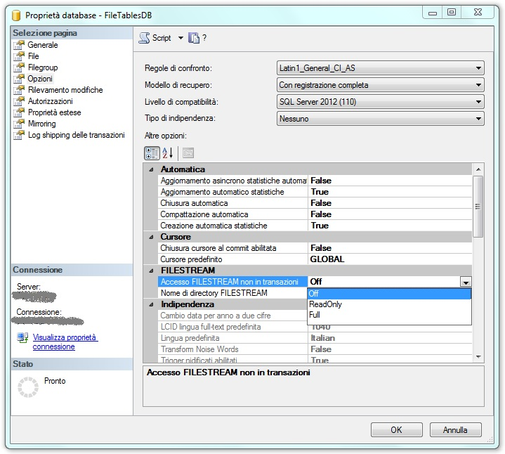
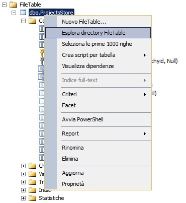
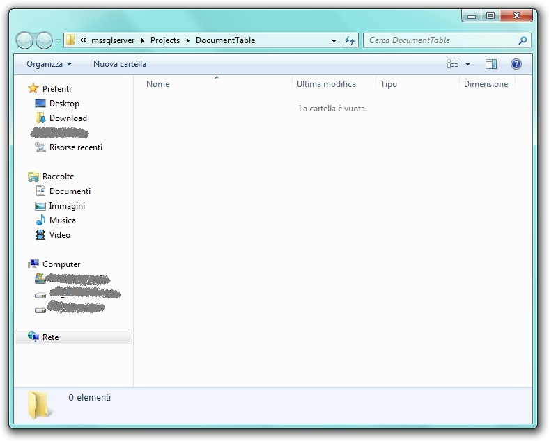
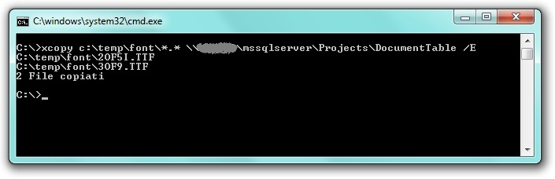
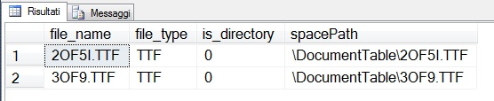

# FileTable in SQL Server 2012

#### Di [Sergio Govoni](https://mvp.microsoft.com/en-us/PublicProfile/4029181?fullName=Sergio%20Govoni) – Microsoft Data Platform MVP

English Blog: <http://sqlblog.com/blogs/sergio_govoni/default.aspx>

UGISS Author: <https://www.ugiss.org/author/sgovoni>

Twitter: [@segovoni](https://twitter.com/segovoni)


*Giugno, 2012*

Introduzione
============

Alcuni di voi avranno sicuramente apprezzato l'attributo [FILESTREAM](http://technet.microsoft.com/it-it/library/bb933993(v=sql.105).aspx) introdotto nella versione 2008 di SQL Server. FILESTREAM rappresenta il punto di contatto tra il mondo del file system e il mondo del database, concilia i vantaggi delle due tecnologie con una struttura dati gestita da SQL Server, ma appoggiata sul file system.

Abbiamo illustrato l'utilizzo del supporto FILESTREAM nel webcast [SQL Server 2008 R2: FILESTREAM Attribute](https://vimeo.com/87449251) disponibile sul [canale UGISS](https://vimeo.com/ugiss) di Vimeo.

Tuttavia, un limite evidente del supporto FILESTREAM è rappresentato dal fatto che le applicazioni tradizionali, che non conoscono SQL Server, non possono accedervi. L'accesso al supporto FILESTREAM, su SQL Server 2008, doveva essere eseguito utilizzando il linguaggio T-SQL oppure tramite speciali API .NET Win32. Molti clienti hanno quindi chiesto il potenziamento di questa tecnologia e l'implementazione del tradizionale accesso ai file, come avviene nelle applicazioni Office o con Esplora Risorse di Windows, mantenendo però i vantaggi del supporto FILESTREAM, ovvero la possibilità di includere, nel backup del DB, i file memorizzati nelle colonne VARBINARY(MAX) con attributo FILESTREAM e di poter eseguire ricerche con il servizio full-text search.

La risposta di Microsoft è arrivata con SQL Server 2012, che implementa [FileTable](http://msdn.microsoft.com/it-it/library/ff929144(v=sql.110).aspx).


FileTable
=========

FileTable permette ad una applicazione d'integrare la memorizzazione dei propri file all'interno di SQL Server, dove sarà possibile eseguire ricerche full-text e semantiche, anche su dati e metadati non strutturati. In altre parole sarà possibile memorizzare file e documenti in speciali tabelle di SQL Server chiamate *FileTables*; le applicazioni Windows potranno accedere a tali file come se fossero memorizzati (solo) nel file system senza implementare alcuna modifica.

La nuova caratteristica FileTable è basata sulla tecnologia FILESTREAM; **una FileTable è una tabella speciale, con uno schema fisso, creata dall'utente e utilizzata per la memorizzazione di dati FILESTREAM** (documenti, file o cartelle).


Prerequisiti 
============

Per utilizzare FileTable è necessario aver attivato il supporto FILESTREAM, dapprima a livello di sistema operativo e poi a livello d'istanza. Vedremo di seguito, che sarà inoltre necessario aggiungere al database, su cui vogliamo usare FileTable, un Filegroup dedicato.


Setup 
=====

Procediamo con il setup del database di esempio *FileTablesDB*, il seguente frammento di codice in linguaggio T-SQL implementa la creazione di questo database. Osserviamo la definizione del Filegroup aggiuntivo *FileStreamGroup* dedicato al supporto FILESTREAM.

```SQL
------------------------------------------------------------------------
-- Setup database
------------------------------------------------------------------------

-- Drop database if exists
use [master];
go

if DB_ID('FileTablesDB') is not null
    begin
    alter database FileTablesDB
        set single_user with rollback immediate;
    drop database FileTablesDB;
    end;
go

-- Create database
create database FileTablesDB on primary
(
    name = FileTablesDB_Data
    ,filename = N'C:\Program Files\Microsoft SQL Server\MSSQL11.MSSQLSERVER\MSSQL\DATA\FileTablesDB_Data.mdf'
    ,size = 5MB
    ,maxsize = 50MB
    ,filegrowth = 10%
),

-- This filegroup contains filestream data
FILEGROUP FileStreamGroup CONTAINS FILESTREAM
(
    -- The folder 'C:\Program Files\Microsoft SQL Server\MSSQL11.MSSQLSERVER\MSSQL\DATA\' must exists on the file system
    -- The subfolder '\FileTablesDB' is created by SQL Server
    name = FileTablesDB_FileStream
    ,filename = N'C:\Program Files\Microsoft SQL Server\MSSQL11.MSSQLSERVER\MSSQL\DATA\FileTablesDB_FileStream'
)

LOG ON
(
    name = FileTablesDB_Log
    ,filename = N'C:\Program Files\Microsoft SQL Server\MSSQL11.MSSQLSERVER\MSSQL\DATA\FileTablesDB_Log.ldf'
    ,size = 3MB
    ,maxsize = 10MB
    ,filegrowth = 3MB
);
go
```

Dopo aver creato il database che ospiterà FileTable, modifichiamo l'opzione *NON\_TRANSACTED\_ACCESS* sul DB appena creato (FileTablesDB). Il valore *FULL* assegnato a *NON\_TRANSACTED\_ACCESS* indica a SQL Server che tutti gli accessi a FileTable, derivanti dal file system, non saranno transazionali; non sarà quindi possibile ripristinare i dati di FileTable in un punto preciso (point-in-time restore). La non transazionalità delle modifiche è applicata solo agli accessi che avvengono tramite la condivisione file di Windows, qualsiasi altro accesso tramite T-SQL o API sarà completamente transazionale, anche se attiva l'opzione *NON\_TRANSACTED\_ACCESS*.


I valori supportati da *NON\_TRANSACTED\_ACCESS* sono:

- FULL
- READONLY
- OFF


Il seguente frammento di codice T-SQL imposta l'accesso non transazionale (FULL) per FileTable sul database di esempio *FileTablesDB*.

```SQL
------------------------------------------------------------------------
-- Set NON_TRANSACTED_ACCESS to FULL
------------------------------------------------------------------------

-- Change database context
use [FileTablesDB];
go

-- Alter database
alter database FileTablesDB
  set filestream (NON_TRANSACTED_ACCESS = FULL, DIRECTORY_NAME = N'Projects');
go
```

E' possibile ottenere lo stesso risultato anche da SQL Server Management Studio (SSMS) impostando il valore desiderato per l'opzione "Accesso FILESTREAM non in transazioni" nella finestra Proprietà database, scheda Opzioni, come illustrato in figura 1.



Figura 1 – Scheda Opzioni della finestra Proprietà database di SQL Server Management Studio


Creazione di una FileTable 
==========================

Procediamo ora con la creazione di una FileTable (letteralmente "tabella di file") nel database di esempio *FileTablesDB*; il seguente frammento di codice T-SQL implementa la creazione della tabella dbo.ProjectsStore.

```SQL
------------------------------------------------------------------------
-- Setup FileTable
------------------------------------------------------------------------
create table dbo.ProjectsStore as FileTable
with (
    FileTable_Directory = 'DocumentTable'
    ,FileTable_Collate_Filename = database_default
);
go
```

Una delle particolarità che possiamo osservare nel precedente statement è l'assenza di definizione dello schema; la tabella *dbo.ProjectsStore* è stata creata con lo schema predefinito per FileTable, che potete consultare sui BOL di SQL Server 2012 a [questo link](http://msdn.microsoft.com/en-us/library/gg492084(v=SQL.110).aspx).

Come descritto in precedenza, l'aggiunta o la rimozione di colonne allo schema fisso di un oggetto FileTable non è consentita. Il seguente frammento di codice T-SQL sarà quindi respinto da SQL Server:

```SQL
-- Alter FileTable schema... does not work
alter table dbo.ProjectsStore add test int null;
go
```

In output, il messaggio di errore sarà:

    Messaggio 33422, livello 16, stato 1, riga 2

    Impossibile aggiungere la colonna 'test' alla tabella 'dbo.ProjectsStore' perché si tratta di un oggetto FileTable. L'aggiunta di colonne allo schema fisso di un oggetto FileTable non è consentita.

Nello schema della tabella *dbo.ProjectsStore* troviamo colonne che descrivono le proprietà dei file di Windows (attributo di sola lettura, archivio, file temporaneo, file di sistema, ecc.), troviamo il path relativo rispetto alla root directory, memorizzato nella colonna path\_locator di tipo HIERARCHYID; il file effettivo, invece, si trova nella colonna file\_stream di tipo VARBINARY(MAX).

La figura 2 illustra la struttura della tabella *dbo.ProjectsStore*, si osservi il ramo dedicato a FileTable, posto allo stesso livello di quello dedicato alle tabelle di sistema.


Figura 2 – Schema predefinito per le tabelle FileTable

Per esplorare il contenuto della directory associata alla tabella *dbo.ProjectsStore* è sufficiente eseguire un click destro del mouse sulla FileTable e selezionare la voce "Esplora directory FileTable" dal menù contestuale. La figura 3 descrive graficamente l'operazione da eseguire.



Figura 3 – Menu click destro eseguito su un oggetto FileTable

L'output di questa operazione è illustrato in figura 4.



Figura 4 – Contenuto della directory associata alla FileTable *dbo.ProjectsStore*

La cartella ora è vuota; osserviamo il suo path, che contiene il nome della condivisione Windows (MSSQLSERVER) specificata durante la configurazione del supporto FILESTREAM, su cui si basa la tecnologia FileTable.

Eseguiamo ora la copia di tutti i file contenuti in C:\\Temp\\Font, specificando come cartella di destinazione la directory associata alla FileTable *dbo.ProjectsStore*; il seguente comando XCOPY permette di eseguire l'operazione di copia:

    xcopy c:\temp\font\*.* \\nome_server\mssqlserver\Projects\DocumentTable /E



Figura 5 – Copia file da C:\\temp\\font a FileTable

Nella cartella di destinazione ci aspettiamo di trovare tutti i file copiati, ma nella FileTable, cosa ci aspettiamo di trovare?

Il seguente frammento di codice interroga il contenuto della FileTable *dbo.ProjectsStore*:

```SQL
select
    name as [file_name]
    ,file_type
    ,is_directory
    ,file_stream.GetFileNamespacePath() as spacePath
    from
    dbo.ProjectsStore;
go
```

L'output è illustrato in figura 6:



Figura 6 – Contenuto della FileTable *dbo.ProjectsStore*

La copia dei (due) file, dalla cartella C:\\Temp\\Font alla directory collegata alla FileTable ha eseguito anche l'inserimento di un record, per ogni file copiato, nella tabella *dbo.ProjectsStore* memorizzando, di fatto, tali file nel database *FileTablesDB*, grazie al supporto FILESTREAM.

Con FileTable sono state rilasciate anche alcune funzioni che permettono di gestire e interrogare i dati attraverso il linguaggio T-SQL, un esempio è rappresentato dalla funzione *FileTableRootPath()* che fornisce il path di origine del file salvato su FileTable.

Con T-SQL è inoltre possibile:

- Creare nuove cartelle
- Aggiornare gli attributi di un file
- Spostare i file da una cartella ad un’altra
- Modificare il file vero e proprio


Conclusioni
===========

FileTable, una delle novità di SQL Server 2012, completa la tecnologia FILESTREAM e rappresenta una potente combinazione tra il linguaggio T-SQL e l'accesso classico al file system da parte delle applicazioni Windows che ora possono salvare con estrema facilità i propri documenti all'interno di SQL Server.

#### Di [Sergio Govoni](https://mvp.microsoft.com/en-us/PublicProfile/4029181?fullName=Sergio%20Govoni) – Microsoft Data Platform MVP

English Blog: <http://sqlblog.com/blogs/sergio_govoni/default.aspx>

UGISS Author: <https://www.ugiss.org/author/sgovoni>

Twitter: [@segovoni](https://twitter.com/segovoni)
