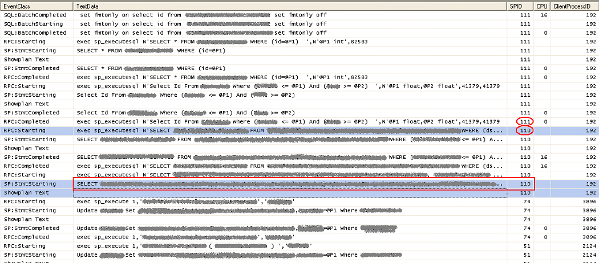
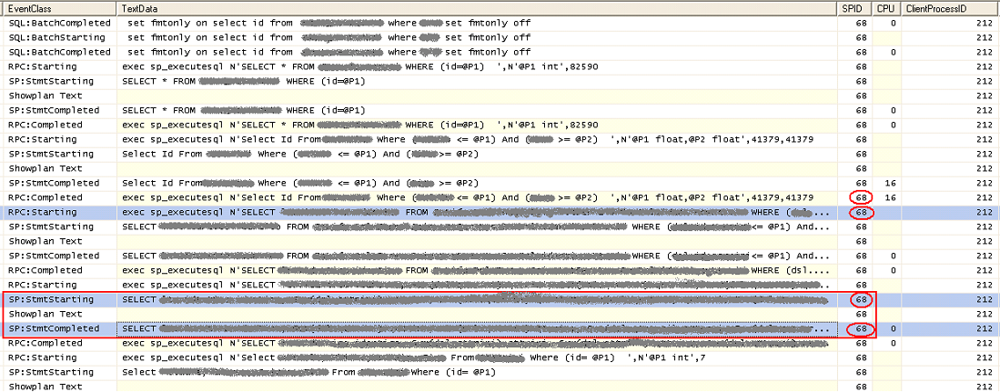

# Una inaspettata variazione di SPID (SQL Server, Session Process ID)

#### Di [Sergio Govoni](https://mvp.microsoft.com/en-us/PublicProfile/4029181?fullName=Sergio%20Govoni) – Microsoft Data Platform MVP

English Blog: <http://sqlblog.com/blogs/sergio_govoni/default.aspx>

UGISS Author: <https://www.ugiss.org/author/sgovoni>

Twitter: [@segovoni](https://twitter.com/segovoni)

*Aprile 2014*

Introduzione
============

Un po' di tempo fa, ho avuto l'opportunità di analizzare una situazione in cui si verificava un inaspettato cambiamento dello SPID relativo ad una connessione aperta da un'applicazione verso un database SQL Server. Lo [SPID](http://technet.microsoft.com/en-us/library/ms189535.aspx) rappresenta l'identificativo numerico assegnato da SQL Server ad ogni nuova sessione.

Inaspettata variazione dell'identificativo sessione (SPID)
==========================================================

Tutto è iniziato con la segnalazione di un cliente, che lamentava rallentamenti nell'applicazione, blocchi e talvolta errori di lock time-out. I rallentamenti e i blocchi non erano ovviamente sistematici e attribuibili ad un eccezionale carico di lavoro; si verificavano però principalmente su una determinata funzione Applicativa. Dopo svariati tentativi nel cercare di catturare questi tipi di lock, siamo finalmente riusciti a riprodurre il problema.

Siamo riusciti ad avere due file di traccia SQL Profiler relativi a due elaborazioni della stessa funzione Applicativa eseguita dallo stesso operatore, sullo stesso client e con gli stessi criteri. La prima elaborazione non è stata portata a termine a causa di un errore di lock time-out, mentre la seconda elaborazione è stata completata senza errori.

Confrontando i due file di traccia SQL Profiler, in uno dei due, si è osservata una "inaspettata variazione" dello SPID relativo alla sessione del processo che si stava monitorando, proprio nell'elaborazione che non è stata portata a termine. Ho scritto "inaspettata variazione" perché l'applicazione utilizza una sola connessione per eseguire tutte le query catturate da SQL Profiler.

La figura 1 illustra il file di traccia relativo all’elaborazione terminata con l'errore di lock time-out.

Figura 1 – File di traccia SQL Profiler con inaspettata variazione di SPID

Osserviamo le righe aventi *ClientProcessID* uguale a 192, in corrispondenza della prima riga selezionata c'è stata la variazione di SPID passato dal numero 111 al numero 110. L'elaborazione prosegue fino all'ultima query eseguita con lo SPID 110 che ha soltanto l'evento *SP:StmtStarting* senza il rispettivo *SP:StmtCompleted*. Questa query attende il rilascio dei lock posti sulle risorse accedute dall'ultima query eseguita con lo SPID 111. L'applicazione risulta quindi bloccata; ovviamente l'ultima query eseguita con lo SPID 111 e la prima eseguita con lo SPID 110 sono state inviate a SQL Server utilizzando la medesima connessione.

La figura 2 illustra il file di traccia SQL Profiler catturato durante la stessa elaborazione, eseguita a distanza di pochi minuti dalla precedente, sullo stesso client, dallo stesso utente e con gli stessi criteri.

Figura 2 – File di traccia SQL Profiler elaborazione senza variazione di SPID

Osserviamo ora le righe aventi *ClientProcessID* uguale a 212; come si può notare, tutte le query inviate a SQL Server vengono eseguite con lo SPID numero 68. Questa elaborazione è stata portata a termine senza errori ne rallentamenti.

Qual è la ragione di questa inaspettata variazione di SPID?
===========================================================

Parlando di questo problema con l'amico [Erland Sommarskog](http://www.sommarskog.se/), ad un certo punto mi ha chiesto: "Quali API usa l'applicazione?", "OLEDB" è stata la mia risposta, e lui ha replicato: "Abbiamo la risposta!".

Quando si utilizza OLEDB e si esegue una query su una connessione **che non ha completamente consumato l'intero data-set del precedente comando**, il comportamento di default è l'apertura, dietro le quinte, di una nuova connessione. La nuova connessione avrà **uno SPID differente**, che però potrà incontrare i lock posti dal suo predecessore.

Questo comportamento rappresenta un tentativo di ottimizzazione, applicato da OLEDB, in alcune situazioni, che però non sempre produce l'effetto desiderato!

#### Di [Sergio Govoni](https://mvp.microsoft.com/en-us/PublicProfile/4029181?fullName=Sergio%20Govoni) – Microsoft Data Platform MVP

English Blog: <http://sqlblog.com/blogs/sergio_govoni/default.aspx>

UGISS Author: <https://www.ugiss.org/author/sgovoni>

Twitter: [@segovoni](https://twitter.com/segovoni)

