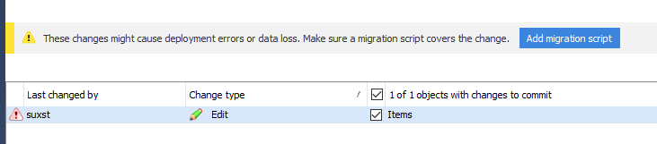
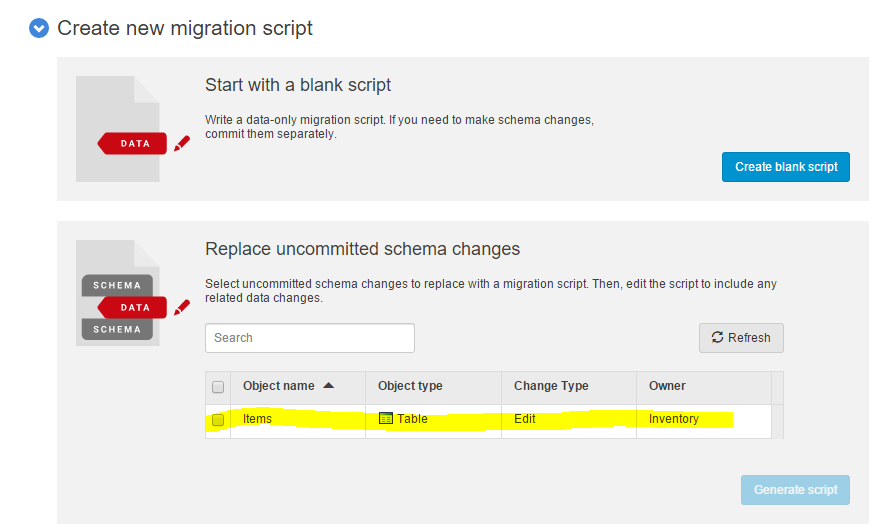
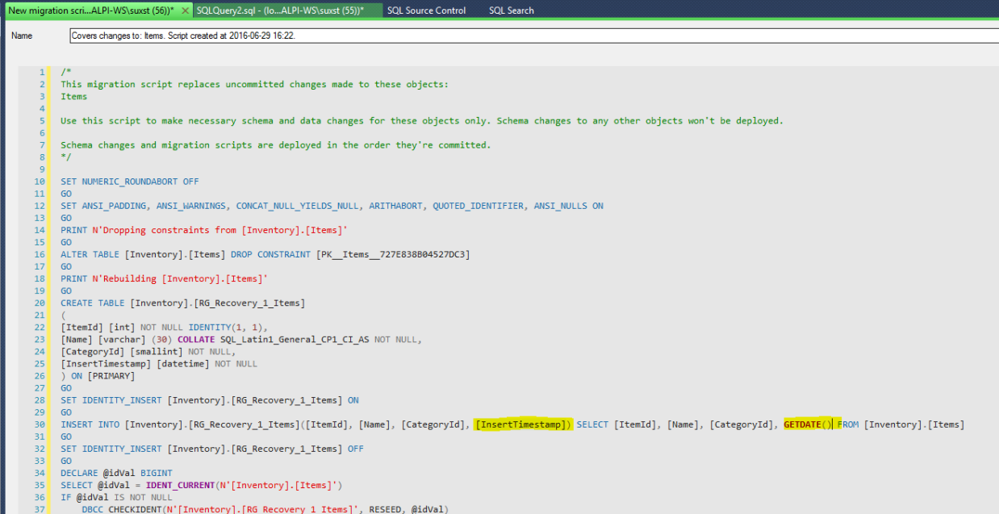
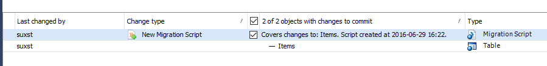
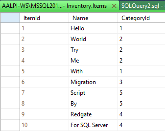
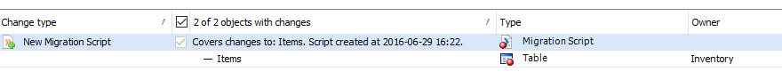
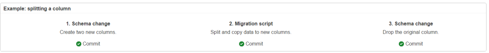
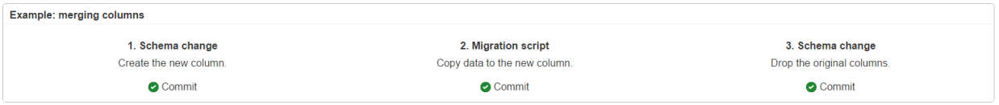
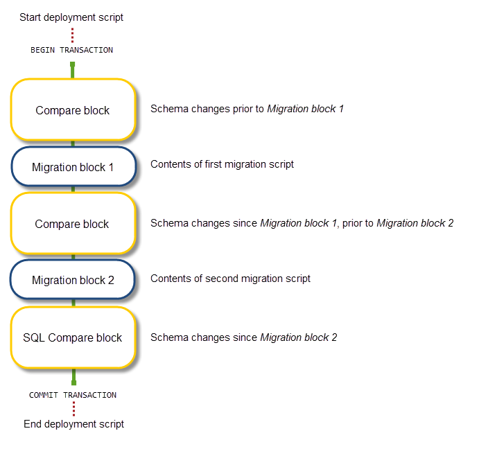

# Migrazioni e deployment in SQL Server

#### di [Alessandro Alpi](https://mvp.microsoft.com/it-it/PublicProfile/4014222?fullName=Alessandro%20Alpi) - Microsoft MVP

In questi giorni sono riuscito a provare la nuova funzionalità per gli
script di migrazione di [*SQL Source
Control*](http://www.red-gate.com/products/sql-development/sql-source-control/).
La feature, che ci consentirà di automatizzare i nostri rilasci anche a
database, ha una storia piuttosto lunga, ed è stata cambiata e
addirittura riscritta nel corso dell'ultimo anno.

## In cosa consiste?

Quando nei nostri changeset abbiamo modifiche che portano potenzialmente
a rotture dei deploy o a quello che in gergo viene chiamato data loss
(perdita di dati), dobbiamo in ogni modo scrivere uno script che
supporti la "migrazione", ovvero uno script che renda silente e
retrocompatibile la nostra modifica, senza che essa possa bloccare il
lavoro di altri sviluppatori o di un ambiente target di deploy. Ancora
maggiore è la necessità di questo processo nelle realtà in cui è stata
realizzata la continuous integration. In definitiva, dobbiamo evitare il
più possibile delle rotture dovute ai cambiamenti dello schema degli
oggetti database in modo da ridurre il rischio di regressione poi in
fase di pubblicazione.

Come dicevamo poco fa, si tratta di script, e, nella fattispecie, di
script t-sql custom, strettamente dipendenti e derivanti dagli oggetti
modificati. Sono salvati sul source control e poi automaticamente
"iniettati" in fase di deploy ed in sviluppo, nel momento più indicato,
in base a come viene scritto lo script stesso (pre modifica, post
modifica, semplice modifica di dati).

## La storia della funzionalità

L'implementazione del supporto alle migrazioni è stata affrontata più di
una volta da Red Gate sul suo SQL Source Control. Sfortunatamente, sono
stati evidenziati molti problemi, anche dal sottoscritto, tra i quali
uno dei più importanti è relativo al mancato supporto multi branch (dopo
una merge la migrazione veniva completamente dimenticata). Maggiori
informazioni su questo [*blog
post*](https://www.simple-talk.com/blogs/2016/06/02/sql-source-control-5-weve-solved-the-data-problem/).
Tuttavia, l'ultima versione (la v5) è una ottima implementazione, e
supporta anche la sorgente come Working Folder (indipendentemente dal
source control usato su quella cartella). Le versioni precedenti, che
sono tentativi di migrazione, sono state completamente superate dalla
qualità dell'ultima release.

## Uno scenario reale

Immaginiamo un ambiente in cui è stato utilizzato un Source Control
Manager centralizzato come [*Visual Studio Team
Services*](https://www.visualstudio.com/), con già definite alcune
branch a server:

- una cartella locale su di un Workspace mappato su di un progetto VSTS
- una cartella locale per ogni branch definita a server (*dev* | *main*
| *release*)
- la cartella del nostro database, una per ogni branch
(*dev/Database* | *main/Database* | *release/Database*)

Lo scopo di questo articolo è quello di dimostrare quali sono le
funzionalità disponibili per la gestione di due casi tipici. Il primo è
su un "breaking-change" molto comune, ovvero l'aggiunta di una colonna
NOT NULL su di una tabella, ed il secondo è un migration script
data-only, ovvero uno script che viene iniettato durante il deploy per
allineare i dati e non strettamente relativo allo schema.

## Migrazione per la colonna NOT NULL su tabella esistente

Aggiungere una colonna NOT NULL su di una tabella può portare a grossi
problemi di "consegna" delle nostre modifiche sullo schema. In sviluppo,
la get dell'ultima versione rischia di non poter essere applicata, a
causa della presenza di dati sulla tabella oggetto della modifica, e lo
stesso può capitare quando si consegna in produzione. 

Quando questo accade, è sempre possibile creare a mano script di "Pre"
e/o "Post" release, i quali aggiungono la colonna con supporto al NULL,
modificano i valori in modo da supportare la successiva modifica e,
infine, impostano il NOT NULL finale. Tutto fatto manualmente, il che
non solo porta ad un aumento degli errori umani possibili, ma anche
l'aumento del tempo di "sviluppo" impiegato per creare l'infrastruttura
e gli script, l'aumento del tempo di analisi per le naming convention e
le locazioni da utilizzare, ed, infine, ma di certo non per importanza,
la grande probabilità di dimenticarsi di eseguirli quando necessario.

Possiamo aver creato i migliori script di migrazione a mano, ma se poi
non vengono eseguiti, l'eccezione è garantita. Stavolta la probabilità
più alta è in sviluppo. Se non si conosce la necessità di eseguire sulla
propria macchina uno script di migrazione, si rischia di non capire per
molto tempo come mai il nostro database non si vuole allineare
all'ultima versione. Una perdita di tempo e di sforzi, insomma.

L'automazione è garantita con le migrazioni di SQL Source Control. Nella
fattispecie, vedremo che succede quando:

1. sostituiamo un change con un migration script
2. condividiamo il change con gli altri membri del team di sviluppo
3. facciamo merge delle branch (ad esempio da *dev* a *main*)
4. utilizziamo uno script di migrazione data-only

### 1 - Sostituzione del change con un migration script

Quando dobbiamo sostituire il cambiamento di schema proposto con il
nostro script custom, il miglior modo è quello di applicare uno
"schema-data-schema" migration script.

Supponiamo di avere due sviluppatori, Dev1 e Dev2, che stanno lavorando
sulla branch *dev* con un [*modello
dedicato*](https://documentation.red-gate.com/display/SOC5/Teams+using+the+dedicated+model)
per il database con SQL Source Control.

Entrambi hanno un database chiamato *StoreDb* ed una tabella chiamata
*Inventory.Items* che ha i campi *ItemId int PK*, *Name varchar(30)* e
*CategoryId smallint*. Dev1 ha la tabella Items vuota, mentre Dev2 ha
alcune righe all'interno di essa. Dev1, a questo punto, effettua la
modifica seguente:
```SQL
Use StoreDb;
GO

ALTER TABLE Inventory.Items ADD InsertTimestamp datetime NOT NULL;
GO
```

Siccome la tabella Items è vuota per Dev1, il comando viene eseguito
senza problemi. Tuttavia, Dev1, ignora completamente questo problema ma,
per fortuna, SQL Source Control lo avvisa prima che egli possa salvare
la versione:



Dev1 (nella figura è l'account *suxst*) ora può facilmente aggiungere
uno script di migrazione, relativo all'oggetto cambiato:



Premendo il pulsante "Generate script" verrà aperta la view di edit
dello script per l'oggetto selezionato:




Come potete notare, lo script non è completo, poiché è responsabilità di
Dev1 applicare le modifiche al comportamento per gestire senza
regressione l'aggiunta della colonna NOT NULL di cui sta cercando di
fare il commit. La parte evidenziata è l'aggiunta che Dev1 ha fatto allo
script built-in. Semplice e veloce. Ora egli può finalmente selezionare
"Save and close" per inviare il change tramite lo script appena creato:




**Nota:** Lo script generato SOSTITUISCE la modifica inizialmente
proposta dallo sviluppatore.

### 2 - Condividere i change agli altri sviluppatori


Che succede quando Dev2 prova una get dell'ultima versione? Di certo, se
Dev1 avesse inviato semplicemente il comando per creare la nuova
colonna, Dev2 non avrebbe potuto continuare con l'applicazione della
modifica dello schema (ricordiamo che quest'ultimo sviluppatore ha dati
- dieci righe - nella propria tabella *Inventory.Items*):




Ricordiamo anche che entrambi i dev stanno utilizzando database dedicati
che puntano ad una working folder, non direttamente ad un source control
manager, ma non cambia molto. La get nel secondo caso applicherebbe
direttamente i cambiamenti, mentre nel primo caso, dopo la get dei FILE,
l'applicazione avviene on demand, in un secondo momento, utilizzando
SSMS dopo il client del source control manager. Tuttavia, l'operazione è
la stessa. Tornando a noi, dopo la get, Dev2 vedrà quanto segue:




Compare la get del migration in sostituzione della modifica nativa di
Dev1. Grazie a questa sostituzione, Dev2 potrà continuare in totale
trasparenza. Applicando i change, infatti, avrà:


### 3 - merge di branch


Che succede quando il "lavorato" viene passato su un'altra linea?
Supponiamo di avere un'operazione di merge tra le branch *dev* e *main*.
L'operazione è del tutto simile a quella descritta in precedenza. La get
funziona esattamente come prima, il che significa che lo script di
migrazione è stato replicato nel repository di destinazione. Quindi
possiamo dire che il bug presente nel SQL Source Control 4 è stato
definitivamente risolto.

### 4 - utilizzare uno script di migrazione data-only


Quando la modifica è stata già inviata al source control e solo allora
dobbiamo aggiornare i dati nell'oggetto target della modifica, il
data-only è la scelta migliore. I refactor chiamati "split column"
(divisione o disaggregazione di una colonna in più di una) e "merge
columns" (unione o aggregazione di più colonne in una sola) sono ottimi
esempi.




lo scenario "Split" è riassumibile in:

- creare due nuove colonne, commit
- aggiungere lo script di migrazione per l'aggiornamento delle nuove
colonne, commit
- drop della colonna originaria, commit




lo scenario "Merge" è riassumibile in:

- creare la nuova colonna target, commit
- aggiungere lo script di migrazione per aggregare i valori dalle altre
colonne, commit
- drop delle colonne da cui abbiamo aggregato i dati, commit

In entrambi i casi, il delivery dei change rispetteranno l'ordine di
commit.

## Come lavora la feature "dietro le quinte"?


Qualunque deploy che coinvolge un migration script, consiste nella
comparazione di "blocchi" e "blocchi di migrazione":




SQL Source Control crea una serie di elementi all'interno di una
cartella denominata "Custom Scripts", che è all'interno della cartella
su cui è mappato il database:

- &lt;datetime&gt; ue auto: configurazioni ed impostazioni sulla
comparazione (anche *RedGateDatabaseInfo.xml*)
- &lt;datetime&gt; uf user: lo script di migrazione (sql script e json
file per la trasformazione)
- DeploymentOrder.json: ordine del deploy di migrazione da rispettare

In aggiunta, viene creata sul database target una tabella chiamata
[*RedGateLocal.DeploymentMetadata*](http://documentation.red-gate.com/display/SOC5/RedGateLocal.DeploymentMetadata).
Essa contiene la lista degli script di migrazione eseguiti e consente di
evitare la riesecuzione degli stessi. Maggiori dettagli
[*qui*](https://documentation.red-gate.com/display/SOC5/How+migration+scripts+work).

## La fase di deploy

Abbiamo più volte parlato di deploy, anche se Source Control non è
coinvolto nel processo. Con esso prepariamo il package del quale fare
deploy, tramite altri strumenti, anch'essi automatizzabili o
utilizzabili da software dedicati all'automazione del delivery (come
[*VS Release
Management*](https://www.visualstudio.com/en-us/features/release-management-vs.aspx), [*Octopus
Deploy*](https://octopus.com/),
[*Jenkins*](https://jenkins.io/index.html),
[*TeamCity*](http://www.jetbrains.com/teamcity/)). Le applicazioni
ufficiali di Red Gate sono [*SQL
Compare*](http://www.red-gate.com/products/sql-development/sql-compare/)
e [*SQL Data
Compare*](https://www.red-gate.com/products/sql-development/sql-data-compare/),
rispettivamente per strutture e dati, e il tool di [*DLM
automation*](https://www.red-gate.com/products/dlm/dlm-automation/).

Così come accade per la get/apply durante la fase di sviluppo, la
comparazione verifica la presenza della cartella "*Custom Scripts*" e
controlla il contenuto della tabella RedGateLocal.DeploymentMetadata. Se
il migration script è già stato eseguito, viene saltato, mentre in caso
contrario, viene eseguito nell'ordine con cui è stato fatto il commit.
Ciò significa che il package avrà al suo interno solo la cartella
"*Custom Scripts*" ma il database di destinazione dovrà essere dotato
della tabella suddetta. Se essa non esiste, il primo deploy si occuperà
di crearla.

## Conclusioni

La funzionalità descritta è finalmente arrivata ad un'implementazione
stabile ed efficace. Gli script suggeriti sono ben formati, tutto è
piuttosto semplice e chiaro. Inoltre, l'esperienza utente è gradevole e
ben seguita. Il punto più importante, è, a mio avviso, il vantaggio che
possiamo ottenere dalle migrazioni durante la fase di deploy, parlando
ovviamente di automazione. Improvvisamente infatti, per tutti coloro che
creavano script a mano per questo tipo di change, la necessità di
scrivere codice di migrazione cala drasticamente, riducendo, di fatto,
anche il margine di errore umano. Una volta definita una buona pipeline
ed una serie di regole da seguire, è sufficiente integrare il pacchetto
nel nostro strumento di deploy, ed è fatta. Anche il database non sarà
più un enorme problema di release.

Stay Tuned! 

