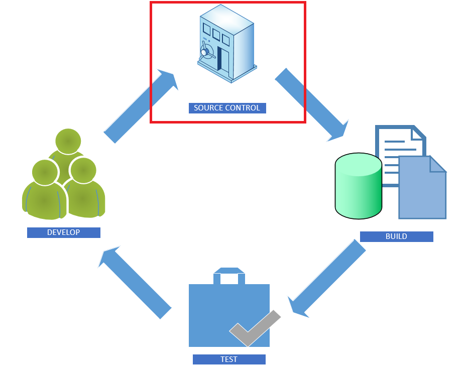
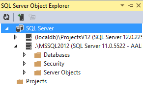
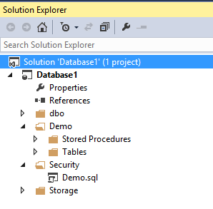
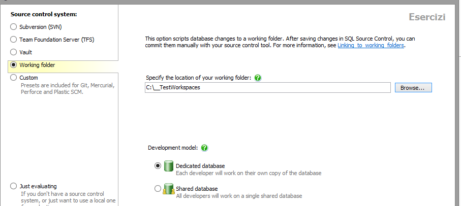
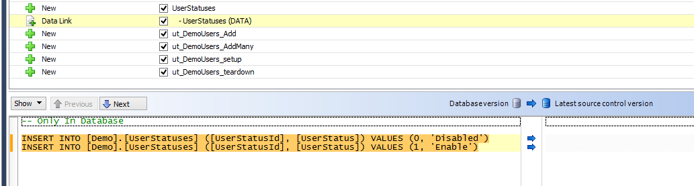
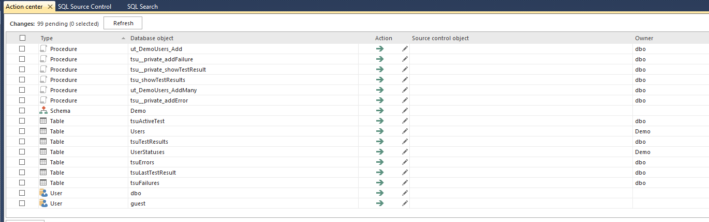
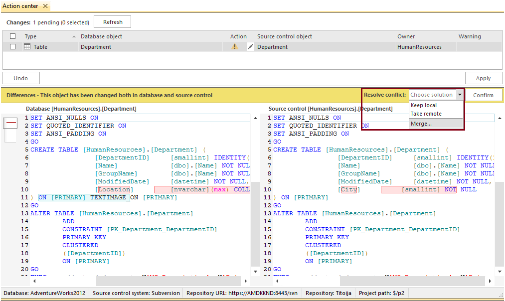

# SQL Server sotto source control

#### di Alessandro Alpi – Microsoft MVP

blog italiano: [http://blogs.dotnethell.it/suxstellino](http://blogs.dotnethell.it/suxstellino)

blog inglesi: 
- [http://blogs.dotnethell.it/suxstellino](http://blogs.dotnethell.it/suxstellino)
- [http://suxstellino.wordpress.com](http://suxstellino.wordpress.com)

sito web: [http://www.alessandroalpi.net](http://www.alessandroalpi.net)

Introduzione
------------

Abbiamo già trattato in questo articolo il concetto di *Continuous
Integration* e come essa rientra nel ciclo di vita del nostro database
(DLM). Nell’articolo abbiamo parlato di quanto mettere il database sotto
source control sia importante e di come testare le nostre unità di
lavoro. Tuttavia non abbiamo approfondito ogni passo. Per questo motivo
ora entreremo nei dettagli, partendo dal primo punto, il controllo del
codice sorgente:

Motivi per cui è importante mettere i nostri database sotto source control
--------------------------------------------------------------------------

- Sono varie le motivazioni per cui dovremmo pensare di considerare
l’ipotesi, ma in particolare possiamo focalizzarci su questi punti:
- I database devono essere sviluppati, quindi esisteranno sempre
cambiamenti (changeset)
- I database devono essere distribuiti all’interno del team, come succede
per il codice
- I database devono essere sincronizzati tra gli sviluppatori ad una
versione V
- I cambiamenti effettuati sul database dovrebbero essere allegati alle
attività eseguite (task)
- I database dovrebbero essere testati anch’essi prima di essere
rilasciati
- La fase di deploy di un database è complessa, quindi l’automazione può
alleggerire i processi

Il source control applicato a database può sembrare scomodo in partenza.
Se non si tratta di un file all’interno dell’applicazione (come un file
Excel, Access, ecc.), ad esempio scritta in Visual Studio, potrebbe
sembrare oneroso dover gestire le principali problematiche che una base
dati porta.

Ci sono scenari in cui un team lavora su server centralizzati in cui
sono installate istanze di SQL Server per lo sviluppo. In tali realtà,
gli sviluppatori producono codice direttamente sui database e le
modifiche, che possiamo definire “dirette”, sono istantaneamente
riflesse a chi sta lavorando in quella istanza. Se questo in un primo
momento può sembrare anche un vantaggio, a tendere, con la
strutturazione del team, diventa un grosso problema di conflitti.
Immaginiamo, ad esempio, uno sviluppatore che cambiasse una struttura
rendendola valida solo per il suo codice (che possiede solamente in
locale, non ancora inviato al source control). Questa modifica,
istantanea per natura, potrebbe essere un blocco nei confronti di altri
collaboratori che condividono l’utilizzo della risorsa cambiata. E non
sempre si è nello stesso luogo di lavoro. Questo può capitare con membri
interni del team, membri esterni al team, terze parti che collaborano,
ecc.

Altri scenari invece obbligano gli sviluppatori a spezzare la base dati,
o meglio, a ricrearla sotto forma di nuove copie, al fine di creare
diversi rami di sviluppo. Supponiamo di avere la necessità di
intervenire su una risorsa con due team differenti, per implementare due
funzionalità differenti, ma che condividono le stesse informazioni di
destinazione. In quel caso, siccome lavorare su di un solo punto rischia
di bloccare completamente il lavoro (o di ridurre la produttività non di
poco), si effettuano operazioni di copia, o di backup/restore di un
database selezionato in un particolare istante. Altre volte, si creano
schema sotto i quali mettere gruppi di lavoro differenti, anche se
questa strada risulterebbe molto presto poco comoda. Alla fine degli
sviluppi però, sarà necessario arrivare all’unione delle due
implementazioni. E non sempre arrivano allo stesso momento, anzi, nella
maggior parte dei casi una consegna arriva, anche di molto, prima
dell’altra. In tali casi, fare operazioni di “merge” delle differenze è
un processo decisamente oneroso (con la speranza che tutto vada come
deve, altrimenti si perdono modifiche o si creano, come minimo,
regressioni) e soggetto ad un numero elevato di errori umani. La
soluzione, inoltre, richiede un continuo backup dei database, per poter
tornare indietro in caso di errore di sviluppo. Insomma, rischia di non
essere una soluzione affidabile.

Il software, già di per sé, non è visto come un lavorato senza errori.
La maggior parte dei rilasci sul mercato portano naturalmente un insieme
di problemi noti. E tutti accettano questa condizione. Ma la riduzione
della qualità e dell’affidabilità non è di certo una caratteristica da
includere nel nostro lavoro. Mettere sotto controllo del codice sorgente
anche le basi di dati contribuisce ad evitare anche questi problemi.

Il source control ci viene in aiuto 
------------------------------------

Applicando una soluzione di controllo del codice sorgente, andiamo a
risolvere la maggior parte delle problematiche indicate nei paragrafi
precedenti. Rimangono solamente quegli ostacoli che la natura del
database porta, e che alla fine lo rendono diverso dalla realtà del
codice puro:
- Il database non è tutto e solo codice
- Il database persiste dati utente, che cambiano nel tempo

Non è tutto e solo codice poiché esistono comportamenti che non sono da
considerare nello sviluppo, ma soprattutto, persiste i dati e quindi
porta con sé maggiori possibilità di regressione, e di mancate
considerazioni in ambienti diversi da quello di produzione.

Tuttavia, con un source control avremmo tanti vantaggi:
- Gestione delle fix (tracciabilità e monitoring)
- Creazione di più rami di sviluppo in ambienti branch oriented
- Creazione di versioni differenti dello stesso database
- Ritorno a situazioni precedenti sfruttando le “label”
- Sincronizzazione dei nostri database per il team
- Documentazione salvata del database

Similitudini con il codice
--------------------------

Ci sono molte similitudini tra database e codice, più di quante si possa
pensare:

- La programmabilità, le DDL, gli statement della security, sono codice
T-SQL. Sempre codice.
- Le tabelle contenenti i dati di lookup (o statici) sono molto simili ad
enum.
- Dovrebbe andare di pari passo con le linee di sviluppo
- Anche il database ha le sue configurazioni di ambiente, pensiamo ai
linked server o alle login.

Come già detto, la vera differenza sta nel fatto che il database
persiste dati utente e quindi porta con sé uno stato. Questa è una
considerazione da non includere nel source control. Una volta fatto il
passo di disaccoppiare la realtà dei dati dinamici dalla struttura del
database, è tutto molto più semplice e naturale.

Strumenti per mettere sotto source control il nostro database
-------------------------------------------------------------

Vi sono vari applicativi che possiamo sfruttare per mettere il database
sotto source control.

Visual Studio – SQL Server Data Tools
-------------------------------------

Visual studio, con il suo Sql Server Data Tools (SSDT), consente la
creazione di progetti di tipo SQL Server. Sono progetti dedicati alla
gestione di database e consentono, come ogni altro template di progetto,
di mettere tutto il loro contenuto sotto source control. Inoltre
permettono la creazione di uno schema disconnesso rispetto all’istanza o
al file *dacpac* (data tier application) da cui esso è stato importato.
Quindi supporta lo sviluppo su database disconnesso e non, ma fornisce
tutti gli strumenti per connettersi ai source control manager (integrati
in Visual Studio abbiamo Visual Studio Online, Team Foundation Server,
Git).

Esso è disponibile nelle edizioni di Visual Studio indicate in questo
link.

I vantaggi dell’utilizzo di Visual Studio sono quelli intrinseci di
questo IDE. L’interfaccia è comoda, conosciuta e potente e consente di
sfruttare tutti i vantaggi dell’editor e del debug del codice.

Gli editor sono user-friendly ed è possibile utilizzare il solution
explorer ma anche un SQL Server Explorer dedicato alla connessione
diretta su server (o a localDB/Express).

Solution Explorer, visualizzazione organizzata a schema e visualizzazione a server

L’editor comprende:

- Designer user friendly per tabelle, viste, relazioni, ecc.
- Fogli di query per eseguire interrogazioni su database connessi
- Connessione LocalDB integrata
- Intellisense migliorato
- Opzioni di refactor e wrap/surround di codice
- Visualizza codice direttamente dagli oggetti
- Risoluzione dei riferimenti e delle dipendenze

Per approfondire le funzionalità di SSDT, leggere qui.

Red-Gate SQL Source Control
---------------------------

A differenza di Visual Studio, questo è un tool visto come add-in di SQL
Server Management Studio. Da come si può capire, risulta molto comodo
per gli sviluppatori abituati ad utilizzare per la maggior parte del
loro tempo l’IDE di gestione di SQL Server. Oltre all’integrazione con
SSMS, e quindi oltre alle interfacce utente e alle viste dedicate alla
configurazione del source control, possiede un proprio motore per
gestire i più comuni version control system. Non solo Visual Studio
Online, Team Foundation Server e Git, ma anche Subversion, Mercurial,
ed, in generale, tutti i source control che consentono la creazione di
working folder.

Con questo add-in è possibile definire anche il modello di sviluppo tra
**shared** e **dedicated**. Nel primo caso tutto il team lavora su di un
unico server di sviluppo (con istanza SQL Server) mentre nel secondo
ogni sviluppatore possiede la sua copia dei database, scaricata
direttamente dal source control.

Il modello **shared** offre semplicità di migrazione per chi è già
abituato a sviluppare su di un server centralizzato, ma allo stesso
tempo arricchisce l’esperienza con un tracking dei cambiamenti suddiviso
per utente. Viene applicato al server di sviluppo, su cui risiedono i
database di cui fare versioning. Il vero problema del modello, oltre
agli svantaggi di applicare modifiche riflesse istantaneamente al team,
è quello sulla fase di commit. Essa è decisa da una sola persona, per
cui lo sviluppatore che esegue la commit porta la propria versione sul
source control e sull’istanza, comprendendo le modifiche altrui,
potenzialmente da non considerare nel changeset. Inoltre non supporta la
get dell’ultima versione, in quanto l’unica versione è quella del
database al quale si è collegati.

Il modello **dedicated**, consigliato nella maggior parte dei casi,
porta un nuovo modo di concepire lo sviluppo del database. Non si è più
connessi all’istanza centrale, bensì su di una cartella che punta al
database dell’istanza locale. Ogni modifica di cui non sono state fatte
commit è dedicata solo allo sviluppatore che sta sviluppando su quella
macchina, fino alla commit, momento dopo il quale la modifica può essere
scaricata da chi fa get dell’ultima versione. Se il source control è
distribuito, come nel caso di git, la fase di conferma della modifica è
persistita su cartelle locali. Solo l’operazione di push renderà
disponibile al team i cambiamenti.

Oltre al modello abbiamo tante migliorie nell’interfaccia di SSMS come:
- Colori e simboli sui database e sugli oggetti sotto controllo del codice
sorgente
- Filtri per escludere o includere oggetti
- Tab per la get delle versioni
- Tab per la save delle modifiche
- Tab per l’inserimento di script di migrazione PRE e POST modifica

Il vero punto di forza di Red-Gate Source control, oltre ad una buona
gestione delle migrazioni nel caso di refactor pericolosi (come aggiunte
di colonne che potrebbero interrompere un rilascio a causa di violazioni
di constraint) è quello della gestione dei dati statici. Le tabelle di
lookup, spesso usate come riferimento di foreign key, possono essere
persistite sul source control.

Il dato è salvato sotto forma di script sql contenenti statement
**INSERT INTO**. L’aggiunta di una riga corrisponde ad una nuova INSERT
INTO, la modifica di valori è una modifica dei valori su una **INSERT
INTO** esistente e la cancellazione di un record è la rimozione del
relativo **INSERT INTO** esistente.

Per maggiori informazioni su questo tool, leggere qui.

ApexSQL Source Control
----------------------

Questo tool, anch’esso considerato anche un add-on di SQL Server
Management Studio, è un prodotto nuovo rilasciato da ApexSQL da poco,
come si nota anche dall’interessante roadmap. È ricco di spunti
notevoli, soprattutto dal punto di vista dell’interfaccia. Supporta
anch’esso i source control manager più famosi. È completamente integrato
con SSMS e dispone di un pannello di controllo molto snello e veloce,
chiamato Action Centrer.

L’action center non mostra solamente gli oggetti ed i tipi di modifica
che verranno effettuati in fase di accettazione dei cambiamenti, bensì
consente di mostrare anche le differenze per ogni oggetto preso in
esame:

Anche ApexSQL Source Control ha i due modelli di sviluppo supportati.
Anche in questo caso è consigliato seguire il modello dedicato, se non
per retrocompatibilità sulle proprie abitudini di sviluppo o per
necessità infrastrutturale.

In aggiunta al tab Action Center vi è un notevole arricchimento dei menu
contestuali sull’albero dell’object explorer in SSMS. Oltre alla
gestione delle label e del singolo commit di oggetto, vi è la possbilità
di lavorare offline con il comando “Go Offline” nel caso in cui si sia
collegati ad un source control manager centralizzato, come Visual Studio
Online.

Sfortunatamente, come Visual Studio, non supporta il salvataggio dei
dati statici, anche se in futuro il tool supporterà questa importante
funzionalità. Per verificare lo stato dell’arte, leggere qui.

I menu contestuali consentono di effettuare varie operazioni:

- Aggiunta e get di “label”
- Checkin/checkout e undo
- Rimozione di oggetti dal source control
- Editor delle opzioni di progetto

Uno dei punti di forza dell’add-in è quello di supportare le merge
manuali in caso di conflitto, tramite l’ausilio ti eseguibili free, come
ad esempio kdiff3. Fare merge manuali, consente di avere un completo
controllo sulla risoluzione dei conflitti e sulla qualità del nostro
codice.

Per maggiori informazioni, leggere qui.

Conclusioni
-----------

Ogni tool ha i suoi vantaggi e svantaggi per la gestione del database
sotto source control. La scelta degli strumenti di produttività
descritti dovrebbe essere basata sulle esigenze del team, sulla curva di
apprendimento da affrontare e sui costi che si vanno a sostenere.

Tuttavia, nonostante possa sembrare un argomento scomodo, si consiglia
di includere il database nelle logiche di version control. Gli strumenti
ci sono, e, soprattutto nel breve termine, i vantaggi si toccano con
mano. È molto importante avere controllo delle versioni e dei changeset
relativi alle nostre basi dati ed è estremamente utile tracciare gli
stessi con strumenti di team working. L’obbiettivo è quello di
utilizzare uno o più tool al fine di centralizzare la gestione dei
nostri progetti, sia dal punto di vista del codice, sia dal punto di
vista delle risorse che lavorano su di esso. Non seguire questa strada,
porta il rischio di tenere troppo distante i nostri database dal resto
dell’applicazione, con tutti gli svantaggi che questo comporta.

Risorse
-------

[Visual Studio SSDT help](http://msdn.microsoft.com/it-it/data/tools.aspx)
[Visua Studio Online](http://www.visualstudio.com/) 
[Git](http://git-scm.com/) 
[Github](https://github.com/) 
[Subversion](https://subversion.apache.org/) 
[Mercurial](http://mercurial.selenic.com/) 
[Red-Gate SQL Source Control](http://www.red-gate.com/products/sql-development/sql-source-control/)
[ApexSQL Source Control](http://www.apexsql.com/sql_tools_source_control.aspx) 
[Kdiff3](http://kdiff3.sourceforge.net/)

