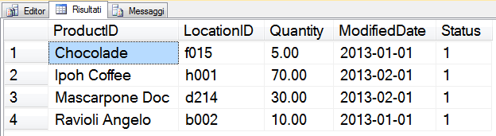
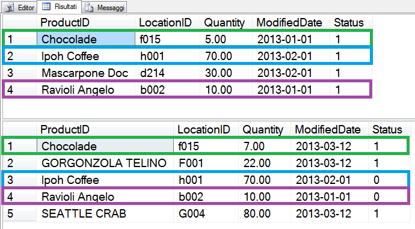

# SQL: Lo Statement MERGE e i Trigger

#### di [Sergio Govoni](http://mvp.microsoft.com/en-us/mvp/Sergio%20Govoni-4029181) - Microsoft MVP

Blog: <http://www.ugiss.org/sgovoni/>

Twitter: <https://twitter.com/segovoni>

1.  

*Aprile, 2013*

Introduzione {#introduzione .ppSection}
============

Abbiamo parlato dello statement MERGE nel precedente articolo [Come
usare lo Statement MERGE
(T-SQL)](http://msdn.microsoft.com/it-it/library/jj973188), ora
tratteremo un approfondimento che ci permetterà di comprendere il
comportamento di eventuali Trigger attivi sulla tabella (destinazione)
oggetto delle operazioni DML specificate nelle clausole del comando
MERGE. In particolare, risponderemo alle seguenti domande: Come viene
regolata l’attivazione dei Trigger definiti sulla tabella di
destinazione? L’esecuzione delle azioni specificate nelle clausole del
comando MERGE scatena l’attivazione di tali Trigger come una qualsiasi
operazione DML?

MERGE Trigger {#merge-trigger .ppSection}
=============

SQL Server non supporta i MERGE Trigger, tuttavia qualora esistano
oggetti Trigger definiti sulla tabella destinazione di un comando MERGE,
l’esecuzione delle azioni specificate nelle clausole del comando scatena
l’attivazione di tali Trigger come una qualsiasi operazione DML.

Esiste però una particolarità interessante: verrà scatenata una sola
occorrenza di ogni Trigger, in risposta al comando MERGE, anche in
presenza di esecuzioni multiple della stessa azione da parte di
quest’ultimo. Come sempre, i Trigger avranno accesso alle tabelle
virtuali Inserted e Deleted che conterranno tutte le righe modificate
dallo statement. Dimostreremo questa particolarità del comando MERGE
utilizzando lo scenario di esempio già precedentemente descritto
nell’articolo [Come usare lo Statement MERGE
(T-SQL)](http://msdn.microsoft.com/it-it/library/jj973188).

Scenario OLTP: Inventario di Magazzino {#scenario-oltp-inventario-di-magazzino .ppSection}
======================================

Ipotizziamo di eseguire l’inventario a rotazione, dei prodotti giacenti
a magazzino e di dover aggiornare le giacenze logiche, memorizzate nella
tabella dbo.ProductInventory del database AdventureWorks2012, con le
giacenze fisiche rilevate dagli operatori durante l’inventario. Il
comando MERGE sarà di grande aiuto per aggiornare i dati contenuti nella
tabella dbo.ProductInventory (destinazione). Si dovrà quindi prevedere
di:

1.  Aggiornare le giacenze e Inserire, nella tabella
    dbo.ProductInventory, eventuali nuovi prodotti rilevati a magazzino
    (e non presenti nella destinazione)

    Eliminare i prodotti non giacenti (giacenza uguale a zero)

    Aggiornare la colonna Status per i prodotti non rilevati (prodotti
    nella tabella di destinazione che non hanno corrispondenza
    nella sorgente)

Procediamo con la creazione della tabella dbo.ProductInventory sul
database AdventureWorks2012 (scaricabile da
[CodePlex](http://msftdbprodsamples.codeplex.com/releases/view/55330)) e
inseriamo alcuni dati di prova.

1.  USE \[AdventureWorks2012\];

    GO

    ------------------------------------------------------------------------

    -- Creazione tabella dbo.ProductInventory e inserimento dati

    -- di prova

    ------------------------------------------------------------------------

    -- dbo.ProductInventory

    IF OBJECT\_ID('dbo.ProductInventory', 'U') IS NOT NULL

    DROP TABLE dbo.ProductInventory;

    GO

    CREATE TABLE dbo.ProductInventory

    (

    ProductID VARCHAR(25) NOT NULL

    ,LocationID VARCHAR(20) NOT NULL

    ,Quantity DECIMAL(9, 2) NOT NULL

    ,ModifiedDate DATE NOT NULL DEFAULT GETDATE()

    ,Status BIT NOT NULL DEFAULT(1)

    ,constraint PK\_Product\_ProductID\_LocationID PRIMARY
    KEY(ProductID, LocationID)

    );

    INSERT INTO dbo.ProductInventory

    (

    ProductID

    ,LocationID

    ,Quantity

    ,ModifiedDate

    )

    VALUES

    ('Ravioli Angelo', 'b002', 10, '20130101'),

    ('Chocolade', 'f015', 5, '20130101'),

    ('Ipoh Coffee', 'h001', 70, '20130201'),

    ('Mascarpone Doc', 'd214', 30, '20130201');

    GO

Consultiamo i dati inseriti, essi rappresentano le giacenze logiche dei
prodotti in magazzino:

1.  USE \[AdventureWorks2012\];

    GO

    SELECT \* FROM dbo.ProductInventory;

    GO

L’output è illustrato in figura 1.

1.  


<!-- -->

1.  Figura 1 – Giacenze logiche dei prodotti in magazzino

I Trigger definiti nella tabella di destinazione {#i-trigger-definiti-nella-tabella-di-destinazione .ppSection}
================================================

Per analizzare il comportamento dei Trigger in presenza del comando
MERGE, definiamo sulla tabella di destinazione dbo.ProductInventory i
seguenti Trigger rispettivamente per le azioni INSERT, UPDATE e DELETE.

1.  USE \[AdventureWorks2012\];

    GO

    ------------------------------------------------------------------------

    -- Creazione trigger sulla tabella dbo.ProductInventory

    ------------------------------------------------------------------------

    CREATE TRIGGER dbo.Tr\_ProductInventory\_INSERT ON
    dbo.ProductInventory

    AFTER INSERT

    AS

    PRINT 'INSERT detected on dbo.ProductInventory';

    GO

    CREATE TRIGGER dbo.Tr\_ProductInventory\_UPDATE ON
    dbo.ProductInventory

    AFTER UPDATE

    AS

    PRINT 'UPDATE detected on dbo.ProductInventory';

    GO

    CREATE TRIGGER dbo.Tr\_ProductInventory\_DELETE ON
    dbo.ProductInventory

    AFTER DELETE

    AS

    PRINT 'DELETE detected on dbo.ProductInventory';

    GO

Questi Trigger di esempio eseguiranno semplicemente il comando PRINT, in
cui viene riportato il nome del Trigger e l’azione (INSERT, UPDATE o
DELETE) rilevata.

Le rilevazioni inventariali {#le-rilevazioni-inventariali .ppSection}
===========================

Ipotizziamo di raccogliere i dati inventariali nella tabella
dbo.FrequentInventory, che possiamo creare e popolare con alcuni dati di
prova (le rilevazioni inventariali) attraverso il seguente frammento di
codice T-SQL.

1.  USE \[AdventureWorks2012\];

    GO

    ------------------------------------------------------------------------

    -- Creazione tabella dbo.FrequentInventory e inserimento dei dati

    -- di prova che rappresentano le rilevazioni inventariali

    ------------------------------------------------------------------------

    IF OBJECT\_ID('dbo.FrequentInventory', 'U') IS NOT NULL

    DROP TABLE dbo.FrequentInventory;

    GO

    CREATE TABLE dbo.FrequentInventory

    (

    ProductID VARCHAR(25) NOT NULL

    ,LocationID VARCHAR(20) NOT NULL

    ,Quantity DECIMAL(9, 2) NOT NULL

    ,ModifiedDate DATE NOT NULL DEFAULT GETDATE()

    ,constraint PK\_FrequentInventory\_ProductID\_LocationID PRIMARY
    KEY(ProductID, LocationID)

    );

    go

    INSERT INTO dbo.FrequentInventory

    (

    ProductID

    ,LocationID

    ,Quantity

    ,ModifiedDate

    )

    VALUES

    ('CHOCOLADE', 'F015', 7, '20130312'),

    ('GORGONZOLA TELINO', 'F001', 22, '20130312'),

    ('SEATTLE CRAB', 'G004', 80, '20130312'),

    ('MASCARPONE DOC', 'D214', 0, '20130301');

    GO

Consultiamo le rilevazioni inventariali memorizzate nella tabella
dbo.FrequentInventory.

1.  USE \[AdventureWorks2012\];

    GO

    SELECT \* FROM dbo.FrequentInventory;

    GO

L’output è illustrato in figura 2.


Figura 2 – Rilevazioni inventariali nella tabella
    dbo.FrequentInventory

Il comportamento dei Trigger scatenati dalle azioni del comando MERGE {#il-comportamento-dei-trigger-scatenati-dalle-azioni-del-comando-merge .ppSection}
=====================================================================

Applichiamo ora l’inventario attraverso l’esecuzione del seguente
comando MERGE in cui sono state specificate tutte le clausole, compresa
la clausola WHEN NOT MATCHED BY SOURCE proprietaria del linguaggio
T-SQL.

Si noti che l’operazione di UPDATE sulla tabella di destinazione
dbo.ProductInventory verrà eseguita sia dalla clausola WHEN MATCHED (per
il prodotto “Chocolade” la cui giacenza viene aggiornata da 5 unità a 7
unità) che dalla clausola WHEN NOT MATCHED BY SOURCE (per i prodotti
“Ipoh Coffee” e “Ravioli Angelo” che non sono stati rilevati durante
l’inventario).

```SQL
USE [AdventureWorks2012];
GO

------------------------------------------------------------------------
-- Applichiamo l'inventario utilizzando il comando MERGE e analizziamo
-- il comportamento dei Trigger attivi sulla tabella di destinazione
-- dbo.ProductInventory
------------------------------------------------------------------------

BEGIN TRANSACTION;
GO

SELECT * FROM dbo.ProductInventory;
GO

MERGE INTO
dbo.ProductInventory AS itarget
USING
dbo.FrequentInventory AS isource
ON ((itarget.ProductId = isource.ProductId)
AND (itarget.LocationId = isource.LocationId))
WHEN MATCHED AND
(isource.Quantity <> 0)
AND ((itarget.Quantity <> isource.Quantity)
OR (itarget.ModifiedDate <> isource.ModifiedDate)) THEN

UPDATE SET
itarget.Quantity = isource.Quantity
,itarget.ModifiedDate = isource.ModifiedDate
WHEN MATCHED AND
(isource.Quantity = 0) THEN
DELETE
WHEN NOT MATCHED THEN
INSERT
(
ProductId
,LocationId
,Quantity
,ModifiedDate
)
VALUES
(
isource.ProductId
,isource.LocationId
,isource.Quantity
,isource.ModifiedDate
)
WHEN NOT MATCHED BY SOURCE THEN
UPDATE SET
status = 0;
GO

SELECT * FROM dbo.ProductInventory;
GO

ROLLBACK TRANSACTION;
GO
```

L’output è illustrato in Figura 3.



Figura 3 – Giacenze dei prodotti in magazzino prima e dopo
    l’inventario

Oltre all’aggiornamento dei dati, per effetto dei Trigger si ottiene
anche il seguente output:

- INSERT detected on dbo.ProductInventory
- UPDATE detected on dbo.ProductInventory
- DELETE detected on dbo.ProductInventory

Conclusioni {#conclusioni .ppSection}
===========

Il comando UPDATE è stato attivato ed eseguito in **due differenti
clausole** del precedente comando MERGE, ma **ha provocato solo una
attivazione del Trigger** dbo.Tr\_ProductInventory\_UPDATE per tutte le
righe modificate.

#### di [Sergio Govoni](http://mvp.microsoft.com/en-us/mvp/Sergio%20Govoni-4029181) - Microsoft MVP

Blog: <http://www.ugiss.org/sgovoni/>

Twitter: <https://twitter.com/segovoni>


