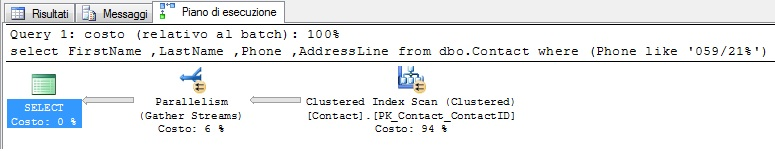

# SQL: Trasferire le statistiche di una tabella


#### di [Sergio Govoni](https://mvp.support.microsoft.com/profile/Sergio.Govoni) – Microsoft MVP ([blog](http://community.ugiss.org/blogs/sgovoni/))


*Maggio 2012*

Introduzione
------------

In questo articolo cercheremo di rispondere alla domanda: Come posso
simulare, in ambiente di test, le query che sono eseguite in produzione?
Senza fare il restore del DB nell’ambiente di test?

E’ possibile esportare le Statistiche di un database in produzione e
importarle in un database di test con lo stesso schema? Simulando quindi
la densità e la distribuzione dei dati nelle tabelle in produzione?

Prima di descrivere la soluzione, pensiamo a quello che avviene “dietro
le quinte” quando chiediamo a SQL Server di eseguire una query. Le tre
fasi fondamentali compiute, dall’Engine di SQL Server, durante
l’esecuzione di una query sono:

- [Query Parsing](#query-parsing)
- [Query Optimizer](#query-optimizer)
- [Query Execution](#query-execution)


Query Parsing
-------------

Durante la prima fase denominata Query Parsing, SQL Server verifica la
sintassi del comando T-SQL, controlla che gli elementi (operatori) del
linguaggio siano stati scritti e specificati correttamente; l’output di
questa fase è noto come Logical Operator Tree e rappresenta l’input per
la fase successiva svolta da un componente chiamato Query Optimizer.

Query Optimizer
---------------

Query Optimizer ha il compito di trasformare una query T-SQL in un piano
di esecuzione; genera e valuta molteplici piani di esecuzione con
l’obiettivo di sceglierne uno, quello che meglio permette di raggiungere
ai dati. La scelta del miglior piano di esecuzione passa attraverso la
valutazione delle statistiche che permettono di conoscere la selettività
(valore di densità) degli indici definiti nelle tabelle cui SQL Server
dovrà accedere. Le statistiche consentono al Query Optimizer di valutare
correttamente il costo dei possibili piani di esecuzione e di sceglierne
uno.

L’output di questa fase è noto come Estimated Execution Plan e
rappresenta l’input per il Query Execution.

Query Execution
---------------

Query Execution esegue la query nello Storage Engine in accordo con il
piano di esecuzione stimato.

Import/Export delle Statistiche di una tabella
----------------------------------------------

Le Statistiche influenzano quindi il Query Optimizer nella scelta del
piano di esecuzione ottimale, è per questo motivo che vogliamo
esportarle da un database in produzione per importarle in un database di
test, al fine di simulare la presenza dei dati all’interno delle tabelle
e analizzare in tutta tranquillità (offline) i piani di esecuzione
scelti da SQL Server per determinate query.

Ipotizziamo di avere un database in produzione chiamato
DB\_Export\_Stats che contiene, per semplicità, soltanto una tabella
denominata dbo.Contact che rappresenta l’anagrafica contatti. Il
seguente frammento di codice in linguaggio T-SQL permette di eseguire il
setup del database DB\_Export\_Stats:

```SQL
------------------------------------------------------------------------
-- Setup DB for export statistics
------------------------------------------------------------------------

use [master];
go

if exists(select * from sys.databases where name = 'db_export_stats')
begin
    alter database [db_export_stats]
    set single_user with rollback immediate;

    drop database [db_export_stats];
end
go

-- Create database
create database [db_export_stats];
go
```

Dopo aver creato il database, eseguiamo il seutp della tabella
dbo.Contact e il caricamento di 1.000.000 di record (contatti di test)
utilizzando il seguente codice T-SQL:

```SQL
------------------------------------------------------------------------
-- Setup table and insert data
------------------------------------------------------------------------
-- Change database context
use [db_export_stats];
go

-- Create table dbo.Contact (drop if exists)
if object_id('dbo.Contact', 'U') is not null
    drop table dbo.Contact;
go

create table dbo.Contact
(
    ContactID int identity(1, 1) not null
    ,FirstName varchar(128) not null
    ,LastName varchar(128) not null
    ,AddressLine varchar(40) default 'AddressLine'
    ,City varchar(40) default 'City'
    ,PostalCode varchar(5) default 'PCode'
    ,Phone varchar(20) not null
    ,ModifiedDate datetime default getdate()
);
go

-- Create function dbo.udf_GetNums
if (object_id('dbo.udf_GetNums') is not null)
    drop function dbo.udf_GetNums;
go

create function dbo.udf_GetNums(@m as bigint) returns table
as
return
with
    cte0 as (select n = 1 union all select n = 1),
    cte1 as (select n = 1 from cte0 as a, cte0 as b),
    cte2 as (select n = 1 from cte1 as a, cte1 as b),
    cte3 as (select n = 1 from cte2 as a, cte2 as b),
    cte4 as (select n = 1 from cte3 as a, cte3 as b),
    cte5 as (select n = 1 from cte4 as a, cte4 as b),
    cteres as (select row_number() over (order by n) as n from cte5)
    select n from cteres where n <= @m;
go

with cte_rows as
(
    select
        n
    from
        dbo.udf_GetNums(1000000)
)

insert into dbo.Contact
(
    FirstName,
    LastName,
    Phone
)

select
    'Nome_' + ltrim(str(n)),
    'Cognome_' + ltrim(str(n)),
    '059/' + ltrim(str(n))
from
    cte_rows;
go
```

Familiarizziamo con i dati di prova inseriti nella tabella dbo.Contact,
la Figura 1 illustra l’output che si ottiene eseguendo la SELECT
riportata di seguito:

```SQL
select * from dbo.Contact;
go
```


Figura 1 – Contenuto della tabella dbo.Contact

Applichiamo ora la Primary Key alla tabella dbo.Contact definita sulla
colonna ContactID; la creazione di questo Constraint, in questo
scenario, sulla tabella dbo.Contact ha come effetto la creazione
dell’indice cluster sulla tabella stessa. Poi eseguiamo la creazione di
un indice non cluster per migliorare le performance delle query che
interrogano i contatti applicando un filtro sulla colonna Phone.
Osserviamo anche l’utilizzo della stored procedure di sistema
[sp\_createstats](http://msdn.microsoft.com/en-us/library/ms186834.aspx)
che permette di creare le Statistiche per ogni colonna nelle tabelle
utente del database corrente.

```SQL
------------------------------------------------------------------------
-- Setup constraint and statistics
------------------------------------------------------------------------

alter table dbo.Contact
    add constraint PK_Contact_ContactID primary key (ContactID);
go

create index NCI_Contact_FirstName_LastName on dbo.Contact
(
    [Phone]
)
include
(
    [FirstName]
    ,[LastName]
);
go

exec sp_createstats;
go
```

Consultiamo ora le statistiche riguardanti la tabella dbo.Contact,
l’output è illustrato in Figura 2:

```SQL
exec sp_helpstats
    @objname = 'dbo.Contact',
    @results = 'ALL';
go
```


Figura 2 – Statistiche per la tabella dbo.Contact

Abbiamo allestito il database di produzione, ipotizziamo ora ci siano
diversi utenti pronti a interrogare i dati attraverso un’applicazione,
uno di loro desidera selezionare i contatti filtrandoli per la colonna
Phone attraverso l’operatore LIKE e invia a SQL Server la query
riportata di seguito. In Figura 3 osserviamo il piano di esecuzione
effettivo generato per la query; consultandolo si osserva la
parallelizzazione del task Clustered Index Scan.

```SQL
-- Query data
select
    FirstName
    ,LastName
    ,Phone
    ,AddressLine
from
    dbo.Contact
where
    (Phone like '059/21%')
go
```



Figura 3 – Piano di esecuzione effettivo in ambiente di produzione

La query precedente rappresenta (ovviamente) un esempio, nel mondo reale
l’istanza SQL Server si troverà a dover gestire migliaia di query al
minuto contemporaneamente ad altre attività, le operazioni di
monitoraggio e di tuning vorremmo venissero eseguite offline per non
stressare ulteriormente la macchina e per lavorare in sicurezza su un
database in ambiente di test. Come potrei simulare, in ambiente di test,
la precedente query su dbo.Contact senza disporre dei dati veri e
propri? Alcuni clienti (giustamente) non hanno piacere vengano presi i
backup dei DB in produzione, oppure semplicemente il backup potrebbe
essere centinaia di GB.

Una soluzione è rappresentata dall’esportazione di tutte le statistiche
presenti sulla tabella dbo.Contact per la successiva importazione su un
DB vuoto avente lo stesso schema del database DB\_Export\_Stats.

Procediamo quindi con il seutp del database DB\_Stats\_Only che conterrà
la tabella dbo.Contact con lo stesso schema dell’omologa tabella sul
database DB\_Export\_Stats, unica differenza: sul database
DB\_Stats\_Only non verrà eseguito il caricamento dei contatti.

```SQL
------------------------------------------------------------------------
-- Setup DB with statistics only
------------------------------------------------------------------------
use [master];
go

if exists(select * from sys.databases where name = 'db_stats_only')
begin
    alter database [db_stats_only]
    set single_user with rollback immediate;

    drop database [db_stats_only];
end
go

-- Create database
create database [db_stats_only];
go

------------------------------------------------------------------------
-- Setup table dbo.Contact
------------------------------------------------------------------------

-- Change database context
use [db_stats_only];
go

-- Create table dbo.Contact
if object_id('dbo.Contact', 'U') is not null
    drop table dbo.Contact;
go

create table dbo.Contact
(
    ContactID int identity(1, 1) not null
    ,FirstName varchar(128) not null
    ,LastName varchar(128) not null
    ,AddressLine varchar(40) default 'AddressLine'
    ,City varchar(40) default 'City'
    ,PostalCode varchar(5) default 'PCode'
    ,Phone varchar(20) not null
    ,ModifiedDate datetime default getdate()
);
go

------------------------------------------------------------------------
-- Setup constraint
------------------------------------------------------------------------
alter table dbo.Contact
    add constraint PK_Contact_ContactID primary key (ContactID);
go

create index NCI_Contact_FirstName_LastName on dbo.Contact
(
    [Phone]
)

include
(
    [FirstName]
    ,[LastName]
);
go
```


Eseguiamo, in ambiente di test, la stessa query eseguita in precedenza
in ambiente di produzione (piano di esecuzione illustrato in Figura 3),
come si può facilmente intuire il piano di esecuzione sarà diverso, il
Query Optimizer, in questo caso (nessun record nella tabella
dbo.Contact), sceglierà di eseguire una scansione dell’indice cluster,
ma senza parallelizzare il task; il piano di esecuzione effettivo è
illustrato in Figura 4.

```SQL
use [db_stats_only];
go

-- Query data
select
    FirstName
    ,LastName
    ,Phone
    ,AddressLine
from
    dbo.Contact
where
    (Phone like '059/21%');
go
```

<!-- -->


Figura 4 – Piano di esecuzione effettivo in ambiente di test

L’esportazione delle Statistiche può essere eseguita utilizzando il
Wizard “Generazione guidata script di SQL Server” raggiungibile con un
click destro del mouse sul database (in produzione) DB\_Export\_Stats,
accedendo al menù attività e in seguito a “Genera script…”. Con alcuni
semplici click, si accede alla finestra illustrata in Figura 5 dove si
dovrà selezionare, per l’opzione “Script Statistiche”, il valore “Genera
script per statistiche e istogrammi”.


Figura 5 – Selezione del valore “Genera script per statistiche e
    istogrammi” per l’opzione “Script Statistiche”

Scegliendo di ottenere l’output in una nuova finestra di query, SQL
Server produrrà uno script simile a quello riportato di seguito:

```SQL
SET ANSI_PADDING OFF
GO

CREATE STATISTICS [AddressLine] ON [dbo].[Contact]([AddressLine]) WITH STATS_STREAM = 0x01000...0F0000000000
GO

CREATE STATISTICS [City] ON [dbo].[Contact]([City]) WITH STATS_STREAM = 0x01000...000000000
GO

CREATE STATISTICS [FirstName] ON [dbo].[Contact]([FirstName]) WITH STATS_STREAM = 0x010000000100...00000000
GO

CREATE STATISTICS [LastName] ON [dbo].[Contact]([LastName]) WITH STATS_STREAM = 0x010000...40420F0000000000
GO

CREATE STATISTICS [ModifiedDate] ON [dbo].[Contact]([ModifiedDate]) WITH STATS_STREAM = 0x01000000010...000000000
GO

UPDATE
STATISTICS [dbo].[Contact]([NCI_Contact_FirstName_LastName]) WITH STATS_STREAM = 0x010000000200...000040420F0000000000, ROWCOUNT = 1000000, PAGECOUNT = 6025
GO

UPDATE STATISTICS [dbo].[Contact]([PK_Contact_ContactID]) WITH STATS_STREAM = 0x0100000001...0F0000000000, ROWCOUNT = 1000000, PAGECOUNT = 11061
GO

CREATE STATISTICS [PostalCode] ON [dbo].[Contact]([PostalCode]) WITH STATS_STREAM = 0x010000000...420F0000000000
GO
```

Osserviamo l’opzione non documentata STATS\_STREAM del comando CREATE
STATISTICS.

STATS\_STREAM (di cui Microsoft non garantisce la compatibilità con le
versioni future – è comunque presente in SQL Server 2012) accetta in
input un valore esadecimale (troncato per semplicità nello script
riportato in quest’articolo). Eseguendo i comandi CREATE e UPDATE
STATISTICS, SQL Server sarà in grado di includere nelle statistiche, gli
istogrammi che descrivono la distribuzione dei dati, il numero di righe
contenute nelle tabelle ed il numero di pagine necessarie per la
memorizzazione dei dati.

Dopo aver applicato le statistiche e aver resettato la Plan Cache,
rieseguiamo la query descritta in precedenza in ambiente di test.
Osserviamo che Query Optimizer cercherà di determinare, ancora una
volta, il piano di esecuzione (sub)ottimale in funzione delle
statistiche importate dal database DB\_Export\_Stats… deciderà quindi di
parallelizzare gli operatori esattamente come avviene in produzione, lo
illustra la Figura 6.

```SQL
DBCC FREEPROCCACHE;
go

-- Query data
select
    FirstName
    ,LastName
    ,Phone
    ,AddressLine
from
    dbo.Contact
where
    (Phone like '059/21%');
go
```


Figura 7 – Piano di esecuzione effettivo (grafico e XML) in ambiente
    di test

Conclusioni
-----------

In quest’articolo abbiamo descritto come sia possibile analizzare il
piano di esecuzione effettivo di una query eseguita in produzione,
simulandola in ambiente di test, senza però fare il restore del DB o
copiare il contenuto delle tabelle interessate.

Pulizia dati
------------

```SQL
------------------------------------------------------------------------
-- Cleanup DB
------------------------------------------------------------------------
use [master];
go

if exists(select * from sys.databases where name = 'db_export_stats')
begin
    alter database [db_export_stats]
    set single_user with rollback immediate;

    drop database [db_export_stats];
end
go

if exists(select * from sys.databases where name= 'db_stats_only')
begin
    alter database [db_stats_only]
    set single_user with rollback immediate;

    drop database [db_stats_only];
end
go
```

#### di [Sergio Govoni](https://mvp.support.microsoft.com/profile/Sergio.Govoni) – Microsoft MVP ([blog](http://community.ugiss.org/blogs/sgovoni/))


