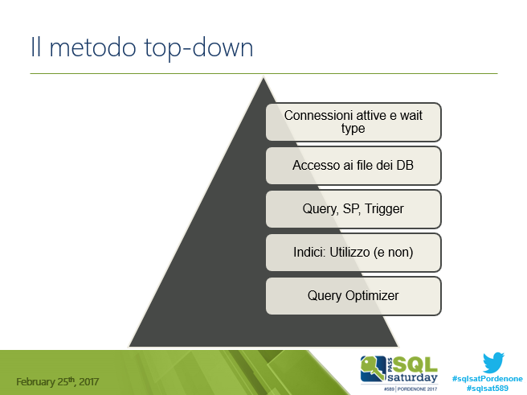

# Statistiche di utilizzo e performance delle viste in un database SQL Server

#### Di [Sergio Govoni](https://mvp.microsoft.com/en-us/PublicProfile/4029181?fullName=Sergio%20Govoni) – Microsoft Data Platform MVP

English Blog: <http://sqlblog.com/blogs/sergio_govoni/default.aspx>

UGISS Author: <https://www.ugiss.org/author/sgovoni>

Twitter: [@segovoni](https://twitter.com/segovoni)


*Aprile, 2018*

Introduzione
============

Le performance di una soluzione database sono spesso oggetto di diatriba tra chi fornisce la soluzione e chi la personalizza. Scrivere codice T-SQL ottimizzato, in grado di scalare all'aumentare dei dati e degli utenti, non è affatto semplice e quando la complessità aumenta, le attività di manutenzione del codice diventano difficili da attuare anche per l'autore stesso.

In questo articolo, condivido la metodologia di tuning e alcuni script che utilizzo per ottenere informazioni sulle **performance delle query che utilizzano le viste** presenti nel database oggetto dell'analisi. La presenza di viste nidificate contenenti query non ottimizzate può diventare oggetto di analisi specifica, gli script contenuti in questo articolo hanno l'obiettivo di fornire alcuni indicatori sull'utilizzo e sulle performance delle viste di un DB.

Alcuni indicatori sulle performance delle viste in SQL Server
==========================================

Utilizzando la tecnica top-down, che per il tuning delle performance è schematizzata nella figura 1, il primo dato interessante è stato ottenuto interrogando la DMV [sys.dm_exec_query_optimizer_info](https://docs.microsoft.com/it-it/sql/relational-databases/system-dynamic-management-views/sys-dm-exec-query-optimizer-info-transact-sql) che espone le statistiche sulle ottimizzazioni eseguite dal Query Optimizer dall'avvio dell'istanza SQL Server; i valori sono quindi cumulativi.



La CTE riportata di seguito, basata sulla DMV [sys.dm_exec_query_optimizer_info](https://docs.microsoft.com/it-it/sql/relational-databases/system-dynamic-management-views/sys-dm-exec-query-optimizer-info-transact-sql), fornisce informazioni sul carico di lavoro. Il dato interessante che si ottiene è il numero (in percentuale) di query che referenziano una vista. Ho avuto l'opportunità di esaminare casi dove circa l'85% delle query eseguite referenziava una vista. Il dato puro, di per sé, non necessariamente è sintomo di un problema di performance, ma se associato alle lamentele degli utenti circa la lentezza del sistema, ci suggerisce quantomeno un approfondimento.

```SQL
WITH CTE_QO AS
(
  SELECT
    occurrence
  FROM
    sys.dm_exec_query_optimizer_info
  WHERE
    ([counter] = 'optimizations')
),
QOInfo AS
(
  SELECT
    [counter]
    ,[%] = CAST((occurrence * 100.00)/(SELECT occurrence FROM CTE_QO) AS DECIMAL(5, 2))
  FROM
    sys.dm_exec_query_optimizer_info
  WHERE
    [counter] IN ('optimizations'
                  ,'trivial plan'
                  ,'no plan'
                  ,'search 0'
                  ,'search 1'
                  ,'search 2'
                  ,'timeout'
                  ,'memory limit exceeded'
                  ,'insert stmt'
                  ,'delete stmt'
                  ,'update stmt'
                  ,'merge stmt'
                  ,'contains subquery'
                  ,'view reference'
                  ,'remote query'
                  ,'dynamic cursor request'
                  ,'fast forward cursor request'
	         )
)
SELECT
  [optimizations] AS [optimizations %]
  ,[trivial plan] AS [trivial plan %]
  ,[no plan] AS [no plan %]
  ,[search 0] AS [search 0 %]
  ,[search 1] AS [search 1 %]
  ,[search 2] AS [search 2 %]
  ,[timeout] AS [timeout %]
  ,[memory limit exceeded] AS [memory limit exceeded %]
  ,[insert stmt] AS [insert stmt %]
  ,[delete stmt] AS [delete stmt]
  ,[update stmt] AS [update stmt]
  ,[merge stmt] AS [merge stmt]
  ,[contains subquery] AS [contains subquery %]
  ,[view reference] AS [view reference %]
  ,[remote query] AS [remote query %]
  ,[dynamic cursor request] AS [dynamic cursor request %]
  ,[fast forward cursor request] AS [fast forward cursor request %]
FROM
  QOInfo
PIVOT (MAX([%]) FOR [counter] 
  IN ([optimizations]
      ,[trivial plan]
      ,[no plan]
      ,[search 0]
      ,[search 1]
      ,[search 2]
      ,[timeout]
      ,[memory limit exceeded]
      ,[insert stmt]
      ,[delete stmt]
      ,[update stmt]
      ,[merge stmt]
      ,[contains subquery]
      ,[view reference]
      ,[remote query]
      ,[dynamic cursor request]
      ,[fast forward cursor request])) AS p;
GO
```

L'approfondimento può essere eseguito mettendo in relazione la vista di sistema [sys.views](https://docs.microsoft.com/it-it/sql/relational-databases/system-catalog-views/sys-views-transact-sql) con le DMV che espongono le statistiche delle query recenti, il testo della query ed il relativo piano di esecuzione in cache.

La seguente CTE fornisce informazioni statistiche dettagliate sulle query in cache che utilizzano le viste presenti nel database corrente. I valori relativi a numero di esecuzioni, tempo totale di esecuzione, pagine di memoria lette e le altre informazioni dipendenti dalla versione di SQL Server in uso, forniscono una chiara indicazione sulle query da controllare/ottimizzare; analisi supportata dalla visualizzazione del piano di esecuzione in cache.

```SQL
WITH CTE_VW_STATS AS
(
  SELECT
    SCHEMA_NAME(vw.schema_id) AS schemaname
    ,vw.name AS viewname
    ,vw.object_id AS viewid
  FROM
    sys.views AS vw
  WHERE
    (vw.is_ms_shipped = 0)
  INTERSECT
  SELECT
    SCHEMA_NAME(o.schema_id) AS schemaname
    ,o.Name AS name
    ,st.objectid AS viewid
  FROM
    sys.dm_exec_cached_plans cp
  CROSS APPLY
    sys.dm_exec_sql_text(cp.plan_handle) st
  INNER JOIN
    sys.objects o ON st.[objectid] = o.[object_id]
  WHERE
    st.dbid = DB_ID()
)
SELECT
  vw.schemaname
  ,vw.viewname
  ,vw.viewid
  ,DB_NAME(t.databaseid) AS databasename
  ,t.databaseid
  ,t.*
FROM
  CTE_VW_STATS AS vw
CROSS APPLY
  (
    SELECT
      st.dbid AS databaseid
      ,st.text
      ,qp.query_plan
      ,qs.*
    FROM
      sys.dm_exec_query_stats AS qs
    CROSS APPLY
      sys.dm_exec_sql_text(qs.plan_handle) AS st
    CROSS APPLY
      sys.dm_exec_query_plan(qs.plan_handle) AS qp
    WHERE
      (CHARINDEX(vw.schemaname, st.text, 1) > 0)
      AND (st.dbid = DB_ID())
  ) AS t;
GO
```

L'ultima query fornisce informazioni sulle viste non utilizzate, fate molta attenzione ai dati che estrae, è basata sulla DMV [sys.dm_exec_cached_plans](https://docs.microsoft.com/it-it/sql/relational-databases/system-dynamic-management-views/sys-dm-exec-cached-plans-transact-sql) che è soggetta al fluttuare dei piani di esecuzione all'interno della plan cache. Se una vista non è in cache nel momento in cui eseguite la query, non è detto che tale vista sia da eliminare. Se ritenete che la cache sia abbastanza rappresentativa del vostro carico di lavoro, tenetene semplicemente conto. Se nei successivi controlli, la vista sarà sempre presente, potrete valutare di effettuare altre indagini.

```SQL
SELECT
  SCHEMA_NAME(vw.schema_id) AS schemaname
  ,vw.name AS name
  ,vw.object_id AS viewid
FROM
  sys.views AS vw
WHERE
  (vw.is_ms_shipped = 0)
EXCEPT
SELECT
  SCHEMA_NAME(o.schema_id) AS schemaname
  ,o.name AS name
  ,st.objectid AS viewid
FROM
  sys.dm_exec_cached_plans cp
CROSS APPLY
  sys.dm_exec_sql_text(cp.plan_handle) st
INNER JOIN
  sys.objects o ON st.[objectid] = o.[object_id]
WHERE
  st.dbid = DB_ID();
GO
```

## Risorse correlate

Alcune risorse correlate

1. [DMVs for Performance Tuning (Video - SQL Saturday Pordenone 2017)](https://www.youtube.com/watch?v=9FQaFwpt3-k)

2. [DMVs for Performance Tuning (Slide e Demo - SQL Saturday Pordenone 2017)](http://www.sqlsaturday.com/589/Sessions/Details.aspx?sid=57409)

2. [SQL Server Tuning in pillole](https://vimeo.com/200980883)

2. [Performance Tuning With SQL Server Dynamic Management Views](https://www.red-gate.com/library/performance-tuning-with-sql-server-dynamic-management-views)

3. [The Most Prominent Wait Types of your SQL Server 2016](https://channel9.msdn.com/Blogs/MVP-Data-Platform/The-Most-Prominent-Wait-Types-of-your-SQL-Server-2016)


#### Di [Sergio Govoni](https://mvp.microsoft.com/en-us/PublicProfile/4029181?fullName=Sergio%20Govoni) – Microsoft Data Platform MVP

English Blog: <http://sqlblog.com/blogs/sergio_govoni/default.aspx>

UGISS Author: <https://www.ugiss.org/author/sgovoni>

Twitter: [@segovoni](https://twitter.com/segovoni)
