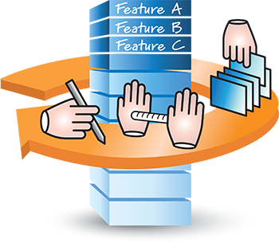
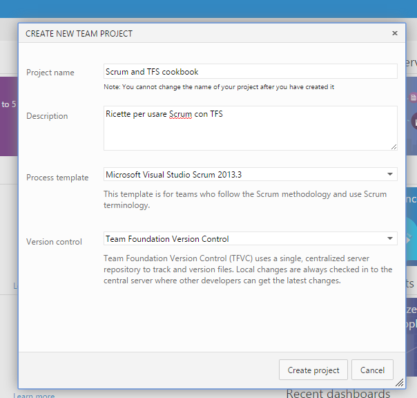
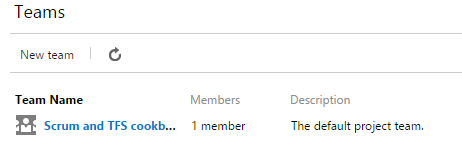
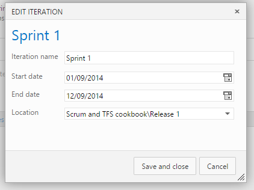
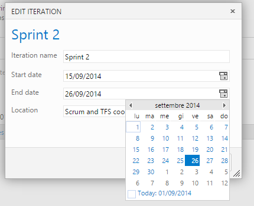
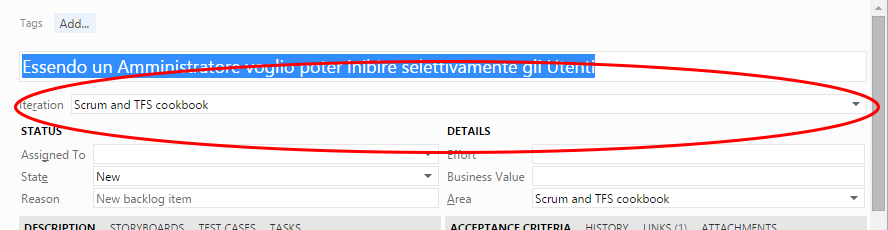
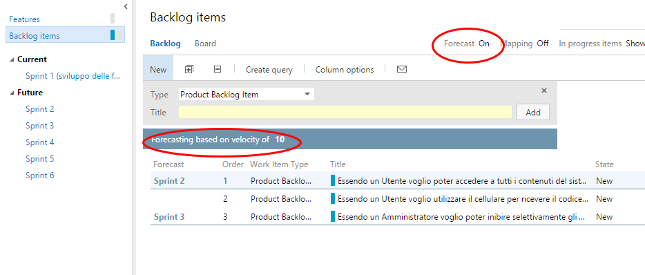
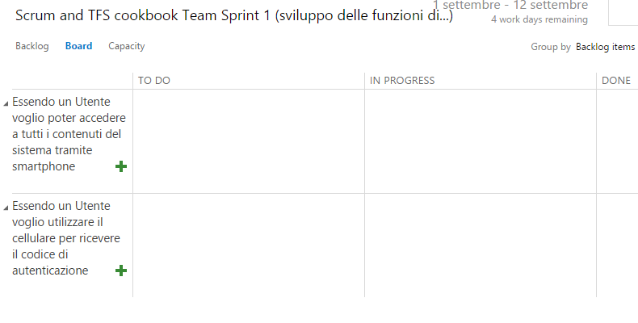
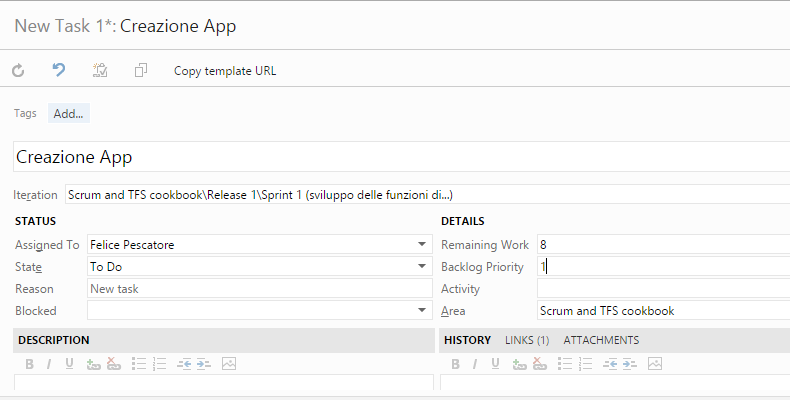
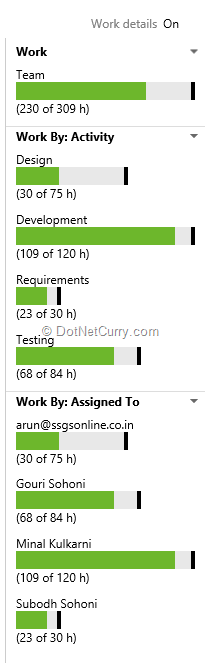

# Agile Application Lifecycle Management con VSO/TFS (parte 2/3)

#### di [Felice Pescatore (MVP)](http://mvp.microsoft.com/en-us/mvp/Felice%20Pescatore-5001016)

Blog/Sito Personale: [www.felicepescatore.it](http://www.felicepescatore.it)

ALM Blog: <http://www.getlatestversion.it/>

*Dicembre 2014*

Let’s start
-----------

Dopo aver messo il punto sui concetti, sulle metodologie e sugli
strumenti alla base dell’ALM, siamo pronti a tuffarci nel lato
operativo, creando un nuovo progetto e gestendone sia il *Program* che
il *Product Backlog*. La governance di quest’ultimo spetta al *Product
Owner* che si occupa, costantemente, di effettuarne il \[*Product
Backlog\] Grooming*: *scrittura, stima, rifinimento e priorizzazione*.

    
Figura 7 - Product Backlog Grooming

Come ben noto a coloro che usano Scrum, tale framework non contempla
direttamente il *Product Backlog Grooming,* occupandosi esclusivamente
della realizzazione dei relativi Work Item. Qui entriamo, in punta di
piedi, nel campo dell’*Agile Scaling* (@Scale) che estende i Valori, i
Principi e le Pratiche Agili oltre al “solo” contesto dello sviluppo,
abbracciando i vari aspetti aziendali. Nel caso specifico di Scrum è
possibile gestire il Product Backlog in funzione delle strategie
aziendali e, quindi effettuarne il *Grooming,* sfruttando, ad esempio,
**CIF** (*Continuous Improvement Framework*), creato da *Scrum.org,*
sotto la supervisione dallo stesso *Ken Schwaber,* e pensato proprio per
rafforzare la competitività dell’azienda al fine di massimizzare il
proprio *ROI* (Return On Investment).

Figura 8 - CIF Framework

Senza voler approfondire CIF e i relativi processi caratterizzanti,
*product development* e *continuous improvement*, è importante
evidenziare come il Product Backlog sia “condizionato”, praticamente, da
tutte le funzioni aziendali: *Product Management, Program Management e
Development Management.* Esistono framework più robusti ed olistici,
*SAFe* e *DAD* in primis, di cui sicuramente ci occuperemo in specifici
articoli*.*

Come ci aiuta VSO/TFS in tutto ciò? Ebbene, diamo un’occhiata alla
segmentazione proposta da Microsoft per l’*Agile Portfolio*,
relativamente allo *Scrum Process Template*:

Figura 9 - TFS 213, Scrum Process Template Work Item

VSO/TFS, di base, considera le attività di sviluppo affidate a un solo
Team, identificando due diversi Backlog: il *Program Backlog (feature
based)* e il *Product Backlog* (anche Team Backlog, *Work Item based*).
Nella sola versione on-premise è possibile anche definire il *Portfolio
Backlog* (*Initiatives based*), utile per descrivere *Epic* che
tipicamente sono utilizzate a livello *Portfolio* (Management aziendale)
per le decisioni strategiche.

I tre diversi Backlog sono di proprietà/responsabilità di altrettante
board o figure specifiche:

Portfolio Backlog, Portfolio Management;

Program Backlog, Product Management (in cui rientra anche il Product
Owner o il Chief PO);

Product Backlog (Team Backlog), Product Owner (che può essere coadiuvato
da un Product Manager che cura gli aspetti di “esterni” del progetto,
come quelli di business).

1.  

L’aspetto interessante è che tale suddivisione consente di avere due
“viste” di quanto si sta realizzando: una, di alto livello, orientata al
business (Program Backlog) da condividere con il cliente/stakeholder e
una orientata alle attività di sviluppo (Product Backlog) e pensata per
il Team di sviluppo.

Un attimo: dov’è finito lo *Sprint Backlog?* Tale Backlog viene
implicitamente definito selezionando quali Work Item vadano inseriti
nell’iterazione successiva, secondo le indicazioni del Product Owner.
L’assegnazione e la definizione dei relativi Task afferenti al singolo
Work Item è, in perfetto stile Scrum, responsabilità del Team di
Sviluppo e avviene sotto la “guida” dello Scrum Master.

Le *Feature* sono tipicamente espresse in modo generico (es: “Il sistema
deve disporre dell’autenticazione a 2-fasi”), i *Work Item* sono
prevalentemente costituiti dalle *User Story* (es: “Essendo un Utente
voglio utilizzare il cellulare per ricevere il codice di
autenticazione”) pesate in *Story Point* o *Ideal Day*, mentre i *Task*
sono un’unità esplicita di lavoro (es: “realizzare la funzionalità di
invio dell’SMS con codice di verifica”) espressa in ore e auto-assegnata
da un singolo membro del Team. Discorso a parte per le *Epic* che, come
lo stesso *Portfolio Backlog*, non verranno trattate in questa serie,
afferendo ad un dominio di discussione diverso.

Andiamo ora a vedere come creare un nuovo progetto in VSO (se usate
un’istallazione proprietaria di TFS la creazione del progetto avviene da
Visual Studio), e creare un nuovo Product Backlog.

Cliccate su “new” nell’area “Recent pojects & teams”, selezionando il
corretto Process Template ed inserendo le informazioni richieste.

Figura 10 - Create new project

A questo punto, VSO crea per noi una serie di elementi specifici per il
nuovo progetto:

Un specifica Home Page;

Uno specifico Team;

Una serie di Iterazioni già attive relative alla prima release del nuovo
sistema;

e … molto altro di cui parleremo in seguito.

Figura 11 - New Home Page

Figura 12 - New Team

Figura 13 – Iterations

Il passo successivo è quello di impostare il *timing* relativo alla
Release e agli Sprint. Anche qui bisogna dire che, sebbene Scrum non
preveda esplicitamente l’artefatto “Release”, è ormai pratica
consolidata raggruppare una serie di Sprint sotto tale cappello, al fine
di consentire una migliore gestione delle attività, soprattutto in
ottica dei rilasci in produzione e della creazione di **PSI**
(*Potentially Shippable Increments*) da mostrare agli stakeholder.
Attenzione: TFS non setta automaticamente i tempi della Release in
conformità con quelli settati per gli Sprint compresi in essa, per cui è
necessario impostarli entrambi manualmente. Nell’inserimento, la
soluzione Microsoft tiene comunque conto dell’intervallo scelto per lo
Sprint precedente (es: 2 settimane) e suggerisce le date per i
successivi.

Figura 14 - Sprint and Release timing

Al termine delle operazioni relative, avremo un *Backlogs Tree* simile
al seguente:

Figura 15 - Backlogs Tree

Settato il contesto, passiamo ad aggiungere le *Feature* (Program
Backlog) e le *User Story* (Product Backlog), adottando un approccio
top-down e avendo cura di settare la corretta relazione padre-figlio tra
essi.

Figura 16 - Aggiunta Feature

Figura 17 - Aggiunta User Story

Una volta completato il tutto, avremo un risultato simile al seguente:

Figura 18 - Product Backlog Work Item

Ora, per poter popolare il primo Sprint/Iteration Backlog con la scelta
delle User Story, settando il campo “Iteration” per ogni singola User
Story e la definizione dei Task relativi, manca un tassello fondamentale
e irrinunciabile per fare ciò: il Team nella sua interezza!

Figura 19 - User Story Iteration Setting

La scelta dei Work Item per la prossima iterazione avviene durante lo
*Sprint Planning*, ovvero la cerimonia Scrum a cui è demandata lo
start-up di un nuovo Sprint, sotto il cappello di uno “Sprint Goal” che
definisce l’obiettivo d’insieme dell’iterazione stessa. Il Goal guida la
scelta delle User Story (PBI) che andranno a formare lo *Sprint Backlog*
e che si trovano tipicamente al top dello stack che rappresenta il
Product Backlog, cosa che le assegna un’alta priorità relativa.

Purtroppo l’attuale versione di VSO/TFS non dispone di “un’Area Sprint”
o di uno “Sprint Work Item” per raccogliere lo “Sprint Goal”. Tale
mancanza è facilmente ovviabile associando lo Sprint Goal al nome
dell’Iterazione, grazie al fatto che esso è tipicamente caratterizzato
da una descrizione sintetica.

Figura 19 - Sprint Goal

In alternativa è possibile, solo per TFS, creare un apposito Work Item o
importare quello specifico esistente nella versione 2010.

Figura 20 - Sprint Work Item TFS 2010

Il numero di User Story da “inserire” nello Sprint hanno una relazione
diretta con la *Velocity* (pari alla somma dell’effort delle User Story
completate) raggiunta nello Sprint precedente dal Team, ottenuta
sommando gli Story Point completati in funzione delle User Story
completate. Nel caso in cui l’ultimo Sprint è stato interessato da
eventi esterni che hanno inficiato il valore della Velocity, è possibile
utilizzare una media storica come valore di riferimento, anche se ciò ha
diverse controindicazioni.

Ma come stimiamo gli Story Point associati ad una User Story? Come
sempre, esistono diverse tecniche, ma vi suggerisco il *Planning Poker*
basato sulla sequenza di Fibonacci “corretta” che, inoltre, contribuisce
alla discussione sulla singola User Story al fine di condividerne il
significato ed il dominio.

Figura 21 - Le carte per il Planning Poker

L’attività di stima si svolge nel seguente modo:

ogni membro del Team ha un proprio deck di carte con sopra la sequenza
di Fibonacci “corretta” (0, 1, 2, 3, 5, 8, 13, 20, 40, 100, infinito,
0,5, ?). Lo Scrum Master legge ad alta voce la User Story e chiede ad
ogni membro del Team di stimare la relativa complessità scegliendo una
carta dal mazzo e posizionandola con il dorso verso l’alto su una
scrivania di supporto. Sempre su indicazione dello SM, tutti i membri
del Team girano contemporaneamente le carte: a questo punto chi ha
indicato il valore più basso e chi ha indicato quello più alto
dispongono di 3minuti per motivare la scelta. L’operazione si ripete
finché il Team non raggiunge un’opinione comune sulla complessità della
User Story. Nel caso in cui il valore scelto sia di 40, 100, infinito, è
opportuno che la User Story venga messa da parte ed analizzata con
dovizia per essere divisa in User Story più semplici.

Stimata la complessità della User Story, si passa alla definizione dei
Task relativi che rappresentano l’unità minimale di lavoro stimata in
ore. Il consiglio è quello di non effettuare una “stima verticale”
(prima tutte le User Story e poi tutti i Task), ma seguire un approccio
“orizzontale”: prendo una User Story dal Product Backlog, la stimo,
definisco/stimo i relativi Task, passo alla successiva User Story.
Questo per favorire una comprensione più di dettaglio della User Story
corrente e di conseguenza del progetto, cosa che può essere sfruttata
già nelle stime immediatamente successive.

Completata la stima di un numero congruo di User Story (es: si stima
finché non si raggiunge il doppio degli Story Point completabili in una
iterazione), quelle che rientrano nel prossimo Sprint/Iterazione, vanno
correttamente assegnate ad esso.

Figura 23 - Assegnazione Iterazione

Congiuntamente bisogna aggiungere il “Valore” (Business Value, definito
dal Product Owner durante il Grooming) e l’Effort (Story Point),
valorizzando la sezione “Details” con quanto emerso durante il Planning
Poker. Ciò servirà per utilizzare efficacemente gli strumenti di
analisi.

Figura 24 - Effort e Priorità

Non ci resta ora che assegnare la *Priorità*, in accordo con lo Sprint
Backlog ed il Product Backlog: questa azione è “implicita” nel senso che
si ottiene spostando con il mouse i Work Item nell’ordine (alias
priorità) desiderato. Completati tutti i settaggi, selezionando lo
specifico Sprint, TFS vi presenterà un summary simile a quello seguente:

Figura 25 - Sprint summary

Una puntualizzazione: come accennato la stima viene effettuata per un
numero minimo di User Story, mentre quella relativa ai rimanenti PBI è
differita ai successivi Sprint Planning. Si tratta di una precisa
scelta, legata alla teoria delle code (per approfondimenti, *The
Principles of Product Development Flow: Second Generation Lean Product
Development - D. Reinertsen*) in cui si dimostra l’inutilità di stimare
completamente gli elementi di uno stack (alias Product Backlog), poiché
la relativa conoscenza aumentare durante il progetto, alcuni di essi
verranno eliminati ed altri introdotti.

Ciò rende poco utile la funzionalità di “Forecast” (previsione,
attivabile nella visualizzazione dei PBI) perché richiede l’assegnazione
dei pesi di tutti i Work Item, cosa in netta contraddizione con quanto
appena detto. Se, comunque, avete la necessità di realizzare delle
metriche di massima per il management che insiste nel volere una visione
complessiva, potete stimare tutti i Work Item in modo più light (es:
utilizzando dei pesi associati alle taglie delle T-shirt) e utilizzare
la “Forecast”. In tal modo raccogliete la richiesta esplicita del
Program Level, cercando di avere una buona accuratezza ma evitando,
comunque, di sprecare tempo nella ricerca della precisione.

Figura 26 - TFS Forecast

L’ultimo parametro da settare è la *Capacity* (capacità) del Team sullo
Sprint, selezionando chi lavorerà sul progetto, in quale sub-area e per
quante ore al giorno. In tal modo si indicano le ore totali che il Team
dedicherà allo Sprint, suddivise, se ha senso, per area.

Figura 27 - Sprint "Capacity"

Questo dato risulta utile per avere costantemente una stima di
capacità/carico di lavoro, che però diventa evidente solo con
l’*inserimento dei Task* relativi alle User Story incluse nello Sprint.

Per fare ciò, selezioniamo “Board” e passiamo alla relativa
visualizzazione:

Figura 28 - Sprint Board View

Clicchiamo sul segno “+” adiacente la User Story e creiamo, come Team,
un nuovo Task, compilando i relativi dettagli:

Figura 29 - Nuovo Task

Salviamo e, a questo punto, ci troveremo difronte a una Board contenente
il nuovo Task con riportare le relative ore.

Figura 30 - Sprint Board

Ovviamente i Task da creare sono quelli relativi alle User Story
selezionate nello Sprint Planning.

La nostra finestra di stima della capacità del Team (alla destra dei
Work Item nella visualizzazione Backlog dello Sprint) somiglierà alla
figura seguente:

Figura 31 – Work

Si conclude così la fase di “pre-settaggio” dello Sprint sulla base di
quanto emerso durante lo Sprint Planning. Da sottolineare l’uso del
termine “pre-settaggio” scelto per evidenziare che l’ambiente di lavoro
relativo ad un Sprint è in continua evoluzione e questa è solo una
fotografia del suo stato nella fase iniziale.

Nel [prossimo articolo](AgileALMConVSOTFS3.md) della serie ci occuperemo del cuore operativo di
Scrum: lo **Sprint**.

#### di [Felice Pescatore (MVP)](http://mvp.microsoft.com/en-us/mvp/Felice%20Pescatore-5001016)

Blog/Sito Personale:
[www.felicepescatore.it](http://www.felicepescatore.it)

ALM Blog: <http://www.getlatestversion.it/>
