# AgileIoT - Agile meets IoT

#### di [Felice Pescatore](https://mvp.microsoft.com/it-it/mvp/Felice%20%20Pescatore-5001016) - Microsoft MVP

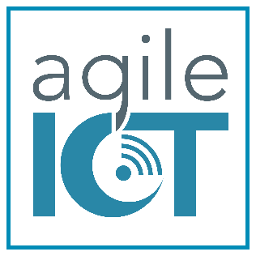

[**agileiot.org**](http://www.agileiot.org)

**@agileiotdotorg**

## Introduzione

L’**Internet of Things** è la nuova frontiera della Rete: un ecosistema
fisico/virtuale in grado di comunicare all’unisono per migliorare la
qualità della nostra vita.

Stiamo parlando di milioni di dispositivi estremamente eterogenei che si
scambiano informazioni grazie alla Rete e “reagiscono” a differenti
situazioni in funzione di pattern pre-determinati o anche “deducendo” il
da farsi grazie a strumenti di *machine learning*.

Va da se che questa complessità si ribalta sulle attività di governance
dei nascenti progetti annessi, per cui è necessario avvalersi di
strumenti, metodologici e tecnologici, in grado di supportarli
adeguatamente..

Proprio su queste basi nasce **AgileIoT**, un progetto tutto italiano
che scaturisce dall’esperienza di MVP ed esperti, tecnologi e
metodologi, che nel corso dell’ultimo anno si sono confrontati sulle
varie implicazioni derivanti dall’adottare un modello di sviluppo
Agile/Lean/DevOps nella realizzazione di soluzioni dell’Internet of
Things.

## Il Manifesto

**AgileIoT** è frutto di un’esigenza affascinate: proporre un approccio
ragionato e “goal-driven” allo sviluppo di soluzioni Internet of Things,
per propria natura multidisciplinari e complesse.

Ciò è estremamente evidente se si guarda alle diverse tematiche oggi
predominanti nel mondo IoT: *Smart Car, Smart Metering, Smart Asset
Management, Smart Home & Building, Smart Logistics, Smart City,* sono
gli esempi più noti e di cui si sente continuamente parlare.

Ma qual è la vera sfida da affrontare? Si tratta di ragionare in modo
olistico nella realizzazione dei tre elementi primari che
contraddistinguono un prodotto IoT: *Cloud (la “I”)*, *Software/Firmware
e Hardware* *(la “T”)*, senza dimenticare i servizi accessori, come, ad
esempio, il montaggio fisico dei device, che trasforma il *Prodotto* in
*Soluzione*, e senza i quali il prodotto è destinato a restare nei
nostri cassetti.

La base di ragionamento è quindi quella di evitare di pensare alla
realizzazione separata, e spesso isolata, dei suddetti componenti
primari, trovando poi un modo di integrarli tra loro, ma di realizzare
l’intero Prodotto, meglio ancora se l’intera Soluzione, in modo
integrato, combinando le attività giornaliere delle diverse figure
coinvolte.

L’obiettivo è quello di allontanare la logica della *Big Bang
Integration* che soffre di diversi problemi critici:
-   l’efficienza di sviluppo è fortemente penalizzata, poiché i diversi team non comunicano costantemente tra loro e non condividono il know-how e gli elementi di forza e debolezza;
-   i problemi vengono alla luce solo in una fase avanzata di realizzazione della soluzione, con costi di fix elevati, soprattutto per la componente hardware;
-   la soluzione finale spesso contiene un compromesso qualitativo a ribasso, dettato dalla necessità di consegnare la soluzione in tempo e basato su workaround software laddove i vari componenti non si integrino perfettamente.

Proprio da tali considerazioni nasce l’**AgileIoT Manifesto**, la cui
filosofia è quella della….

“…**bottega rinascimentale**, ovvero la *cellula* in cui veniva fatto
tutto quanto necessario alla realizzazione di una nuova opera: dalla
progettazione alla commercializzazione, passando per la formazione e la
produzione.

I membri del team sono spinti a comportarsi come gli **artigiani
rinascimentali** che con estrema abilità utilizzavano materiali,
tecniche e strumenti diversi per soddisfare il cliente che aveva
commissionato l’opera.

AgileIoT mette al centro il bisogno del cliente, armonizzando
competenze, approcci e tecnologie differenti, grazie alla definizione di
un main-set comune di strumenti che rendono economicamente sostenibile
la creazione di una soluzione Internet of Things.”

L’AgileIoT philosophy è pensata per esplicitare i punti di vista dei
diversi attori coinvolti (si pensi solo alla differente astrazione degli
Informatici e degli Elettronici) che devono convivere e trovare un
opportuno equilibrio per ottenere il risultato finale, ovvero: *creare
una Soluzione che abbia un Valore per il cliente e per i differenti
stakeholder*.

La filosofia viene esplicitata attraverso i **4 principi** portanti:
-   **It’s not software, hardware or service: it’s about jobs to be
    done!** Non si tratta di completare un progetto software o hardware,
    bensì di realizzare una soluzione intelligente che sfrutta entrambi
    per risolvere un’esigenza in modo efficiente ed efficace.
-   **Think less and do it fast!** Ridurre all’essenziale il tempo
    dedicato alla fase di analisi in favore di un rapido avvio delle
    attività di sviluppo della soluzione.
-   **Simple is better!** Più semplice è la soluzione che si realizza,
    maggiori saranno le possibilità di farla evolvere in funzione delle
    esigenze degli stakeholder.
-   **If you can’t remember it, you can’t improve it!** Utilizzare
    strumenti di visual management per monitorare lo stato di sviluppo
    della soluzione.

e attraverso la **SEC Oriented practice** (Security, Energy e Cloud
oriented practice), che pone al centro delle attività gli aspetti di
adattabilità e scalabilità, unitamente a quelli di sicurezza ed energia.
Tale pratica trova le proprie fondamenta nel *Threat Modeling*, che
punta a rendere la sicurezza parte integrante del progetto e del
processo di sviluppo. Nel caso di AgileIoT, non solo gli aspetti di
Security, ma anche quelli di Energy e di Cloud diventano elementi
costanti del processo, andando ad identificare e valutare i rischi a cui
potrebbe essere soggetta la soluzione.

Si tratta di un *viaggio* affascinate, che deve tener conto di sfide che
normalmente sono appannaggio solo di una specifica categoria di
tecnici-progettisti. Basti riflettere sulla questione *energetica*,
praticamente ignorata dagli sviluppatori software, ma portante per
quelli hardware. Discorso inverso per la *Continuous Delivery*, che nel
caso dell’hardware significherebbe produrre ogni volta fisicamente un
nuovo componente.

Fondamentali sono, inoltre, le problematiche annesse alla **privacy**,
ulteriore dominio di discussione in ambito IoT: più device connessi
significa più dati personali che viaggiano in Rete. Ciò impone di
focalizzarsi sin da subito sulle implicazioni inerenti la sfera
personale a cui le soluzioni IoT possono portare. Tali problematiche
specializzano la questione della security, declinandola nel segmento dei
**dati**, di controllo e gestione degli apparati, poiché essi impattano
direttamente sul mondo fisico: si pensi, ad esempio, ai disastri a cui
può portare un attacco ai servizi di gestione dei computer di bordo
delle autovetture.

Il Manifesto è attualmente declinato in due soluzioni immediatamente
utilizzabili: l’AgileIoT Framework e l’Agile Kanban::Board, utilizzabili
separatamente ma anche in modo congiunto.

## Il Framework

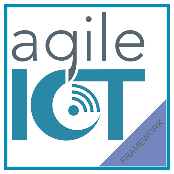

La prima concretizzazione del Manifesto è
rappresentata dall’**AgileIoT Framework** (Framework in seguito) che
definisce un processo *Goal-Driven, ricco ed articolato*, orientato al
*Valore* e alle soluzioni End-to-End.

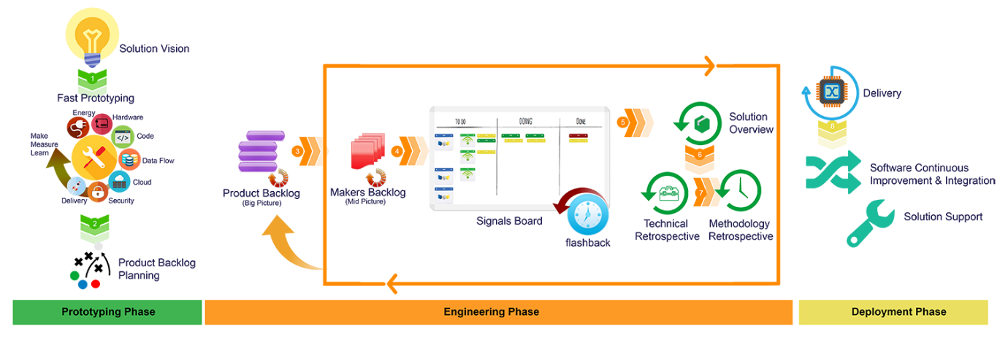

Figura 1 - AgileIoT Framework Big Picture

In particolare, la creazione di una specifica soluzione passa attraverso
tre fasi ben delineate:

-   **Prototyping Phase**: la fase in cui l’azienda prende atto della
     volontà di realizzare una nuova soluzione e, partendo dall’idea o
     da bisogno iniziale, definisce quella che è la *Solution Vision*.
     Si tratta di tracciare gli obiettivi specifici in funzione delle
     esigenze del committente, andando a definire i *Solution Goal* e
     le *metriche di validazione*.
-   **Engineering Phase**: la fase in cui la realizzazione della
    soluzione entra nel vivo. In questa fase gran parte dell’enfasi è
    posta sullo sviluppo del prodotto, ma, parallelamente, anche gli
    aspetti a supporto vengono messi progressivamente a fuoco e
    strutturati a livello aziendale.
-   **Deployment Phase**: l’ultima fase focalizzata sul Delivery in
     esercizio, sul Supporto e sul Miglioramento Continuo.

In particolare nella fase di prototyping trova posto la cerimonia di
*Fast Prototype*, pensata esplicitamente per valutare la sostenibilità
della soluzione stessa e focalizzata sui seguenti aspetti:

-   **Energy**: verifica delle ipotesi relative agli aspetti energetici
     in funzione delle esigenze di continuità operativa degli smart
     device;
-   **Hardware**: validazione delle ipotesi hardware tramite uno o più
     *Evaluation Kit* (EVK). La selezione dell’EVK più idoneo passa, in
     primis, dalla scelta della CPU/MCU, dopodiché si inizia a
     “costruire” il prototipo lavorando sugli altri componenti (es:
     RAM, USB, ecc.);
-   **Code**: prototipazione del firmware dei dispositivi e su quella
     dei servizi a supporto per l’acquisizione dei dati/eventi portanti
    della soluzione. In questa fase l’utilizzo di framework e di IDE
     di codifica veloce è fondamentale per abbattere i tempi relativi;
-   **Data Flow**: approfondimento degli aspetti legati alla raccolta,
     alla pulitura ed alla gestione dei *Raw Data* provenienti dai
     device, implementando gli aspetti di trasmissione e
     serializzazione degli stessi, con la scelta degli opportuni
     protocolli e dei formati più adeguati. In particolare, è
     fondamentale dedicare particolare attenzione alla stima dei volumi
     dei dati ed alle relative metodologie di analisi, in modo da
     approcciare alla gestione delle informazioni in chiave *Polyglot
     Persistence*, fondamentale per garantire la possibilità di
     elaborare velocemente grandi moli di informazioni;
-   **Cloud**: verifica degli aspetti cloud della soluzione, intesa come
     piattaforma di gestione dei dati, degli eventi e delle action
     portanti;
-   **Security**: verifica delle ipotesi relative agli aspetti centrali
     di security che l’intera soluzione e che ne influenzano in modo
     diretto lo sviluppo;
-   **Delivery Prototyping**: analisi dei possibili vincoli normativi e
     ambientali del dispiegamento degli Smart Thing. Si tratta, in
     pratica, di avere prontezza delle possibili difficoltà annesse al
     deployment e verificare che non vadano a minare la sostenibilità
     del progetto.

La cerimonia di Fast Prototyping viene eseguita sfruttando il ciclo
**make-measure-learn** (**MML**), al fine di renderla sufficientemente
breve ed estremamente concreta.

Come già accennato, una Soluzione IoT può divenire estremamente
complessa e può risultare difficile avere sempre una chiara visione
dello stato di avanzamento dei progetti annessi e delle azioni da
intraprendere. Proprio per questo, il Framework adotta un approccio
**Goal-oriented**, caratterizzando ogni fase con goal espliciti che
consentono di avere una “misura” dello stato di avanzamento del progetto
in termini di obiettivi raggiunti.

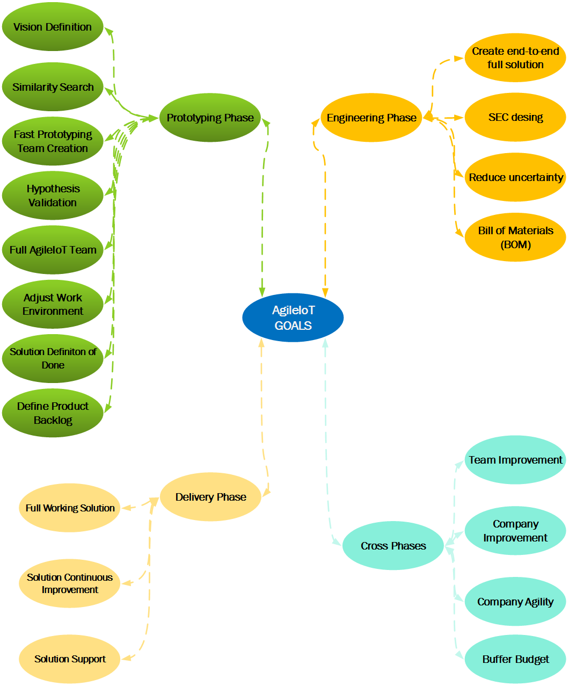

Figura 2 - AgileIoT Goals

Questa scelta risulta estremamente efficace, consentendo al team di
auto-organizzarsi e restare allineato con lo scope generale del
progetto, reagendo e trasformandosi laddove si verifichino imprevisti o
cambiamenti espliciti dei requisiti. I goal sono contestualizzati grazie
alla specifica **Solution Definiton of Done** (sDoD) che chiarisce
quando gli stessi possono essere ritenuti raggiunti.

Da un punto di vista operativo, ogni progetto è affidato ad uno
specifico **AgileIoT Team**, organizzato in chiave *T-Shape*, con
competenze verticali profonde, dei singoli membri, in un settore
(*Deep*) ma comunque in grado di intervenire a supporto di tutte le
attività (*Broad*).

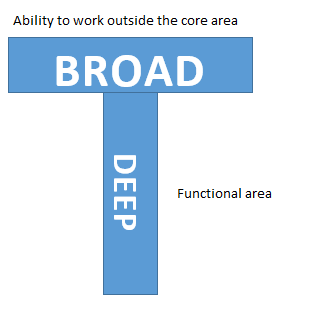

Il team può essere composto da un numero variabile di 4:8 membri
afferenti (Primary Roles):

-   T-Shape Maker :: 2, 4, 6
-   Prime Maker :: 1
-   Product Owner :: 1

a cui è possibile aggiungere ulteriori 4 figure inquadrabili come
*Closer Roles*: *Cloud Closer*, *Data Flow Closer*, *Security Closer* ed
*Energy Closer*.

La distinzione tra *primary* e *closer roles* è funzionale al loro
commitment sulla soluzione, con i primi impegnati per tutta la durata
dello sviluppo ed i secondi presenti solo laddove sia necessario
rinforzare il know-how specifico all’interno del team con azioni di
coaching concentrate nella fase di prototyping e a supporto di quella di
engineering.

All’interno di un AgileIoT Team si formano due temporary team:

-   *Fast Prototyping Temporary Team*, core iniziale del team per
    supportare le attività di Fast Prototyping;
-   *Signal Temporary Team (ST2),* coppia di makers dedicata a un
    singolo work-item (aka Signal).

I team sfruttano specifici artefatti per organizzare le proprie
attività, a partire dalle feature da realizzare, gerarchicamente
specializzate come segue:

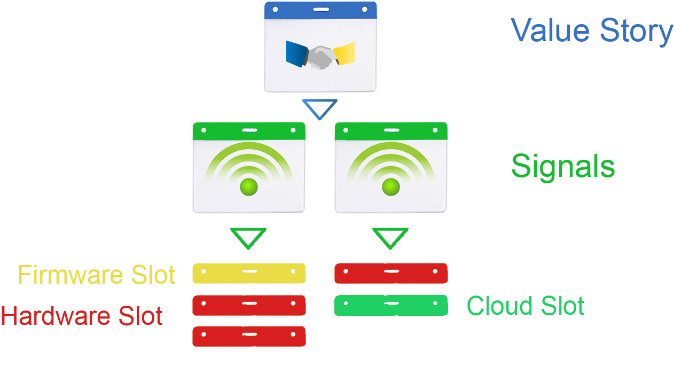

Nello specifico:
-   **Value Story**: enfatizza il Valore della Soluzione, cogliendo
    aspetti relativi sia ai Software Maker che agli Hardware Maker;
-   **Signal**: è l’elemento su cui si concentra l’attività dei Maker,
    in particolare del Signal Temporary Team. Si tratta di attività
    descrivibili in funzione di elementi di input/output dei dispositivi
    IoT specifici;
-   **Slot**: è l’unità minima di lavoro, possibilmente specializzata
    per singola area applicativa: hardware, firmware, service e cloud.

Facciamo un esempio concreto di utilizzo di questa gerarchia:
-   **Value Story**: una soluzione che monitori il traffico in una
    determinata strada.
-   **Signals**:
    1.  *Smart Thing che conta il numero di veicoli in transito (device
        signal);*
    2.  *Invio dei dati al sistema di raccolta e gestione (device
        signal);*
    3.  *Analisi e gestione dei dati in formato aggregato
        (cloud signal).*
-   **Slot Signal 1**:
    -   hardware: creare lo smarthing collegando i sensori necessari;
    -   software/firmware: collegarsi al servizio cloud per inviare il
        dati in funzione del timestamp;
    -   cloud: elaborare lo stream di dati e fornire cruscotti
        di misura.

Parimenti, il Framework definisce una serie di **Cerimonie** e
**Metriche** che permettono di raggiungere i Goal su menzionati e
misurare oggettivamente i progressi, di progetto e di team.

Un punto di particolare attenzione è quello che vede la definizione
della *Bill of Materials* (BOM), ovvero la distinta che definisce lo
Smart Thing, il device fisico che andrà successivamente installato
nell’ambiente di riferimento.

Qui si apre un mito da sfatare: quasi mai si andrà in produzione con i
già citati EVK (Evaluation Kit), per citarne uno Arduino, che sono
pensati primaria per la prototipazione e non per i sistemi in
produzione.

Arrivati alla definizione della BOM, la produzione fisica dello Smart
Thing è affidata ad un Team esterno, con cui bisognerà sincronizzarsi
per procedere alla validazione finale e allinearsi per consentire una
coerente governance d’insieme da parte del *Product Owner* e della
gestione operativa del *Prime Maker*.

## La Kanban::Board

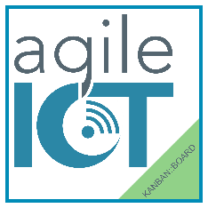
Il
Framework, è sicuramente ricco e articolato e consente di approcciare in
modo estremamente valido alla realizzazione di una nuova soluzione IoT.\
La sua adozione richiede però un forte impegno da parte dell’intera
azienda che avvia così una trasformazione in chiave Agile/Lean.

Nel caso in cui tali aspetti siano già parte della Cultura azinedale e
si è alla ricerca di una soluzione per proiettarli nel mondo IoT con un
impatto meno profondo, l’**AgileIoT Kanban::Board** potrebbe essere una
soluzione più flessibile, avendo l’obiettivo di fornire uno strumento
meno strutturato, che si rifà all’ AgileIoT Manifesto, ma che lascia
maggiore spazio al team di auto-organizzarsi e “trovare la propria
strada”.

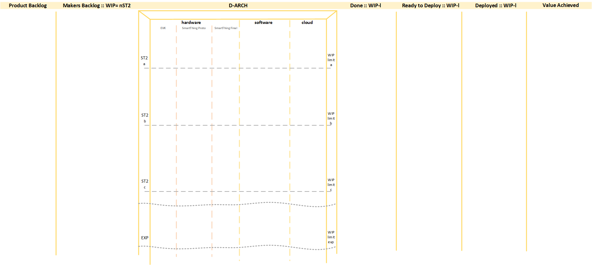

Figura 3 - AgileIoT Kanban::Board

Prima di proseguire è fondamentale evidenziare un aspetto portante: la
Kanban::Board è una alternativa alla strutturazione a fase alla base del
Framework, ma tutto quanto descritto in realazione all’AgileIoT Team, ai
Goal, agli Artefatti, alle Cerimonie e alle Metriche resta fondamentale
anche con questo strumento maggiormente Lean-oriented.

Tornando alla *Kanban::*Board, essa è suddivisa in 7 aree primarie di
riferimento (colonne):

-   **Product Backlog**, contenente le Value Story del prodotto,
    ordinate in funzione del Valore relativo;
-   **Makers Backlog**, contenente i Signal, e i relativi Slot, che
    compongono le Value Story pronte per essere realizzate. Quest’area
    ha, di base, un WIP Limit pari al numero di ST2, spingendo i singoli
    Temporary Team a concentrarsi su un unico obiettivo alla volta.
    Chiaramente tale limite può essere variato in funzione alle
    specifiche esigenze;
-   **D-ARCH**, è l’area di lavorazione degli Slot. Verrà descritta in
    dettaglio di seguito;
-   **Done**, quando un Signal raggiunge quest’area, vuol dire che tutti
    gli Slot relativi sono stati completati e si può procedere a
    pianificare ed attuare tutte le azioni preparatorie al
    suo Deployment. Si possono, ad esempio, attivare i nuovi servizi del
    Customer Service e di Operation atti a supportare il nuovo elemento
    in produzione;
-   **Ready to Deploy**, i Signal in quest’area devono essere
    solo dispiegati. Ad esempio, si procede a concordare con cliente la
    data effettiva di deploy;
-   **Deployed,** il Signal è stato dispiegato ed è operativo;
-   **Value Achieved**, quando una Value Story raggiunge quest’area,
    vuol dire che tutti i Signal afferenti sono stati dispiegati e la
    soluzione è operativa. E’ fondamentale che i criteri di accettazione
    previsti dalla *sDOD*, ovvero la *Solution Definition of Done*,
    siano stati soddisfatti.

Rispetto ad una Kanban classica, questa declinazione in chiave IoT,
introduce due innovativi aspetti di visual management:

-   **WorkPivot**: che consente di passare dall’evidenza delle attività
    afferenti l’intero AgileIoT Team (verticali) a quelle del singolo
    Signal Temporary Team (orizzontali);
-   **D**-**ARCH** (Doing ARCH), in cui le attività (Slot) sono
    identificate in funzione della loro specificità (Hardware,Software e
    Cloud – asse verticale) associandole, contemporaneamente, all’ST2
    (asse orizzontale) e al relativo Work in Progress limit (WIP-limit
    / WIP-l).

In particolare, il **D-ARCH** (ACHIEVE RAPIDLY CUSTOMER HOPES, ovvero
centrare velocemente le aspettative del cliente) è il cuore pulsante
dell’AgileIoT Kanban::Board, consentendo di mettere in evidenza le
attività in essere e gli elementi “pull” che ne cadenzano il ritmo.

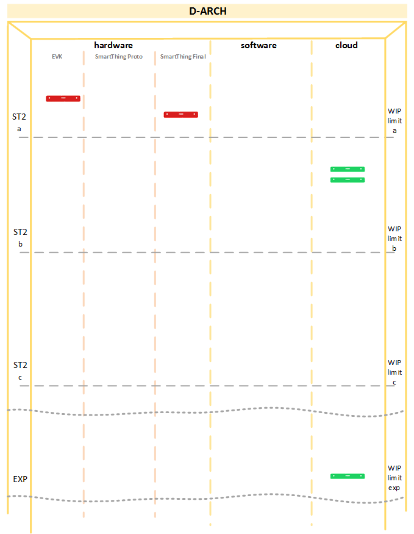

Figura 4 - D-ARCH

Tale risultato si ottiene capovolgendo la vista d’insieme (da qui
**WorkPivot**), spostando così il focus sull’attività dei singoli ST2 e
creando una specifica caratterizzazione delle dimensioni Verticali e
Orizzontali:

-   *Dimensione Verticale*: evidenzia gli aspetti afferenti all’intero
    AgileIoT Team e al progetto in generale;
-   *Dimensione Orizzontale*: evidenza gli aspetti afferenti ai
    diversi ST2.

L’introduzione del D-ARCH consente di estendere le metriche previste dal
Framework, associandole sia alla dimensione verticale che a quella
orizzontale, ottenendo degli indicatori molto utili per le azioni di
*Continuous Improvement* dell’AgileIoT Team e nella gestione del
progetto.

Le principali metriche individuate sono riportati nella figura seguente:

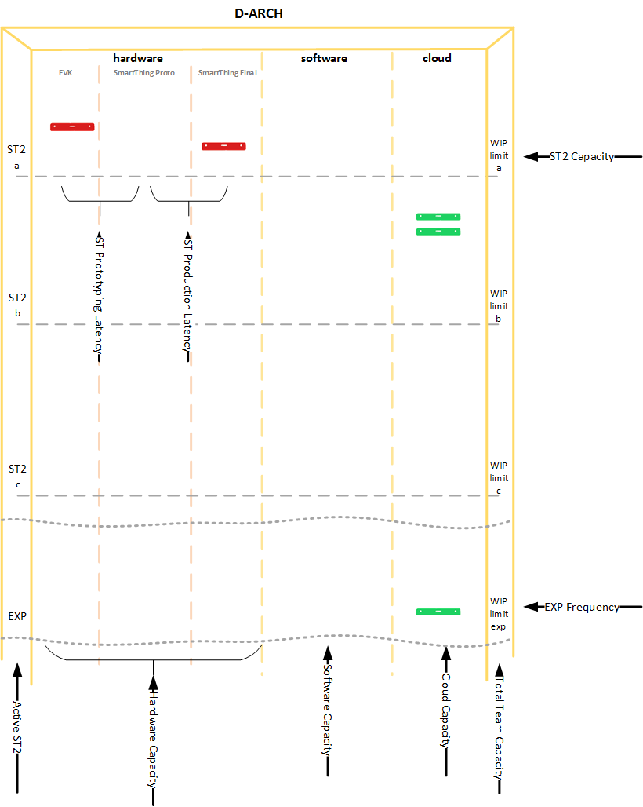

Figura 5 - D-ARCH Metrics

Entrando nel dettaglio, le metriche sono classificate in funzione della
specifica dimensione afferente:

-   *Dimensione Orizzontale, relativa ai singoli Temporary Team:*

    -   **ST2 Capacity**: capacità di realizzare obiettivi dello
        specifico ST2;
    -   **EXP Frequency**: frequenza di sperimentazione degli
        ST2/ET2 team.

-   *Dimensione Verticale, relativa all’AgileIoT Team nel suo
    complesso:*

    -   **Total Team Capacity**: capacità dell’AgileIoT Team di
        realizzare gli obiettivi;
    -   **Hardware, Software e Cloud Capacity:** capacità totale
        dell’AgileIoT Team di affrontare gli obiettivi annessi ai
        differenti aspetti IoT. La somma delle tre metriche fornisce la
        **Team Skills Balanced View**, ovvero la misura del
        bilanciamento degli skill complessivi dell’AgileIoT Team;
    -   **Active ST2**: numero di ST2 attivi sul progetto;
    -   **ST Prototyping Latency**: latenza dal passaggio dall’utilizzo
        degli EVK al prototipo custom di Smart Thing;
    -   **ST Production Latency**: latenza del passaggio dal prototipo
        di Smart Thing alla sua versione finale.

Quando si parla di *Capacità* o *Frequenza*, l’unità minima di
riferimento è chiaramente il singolo *Slot*.

Una nota di attenzione è dovuta nei riguardi delle “metriche di
latenza”, ovvero S*T Prototyping Latency* e *ST Production Latency*:
entrambe, con opportuna indicazione sulla relativa card dei tempi di
inizio e completamento, consentono di evidenziare il gap tra l’utilizzo
degli EVK e la realizzazione del custom Smart Thing.

Queste informazioni permettono di gestire al meglio la definizione della
*BOM* e, soprattutto, la gestione della fase di produzione fisica che,
come evidenziato nel Framework, è contemplata quale attività esterna.

## AgileIoT e Team Foundation Server

Fin ora il nostro viaggio ci ha portato ad esplorare gli aspetti
metodologie ed operativi di AgileIoT, volutamente senza fare riferimenti
a specifiche tecnologie e piattaforme a supporto.

Per quanto, però, le metodologie debbano considerare gli strumenti
afferenti come “facility”, è innegabile che il loro utilizzo consenta di
semplificare di molto le attività di gestione di un progetto,
soprattutto se si hanno più Team delocalizzati tra loro o, addirittura,
nei suoi singoli membri.

In quest’ottica AgileIoT, propone uno specifico **Process Template**
custom per *Microsoft TFS 2015*.

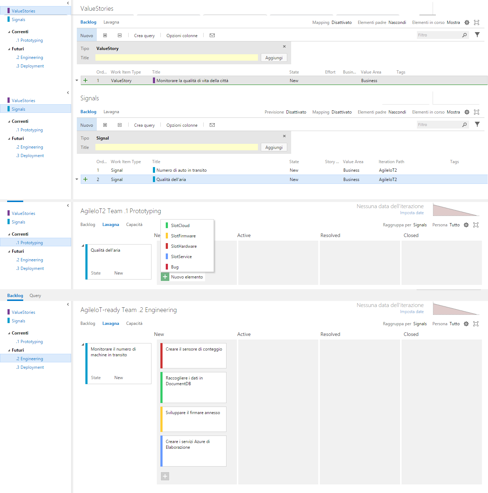

Figura 6 - AgileIoT TFS Process Template

In particolare, due sono gli aspetti su cui il lavoro di
personalizzazione si è concentrato:
-   *Work Item type;*
-   *Iteration path.*

Per modellare l’**Iteration Path**, si è proceduto a modificare quello
base adattandolo alle tre fasi primarie di AgileIoT: *Prototyping*,
*Engineering* e *Deployment*.

I **Work Item type**, invece, sono stati specificamente creati in
funzione degli artefatti previsti da AgileIoT, già descritti in
precedenza.

Tutte le personalizzazioni si riflettono anche sugli aspetti operativi e
sulle metriche di progetto: è possibile, ad esempio, effettuare le
*query* in funzione degli specifici work item e degli specifici path.

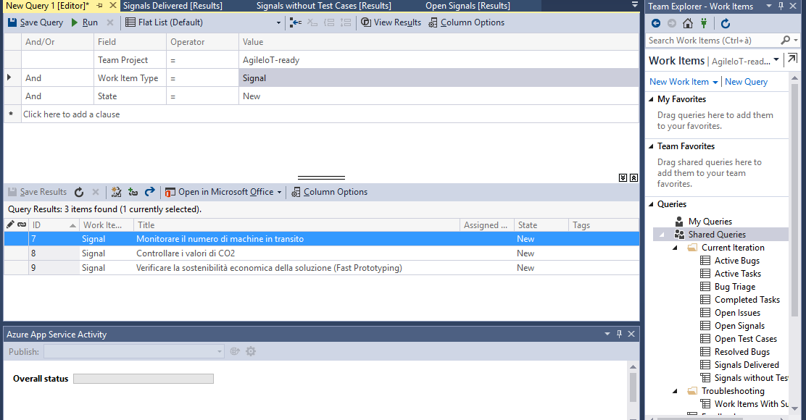

Figura 7 - AgileIoT Work Item query da Visual Studio

Il process template è gratuitamente scaricabile da GitHub all’indirizzo:
[*https://github.com/AgileIoT/TFS2015PT*](https://github.com/AgileIoT/TFS2015PT).

## Conclusioni

*AgileIoT* vuole essere una **Open-Methodology**, che va a modificarsi,
adattarsi e aggiornarsi in funzione degli esperimenti e delle
applicazioni in corso e a venire.

Si tratta di un progetto in continua evoluzione, in chiave
*inspect-and-adapt*, basato su una community aperta che si confronta su
specifici canali digitali messi e durante i workshop di applicazione
pratica.

L’invito è quello di fornire agli autori feedback e suggerimenti,
soprattutto quelli derivati da un’applicazione sul campo, consentendo di
far maturare e crescere il progetto.

Tutti i dettagli, i riferimenti ai canali social e le guide complete
sono disponibili sul portale ufficiale:  [*www.agileiot.org*](http://www.agileiot.org)
