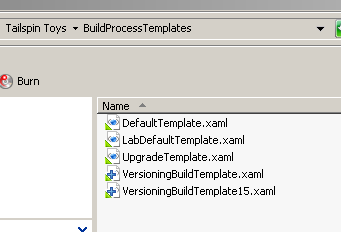
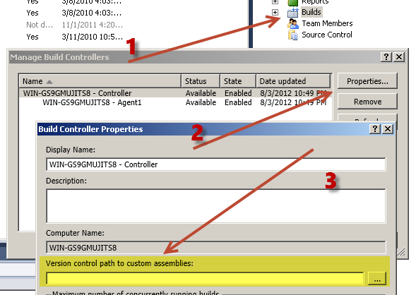
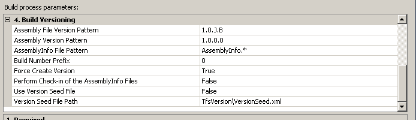

# Gestire la numerazione degli assembly durante la build

#### di [Gian Maria Ricci](http://mvp.microsoft.com/profiles/Ricci) – Microsoft MVP

*Settembre, 2012*

**Nota:** Questo articolo contiene informazioni valide per la vecchia build XAML e non è più attuale con l'attuale sistema di build. Se avete ancora build XAML operative, il suggerimento è aggiornarle alla nuova versione, prima che il build controller venga completamente rimosso in una delle future versioni di TFS.

Concetti di base sulla numerazione degli assembly
-------------------------------------------------

Ogni assembly .NET possiede alcuni numeri di versione utilizzati per
tenere traccia dell’evoluzione di una libreria o di un software durante
il suo ciclo di vita. In particolare due numeri di versione rivestono
una particolare importanza, essi sono: AssemblyVersion e
AssemblyFileVersion.

AssemblyVersion è sicuramente il più importante dei due, perché è usato
durante le operazioni di risoluzione delle dipendenze a run-time. Se un
eseguibile è stato compilato con un riferimento all’assembly *MyLib
versione 1.0.0.0* il caricamento fallirà se nella cartella è presente
una versione di MyLib differente dalla 1.0.0.0. Questo fa sì che
l’AssemblyVersion venga cambiato solo in corrispondenza a rilasci
importanti oppure in caso di incompatibilità binaria con la versione
precedenti.

AssemblyFileVersion è invece utilizzato a titolo informativo e non
prende parte alle operazioni di risoluzione delle dipendenze, per questo
viene utilizzato per distinguere le versioni durante le fasi di
sviluppo. Quello che si fa solitamente è utilizzare come AssemblyVersion
solamente il Major ed il Minor, ad esempio 3.2.0.0 per identificare la
versione 3.2, mentre nella AssemblyFileVersion si utilizza anche il
Build ed il revision attribute. La prima versione rilasciata di una
libreria potrebbe quindi avere la versione 1.0.0.0 ed avere il
FileVersion pari a 1.0.100.234, una patch potrebbe essere rilasciata in
seguito per fixare alcuni bug ed avrebbe sempre la versione 1.0.0.0 ma
il FileVersion 1.0.102.238. In questo modo si può sostituire la dll ed
il software caricherà la nuova versione perché l’assembly è compatibile.

Perché distinguere tra differenti numeri di versione
----------------------------------------------------

In progetti complessi è facilissimo perdere traccia delle versioni
durante lo sviluppo e non sapere più quale è la reale versione presente
sul Server di Test X o quale è presente sul Server di Test Y o quale
versione è attualmente utilizzata dai vari tester. Un ulteriore rischio
è non sapere su che macchina la libreria è stata compilata, se è stata
ad esempio generata da uno script di build (che magari la ha
crittografata con la chiave .snk ufficiale e la ha compilata in modalità
release e fatto girare i test) oppure compilata da uno sviluppatore
qualsiasi e presa dalla output folder di Visual Studio.

Per risolvere questi problemi ed avere una tracciabilità delle varie
versioni degli assembly che sono presenti nella propria organizzazione
si può utilizzare una semplice convenzione.

- Tutti gli assembly compilati dagli sviluppatori nelle proprie macchine
hanno AssemblyVersion uguale a AssemblyFileVersion e con il formato
X.Y.0.0, ovvero utilizzano solamente il Major ed il Minor

- Tutti gli assembly compilati dagli script di build hanno
AssemblyVersion nel formato X.Y.0.0, mentre l’AssemblyFileVersion deve
avere un formato X.Y.R.B dove R e B debbono *identificare univocamente
la build che ha generato quegli assembly*.

Con questa convenzione si può semplicemente osservare le proprietà di un
assembly per capire se è risultato di una build non ufficiale fatta in
una macchina di uno sviluppatore (il File Version finisce per 0.0)
oppure è il risultato di una build ufficiale (il File Version contiene
build e revision number) ed in questo caso si può identificare
esattamente la build che lo ha prodotto e da li risalire al codice
esatto che lo ha generato.

Capire la build che ha prodotto un determinato assembly è importante
perché ci permette di andare in TFS e verificare se ci sono warning di
compilazione, verificare il risultato dei test e l’eventuale Build
Quality o commenti sulla build; infine è naturalmente possibile
visualizzare l’esatto codice sorgente facendo un Get Specific version
con la label generata durante la build.

Supponiamo un caso pratico, un tester inizia a riportare molti Bug ed il
numero e l’entità dei bug trovati è decisamente troppo elevata rispetto
agli altri tester. Grazie al versioning potremmo ad esempio verificare
che il Tester sta erroneamente lavorando su una versione generata da una
build dove molti Unit Test falliscono, ovvero una build instabile.

Come cambiare i numeri di versione durante una build di TFS
-----------------------------------------------------------

Entrambi i numeri di versione di cui abbiamo parlato vengono solitamente
specificati in un file chiamato AssemblyInfo.cs (o AssemblyInfo.vb nel
caso di Visual Basic) tramite Attributi a livello di assembly. Per
cambiare numero di versione prima di una build basta quindi cercare
tutti i file AssemblyInfo.\* e con una RegularExpression cambiarne il
contenuto alterando o aggiungendo l’attributo AssemblyFileVersion. Una
volta che è stata effettuata questa manipolazione si può poi procedere
ad una normalissima build ottenendo cosi il cambio automatico di
versione.

Fortunatamente esiste un progetto su Codeplex che implementa i passi
sopra descritti con una custom action che può essere utilizzata durante
build automatizzata di TFS. Questa libreria è composta da un file dll
che incapsula la logica di numerazione e l’azione per il workflow della
build e di un BuildTemplate basato su quello base che ha già al suo
interno inserita e configurata questa azione. Le operazioni necessarie
per usarla sono veramente poche e consistono essenzialmente in due
distinte procedure

1.  Rendere la dll della libreria disponibile al Build Agent affinché
    possa essere utilizzata durante la build

2.  Aggiungere nel source control del Team Project il template di
    Workflow Foundation che include le operazioni di numerazione
    degli assembly.

Creazione di una build con versioning
-------------------------------------

Il primo passo è scaricare il TfsVersioning tool da codeplex
all’indirizzo <http://tfsversioning.codeplex.com/>, estrarre tutto il
contenuto del file zip e copiare le nuove definizioni della build (che
trovate nella cartella BuildProcessTemplates) nel source control del
vostro progetto assieme alle altre di default già presenti (anche qui
nella cartella **BuildProcessTemplates).**

A questo punto dovete copiare la dll chiamata
**TfsBuild.Versioning.Activities.dll** (che trovate nella cartella
assembly della libreria TfsVersioning) nella cartella del source control
dove sono presenti gli assembly con le azioni custom.

Prima di tutto è necessario verificare se questa cartella sia già stata
configurata; per far questo dal team explorer basta fare click con il
tasto destro sul nodo “Builds”, scegliere “Manage Build Controllers” ed
infine selezionare il controller desiderato e premere il tasto
“properties”. A questo punto dovete controllare il contenuto
dell’opzione “Version control path to custom assemblies”.

Questa opzione permette di specificare una cartella del source control
dove le macchine di build andranno a cercare le dll per le build
personalizzate. Se avete già una cartella specificata dovete solamente
andarci a copiare la dll **TfsBuild.Versioning.Activities.dll**, se al
contrario nessuna cartella è stata ancora specificata, potete
semplicemente scegliere una qualsiasi cartella da qualsiasi team project
e poi copiarci la suddetta Dll.

Non dimenticate a questo punto di fare check-in sia del file di
definizione della build, sia della dll delle attività, in modo che siano
correttamente inserite nel Controllo di codice Sorgente.

A questo punto potete creare una normalissima TFS Build per il vostro
progetto (o modificare una build esistente) in cui l’unico cambiamento
da effettuare si trova nel tab “Process” dove per prima cosa dovete
scegliere di usare il nuovo template appena inserito nel codice sorgente
premendo il tasto New.

Nella finestra di selezione “New Build Process Template” potete poi
scegliere “select an existing XAML File” per usare il nuovo workflow
chiamato VersioningBuildTemplate.xaml caricato in precedenza nella
cartella BuildProcessTemplate.

La vostra build ora eseguirà il versioning automatico degli assembly.

Customizzazione della build con versioning
------------------------------------------

Dopo aver scelto il nuovo build template una nuova sezione di parametri
appare nella definizione della build, come rappresentato nella figura
seguente.

Questi parametri sono specifici della nuova build e permettono di
personalizzare la numerazione automatica. Le prime due voci consentono
di specificare i due numeri di versione AssemblyFileVersion e
AssemblyVersion discussi in precedenza. Come potete vedere dalla figura,
mentre l’ AssemblyVersion è fisso alla versione 1.0.0.0, l’
AssemblyFileVersion contiene due caratteri, J e B che rispettivamente
indicano la data in formato Julian (5 cifre) ed il numero giornaliero
incrementale della build. Questi valori verranno calcolati durante la
build e verranno usati per generare l’AssemblyFileVersionAttribute.

La terza opzione permette di specificare il pattern dei file che
contengono gli attributi di versione, di base essi si chiamano
assemblyInfo.cs (o vb per VisualBasic) e quindi potete lasciare il
valore di default. Il BuildNumberPrefix è invece necessario per
distinguere tra le varie build. Supponiamo di avere la necessità di due
build con versioning, come possiamo dal numero generato capire di che
build si tratta? La soluzione più semplice è avere un valore di base che
viene semplicemente aggiunto al numero della build. Ad esempio potete
mettere 100 per la prima build e 200 per la seconda, in questo modo la
build 240 ad esempio è la quarantesima della seconda build definition.
Se avete più di 100 build giornaliere potete usare 1000 e 2000.

Le altre opzioni sono per un uso più avanzato della libreria, e potete
trovare tutte le informazioni nella documentazione allegata; di base
queste prime opzioni soddisfano egregiamente la maggior parte delle
esigenze, per cui come si può vedere le operazioni da fare sono
veramente poche.

Ora che tutto è pronto si può semplicemente lanciare la build ed al
completamento andare a verificare gli assembly prodotti nella Drop
folder. Per visualizzare il valore del FileVersionAttribute è
sufficiente verificare le proprietà delle dll da Windows che nel tab
“details”, in figura è stato ad esempio riportato il risultato della
compilazione del progetto di esempio di Tailspin Toys presente nella
macchina virtuale di test di Brian Keller.

Considerando che la data in formato Julian 5 cifre è YYDDD dove il DDD
rappresenta il numero di giorni passati dall’inizio dell’anno, questa
build è stata effettuata nel 2012 il 13 agosto ed è la prima della
giornata.

#### di [Gian Maria Ricci](http://mvp.microsoft.com/profiles/Ricci) – Microsoft MVP

