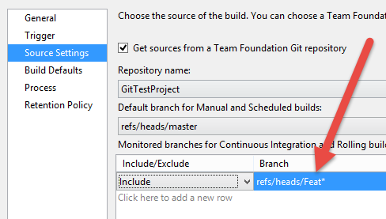
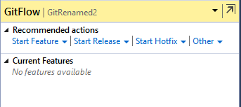
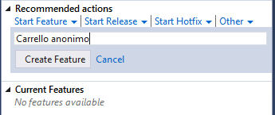
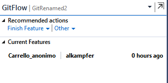

# Branch per feature in Git

#### di Gian Maria Ricci – Microsoft MVP

Blog inglese: <http://www.codewrecks.com>

Blog Italiano ALM: <http://www.getlatestversion.it/author/alkampfer/>

Blog Italiano: <http://blogs.ugidotnet.org/rgm>

*Maggio, 2015*

Differenze rispetto a un Source Control Centralizzato
-----------------------------------------------------

Il differente modello di branching implementato da Git, offre
possibilità decisamente superiori rispetto ad un normale controllo di
codice sorgente centralizzato, permettendo l’adozione di **strategie di
branching difficilmente perseguibili con altri strumenti**. Un’analisi
delle differenze principali che esistono con un VCS centralizzato è
solitamente il punto di partenza per capire come ristrutturare le
proprie politiche di branching al fine di sfruttare al meglio il nuovo
strumento.

***Concetto di Working Directory***

Mentre in un VCS centralizzato una branch è una “*copia intelligente”*
di una cartella ed occupa per questo uno “spazio logico” nella struttura
del codice sorgente, in Git esiste sempre una sola cartella dove
lavorare, chiamata Working Directory. Durante un cambio di Branch
vengono aggiornati i file presenti nella Working Directory per
riflettere il contenuto della branch (o del singolo commit) su cui si
vuole lavorare. Questo comporta

A differenza di un VCS centralizzato, non è necessario adottare alcuna
strategia di mapping per evitare di scaricare branch su cui non si vuole
lavorare

Per ogni sviluppatore, lo spazio occupato da una branch è semplicemente
il differenziale dalla branch di origine, non vi sono cartelle duplicate
con copie dello stesso progetto per le differenti branch

I file dei progetti e soluzioni hanno sempre lo stesso percorso
relativo, la branch dove si sta lavorando non dipende dalla cartella in
cui si è aperto il progetto / solution ma dipende dalla branch attuale
configurata con il comando *git checkout*

Si possono usare branch locali, non visibili al resto del team.

Questa differenza permette di creare branch con più tranquillità, dato
che l’impatto sul resto del team è minimo.

***Singola build per branch multiple***

Se si lavora con un controllo di codice sorgente centralizzato, ogni
branch ha un percorso differente nello spazio logico dei file, es:

    $/MyProject/**Trunk**/src/MyProject.sln
    $/MyProject/**Branches/Release1**/src/MyProject.sln
    $/MyProject/**Branches/Release2**/src/MyProject.sln
    $/MyProject/**Dev**/src/MyProject.sln

In questo caso ho evidenziato in neretto la parte del percorso che
identifica la branch logica, ma a livello di File System, tutte le
solution hanno un percorso differente. Questa limitazione comporta la
necessità di creare una build distinta per ogni branch, dato che nella
build si deve specificare il percorso dei file di progetto / solution
che si vuole utilizzare.

In Git, grazie al concetto precedente di *Working Directory*, i file
hanno sempre lo stesso percorso, quindi una build è concettualmente
valida per tutte le branch. Per evitare lavoro inutile, è comunque
necessario specificare la lista delle branch per cui si vuole attivare
la build. Nella figura sottostante è ad esempio rappresentata una build
che viene eseguita per la branch **master** e per tutte le branch che
iniziano per **feat.**

    

Se si hanno più build con forti personalizzazioni, il poter avere una
singola definizione da utilizzare per branch multiple è una funzionalità
decisamente accattivante.

Strategie di branch avanzate – Branch per feature
-------------------------------------------------

**Le due differenze appena elencate permettono di superare le
tradizionali difficoltà che si incontrano nell’adottare la strategia:
*branch per feature***. In questo modello, ogni nuova funzionalità del
software viene sviluppata in una branch isolata, portando i seguenti
vantaggi:

- Ogni funzionalità è sviluppata in completo isolamento dalle altre
- Si può decidere per ogni singola funzionalità quando reintegrarla con la branch originale
- È molto adatta all’uso con SCRUM e con metodologie agili

Ad esempio, se a fine Sprint il Product Owner decide che solamente 4 dei
5 PBI sono completi, si può procedere con il reintegro delle branch
corrispondenti, lasciando la funzionalità non ancora completata nella
sua branch di sviluppo. In questo modo si può promuovere solamente il
codice relativo alle funzionalità che sono realmente completate.

Se il Product Manager decide che una certa funzionalità è pronta per il
beta testing, si può promuoverla in autonomia per la distribuzione ai
beta-tester, senza preoccuparsi se altre funzionalità sono in stato
incompleto e potrebbero rendere il software instabile.

Nei sistemi classici l’adozione di questa strategia è molto
difficoltosa, il rischio è quello di perdere molto tempo ad effettuare
merge del codice, oltre che avere una proliferazione di cartelle tutte
identiche nel proprio source control. Grazie a Git anche il rischio di
merge complesse è decisamente mitigato. Ad esempio, grazie alla
definizione di una build accurata di controllo, si può conoscere in ogni
momento lo stato di ogni feature branch. Questo significa che per ogni
funzionalità si può sapere se:

- Compila
- Tutti i test sono OK
- Deploy automatico su server di test OK (verifica procedure di rilascio)
- Etc.

Questo vi permette di capire se una funzionalità è pronta o meno per
essere reintegrata.

Merge build monitor
-------------------

Il problema maggiore utilizzando branch per feature è avere troppi
conflitti durante il reintegro. L’unica soluzione per ridurre questo
rischio, è di effettuare periodiche operazioni di forward integration,
ovvero portare le modifiche dalla branch principale alle branch delle
feature. In questo modo le eventuali modifiche (bugfix, feature
rientrate, etc) della master, commitate dopo che una feature branch è
nata, vengono reintegrate a piccoli blocchi.

È fondamentale capire infatti che le operazioni di merge sono più
difficili tanto più tempo passa tra la scrittura del codice e la merge
stessa. La domanda principale diventa quindi: *ogni quanto effettuare la
forward integration tra la master e le varie feature branches.*

Dato che la build di TFS può essere facilmente personalizzata con
script, non è difficile scrivere un piccolo script powershell che, prima
di effettuare la build dei sorgenti, ma dopo avere recuperato l’ultima
versione, tenta di effettuare un merge utilizzando direttamente Git a
riga di comando. Il risultato è una build che è in grado di dirvi in
maniera automatica se la forward integration tra la master e la feature
branch, genera conflitti o no.

    

In questo modo, ad ogni push di codice sulla feature branch, verrà
effettuato un controllo ed il team può essere immediatamente avvertito
quando un incremento di codice genera conflitti con la branch di
origine. In questo modo il team *può immediatamente effettuare il merge
quando le modifiche effettuate sono ancora fresche nella mente degli
sviluppatori*.

L’aspetto interessante è che, nel caso la merge riesca senza conflitti,
la build prosegue, **operando sul codice risultato della merge**. È
infatti possibile che la merge non dia conflitti, ma il codice risultato
della merge automatica non compili nemmeno. Un caso tipico è la presenza
di refactoring di tipo rename nella branch master su classi che sono
utilizzate anche dal nuovo codice della branch.

    

Se il codice compila verranno poi comunque eseguiti gli Unit Test e
tutte le altre procedure di controllo impostate nella build. Una volta
terminata, il risultato può anche essere utilizzato tramite Release
Management per effettuare il deploy su di un server di test. *Ricordate
che in questo caso state testando **il risultato della merge automatica
tra la branch di partenza e la vostra feature branch. ***

Grazie a questa “rete di salvataggio” si possono ridurre fortemente i
rischi di merge complesse, e si può reagire in maniera immediata appena
si presentano conflitti o problemi dovuti alla divergenza tra le feature
branch e la branch di origine.

Git Flow
--------

La strategia di Branch per Feature è cosi utilizzata che, nel corso
degli anni, una sua versione ancora più strutturata ha preso piede nella
community di Git; stiamo parlando di GitFlow
(<http://nvie.com/posts/a-successful-git-branching-model/>). Non mi
addentrerò in questo articolo in una spiegazione dettagliata, ma vi
rimando al link precedente per una spiegazione completa sulla sua
implementazione.

Questa strategia ha una base di adozione molto grande, tanto che è
possibile trovare plugin per quasi ogni strumento di sviluppo e Visual
Studio non fa eccezione; potete infatti scaricare una estensione per
supportare GitFlow direttamente dalla Gallery delle estensioni a questo
indirizzo: <http://tinyurl.com/VsGitFlow>

Questa estensione si integra in maniera semplice con i vari menu del
Team Explorer, fondendosi naturalmente con tutti gli altri comandi
supportati

    

Dopo la prima installazione, se tentate di utilizzare GitFlow vi verrà
proposto di installare gli script necessari in maniera automatica. Una
volta installato, per ogni repository Git potete inizializzare GitFlow
specificando la vostra nomenclatura

    

Dopo l’inizializzazione appare il menù con le azioni disponibili per
GitFlow.

Ad esempio si può iniziare una Feature

    

Una volta iniziata una feature, potete visualizzarla direttamente nella
lista delle feature correnti

    

Dietro le quinte vengono utilizzate le normali branch di Git, ma grazie
a GitFlow è possibile mantenere una nomenclatura consistente e guidare
gli utenti meno esperti nella corretta adozione di una struttura di
branch comune e condivisa, evitando che il repository possa andare fuori
controllo se utilizzato da persone inesperte.

Se si vuole essere sicuri, si può verificare nel menu standard delle
Branch che le operazioni di GitFlow non fanno altro che creare normali
branch di Git.

    

Altro aspetto interessante è che il plugin di Visual Studio non
re-implementa GitFlow, ma bensì installa e configura le estensioni
standard realizzate per la riga di comando di Git. Questo significa che
se preferite lavorare a riga di comando, potete tranquillamente
utilizzare GitFlow nella vostra bash. Per conoscere i comandi basta
scrivere *git flow help.*

    

Conclusioni
-----------

Grazie al modello di branching nativo offerto in Git è possibile
adottare strategie di branch avanzate, come la Branch per Feature,
riducendo di molto i rischi che si hanno utilizzando i modelli classici.
Questo comporta, nel caso abbiate deciso di adottare Git in un progetto,
una nuova analisi sui modelli di branch adottati, in modo da poter
sfruttare al meglio la potenza dello strumento.

#### di [Gian Maria Ricci](http://mvp.microsoft.com/en-us/mvp/Gian%20Maria%20Ricci-4025635) – Microsoft MVP

