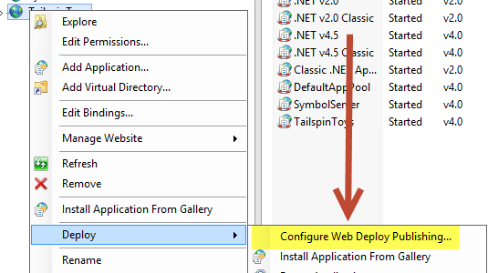
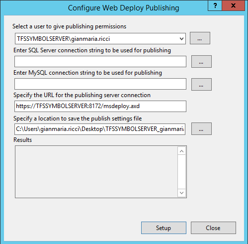
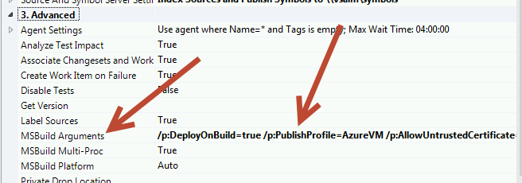
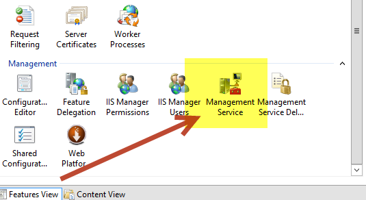
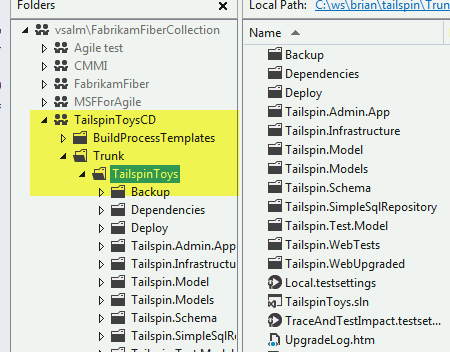
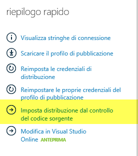
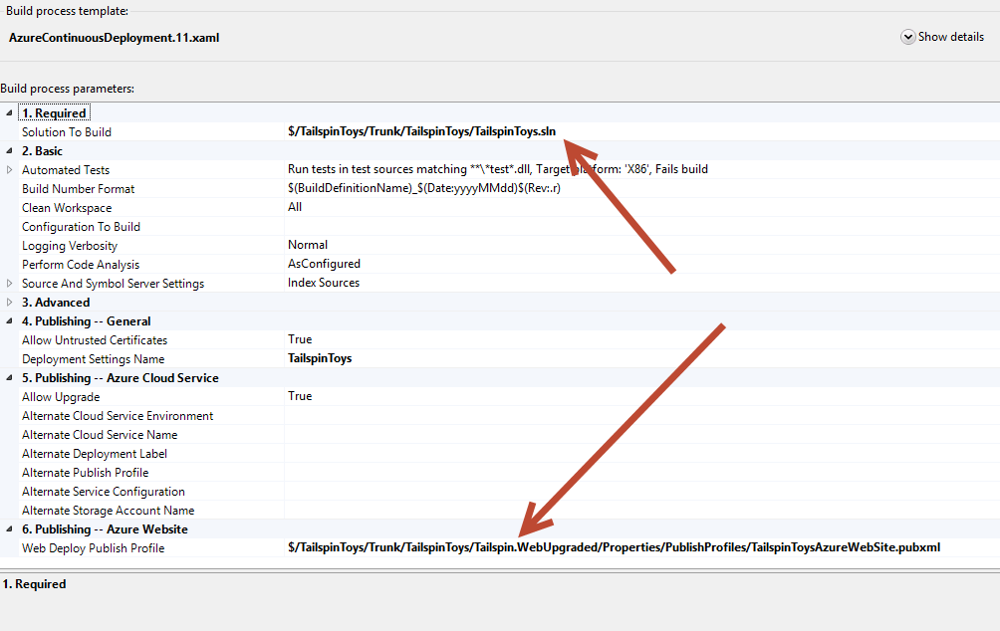
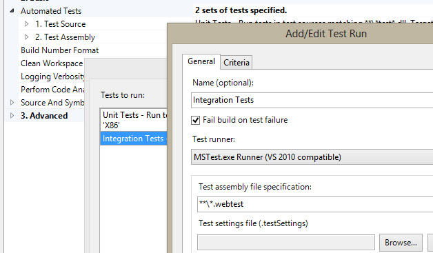
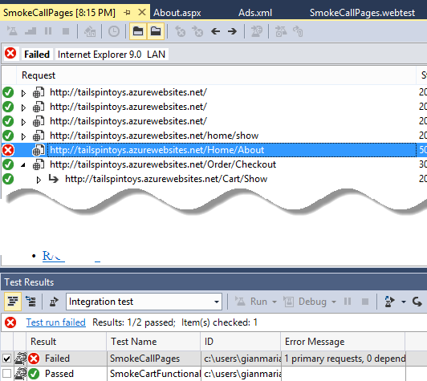

# Continuous Deployment di Asp.Net web sites con TFS Build 

#### di [Gian Maria Ricci](http://mvp.microsoft.com/en-us/mvp/Gian%20Maria%20Ricci-4025635) – Microsoft MVP

Blog inglese: <http://www.codewrecks.com>

Blog Italiano ALM: <http://www.getlatestversion.it/author/alkampfer/>

Blog Italiano: <http://blogs.ugidotnet.org/rgm>

*Dicembre, 2013*

**Nota:** Questo articolo contiene informazioni valide per la vecchia build XAML e non è più attuale con l'attuale sistema di build. Se avete ancora build XAML operative, il suggerimento è aggiornarle alla nuova versione, prima che il build controller venga completamente rimosso in una delle future versioni di TFS.

Perché Continuous Deployment
----------------------------

La complessità media di un software web è aumentata drasticamente negli
ultimi anni, rendendo quindi sempre più difficile la realizzazione e la
manutenzione degli applicativi. Tra i problemi tipici ricorrenti
troviamo la difficoltà di deploy, il rischio di introdurre bug di
regressione, ma soprattutto la necessità di ridurre il tempo che
intercorre dall’avere un’idea e vederla realizzata ed usabile dai
clienti finali. In questo scenario è fondamentale porre particolare
attenzione alle procedure di Quality Assurance e Testing.

Uno dei prerequisiti per poter tenere sotto controllo la qualità di un
software è la possibilità, per il team di test, di accedere
continuamente alle versioni più aggiornate prodotte dagli sviluppatori.
Quello che deve essere fatto è quindi gestire uno o più “ambienti di
test” dove l’applicativo può essere sempre acceduto dal team di test o
più in generale da chiunque sia coinvolto nelle procedure di QA. Lo
scopo è quello di:

-   Poter effettuare test il prima possibile sulle nuove funzionalità
-   Verificare immediatamente la chiusura di eventuali Bug / Difetti che
    il team di sviluppo segnala come “Risolti”
-   Avere ambienti stabili e simili a quello di produzione dove
    effettuare verifiche in situazioni più simili a quelle reali
-   Effettuare test in pre-produzione, ovvero in ambienti quasi identici
    a quelli di produzione, spesso usando un backup dei dati di
    produzione
-   Verificare le procedure di rilascio con particolare attenzione
    all’aggiornamento di sistemi esistenti

Il secondo punto in particolare riveste una particolare importanza. Il
ciclo di vita tipico di un Bug/Difetto che proviene dal team di testing
è infatti il seguente:

-   Il bug viene segnalato da un tester
-   Il team effettua triage di tutti i bug rimuovendo tutti i bug
    duplicati/non riproducibili/deferred in modo che i bug in stato
    “attivo” abbiano una qualità elevata.
-   Il team risolve il bug e lo segnala “risolto”
-   Il team di testing verifica che il bug sia effettivamente risolto e
    lo chiude

Questo è un flusso standard dove spesso ci si arena all’ultimo punto,
dato che il tester deve sapere, per ogni bug segnato come risolto, se le
modifiche fatte per risolvere il difetto siano già state rilasciate
nell’ambiente di test e in quale ambiente (nelle situazioni con più
ambienti, es: dev, test, preprod, staging, etc).

È quindi evidente che per manutenere ambienti di test multipli, la
possibilità di rilasciare in maniera automatica le funzionalità
sviluppate dal team, rappresenta un prerequisito quasi imprescindibile.
Tutte le procedure messe in atto per garantire il rilascio automatico
dal source control in un ambiente (test/preprod/prod) vanno generalmente
sotto il nome di Continuous Deployment o Continuous Delivery, da qui in
poi abbreviate in CD.

Cloud Vs on-premise
-------------------

Per complicare leggermente la situazione, le applicazioni web (Es.
Asp.NET) possono essere rilasciate on-premise oppure nel cloud, ed anche
tutti gli strumenti di sviluppo (Es. la gestione del codice sorgente)
possono risiedere on-premise oppure nel Cloud. Ad esempio si può
utilizzare un IIS in una macchina on-premise oppure rilasciare su Azure
Web Sites / Azure Cloud Services, il sorgente dell’applicativo può
invece essere su un TFS on-premise oppure su Visual Studio Online
(<https://www.visualstudio.com>).

Gli scenari supportati da TFS Build e Asp.Net sono qualsiasi
combinazione delle suddette: possiamo infatti avere TFS sia on-premise
che su TF Service e rilasciare con una build su Azure Web Site o su IIS
on premise indifferentemente. Le differenze tra i vari scenari sono
minime, e si riflettono solamente in alcune funzionalità in più che
vengono offerte dai Web Sites di azure.

Si tenga conto inoltre che anche se si utilizza Visual Studio Online, è
comunque possibile installare un build server on-premise senza problemi
e quindi avere una macchina di build nella propria intranet.

Server web on-premise o Virtual Machine on azure
------------------------------------------------

Se si vuole utilizzare un server web IIS su una macchina nella propria
rete, oppure in una macchina virtuale su Azure o su qualche altro
servizio di hosting di Macchine Virtuali, è necessario installare
preventivamente un componente chiamato Web Deploy. Questo componente
permette di automatizzare il deploy di un sito da Visual Studio (o da
script di MSBUILD) direttamente sul sito IIS selezionato, costituendo il
prerequisito per poter rilasciare in maniera semplice da una build di
TFS.

Una volta che il servizio di Web Deploy è stato attivato si ha la
possibilità di impostare le opzioni di pubblicazione in maniera
specifica per ogni sito presente in IIS. Il primo passo per abilitare il
rilascio tramite Web Deploy è configurare il Web Deploy Publishing da
IIS per il sito che si vuole utilizzare

    

La configurazione è banale ed è solitamente sufficiente specificare
l’utente che sarà autorizzato ad effettuare il rilascio, lasciando
inalterate le restanti informazioni. Ecco ad esempio come risultano le
opzioni di pubblicazione per un sito.

    

Come si può vedere l’utente che può effettuare il deploy è
gianmaria.ricci, non ho impostato alcuna stringa di connessione
specifica per la pubblicazione ed ho lasciato tutte le configurazioni
standard, per cui la url di pubblicazione è
<https://TFSSYMBOLSERVER:8172/msdeploy.axd>. La schermata di
configurazione permette inoltre di generare un file con estensione
.publishsettings che può essere direttamente importato da Visual Studio
in un’applicazione ASP.NET.

Il secondo passo è verificare che tutte le opzioni di pubblicazione
funzionino correttamente. In questa fase è sufficiente aprire le
proprietà di pubblicazione del progetto web che si vuole rilasciare
(tasto destro e publish sul progetto da Visual Studio). A questo punto è
possibile creare un nuovo profilo di pubblicazione, e specificare
semplicemente la url di pubblicazione precedentemente modificata, il
nome del sito da deployare, le credenziali ed infine la Destination URL,
che viene usata dal processo di deploy per verificare semplicemente che
sia tutto ok. Se invece avete già generato un file con estensione
.publishsettings è possibile importarlo direttamente da Visual Studio e
troverete tutti i campi già popolati.

In questo caso come indirizzo del server ho utilizzato il nome della mia
macchina virtuale su azure, ma in generale è sufficiente specificare un
nome DNS valido.

Se volete aggiornare automaticamente anche lo schema del database con un
database project, è possibile configurare i database Upgrade
specificando il file .dacpac che verrà utilizzato per l’aggiornamento.

    

Una volta che tutte le impostazioni di pubblicazione sono corrette, è
possibile salvare il file di pubblicazione.

Creazione della build per il deploy
-----------------------------------

Il workflow standard della Build di TFS è sufficiente per rilasciare una
applicazione ASP.NET, basta infatti aggiungere alcuni argomenti da
passare a MsBuild nelle proprietà di pubblicazione avanzate.

    

In questo caso la stringa esatta che è stata inserita è la seguente.

> /p:DeployOnBuild=true /p:PublishProfile=AzureVM
    /p:AllowUntrustedCertificate=true /p:UserName=gianmaria.ricci
    /p:Password=xxxxxxxxx

Di base è sufficiente specificare il nome del profilo di pubblicazione
da utilizzare (quello che si è inserito precedentemente in Visual
Studio), permettere l’uso di certificati untrusted (perché il
certificato https della VM viene autogenerato da IIS e non è trusted),
ed infine inserire le credenziali per il rilascio. In questo caso le
credenziali sono purtroppo inserite in chiaro nella definizione della
build, ma in generale si sta parlando di credenziali per un server di
test e visibili solamente agli utenti che hanno i diritti in TFS per
modificare una Build; per cui questa problematica di sicurezza può
essere talvolta accettabile. Bisogna comunque ricordare che l’utente
utilizzato per il rilascio non dovrebbe avere alcun privilegio
particolare nella macchina, per evitare problemi di security.

Dato che la security è fondamentale, sarebbe corretto risolvere questi
due problemi in ambienti di produzione. Il problema del certificato è il
più semplice da risolvere, perché basta acquistare un certificato
valido, oppure generare un certificato valido da una Certificate
Authority trusted della propria rete. Una volta che il certificato è
stato generato è sufficiente usarlo per il web Deploy configurando il
Management Service da IIS.

**Se non volete memorizzare nella build le credenziali dell’utente**,
dovete dare i permessi di pubblicazione all’utente utilizzato per i
build server di Team Foundation Server ed utilizzare l’autenticazione
integrata. In questo caso però dovete fare attenzione a qualche semplice
accortezza.

1.  Nel server dove gira IIS, dove aggiungere nel percorso del registro
    HKLM\\SOFTWARE\\Microsoft\\WebManagement\\Server la chiave DWORD
    WindowsAuthenticationEnabled con valore pari ad uno e poi riavviare
    il servizio (net stop wmsvc e poi net start wmsvc)
2.  Dovete utilizzare questi parametri nella apposita sezione
    della build. /p:DeployOnBuild=true
    /p:PublishProfile=WebTest1.Cyberpunk.local.pubxml
    /p:AllowUntrustedCertificate=true /p:UserName="" /p:AuthType=NTLM
  

Come potete vedere i cambiamenti sono due, *il primo è che al posto di
specificare username e password viene specificato solamente il parametro
username che è nullo*. Il fatto che il parametro username sia presente e
nullo è fondamentale affinché tutto funzioni*. Il secondo cambiamento è
l’aggiunta del parametro /p:AuthType che deve essere impostato a NTLM*
affinché sia abilitata l’autenticazione standard di windows.

Infine è necessario verificare e modificare il percorso del file dacpac
affinché possa essere utilizzato dall’agent di rilascio, nel caso
vogliate effettuare l’aggiornamento di un progetto di database.
Purtroppo infatti questo file viene specificato come percorso relativo
tra i progetti, ma questo percorso non è corretto durante un rilascio
con una build di TFS. Il primo passo è verificare il mapping dei
sorgenti utilizzato con la build.

    

In questo caso è stato mappato il percorso principale del progetto,
bisogna ora calcolare quante directory sono presenti dalla radice del
progetto fino al progetto web che si sta rilasciando

In questo esempio si sta parlando di tre livelli, il primo è Trunk, il
secondo è TailspinToys ed il testo è la cartella dove si trova il
progetto web Tailspin.WebUpgraded. Bisogna ora considerare *che tutti i
risultati delle compilazioni dei progetti, durante una build di TFS
vengono copiate in una cartella chiamata bin che si trova allo stesso
livello della cartella dove sono mappati i sorgenti*. Questo significa
che per trovare il file dacpac si deve tornare indietro di quattro
livelli (i tre della solution, piu l’ulteriore per andare alla cartella
padre dei sorgenti) e da qui selezionare la cartella bin, come si vede
nella figura sottostante.

Questa procedura può risultare complessa, ma in realtà è abbastanza
semplice una volta compreso il principio.

Una volta che tutto è stato impostato potete lanciare la vostra build e
verificare che nel server destinazione venga aggiornato correttamente
sia il sito sia il progetto di database. Se qualche cosa va storto
potete sempre aprire il dettaglio della build e consultare il log di
MsBuild che contiene tutto l’output. Per cercare la parte relativa al
deploy effettuate una ricerca per MsDeployPublish: e dovreste trovare
l’output legato al rilascio. Nell’esempio sotto trovate l’inizio del log
di un rilascio su un Web Sites hostato su una VM Azure.

MSDeployPublish:

Start Web Deploy Publish the Application/package to
https://tfssymbolserver.cloudapp.net:8172/msdeploy.axd?site=TailspinToys
...

Starting Web deployment task from source:
manifest(C:\\Builds\\3\\TailspinToysCD\\TailspinToys CD on
VM\\bin\\\_PublishedWebsites\\Tailspin.Web\_Package\\Tailspin.Web.SourceManifest.xml)
to Destination: auto().

Adding sitemanifest (sitemanifest).

Deploy su azure Web Sites 
--------------------------

La stessa tecnica descritta in precedenza può essere utilizzata senza
problemi per effettuare un deploy su windows azure web sites, dato che
il sistema di pubblicazione è lo stesso. Di base si può scaricare il
file publishsettings dal sito di azure, importalo in Visual Studio e
configurare un build esattamente come nel caso precedente.

Nel caso di Azure Web Sites e Visual Studio Online si può però sfruttare
il deploy automatico degli Azure Web Sites, che offre qualche
possibilità in più rispetto a quanto visto finora. Quando create un
Azure Web Site, oppure anche dopo averlo creato, è possibile specificare
opzioni di deploy automatico da differenti sorgenti, ed una di queste è
appunto Visual Studio Online. Di base è sufficiente impostare la
distribuzione dal controllo di codice sorgente.

    

La prima opzione disponibile è infatti Visual Studio Online.

    

A questo punto basta specificare l’indirizzo del proprio account,
effettuare l’autenticazione e garantire accesso al proprio sito dal
componente che si occupa del rilascio, ed infine scegliere il Team
Project che contiene il sorgente da rilasciare.

Questo wizard non fa altro che creare nel Team Project scelto una build
basata su un workflow speciale per la pubblicazione su un Azure Web
Site. Una volta terminato il wizard vi troverete una nuova build con
suffisso \_CD (Continuous Deployment) basata sul template di
distribuzione su Azure Web Site e già configurata.

    

Questa build è a tutti gli effetti una normale build di TFS a cui è
stato aggiunto un segmento di workflow per effettuare un deploy su Azure
ed aggiornare alcune informazioni sul Web Site. *La build può
naturalmente essere modificata, ad esempio se avete più branch potete
cambiare la Solution To Build e scegliere quella associata alla branch
che si vuole rilasciare*. E’ anche possibile andare ad impostare
l’aggiornamento di un progetto di database, semplicemente importando il
file di pubblicazione in Visual Studio e modificandolo come visto
nell’esempio precedente. In questo caso è necessario poi specificare il
file di deploy nell’apposita sezione come mostrato nella figura sopra.

La differenza maggiore rispetto alla publicazione diretta tramite
MsBuild vista precedentemente, è che in questo caso il Web Site Azure
presenterà un tab dedicato alla distribuzione, il quale lista tutti i
rilasci effettuati senza il bisogno di andare a visualizzare il log
delle build di Visual Studio Online.

    

È possibile quindi visualizzare la lista delle distribuzioni, sia andate
a buon fine sia fallite, con una chiara indicazione su quale sia la
distribuzione attualmente attiva. È anche possibile selezionare una
distribuzione precedente e poi selezionare il comando Redistribuisci
(presente in fondo alla pagina) per “tornare indietro” ad una versione
precedente. Naturalmente viene mantenuta la connessione con Visual
Studio Online, ed è possibile visualizzare i dettagli della build
semplicemente cliccando su “Visualizza Registro”.

Esecuzione “smoke Test” o “integration Test” 
---------------------------------------------

Uno degli obiettivi principali del Continuous Deployment è il “fail as
soon as possible” ovvero quello di individuare eventuali problemi nel
minor tempo possibile rispetto a quando essi sono introdotti nel codice
sorgente o nelle configurazioni. Il Fail As Soon As Possible signfica
infatti che in un mondo ideale, ogni errore introdotto nel codice viene
intercettato prima ancora di essere inserito nel server di controllo di
codice (gated check-in).

Oltre agli Unit Test (che vengono eseguiti automaticamente dalla build)
solitamente si devono anche effettuare test di integrazione, ovvero test
sull’intero sito rilasciato. Lo scopo è quindi quello di avere una build
che

1.  Compila il sito
2.  Lo rilascia in un server di test
3.  Esegue gli unit test
4.  Esegue gli Integration test sul sito rilasciato

*Visual Studio comprende uno specifico tipo di test chiamato Web
Performance Test che permette di effettuare una registrazione del
traffico http e di replicarla durante l’esecuzione del test*. Questa
tipologia di test può essere utilizzata per effettuare degli integration
test e può essere schedulata per l’esecuzione nella build dopo il
deploy.

Per fare questo è sufficiente andare nel dettaglio della build ed
aggiungere una nuova lista di test da eseguire, come mostrato nella
figura sottostante.

    

In questo caso ho semplicemente creato un nuovo test run chiamato
Integration Tests, ed ho semplicemente chiesto di utilizzare MsTest
Runner (vs 2010 compatible) per eseguire ogni file con estensione
.webtest (i Web Performance Test). La necessità di utilizzare il vecchio
test runner deriva dal fatto che il nuovo agile test runner non esegue i
web performance test.

Questo è sufficiente affinché vengano eseguiti i web performance test
dopo il deploy. In questo caso ho ad esempio creato un semplice test che
non fa altro che navigare ogni pagina del mio sito e verificare che
nessuna pagina generi un errore. Ecco il risultato della build nel caso
una pagina invece vada in crash.

    

Come si può vedere sono stati eseguiti 2 test run, il primo set di unit
test mi dice che tutti i test sono passati, ma l’integration test da un
errore nel web performance test SmokeCallPages. La parte interessante è
che cliccando sul nome del test, il risultato viene scaricato dalla drop
folder ed aperto direttamente in Visual Studio.

    

In questo modo si può esaminare il dettaglio del test, in questo caso
abbiamo un errore nella pagina Home/About.

Grazie ai Web Performance Test è quindi possibile eseguire dei test di
diagnostica sul sito rilasciato in maniera completamente automatica e
direttamente utilizzando la definizione di build standard presente in
TFS.

Nel caso di TFS 2013, la build standard è stata molto semplificata e
riscritta per cui non vi è più la possibilità di eseguire i test con il
vecchio MsTest Runner. In questo caso è sufficiente utilizzare la
vecchia definizione della build nel caso voi vogliate eseguire dei web
performance test.

#### di [Gian Maria Ricci](http://mvp.microsoft.com/en-us/mvp/Gian%20Maria%20Ricci-4025635) – Microsoft MVP

Blog inglese: <http://www.codewrecks.com>

Blog Italiano ALM: <http://www.getlatestversion.it/author/alkampfer/>

Blog Italiano: <http://blogs.ugidotnet.org/rgm>

