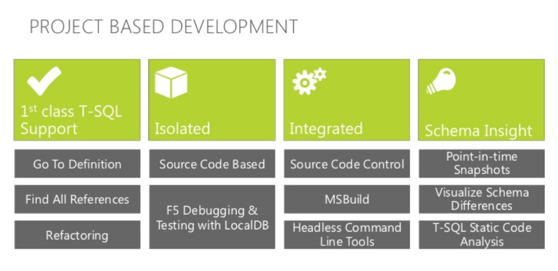
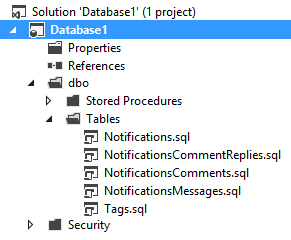
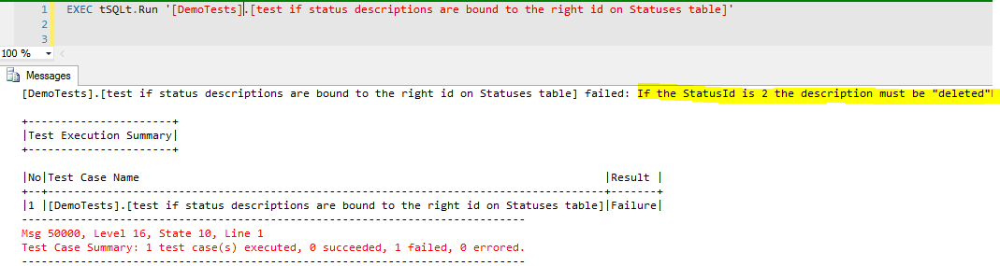
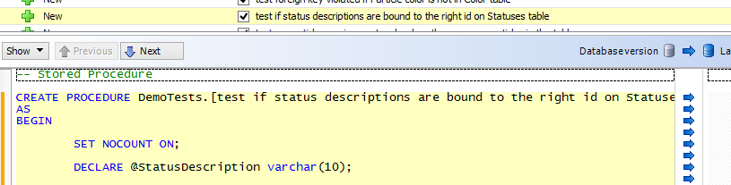

# Continuous Integration con SQL Server 

#### di [Alessandro Alpi](http://mvp.microsoft.com/it-it/mvp/Alessandro%20Alpi-4014222) – Microsoft MVP

blog italiano: <http://blogs.dotnethell.it/suxstellino>

blog inglese: <http://suxstellino.wordpress.com>

sito web: <http://www.alessandroalpi.net>


Introduzione
------------

In questo articolo andremo ad approfondire argomenti che, nel mondo dei
database, non sono molto trattati. Parleremo del processo di Continuous
Integration (CI) e dei principali attori che prendono parte ad esso. Il
tutto cercando di soffermarci su ogni sezione e di approfondire
l’utilizzo di alcuni Strumenti che facilitano le nostre attività.

Una parte descrittiva degli strumenti e dei concetti verrà affiancata ad
alcune considerazioni che riguardano lo sviluppo vero e proprio di
quello che è definito, a volte superficialmente, “codice”. In questi
termini scopriremo che è possibile applicare praticamente gli stessi
comportamenti anche per la base dati, con qualche eccezione data la
natura differente delle due realtà.

Prima di tutto, definizione di CI
---------------------------------

La CI è definita come quella pratica per cui linee di sviluppo vengono
costantemente portate verso un’altra linea condivisa che rende
disponibile i test del codice prodotto. L’obbiettivo è quello di
effettuare test il prima possibile, in modo che gli sviluppatori vengano
messi al corrente di problemi rapidamente. I test di cui si parla sono
automatizzati e consentono il controllo sulle nuove implementazioni e su
come le nuove implementazioni si comportano con gli altri cambiamenti.
Tipicamente il server che si occupa di compilare il codice rilasciato
esegue in automatico anche i test suddetti.

Database e continuous integration
---------------------------------

Partiamo col parlare delle relative parti in gioco. Quando si parla di
CI gli attori sono principalmente tre, escluso il development team che
ne fa ovviamente parte:

- Source control server, ovvero il server delegato al versioning e allo
store del codice.
- Build server, ovvero il server che prende il codice committato e ne
esegue la compilazione
- Testing, ovvero la parte (tipicamente del build server) che si occupa di
eseguire, dopo la compilazione, i test automatici

Andremo a parlare di due di essi nei paragrafi seguenti, mentre
salteremo la parte di Build Server, poiché il database non si preoccupa
di compilare i sorgenti. Si tratta di una parte completamente assente su
SQL Server. In questo senso quindi, prima della gestione della commit
del source control, solo la fase di test potrà avere luogo e verrà
effettuata manualmente direttamente dall’ide di sviluppo.

### Primo attore: il source control con il database 

Il primo attore da considerare è il source control. Tenere il codice
sotto controllo e con progressive versioni è una buona pratica da
seguire comunque, sia lato applicazione, sia lato database. Non è mai da
sottovalutare l’importanza che una pratica come questa ha nel ciclo di
vita del nostro database. Vedremo che da un po’ di tempo a questa parte
non è nemmeno più così difficile raggiungere l’obbiettivo.

#### Perché source control anche su database

Se lo guardiamo da un punto di vista più profondo, il database è
tuttavia codice, e quindi, risulta evidente l’importanza di mantenere
anch’esso sotto source control.

Una delle principali motivazioni che giustificano l’operazione è quella
di avere coerenza ed atomicità tra l’applicazione e la base dati.
Pensate infatti il rilascio di un website ad esempio, alla versione 2.0;
molto probabilmente il database sottostante è cambiato dall’ultima
pubblicazione del sito, quindi, perché non associare sul source control
il codice con gli script SQL? La release risulterebbe più “pulita”, più
coerente.

E immaginate di voler dare un nuovo database di sviluppo ad una certa
versione ad un nuovo collega. Non sarebbe comodo fare una get di una
situazione per avere già su di un’istanza la base dati pronta per
l’utilizzo?

E ancora, per seguire uno sviluppo in multi branch, non trovate sia
estremamente macchinoso e oneroso determinare quale database backup
ripristinare, o peggio, come utilizzare l’unico database che si è deciso
di possedere? Da qui nascono grandi scogli di sviluppo, e il source
control aiuta, così come per il codice a eseguire operazioni di
branching e merging assistite proprio volte a risolvere alcune delle
suddette problematiche.

#### Strumenti per tenere il database sotto source control

Il source control del database può essere di vario genere e dipende
fortemente da:

-   Source control manager scelto
-   Tool utilizzato per gestirlo

È possibile scegliere fra vari source control manager, come [Team
Foundation Server](http://msdn.microsoft.com/vstudio/ff637362.aspx)
on-premise, [Team Foundation Service](http://tfs.visualstudio.com/),
[Git](http://git-scm.com/), [SubVersion](http://subversion.apache.org/),
ed altri. Ognuno di essi supporta differenti tipi di gestione del
controllo del codice sorgente. Per approfondire, consiglio [questa
lettura](http://msdn.microsoft.com/it-it/library/dn133093.aspx).

Come tool di gestione di terze parti, a parte le righe di comando
fornite dai source control manager e parlando di database, i più famosi
sono [Red-Gate Sql Source
Control](http://www.red-gate.com/products/sql-development/sql-source-control/),
[ApexSQL](http://www.apexsql.com/sql_tools_version.aspx) Version. Ma è
possibile anche utilizzare un tool fornito con l’installazione di SQL
Server, chiamato SSDT (Microsoft SQL Server Data Tools).

Qui di seguito parlerò dei due tool che conosco meglio, al fine di
arrivare a parlare della continuous integration su database.

#### Microsoft Sql Server Data Tools (aka SSDT, built-in)

SSDT è uno strumento di sviluppo che, tra le altre cose, consente
l’interfacciamento al source control. Con esso è molto semplice creare
un progetto database e l’IDE di sviluppo estende le funzionalità di base
con plugin che consentono di gestire il progetto in maniera sempre più
completa. Una delle caratteristiche di questo modo di procedere è
proprio quella di avere nel **solution explorer** la completa
definizione della base dati, posta sotto source control proprio come si
fa per un progetto standard basato su codice C\# o altro linguaggio.
Ecco come riassumere quanto SQL Server Data Tools fornisce:

- [Connected database
development](http://msdn.microsoft.com/en-us/library/hh272679(v=vs.103).aspx)
- [Project Based
development](http://msdn.microsoft.com/en-us/library/hh272702(v=vs.103).aspx)
- Schema Deployment


    

Chi è abituato ad utilizzare SQL Server Management Studio (SSMS) ha
poche difficoltà ad utilizzare un ambiente di sviluppo connesso
direttamente al database integrato in Visual Studio, che sfrutta le
add-in che già Management Studio forniva. I designer ed il codice t-sql
sono presenti, costituiti da editor molto simili alle versioni di SSMS.
Le nuove funzionalità sono quelle che consentono la comparazione tra lo
schema salvato nel progetto e quello del database reale.




Il progetto creato con SSDT, è un vero e proprio template che organizza
le informazioni in sottocartelle con il modello *Schema/Tipo
oggetto/file.sql* più altre cartelle come quella della security:



Come è possibile vedere, un grande vantaggio è avere le funzionalità che
si hanno anche lato sviluppo applicazioni, come la *go to definition*, i
refactor automatici degli oggetti e le *find all*, così importanti per
controllare i riferimenti tra gli oggetti database.

Questo tipo di approccio, molto più vicino a chi sviluppa applicazioni,
consente di avere sotto controllo di codice sorgente anche gli oggetti
database e di interagire con **MSBuild**, in un’ottica di continuous
building. Anche la fase di testing del t-sql è immediata e questo sposta
sempre di più la gestione del database verso l’automazione dei deploy.

L’interfacciamento con il source control è lo stesso che si ha con un
normale progetto di Visual Studio. Menu contestuali per sincronizzare
source control e progetti, operazioni di get latest version e get
specifici, risoluzione dei conflitti tramite i merge tool e via
discorrendo.

#### Sql Server Source Control (Red-gate)

Con l’installazione di Red-Gate Source Control, il nostro SQL Server
management studio viene arricchito di aclune view molto comode per la
gestione del versioning degli oggetti a database. Inoltre viene fornito
un plugin per Visual Studio che consente di gestire il proprio database
rispettando la stessa struttura di progetto che il tool di terze parti
crea sul Source Control Manager che abbiamo scelto (ad esempio, TFS).

I tipi di controllo del codice sorgente disponibili sono:

#### Shared

Il modello shared prevede solo un database centralizzato,
nell’operatività questo si traduce in:

- Ogni sviluppatore si connette al source control server e le modifiche
vengono fatte fisicamente su un solo database centrale.
- Chi cambia un oggetto viene segnato come owner della modifica.
- Se più persone cambiano lo stesso oggetto, solo l’ultimo sviluppatore
che ha effettuato la modifica viene segnato, e solo l’ultimo che fa
checkin archivia le modifiche altrui non ancora “committate”.
- Non serve la get latest version, poiché tutti cambiano sulla stessa base
dati e lo stesso source control. Questo equivale ad avere sempre
l’ultima versione del database.
- Le operazioni di checkin comprendono le modifiche di tutti.
- Le operazioni di undo checkout annullano a tutti la modifica (anche
eventuali modifiche fatte da più persone allo stesso oggetto vengono
annullate, poiché l’undo prevede tutte le modifiche dall’ultimo
checkin).

Questo modello è utile se non è possibile creare più versioni dello
stesso database, ma, come si può ben capire, si perdono un po’ tutti i
vantaggi che le branch danno in caso di sviluppo con più team o più
linee. È importante praticamente solo quando fare più copie del database
per gli sviluppatori risulti una pratica troppo onerosa. Tuttavia, anche
da documentazione, ne è sconsigliato l’utilizzo.

#### Distributed

Il modello distribuito prevede un database per sviluppatore che si
collega al source control. Esattamente come per il codice, c’è un
workspace locale su cui la base dati viene creata andando a leggere ogni
versione dal source control per gli aggiornamenti successivi.
Nell’operatività abbiamo:

- Ogni sviluppatore ha il suo database dedicato che è l’ultima versione
scaricata dal source control.
- Ogni modifica è eseguita nel proprio workspace locale (che si traduce in
un vero e proprio database se si utilizza SQL Server Management Studio).
- È di fondamentale importanza effettuare le operazioni di Get Latest per
allineare la versione presente nel workspace locale.
- Ogni sviluppatore può fare checkin delle proprie modifiche per
archiviarle sul source control e renderle disponibili agli altri
collaboratori.
- Ogni sviluppatore possono annullare il proprio checkout senza disturbare
il lavoro altrui, visto che viene toccato solo il proprio workspace
locale (o database).

Tale modello, nell’ottica del lavoro di team, è estremamente
consigliato.

#### Sql Connect (Red-gate)

Come detto nel paragrafo precedente, SQL Connect è un plugin che si
integra con Visual Studio e che crea un progetto in cui ogni file di
struttura e dati dei nostri database viene salvato seguendo
un’impostazione dedicata. Le tabelle, ad esempio, sono salvate dentro
all’omonima cartella, mentre i dati ad esse relativi all’interno della
cartella denominata “Data” con file .sql.

Al di là dell’editor, che ovviamente passa da essere, nel primo caso
SSMS, in questo Visual Studio, vi è un’altra sostanziale differenza: si
lavora direttamente sui file di progetto, sfruttando i vari comandi che
il Source Control Manager fornisce via Visual Studio.

Utilizzando il Red-Gate Source Control invece si modifica il database e
la struttura è costantemente sincronizzata on the fly con la situazione
sul source control. Ogni fase di commit inoltre, non salva su alcun
file, ma porta dal database le modifiche verso il server. Ragion per
cui, per aggiornare il progetto vero e proprio, una get diventa
necessaria. Grazie a SQL Connect questo non è più necessario.

Secondo attore: il testing su database
--------------------------------------

Il secondo attore da considerare è il testing. Esso è estremamente
importante anche su database. Ma cosa si intende per testing del
database? Si intende proprio [Unit
Testing](https://en.wikipedia.org/wiki/Unit_testing) su database,
sfruttando SQL Server Management Studio e il tool aggiuntivo [SQL
Test](http://www.red-gate.com/products/sql-development/sql-test/),
disponibile tramite una view integrata e semplice da utilizzare:


È possibile collegare un proprio database oppure installare il database
di esempio, per vedere un po’ come funziona il framework proposto.
Stiamo infatti parlando di un’organizzazione che espone, appunto, un
framework per fare test SQL, e si chiama [tSQLt](http://tsqlt.org/).
Esso viene installato sul database di riferimento con le seguenti
specifiche:

- tSQLt stored procedure, function e oggetti SQL CLR
- Abilitazione del CLR
- SET TRUSTWORTHY ON sul database (serve per l’esecuzione del CLR)
- Aggiunta facoltativa di [SQLCop framework](http://sqlcop.lessthandot.com/index.php)

Quello che si ottiene tramite questa funzionalità è, non solo eseguire
test preimpostati e condividerli col team di sviluppo, bensì crearne di
nuovi, basandosi sempre sulle regole di scrittura fornite dal framework.

Andiamo quindi a vedere: come eseguire test preesistenti, come crearne
uno “nostro” e come condividerlo al team, istallando il database di
esempio, che il tool chiamerà *tSQLt\_Example*.

### Test all’opera

**Primo esempio**, vediamo come testare il database utilizzando i test
built-in (versione di sql test 1.0.14.2, quindi al momento della lettura
i test potrebbero essere molti di più o cambiati). Innanzitutto abbiamo
due classi:

    Sql Cop
        È un ulteriore framework (che fornisce anche un’applicazione disponibile direttamente da [qui](http://sqlcop.lessthandot.com/index.php)) che sottolinea alcuni problemi delle nostre istanze SQL Server, soprattutto in termini di naming convention e coding, ma non si ferma a questo. L’elenco completo degli issue controllati è [qui](http://sqlcop.lessthandot.com/detectedissues.php).

    Accelerator Tests
        Sono i test built-in di tSQLt

è sufficiente a premere semplicemente *Run Test* sul database
dimostrativo (tab di default posizionato in basso su SSMS):


Un *AcceleratorTests* è fallito ed il messaggio è indicato nella output
window appena sopra. Vediamo cosa fa il test (è sufficiente espandere la
classe ed effettuare doppio click) direttamente dal codice in esso
contenuto:


    

A tutti gli effetti, il test è una semplice stored procedure che
richiama altre procedure e/o funzioni e verifica che il comportamento
sia quello atteso. In questo esempio il test vuole forzatamente tornare
un errore, a scopo dimostrativo. Quello che fallisce è l’ultima
chiamata, perché *@Ready* vale 1 se e solo se ci sono più di due
elementi nella tabella *Particle*. Essendo presenti solo due record,
*@Ready* vale 0 (la funzione torna 0 se non ci sono più di due record) e
quindi la *tSQLt.AssertEquals* (che fa solo uguaglianza dei due
parametri) torna errore, o meglio *tSQLt.Failure*:


Tutti questi test possono essere eseguiti singolarmente, oppure tutti in
una volta, sia nel tab su SSMS, sia con stored procedure dedicate:

- *tSQLt.RunAll*: per l’esecuzione di tutte le classi di test
- *tSQLt.Run*: per l’esecuzione di un test (schema da cui dipendono)
- *tSQLt.RunWithXmlResult*: torna un xml invece che il testo di status
- *tSQLt.RunWithNullResult*: non torna feedback se non quelli di errore

 

Nel **secondo esempio**, si procederà invece a creare un nostro test,
seguendo le linee guida direttamente sulla [documentazione di
tSQLt](http://tsqlt.org/user-guide/).

Immaginiamo di voler creare un test per il controllo dei valori su una
nostra tabella di dati statici, che chiameremo *dbo.Statuses*. La
tabella ha un campo *StatusId* ed una *StatusName*. Essa è stata creata
sul database di demo dei test. I valori sono i seguenti:

0 – disabled

1 – enabled

2 – deleted

Creiamo un test che controlli che ogni valore sia effettivamente legato
alla descrizione che avevamo previsto. Partiamo dalla creazione di una
classe di test (che corrisponde ad uno schema nuovo):

```SQL
EXEC tSQLt.NewTestClass
@ClassName = N'DemoTests'
```


La classe è stata aggiunta, e anche lo schema corrispondente:


Ora andiamo a creare il test. È sufficiente creare una stored procedure
nello schema che abbiamo creato come classe, dando un nome parlante (per
far capire cosa fa quel test). Ad esempio, in base a quello che abbiamo
descritto nello scenario:


Questa stored procedure controlla se per ogni stato c’è una particolare
descrizione. Per ogni controllo, se il test fallisce
(*tSQLt.AssertEqualsString*) viene tornato uno stato di *Failure* col
messaggio di ritorno definito su quella particolare asserzione. Per fare
in modo che il test compaia nella view di SQL Test è necessario iniziare
il nome della stored procedure con la parola “test”.

Lanciamo il test e tutto andrà per il verso giusto:


    

Andiamo ora ad aggiornare una qualunque descrizione, ad esempio mettiamo
la stringa “Confirmed” nello stato 2. Successivamente, rieseguiamo il
test:


    

Diamo uno sguardo ai messaggi, e noteremo Il messaggio di errore
associato all’asserzione che si era inserita nella stored procedure
*tSQLt.AssertEqualsString*:

    [DemoTests].[test if status descriptions are bound to the right id on Statuses table] failed: If the StatusId is 2 the description must be "deleted" Expected: <deleted> but was: <Confirmed>

Eseguendo il test tramite la stored procedure *tSQLt.Run* otterremo il
nostro *tSQLt.Failure*:


    

Ed ora, nel **terzo esempio**, condividiamo il nuovo test al team,
operazione molto semplice poiché compare nel source control direttamente
nella sezione *commit changes*. è sufficiente aprire il nostro source
control tab e fare *checkin* della stored procedure aggiunta, così come
viene fatto per ogni stored procedure sotto controllo del codice
sorgente:


    

La CI quindi è il processo per cui tutto il codice e le risorse ad esso
legate nell’ambito di un progetto sono integrate e testate tramite un
sistema di build e testing. Ogni qual volta una parte del progetto viene
rilasciata al source control, un set di trigger esegue la sessione di
unit testing per dare un feedback immediato (anche errori). Esiste
sempre una versione stabile e funzionante ma la nuova viene definita
come tale solo quando il feedback è positivo. Nel caso in cui errori
fossero ritornati è possibile fare fix della situazione e ripetere la
parte di compilazione/test.

Come dicevamo, per i database, non esistendo la fase di
build/compilazione (fase in cui il build server si occupa di pulire
cartelle, compilare codice, eseguire unit test), si parla di
applicazione degli script e si sfruttano gli istanti precedenti per
effettuare la fase di test, utilizzando ad esempio il tSQLt framework di
cui abbiamo parlato in precedenza ed aggiornare il database. Inoltre, i
tool di Red-Gate danno a disposizione anche una linea di comando
[sqlCI.exe](https://www.red-gate.com/supportcenter/content/Automation_with_Red_Gate_tools/help/1.0/Switches_used_in_sqlCI),
che, in aggiunta, crea anche il package pronto per il deploy del
database. Parleremo di questo nel processo di deploy, in un articolo
successivo.

> Nota: È possibile sfruttare la personalizzazione delle build
    definition per creare un livello di test, direttamente eseguibile da
    riga di comando. Quest’ultima possibilità è disponibile se il
    framework di test impiegato consente, appunto, l’esecuzione da
    command line. Tramite powershell è possibile connettersi al database
    pronto per i test (aggiornato all’ultima versione dal
    source control) ed eseguire direttamente tutti i casi creati durante
    la fase di sviluppo, sfruttando il framework tSQLt.

Qui di seguito, uno schema di continuous integration generico:


In base a quanto descritto sopra, su database, il testing rimarrà
nell’area DEVELOP e il build server segnerà come “eseguiti” tutti i task
relativi (poiché assenti in realtà). Ad ogni sviluppo, verranno eseguiti
a mano i test dagli sviluppatori.

Ricapitolando:

- Installare un tool per la gestione del source control su database (SSDT,
Red-Gate Source Control)
- Installare un framework di test sul proprio SQL Server Management Studio
- Sviluppare e sfruttare il framework di test per fare testing pre commit
- Committare le modifiche testate. Il tutto è allineato sul source
control.
  

Conclusioni
-----------

Seppure su database le metodologie di sviluppo siano differenti da
quelle adottate dal codice, **esso dovrebbe essere integrato nel ciclo
di vita**, seguendo i consigli di questo articolo. In tanti progetti,
soprattutto in quelli capienti ed articolati, è molto importante seguire
un processo con metriche ben stabilite, per ridurre al minimo i tempi di
rilascio e le potenziali regressioni. La vita dello sviluppatore passa
dal fare semplicemente un’implementazione all’integrare di continuo i
propri changeset per rendere il prima possibile le modifiche disponibili
e stabili. Con un paio di semplici click, ragionando in ottica di Test
Driven Development, è possibile eseguire unit test su database e, in
caso di successo, effettuare il commit dei cambiamenti già pronti sul
source control, per poi arrivare al processo finale di deploy. Il tutto
con una certa sicurezza sulla riduzione delle potenziali regressioni.
Non vi è da sottovalutare mai la potenza di questo modo di procedere,
anche sulla base dati.

#### di [Alessandro Alpi](http://mvp.microsoft.com/it-it/mvp/Alessandro%20Alpi-4014222) – Microsoft MVP

blog italiano: <http://blogs.dotnethell.it/suxstellino>

blog inglese: <http://suxstellino.wordpress.com>

sito web: <http://www.alessandroalpi.net>


