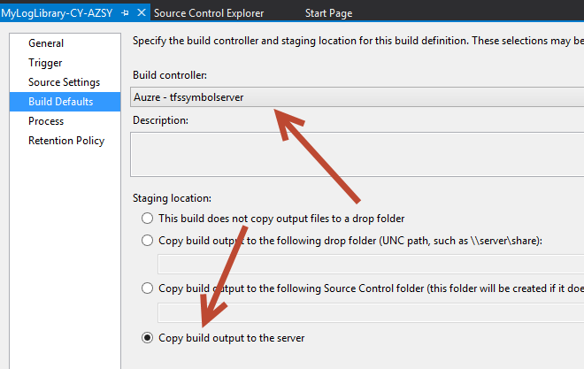
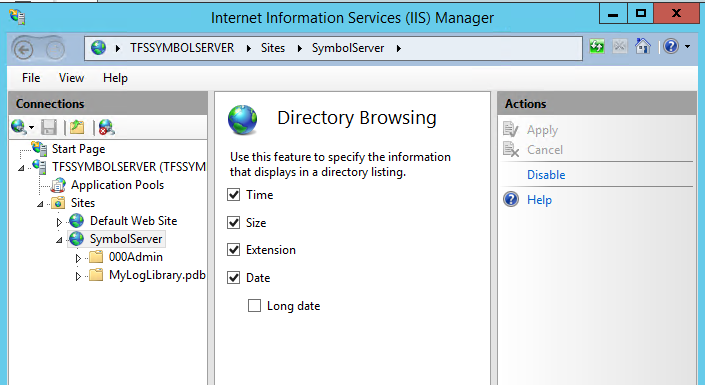
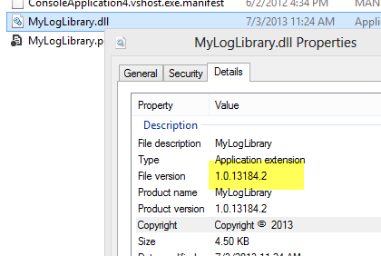
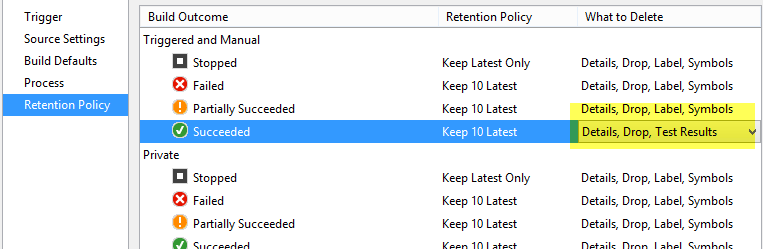

# Creare un Symbol Server con le Build di Team Foundation Server

#### di [Gian Maria Ricci](http://mvp.microsoft.com/en-us/mvp/Gian%20Maria%20Ricci-4025635) – Microsoft MVP

Blog inglese: <http://www.codewrecks.com>

Blog Italiano ALM: <http://www.getlatestversion.it/author/alkampfer/>

Blog Italiano: <http://blogs.ugidotnet.org/rgm>

*Agosto, 2013*

**Nota:** Questo articolo contiene informazioni valide per la vecchia build XAML e non è più attuale con l'attuale sistema di build. Se avete ancora build XAML operative, il suggerimento è aggiornarle alla nuova versione, prima che il build controller venga completamente rimosso in una delle future versioni di TFS.

Scenario standard: realizzazione di librerie interne
----------------------------------------------------

Se nella propria organizzazione vengono sviluppate librerie ad uso
interno, indipendentemente dalla modalità di distribuzione scelta, le
problematiche maggiori che si riscontrano sono due

1.  **Chi usa le librerie lamenta il problema di non poter effettuare il
    debug del codice sorgente.** In caso di eccezione interna alla
    libreria non si riesce a diagnosticare la causa;
2.  **Si perde traccia delle varie versioni, non si capisce più quale
    progetto stia usando quale versione.** Anche in questo caso, in caso
    di eccezione interna, non si è in grado di collegarla al sorgente
    realmente utilizzato per la sua compilazione

Mentre il punto due è stato già trattato in un precedente articolo dal
titolo: [*Gestire la numerazione degli assembly durante le
build*](http://msdn.microsoft.com/it-it/library/jj714729.aspx) il primo
punto rimane spesso “parzialmente” irrisolto. Il termine “parzialmente”
viene usato perché solitamente si hanno i seguenti sintomi: **alcuni
riescono ad effettuare il debug del sorgente mentre altri membri del
team no, anche chi riesce ad effettuare il debug però spesso riceve
l’avvertimento che la versione del file è differente da quella usata per
la compilazione.** La ragione di questo è da ricercarsi nella struttura
dei file .pdb (i file dei simboli) generati da Visual Studio, nei quali
vengono scritte tutte le informazioni necessarie per effettuare il
debug. Il problema sorge perché i file sorgenti vengono referenziati
usando il percorso assoluto, quindi **se chi usa la libreria non ha i
sorgenti nello stesso percorso locale di chi ha compilato la dll**,
quando si preme F11 (Step Into) per debuggare una funzione in una
libreria, o al momento di una eccezione, Visual Studio apre la classica
finestra di dialogo chiedendo dove si trovano i file sorgente.

Anche se si adotta una policy per cui tutti gli sviluppatori strutturano
i progetti nello stesso percorso del proprio disco fisso, questa
soluzione non è comunque corretta. In questo caso, sebbene Visual Studio
sia in grado di trovare i sorgenti nel disco, la versione
**difficilmente sarà la stessa con cui è stata compilata la dll che si
sta usando**. Se si considera che potrebbero essere in circolazione più
versioni di una certa dll, si può capire come sia impossibile adottare
questo approccio.

La soluzione migliore è usare le Build di Team Foundation Server che
permettono (sin dalla versione di TFS 2010) di specificare uno share di
rete da usare come [Symbol
Server](http://msdn.microsoft.com/en-us/library/windows/desktop/ee416588(v=vs.85).aspx).
Tutto **quello che si richiede è che sia disponibile un Build Server che
abbia accesso ad uno share di rete**, il processo di build effettuerà
tutto il resto in maniera completamente automatica.

Se si utilizza TF Service (TFS hostato in Azure), sebbene sia fornito
supporto nativo alla build con l’elastic build, esso non è in grado di
accedere a nessuno share di rete privato. In questa situazione è
necessario configurare un Build Controller on-premise nella propria rete
aziendale oppure utilizzare una Virtual Machine su Azure. Al contrario
se si utilizza TFS on-premise, è sufficiente un qualsiasi build server
ed uno share di rete.

Installare e configurare il build agent
---------------------------------------

Questa operazione è necessaria se viene utilizzato TF Service e non si è
mai configurato un build controller aggiuntivo, oppure se si utilizza il
TFS standard ma non si è mai configurato l’ambiente di Build.

*TF Service:* Dopo avere configurato una Virtual Machine in Azure o
on-premise, si dovrà procedere ad abilitare alcuni ruoli ed installare
TFS Express. La scelta della versione Express viene fatta perché è
disponibile senza alcun costo di licenza fino a 5 utenti e permette di
installare un Build Server.

*On-premise:* Per l’installazione on-premise si procederà invece
all’installazione del Build Server direttamente dalla ISO di Team
Foundation Server, visto che già si possiede la licenza di TFS e le
relative CAL.

In entrambi i casi nella Virtual Machine dovrete abilitare.

- il File Server role, per avere le share di rete
- il Web Server per avere IIS e poter pubblicare un sito

Una volta installato e [configurato il Build
Server](http://msdn.microsoft.com/it-it/library/ee259683(v=vs.110).aspx)
si dovrà creare la cartella che conterrà il Symbol Server e condividerla
in rete, in questo esempio l’indirizzo dello share è:
[\\\\tfssymbolserver\\symbols](file:///\\tfssymbolserver\symbols)

**Figura 1:** *Creare uno share di rete configurato per lettura / scrittura*

**Figura 2:** *Il build controller ed un agente configurati*

Creare una build collegata al symbol server
-------------------------------------------

Una volta che il Build Controller è operativo, si può procedere alla
**creazione di una definizione di Build per compilare la versione
binaria della libreria che si vuole rilasciare**. La configurazione è
standard; nel caso di build su TF Service si deve ricordare di
selezionare il build controller appena installato sulla Virtual Machine
e non l’elastic build, che non ha accesso alla cartella condivisa.

**Figura 3:** *configurazione di una build che utilizza il build controller appena installato*

Per TFS on-premise invece è possibile selezionare qualsiasi build
controller i cui agent collegati abbiano accesso allo share di rete del
Symbol Server.

L’unica altra sezione della configurazione legata al Symbol Server si
trova nella sezione Process / 2.Basic. **Le uniche opzioni che si
debbono specificare sono un parametro booleano per abilitare /
disabilitare la pubblicazione dei simboli e lo share di rete da
utilizzare** (**Figura 4**) In questo processo è stato anche utilizzato
il processo di Build per il versionamento dei file, come descritto
nell’articolo: [Gestire la numerazione degli assembly Durante le
build](http://msdn.microsoft.com/it-it/library/jj714729.aspx)

*Come già detto, se nel vostro scenario il server di build è on-premise,
è possibile scegliere un qualsiasi share di rete che sia accessibile
dall’utente usato per eseguire il Build Agent.*

**Figura 4:** *Il tab del processo di build con evidenziato il
    template di versioning e le opzioni per la pubblicazione
    dei simboli.*

Una volta che la definizione della build è completa, si procederà alla
esecuzione della build, al termine della quale si potrà verificare
l’effettivo popolamento della cartella del Symbol Server.

**Figura 5:** *Al termine della build nello share di rete del Symbol
    Server saranno presenti alcuni file*

Passo 3: pubblicare la libreria dei simboli con IIS
---------------------------------------------------

*Se il vostro build server è on-premise (TFS standard o TF Service)
questo capitolo è superfluo. Basta infatti assicurarsi che lo share di
rete che contiene il symbol server sia visibile a tutti i computer degli
sviluppatori*.

*In caso invece di VM su Azure (TF Service) è necessario trovare una
tecnica alternativa allo share di rete per permettere ai computer client
di accedere alla libreria dei simboli. Questo capitolo spiega quindi
come esporre la cartella del Symbol Server tramite IIS.*

La soluzione più semplice nel caso la VM sia su Azure è quella di
**usare IIS e pubblicare un sito che punti allo share di rete, con
abilitato il Directory Browsing**. Alternativamente è possibile anche
impostare una VPN tra la VM in azure e la propria rete locale, ma la
soluzione con IIS è di gran lunga la più semplice e veloce da realizzare
(a meno che non abbiate già una VM su azure in vpn con la propria
infrastruttura).

Basta aprire la console di amministrazione di IIS ed aggiungere un nuovo
sito che punti alla cartella locale che è stata condivisa abilitando il
directory browsing.

**Figura 6:** *Symbol server is now publishing the symbol directory
    to the web with IIS*

Per questo esempio ho scelto la porta 27000 per la pubblicazione, ed
essendo la mia macchina virtuale su Azure, affinché **il sito sia
visibile dall’esterno è necessario aprire la porta scelta nel firewall
interno di Windows Server, e creare un endpoints nel pannello di
controllo Azure relativo alla vostra Virtual Machine**

**Figura 7:** *Creazione dell’endpoint per esporre all’esterno la
    porta 27000*

Una volta che l’endpoint è stato creato si dovrebbe essere in grado di
navigare all’indirizzo scelto e visualizzare i file della cartella dai
computer della vostra rete.

**Figura 8:** *Il symbol server è ora esposto in HTTP*

Configurare il Visual Studio per usare la libreria dei simboli
--------------------------------------------------------------

L’ultimo passo è **configurare il Visual Studio** specificando nelle
opzioni del Debug (Tools -&gt; Options -&gt; Debugging), l’indirizzo del
server dei simboli. Nella figura sottostante si possono vedere entrambe
le configurazioni, uno share di rete
([\\\\TFSERVBS1\\Symbols](file:///\\TFSERVBS1\Symbols)) oppure
l’esposizione tramite IIS all’indirizzo visto precedentemente
(http://tfssymbolserver.cloudapp.net:27000)

**Figure 9:** *Il symbol server è ora configurato in Visual Studio*

Non bisogna inoltre dimenticare di abilitare il Source Server Support,
altrimenti i vari Symbol server verranno ignorati. I settaggi importanti
sono due: il primo è l’Enable Just My Code che va deselezionato ed il
Source Server Support che va abilitato.

**Figure 10:** *Configurazione generale del debugging per abilitare
    l’uso dei symbol server*

Le operazioni necessarie per la pubblicazione di una versione diventano
quindi:

- lanciare la build
- verificare che l’esecuzione vada a buon fine
- prelevare i file binari dalla drop folder.
- distribuire i file binari con i relativi .pdb

Per quanto riguarda la distribuzione si possono usare le tecniche
preferite, usare un nuget server interno, includere i binari rilasciati
nel source control, depositarli in un apposito share di rete, oppure
semplicemente comunicare la url della Drop della build.

**Figure 11:** *La versione compilata della libreria può essere ora
    scaricata direttamente dalla drop folder della build*

La Drop può infatti essere scaricata comodamente in formato zip, come
mostrato nella **Figura 11**.

In questo caso i file dei simboli generati dalla build, contengono un
riferimento ai sorgenti nel Team Foundation Server oltre che alla
posizione su disco. **Basta quindi referenziare la dll nel proprio
progetto ed essere sicuri che il corrispettivo file .pdb sia presente**
e durante il debug, se si preme F11 da Visual Studio, sarà possibile
effettuare il debug del codice sorgente della libreria**. In questo caso
i sorgenti corretti verranno scaricati automaticamente dal vostro TFS**
(Dovete chiaramente essere loggati ed avere accesso al tfs).

**Figure 12:** *Premendo F11 si è in grado di entrare in debug nei
    file sorgenti usati per la compilazione della dll*

Quello che accade è, una volta premuto F11, Visual Studio legge dal file
.pdb la posizione del codice sorgente relativo all’istruzione attuale,
contatta la libreria dei simboli e TFS, scaricando cosi la versione
corretta del file. Se si osserva con attenzione il nome del file in
Figura 12 si può notare come prima del nome del file (myLogLibrary.cs)
sia presente un numero (1046), che altro non è che il changeset id.

**Figure 13:** *L’ultima modifica fatta al file è appunto la
    versione 1046*

L’aspetto interessante dell’avere messo in opera un Symbol Server, non è
solamente la possibilità di poter effettuare il debug delle librerie
interne senza doversi preoccupare di dove sia il sorgente, ma anche il
fatto di poter effettuare il debug avendo **sempre a disposizione la
versione esatta del sorgente utilizzato per compilare la dll che si sta
usando.**

Infine si ricordi che è comunque possibile risalire alla build
utilizzata semplicemente dalle proprietà del file, grazie alla libreria
di versioning.

**Figure 14:** *Il numero di versione identifica esattamente la
    build utilizzata per compilare la dll*

> **NOTA BENE**: I simboli pubblicati sono parte della build, per cui
    è necessario ricordare di non cancellare mai le build usate per
    pubblicare i simboli, o se le si cancella di non cancellare i
    relativi simboli, altrimenti tutte le dll che avete distribuito
    relative a quella build, non saranno più in grado di riconnettersi
    ai rispettivi sorgenti

**Figura 15:** *Non cancellare mai i simboli di una libreria
    pubblicata, oppure non si sarà più in grado di effettuare il debug.*

Una buona norma è marcare con Retain Indefinitely tutte le build
relative a versioni pubblicate e disabilitare comunque la cancellazione
automatica dei simboli per le build. Questa operazione deve essere fatta
per ogni versione di cui avete distribuito le dll e che sia ancora
ufficialmente supportata.

**Figura 16:** *Anche se si richiede di tenere solamente le ultime
    10 build riuscite, si può scegliere di non cancellare mai i relativi
    simboli pubblicati*

Scenario: debug in produzione 
------------------------------

Lo scenario di libreria condivisa non è il solo a giovare di un symbol
server ed in generale **si dovrebbe rilasciare in produzione solamente
binari che sono stati compilati da una build con il symbol server
configurato**. Supponiamo infatti di dover inviare ad un datacenter la
nostra applicazione asp.net affinché venga hostata su un server remoto e
di dover successivamente diagnosticare un bug che si presenta solamente
in produzione.

In questo caso non si ha probabilmente accesso alla macchina, ma in ogni
caso eseguire un Debug con Visual Studio è altamente sconsigliato,
perché ad ogni breakpoint si fermerebbe tutta l’applicazione di
produzione. **La soluzione migliore è quindi quella di effettuare un
collect degli errori con il collector di Intellitrace [come mostrato in
questo
articolo](http://www.getlatestversion.it/2013/08/01/intellitrace-collector/)**.
Grazie a questo componente si può creare un file Intellitrace™ relativo
all’esecuzione in produzione, che può poi essere semplicemente scaricato
su una macchina di un membro del team che ha una licenza di Visual
Studio Ultimate.

Se è stato impostato il symbol server, navigando all’interno degli
eventi Intellitrace™, si è in grado di visualizzare la versione esatta
del file attualmente in produzione che è stato utilizzato per generare
il file di Intellitrace™ che si sta debuggando.

   

Tutto questo avviene in automatico: una volta selezionato un evento di
Intellitrace relativo al vostro codice, Visual Studio verificherà nel
Symbol Server le informazioni relative e procederà a scaricare da TFS il
file corrispondente nella versione che è attualmente in esecuzione in
produzione. L’aspetto interessante è che **non è nemmeno necessario
avere la solution aperta**, perché VS a tutti gli effetti scarica i file
dal TFS e non ha quindi necessità di avere la corrispettiva soluzione
aperta.

Se non avete una applicazione web, ma una desktop, è comunque possibile
raccogliere una collection di Intellitrace™, seguendo le istruzioni che
sono riportate in questo articolo MSDN: [Collect data from Managed
app](http://msdn.microsoft.com/en-us/library/vstudio/hh398365.aspx#BKMK_Collect_Data_from_Executables).

Se si combina quanto appreso, con la possibilità di [effettuare un
Deploy
automatico](http://www.codewrecks.com/blog/index.php/2013/03/15/tf-service-deploy-on-azure-web-site-with-database-project/)
di un web site e relativo aggiornamento automatico dello schema di
database, avrete un ambiente di Continuous Deployment con la possibilità
di effettuare Intellitrace™ collector o Debug live (per gli ambienti di
Test) con la certezza di poter effettuare il debug risalendo alla
versione del sorgente esatto utilizzata per compilare l’applicativo che
si sta debuggando.

#### di [Gian Maria Ricci](http://mvp.microsoft.com/en-us/mvp/Gian%20Maria%20Ricci-4025635) – Microsoft MVP

Blog inglese: <http://www.codewrecks.com>

Blog Italiano ALM: <http://www.getlatestversion.it/author/alkampfer/>

Blog Italiano: <http://blogs.ugidotnet.org/rgm>

