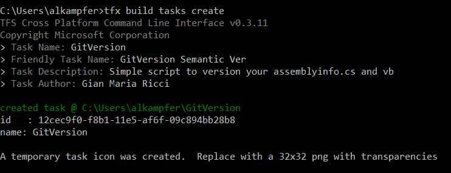
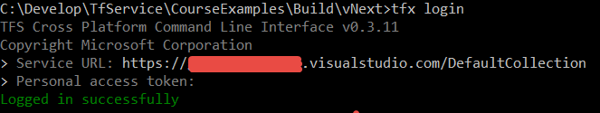
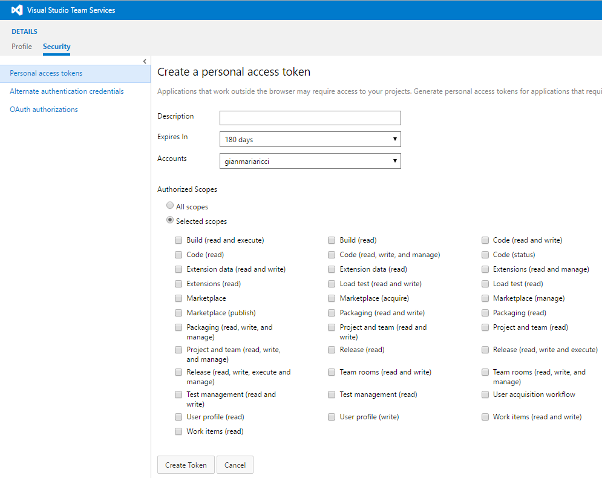
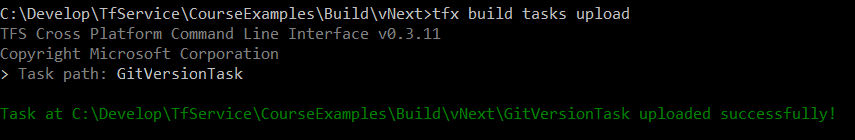
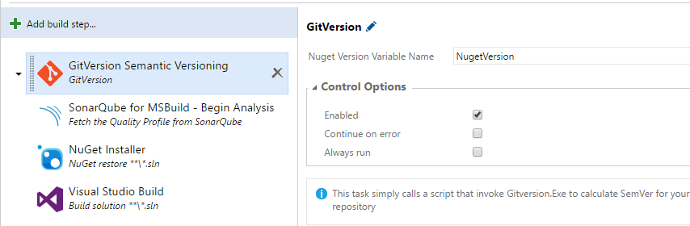

# Creare un Task personalizzato per la nuova build di TFS2015 / Visual Studio Team Services

#### di Gian Maria Ricci - Microsoft MVP

Blog inglese - http://www.codewrecks.com
Blog Italiano ALM - http://www.getlatestversion.it/author/alkampfer/
Blog Italiano - http://blogs.ugidotnet.org/rgm

*Maggio 2016*

Grazie al nuovo Sistema di build offerto da TFS 2015 / VSTS, scrivere un
Task personalizzato da eseguire nella build è una operazione decisamente
più semplice rispetto allo scrivere e mantenere una Custom Activity per
il vecchio sistema di Build.

Build vNext VS XAML Build
-------------------------

La vecchia versione di Build, basata su Workflow Foundation, garantiva
una grande flessibilità, data dalla possibilità di utilizzare un motore
di Workflow complesso ed estendibile. Purtroppo WF comporta una maggiore
complessità per quanto riguarda l’estendibilità della build per eseguire
codice personalizzato.

La soluzione più adottata, onde ridurre il costo di manutenzione, era
utilizzare script Powershell o Batch, in modo da non dovere
personalizzare il Workflow. L’estendibilità vera e propria infatti era
garantita dalla realizzazione di una Custom Activity, da inserire poi
all’interno di un Workflow di build. Il problema maggiore di questo
approccio era che, ad ogni nuova versione di TFS, era necessario
verificare che l’azione fosse ancora compatibile, ed in caso contrario
ricompilarla con le references ai nuovi file binari di TFS. Modificare
il workflow richiedeva inoltre Visual Studio ed era una operazione
decisamente non per l’utente senza esperienza.

Nella build vNext invece, un task può essere scritto o in PowerShell,
oppure in Node.Js, entrambi linguaggi di script che non dipendono quindi
da nessun framework utilizzato. Per questa ragione, una volta scritto un
Task, non esiste la necessità di ricompilarlo con le reference alle
nuove dll, appunto perché non esiste compilazione.

Un altro innegabile vantaggio è che è possibile semplicemente prendere
gli script PowerShell già utilizzati in precedenza, ed includerli in un
Task con veramente poco sforzo. In questo articolo verrà mostrato come
includere lo script di versioning, già mostrato in altri articoli, in
modo da poterlo includere in un Task per aumentare la riutilizzabilità.

Perché creare un Task invece di tenere lo script separato
---------------------------------------------------------

Spesso ci si chiede quale sia il vantaggio di creare un task
personalizzato, invece di mantenere lo script semplicemente nel proprio
source control, ed utilizzarlo direttamente nella build tramite un Task
di tipo PowerShell. I vantaggi solitamente sono i seguenti
-   La gestione dello script viene centralizzata, se si rende necessario
    modificarlo, si può aggiornare il task cosi da aggiornare tutte le
    build che ne fanno uso.
-   Il task non richiede all’utilizzatore dello script di posizionarlo
    in un percorso del suo Source Control, garantendo così un sorgente
    più pulito.
-   Semplice gestione delle dipendenze, se uno script ha bisogno di
    strumenti esterni, come ad esempio GitVersion.exe, è più semplice
    includere tutto in un unico Task invece di dover includere tutto nel
    source control.

Per l’esempio di questo articolo verrà convertito in task lo script di
versionamento tramite GitVersion.exe, descritto in un precedente
articolo. Lo scopo è includere tutte le dipendenze, compreso
GitVersion.exe nel task, in modo da renderlo di più semplice utilizzo.

Come creare l’estensione
------------------------

Per prima cosa serve installare una utility command line chiamata
[tfx-cli](https://github.com/Microsoft/tfs-cli) che permette di gestire
la realizzazione di task custom per la build vNext. Una volta che
l’utility è stata installata è sufficiente da riga di comando digitare
il comando

> tfx build task create

Questo comando vi chiederà una serie di informazioni sul nuovo task che
deve essere creato, come mostrato qui di seguito

Al termine verrà creata una nuova cartella, con il nome che si è scelto
per il proprio task, contente una serie di files che costituiscono lo
“scheletro” per la realizzazione di un nuovo task. Il file più
importante è chiamato task.json, e contiene tutte le informazioni
necessarie affinché il motore di build identifichi ed utilizzi
correttamente il vostro task.

Ecco qui di seguito come ho modificato il task.json per creare il task
che esegue il versioning degli assembly con uno script powershell.

    {
    "id": "4d26fc20-dcb5-11e5-80ed-77d9cb9f353c",
    "name": "GitVersion",
    "friendlyName": "GitVersion Semantic Versioning",
    "description": "Simple script to version your task with GitVersion",
    "author": "Gian Maria Ricci",
    "helpMarkDown": "This task simply calls a script that invoke Gitversion.Exe to calculate SemVer for your repository",
    "category": "Utility",
    "visibility": [
        "Build",
        "Release"
        ],
    "demands": [],
    "version": {
        "Major": "0",
        "Minor": "1",
        "Patch": "14"
        },
    "minimumAgentVersion": "1.91.0",
    "instanceNameFormat": "GitVersion $(message)",
    "inputs": [
            {
            "name": "NugetVersionVariableName",
            "type": "string",
            "label": "Nuget Version Variable Name",
            "defaultValue": "NugetVersion",
            "required": *false*,
            "helpMarkDown": "If you want nuget version in a variable like $(NugetVersion) just specify its name."
            }
        ],
    "execution": {
        "Node": {
            "target": "sample.js",
            "argumentFormat": ""
            },
        "PowerShell": {
            "target": "$(currentDirectory)\version.ps1",
            "argumentFormat": "",
            "workingDirectory": "$(currentDirectory)",
            "platforms": [ "windows" ]
            }
        }
    }

Il file è cosi semplice che non necessita di particolari spiegazioni.
Dopo una sezione inziale prettamente descrittiva, vengono specificati
tutti i parametri di input, in questo caso ne è presente uno solamente,
il nome della variabile della build dove lo script andrà a copiare la
versione del package Nuget. Questo serve affinché il versioning generato
sia disponibile nei task successivi (ad esempio nel Nuget package).

Nella parte execution invece vengono indicati gli script da eseguire, di
tipo Node.js o PowerShell. Chiaramente per questo task non ho nessuno
script node.js, dato che ho già uno script PowerShell pronto. L’aspetto
realmente interessante è che lo script specificato per l’esecuzione è
praticamente quasi identico allo script già utilizzato nelle build
standard. Questa è una delle ragioni per cui si consiglia spesso di
estendere la build con script PowerShell, dato che il loro riutilizzo è
solitamente molto elevato.

Le uniche modifiche fatte allo script originale sono: aggiungere come
unico parametro di ingresso il nome della variabile della build, dove
andare a copiare il valore SemVer per il package nuget. Lo script
inoltre recupera automaticamnete il percorso dei sorgenti dalla
variabile di ambiente \$env:BUILD\_SOURCESDIRECTORY.

A questo punto non resta che da copiare nella directory tutti gli
eventuali file accessori di cui lo script ha necessità. Per questo
esempio è stato incluso il tool GitVersion.exe assieme a tutte le sue
dipendenze. In questo modo il task contiene tutti i file / strumenti
necessari alla sua esecuzione e non si è più costretti ad includerli nel
controllo di codice sorgente.

L’ultimo passo è aggiungere un file package.json per dichiarare tutte le
dipendenze per Node.Js. Anche se il nostro script non utilizza Node.Js
ma PowerShell, è necessario specificare quale sia la versione minima
delle librerie base utilizzate dal motore di build. L’esecuzione della
build è infatti gestita da Node.js, e per questo è necessario includere
per lo meno la dipendenza dal vso-task-lib.

    {
    "name": "Git Version",
    "version": "0.1.14",
    "description": "Sample script to versioning assemblies",
    "author": "Ricci Gian Maria",
    "license": "None",
    "devDependencies": {
        "vso-task-lib": "\^0.5.1"
        }
    }

Si consiglia caldamente che tutti i file che compongono il task siano
comunque messi sotto controllo di codice sorgente, in modo da poter
gestire correttamente ulteriori modifiche per nuove versioni.

Inviare il task al server
-------------------------

Prima di inviare il nuovo task al proprio account è conveniente
utilizzare il comando

> tfx login

Per effettuare il login al vostro account di VSTS e non dovere digitare
ogni volta le credenziali per accedere. Come mostrato nella figura
sottostante la procedura di tfx login chiede un Personal Access Token,
che può essere generato direttamente dal vostro account VSTS, nella
sezione di security del vostro utente.

I Personal Access Token sono un modo molto comodo per accedere al vostro
account VSTS, perché potete scegliere i permessi da dare al token cosi
come la possibilità di revocare il token in ogni momento.

Ricordate che una volta generato il Personal Access Token non viene
salvato in VSTS, per questa ragione è consigliabile utilizzare qualche
strumento di gestione password per salvarlo in caso di futuro
riutilizzo.

Una volta che si è effettuata la login si può inviare il nuovo task a
VSTS con il comando

> Tfx build tasks upload

Il quale chiede solamente il nome della cartella che contiene tutti i
file del task, lo script effettuerà uno zip di questa cartella e la
invierà al vostro server. Ogni volta che effettuate successivi upload al
primo, per aggiornare il task, ricordate di aggiornare il numero di
versione, perché non è possibile sovrascrivere una versione esistente.

Una volta terminato l’upload, il task è pronto per essere utilizzato
nelle vostre build.

Una volta lanciata la build si può verificare dal log il percorso da
dove realmente viene eseguito lo script, che in questo caso non è la
cartella dove risiedono i sorgenti, bensì una cartella specifica
dell’agent di build, Es:

**Executing the powershell script:
C:\\LR\\MMS\\Services\\Mms\\TaskAgentProvisioner\\Tools\\agents\\1.96.3\\tasks\\GitVersion\\0.1.13\\version.ps1.**

In questo caso, l’agent non fa altro che scaricare dal server un file
zip con il contenuto della cartella, decomprimere il tutto ed esegue lo
script.

Conclusioni
-----------

La possibilità di estendere la build tramite script PowerShell o Node.Js
semplifica radicalmente il lavoro necessario per creare una estensione
riutilizzabile per il sistema di build di VSTS / TFS.

Il lavoro si riduce infatti alla creazione dello script vero e proprio,
che può essere verificato e debuggato direttamente nella propria
macchina, riducendo così in maniera drastica i possibili errori che
possono avvenire quando il task è eseguito nel contesto di una build.

L’assenza di codice compilato, rende l’estensione indipendente da
librerie esterne (a parte quelle di node.js di cui è possibile includere
la dipendenza)

L’esempio completo può essere scaricato a questo indirizzo:
http://tinyurl.com/vsotask (ndr. è richiesto login con un Account Microsoft)

