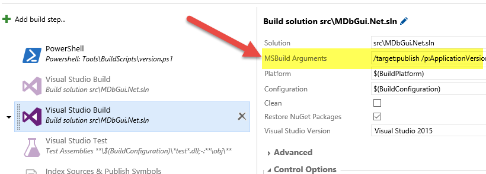
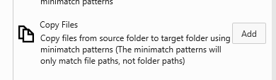

# Rilasciare un package ClickOnce su un Blob di Windows Azure con la build vNext

#### di [Gian Maria Ricci](https://mvp.microsoft.com/it-it/PublicProfile/4025635?fullName=Gian%20Maria%20%20Ricci) - Microsoft MVP

[Blog inglese](http://www.codewrecks.com) / [Blog Italiano ALM](http://www.getlatestversion.it/author/alkampfer/) / [Blog Italiano](http://blogs.ugidotnet.org/rgm)

*Febbraio 2016*

Grazie al nuovo Sistema di build offerto da TFS 2015 / VSTS, rilasciare
una applicazione utilizzando ClickOnce su un blob di Azure è
un’operazione molto semplice.

**Gestire il versioning della propria applicazione**

Il primo prerequisito è una corretta numerazione degli assembly e del
package ClickOnce, in modo da generare un numero di versione in modo
automatico durante la build. Se si utilizza Git e Gitflow esiste la
possibilità di utilizzare il semantic versioning, come descritto in un
precedente articolo \[[Gestire la Semantic Versioning con GitFlow e
GitVersion in una vNext
Build](https://msdn.microsoft.com/it-it/library/mt634392.aspx)\], se
invece si utilizza TFVC si può utilizzare un semplice script PowerShell
che determina la versione in base alla data ed al progressivo della
build. In questo scenario una possibile soluzione è stata descritta nel
mio blog inglese \[Versioning assembly with powershell and build
vNext\]. Nel corso di questo articolo la soluzione mostrata si basa sul
semantic versioning, ma i concetti sono applicabili anche con un
versioning basato su data e numero di build incrementale.

L’aspetto importante su cui porre attenzione è la numerazione, perché
ClickOnce, a differenza di NuGet, non supporta suffissi come -beta o
-unstable per indicare una pre-release. Per avere comunque un numero
univoco partendo dal semantic versioning, si può aggiungere come quarto
numero quello che segue il suffisso. Ad esempio, se il Semantic
Versioning da una versione di 1.3.3-unstable.5, la versione di ClickOnce
sarà la 1.3.3.5.

In questo caso bisogna però ricordare che non esiste con ClickOnce una
maniera veloce e semplice per pubblicare le branch beta (release o
hotfix) parallelamente alla versione stabile e che siano
contemporaneamente installabile su uno stesso sistema. La soluzione
descritta in questo articolo consente di pubblicare parallelamente la
versione stabile e beta, ma l’utente finale deve decidere quale
installare. L’unica maniera per far si che entrambe le versioni siano
installabili è pubblicare due package ClickOnce completamente
differenti.

Tutta l’operazione di calcolo del numero di versione di ClickOnce è
semplicemente gestita nello script PowerShell di versioning.

  ----------------------------------------------------------------------------
      1   $splitted =$preReleaseTag.Split('.')
      2   $preReleaseNum = $splitted[$splitted.Length - 1]
      3   if ([string]::IsNullOrEmpty($preReleaseNum))
      4   {
      5       $preReleaseNum = "0"
      6   }
      7   $clickOnceVersion = $version.MajorMinorPatch + "." + $preReleaseNum
  ----------------------------------------------------------------------------

**Creare il package ClickOnce**

La documentazione ufficiale di MSDN ha una pagina dedicata alla
pubblicazione di package ClickOnce da command line \[[How to publish
ClickOnceapplication from command
line](https://msdn.microsoft.com/en-us/library/ms165431.aspx?f=255&MSPPError=-2147217396)\].
Questo è un ottimo punto di partenza, percé che nella build vNext è
molto semplice specificare i parametri di ingresso di MSBuild. In questo
modo non si ha bisogno di nessuna personalizzazione specifica, ma è
sufficiente modificare la build passando parametri aggiuntivi al task
standard per creare il package.

Come primo passo si dichiarano alcune proprietà nella build in modo da
poter memorizzare semplicemente tutte le variabili necessarie.
Evidenziate in giallo troviamo le tre variabili che sono specifiche
della pubblicazione ClickOnce.

Figura 1: ***Variabili necessarie per poter effettuare una build con
pubblicazione ClickOnce.*

Le variabili necessarie sono le seguenti:

-   **\$(ClickOnceVersion):** Contiene la versione del package generata
    manipolando la versione restituita da GitVersion, come discusso
    in precedenza.
-   **\$(AzureBlobUrl):** è l’indirizzo Url del Blob di Azure dove si
    vuole pubblicare l’applicazione
-   **\$(AzureBlobPrefix):** è un prefisso che verrà usato per
    memorizzare i package all’interno di una sottocartella del
    blob principale.

Nello script PowerShell vengono inoltre effettuate alcune manipolazioni
sul numero di versione restituito da GitVersion per determinare il ruolo
logico della branch che si sta pubblicando. Quello che interessa infatti
non è il reale nome della branch di Git, ma piuttosto il suo ruolo nel
processo di sviluppo (stabile / beta / instabile). Anche questa
operazione può essere fatta semplicemente manipolando il valore di
Semantic Versioning restituito da GitVersion.

Si parte dal numero di versione generato per NuGet, se questo numero non
contiene suffissi siamo nella branch stabile, altrimenti basta estrarre
il suffisso. Ad esempio un possibile numero di versione potrebbe essere
1.3.3.beta.6, da cui si deduce che la branch logica è “beta”.

Questa operazione è necessaria affinché si possa effettuare delle
decisioni sul dove e come e se pubblicare il package. Ad esempio si
potrebbe decidere di pubblicare solamente le branches stabili, oppure
pubblicare le beta su un indirizzo differente.

  ----------------------------------------------------------
      1    $preReleaseString = $splitted[0]
      2    if ([string]::IsNullOrEmpty($preReleaseString))
      3    {
      4        $preReleaseString = "stable"
      5        $ProductName = "MDbGui.Net"
      6    }
      7    else
      8    {
      9        $ProductName = "MDbGui.Net-$preReleaseString"
      10   }
  ----------------------------------------------------------

Un dato interessante nello script precedente è la variabile
\$ProductName che viene specificato usando una costante che rappresenta
il vero nome del prodotto, in questo caso MDbGui.Net, ma nel caso di
branch logica, viene appeso il nome della branch logica. In questo modo
si può generare un nome prodotto che indica chiaramente se sia stato
generato da una branch stabile o meno.

Ora che tutte le variabili sono pronte è sufficiente andare a modificare
gli argomenti passati a MSBuild in modo da richiedere la pubblicazione
del package. Ecco qui di seguito la commandline utilizzata.

  ---------------------------------------------------------
      1   /target:publish
      2   /p:ApplicationVersion=$(ClickOnceVersion)
      3   /p:PublishURL=$(AzureBlobUrl)/$(AzureBlobPrefix)/
      4   /p:UpdateEnabled=true
      5   /p:UpdateMode=Foreground
      6   /p:ProductName=$(ProductName)
  ---------------------------------------------------------

Come si può vedere dalla figura sottostante non è necessario effettuare
nessuna particolare personalizzazione della build, ma è sufficiente
aggiuntere i parametri mostrati sopra nella sezione “MSBuild Arguments”.

**Pubblicare il package**

Lo step precedente produce tutti i file necessari per ClickOnce dentro
una sottocartella chiamata app.publish nella output directory del
progetto. A questo punto per avere una build più pulita è consigliabile
copiare tutti questi file nella staging directory. Una possibile
procedura che utilizza PowerShell è mostrata nel mio blog inglese:
\[*managing artifacts in a vNext Build*\].

Un approccio più semplice può essere quello di utilizzare il task
standard di copia file, ma solitamente l’approccio con PowerShell è più
flessibile, soprattutto perché si può effettuare una manipolazione dei
file prima della pubblicazione

Al termine di questa azione i file saranno copiati nella Staging
Directory e quindi come ultimo passo è necessario spostarli su un blob
di Azure o su qualsiasi altra location pubblicamente accessibile. La
scelta del blob di Azure viene fatta perché il costo dello storage nel
blob è molto basso, non si deve gestire nulla e si ha a disposizione un
task dedicato della build vNext per effettuare l’upload su un Blob di
Azure.

Dati tutti questi vantaggi la scelta primaria come target di
pubblicazione ricade sul blob di Azure.

**Spostare i file su un Azure Blob.**

Nella figura seguente vengono mostrate le proprietà del task “Azure File
Copy”, su cui si deve specificare il nome dello Storage Account, il nome
del container ed il prefisso per il blob. Grazie al semantic versioning
è possibile separare i package prodotti dalla versione beta e stabile su
due sottodirectory separate.

Per connettere un account Azure tramite un Azure Endpoint si consulti il
post \[[*Use the right Azure Service Endpoint in build
vNext*](http://www.codewrecks.com/blog/index.php/2015/12/29/use-the-right-azure-service-endpoint-in-build-vnext/)\]
che spiega come effettuare la configurazione ed utilizzare la tipologia
di sottoscrizione giusta. Tutti i blob di Azure creati con il vecchio
portale sono infatti in modalità classica, e debbono essere acceduti
collegando un Azure Endpoint in modalità MSDN Certificate Based. Per i
blob creati con il nuovo portale è invece necessario utilizzare un
service principal come descritto in questo articolo \[Automating Azure
Resource Group deployment using a Service Principal in Visual Studio
Online: Build/Release Management\].

Al termine della build l’applicazione sarà disponibile ad un indirizzo
simile al seguente.
[*https://portalvhdsdlrhmlyhqzrk1.blob.core.windows.net/mdbgui/unstable/MDbGui.Net.application*](https://portalvhdsdlrhmlyhqzrk1.blob.core.windows.net/mdbgui/unstable/MDbGui.Net.application)

L’aspetto interessante è che grazie al Semantic Versioning è possibile
pubblicare differenti versioni dell’applicazione (beta, stable,
unstable) in differenti percorsi. Si ricordi però che l’identità del
progetto è una sola, per questa ragione è possibile installare in un
sistema solamente una delle versioni, a meno di non effettuare qualche
manipolazione del file MsBuild di progetto per passare il nome del
prodotto dall’esterno.

**Conclusioni**

Gli script utilizzati per questo articolo sono stati provati su un
progetto open source che può essere visualizzato qui:
[*https://github.com/stefanocastriotta/MDbGui.Net/tree/develop/Tools/BuildScripts*](https://github.com/stefanocastriotta/MDbGui.Net/tree/develop/Tools/BuildScripts) 

Nella figura seguente è invece rappresentato l’output di varie build, da
cui si può notare come il nome della build stessa rifletta
immediatamente la versione che è stata realmente pubblicata.

Non dimenticate di marcare tutte le build stabili in modo che non
vengano mai cancellate da TFS / VSTS, in modo da avere sempre
disponibili tutti i dettagli delle build dei package pubblicati.

Gian Maria.
