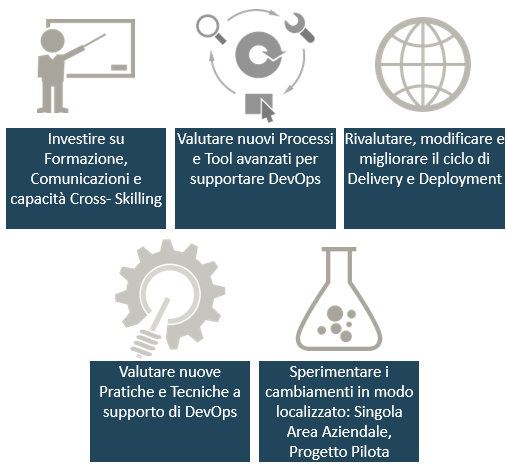
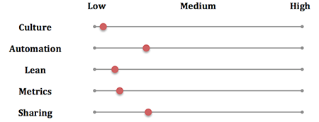

---
title: DevOps Jump Start - Adottare concretamente DevOps
description: DevOps Jump Start - Adottare concretamente DevOps
author: felicepescatore
ms.date: 08/01/2016
ms.topic: how-to-article
ms.service: ALM
ms.custom: CommunityDocs
---

# DevOps Jump Start - Adottare concretamente DevOps

#### di [Felice Pescatore](https://mvp.microsoft.com/it-it/mvp/Felice%20%20Pescatore-5001016) - Microsoft MVP

Blog/Sito Personale: [http://www.felicepescatore.it/](http://www.felicepescatore.it/)

ALM Blog: [http://www.getlatestversion.it](http://www.getlatestversion.it)

*Gennaio 2016* 

Adottare concretamente DevOps
-----------------------------

Nella pratica, quindi, come possiamo approcciare alla trasformazione
DevOps?

Ovviamente non esiste un modo univoco (diffidate sempre da chi vi
propone soluzioni preconfezionate senza conoscere la vostra cultura
aziendale attuale!), ma alcuni suggerimenti possono essere sicuramente
utili per iniziare:
-   *Identificare l’executive sponsor e tutti gli stakeholders interni
    che giornalmente lavorano per promuovere l’adozione dell’approccio
    DevOps;*
-   *Maturare una chiara comprensione di quella che è la catena del
    valore aziendale (Value Chain) e come il Valore viene creato
    attraverso di essa (Value Stream);*
-   *Abbattere i Silos che separano il team di development da quello di
    operation: l’obiettivo è ottenere un unico team integrato;*
-   *Rivedere le azioni incentivanti (es: bonus) che devono tener conto
    del risultato complessivo e non di quello parziale;*
-   *Ricercare processi ripetibili e standardizzabili per tutte le
    attività chiave lungo la catena del valore (pre-requisite to
    mastery);*
-   *Automatizzare quante più attività possibili: continuous
    integration, automated deployments e “infrastructure as code” sono
    un must;*
-   *Adottare degli opportuni sistemi di monitoraggio in grado di
    misurare le metriche fondamentali (key metrics). Nell’ultimo report
    annuale DevOps realizzato da Puppet Labs, emerge che le 4 metriche
    principalmente utilizzate sono: Change Frequency, Change Lead Time,
    Change Failure Rate e MTTR (Mean Time To Restore). A queste è
    sicuramente è utile aggiungere: Availability, Performance e MTBF
    (Mean Time Between Failures);*
-   *Individuare un meccanismo di feedback ben definito al fine di
    operare in chiave di continuous improvement.*

Si tratta quindi di investire su specifici aspetti aziendali, con un
approccio al cambiamento e alla sperimentazione continua, andando ad
operare un’azione di **Insight** senza la quale non è possibile
affacciarsi in modo corretto (forse in alcun modo!) ad una
trasformazione sostenibile del proprio Business.

Figura 13 - Aspetti aziendali di riferimento

È fondamentale comprendere che *Lean/Agile/DevOps* sono cambiamenti
culturali ed operativi orientati al Valore. Non si tratta, quindi, di
scegliere una nuova piattaforma per automatizzare le attività di
sviluppo o di operation, ma di avere una forte comprensione del proprio
modello organizzativo, individuando *i Work Center* e andando ad
estirpare le inefficienze.

Per raggiungere tale obiettivo è necessario contestualizzare DevOps,
avvalendosi di framework operativi come **CALMS**, definito, in
successione e tempi diversi, da *Damon Edwards* e *Jez Humble*:

-   ***Culture** - gestire il cambiamento focalizzandosi sulla
    > collaborazione e la comunicazione*
    -   *Hearts & Minds, Embrace Change;*

-   ***Automation** - rimuovere le azioni manuali lungo la catena del
    > valore*
    -   *Continuous Integration, Continuous Delivery/Deployment,
        Infrastructure-as-a-code;*

-   ***Lean** - utilizzare i principi Lean per velocizzare,
    > standardizzare e rendere efficienti le attività*
    -   *Customer Value focus, Small batch size;*

-   ***Metrics** - misurare qualsiasi cosa, utilizzando i risultati per
    > rifinire costantemente le attività*
    -   *Measure Everything, Show the improvement;*

-   ***Sharing**, condividere le esperienze di successo e di fallimento
    > per una crescita diffusa*
    -   *Open Information Sharing, Collaboration.*

Possiamo pensare a CALMS come ai cinque aspetti strategici per
implementare con successo DevOps all’interno della nostra
organizzazione, tenendo costantemente presente che ignorandone anche uno
soltanto si compromette fortemente l’efficienza complessiva della
trasformazione in atto. CALMS, inoltre, è a sua volta uno strumento
estremamente potente per avere un benchmark sui progressi attualmente
raggiunti e sugli obiettivi che si intendono raggiungere a breve e a
medio termine.

Si ipotizzi, a T0, di avere lo scenario di trasformazione CALMS-related
rappresentato nella figura seguente:

Figura 14 - T0 Scenario

Da esso risulta estremamente evidente che è stata posta una forte enfasi
sugli aspetti tecnologici, adottando strumenti di automazione (si pensi
a Visual Studio Team Services), e sulla condivisione delle informazioni
(ad esempio grazie a Slack).

Quello che si evince, al contempo, è però una bassa attenzione verso la
trasformazione generale della Cultura aziendale, cosa che non spinge al
considerare l’IT parte integrata del Business, generando diversi Silos a
scapito di azioni Value-oriented. Anche l’applicazione di Lean e delle
Metriche lascia decisamente a desidera.

A questo punto, su cosa si può decidere di investire? La risposta come
sempre è “dipende” (), ma in linea generale è fondamentale intervenire
sugli aspetti che hanno il maggior impatto sui propri clienti.

Facciamo un esempio: gli strumenti di automazione scelti hanno risolto
parte dei problemi di Continuous Deployment, ma dal momento in cui si è
pronti per il deploy, passa ancora troppo tempo. In questo scenario,
potremmo avere ad esempio che una delle *Stazioni di Lavoro* (Work
Center) è inefficiente ed intervenire sull’applicazione dei principi
Lean, cosa che sicuramente supporta l’ottimizzazione delle relative
attività in ottica di rendere il tutto maggiormente efficiente.

Detto questo, è possibile settare gli obiettivi, come, per esempio,
riportato nella figura seguente (T1 Scenario):

Figura 15 - T1 Scenario

Come si può notare anche la “Culture” subisce un’evoluzione diretta
(ottimizzare il processo vuol dire sicuramente capirne di più e
condividerne le modifiche tra tutti gli attori coinvolti), evidenziando
come i 5 pilastri siano inscindibilmente legati tra loro.

La definizione del significato di *Low*, *Medium* e *High* è
assolutamente “relativa” e l’obiettivo è quello di spostare sempre più
l’*High* verso l’alto: *High* non deve essere mai considerato il punto
di arrivo, ma solo il prossimo obiettivo da raggiungere! Una volta
raggiunto, l’*High* diventerà il nuovo *Low* e verranno individuati
nuovi e più ambiziosi obiettivi.

Il giusto bilanciamento relativo avviene grazie ad esperimenti continui
finalizzati a migliorare le varie aree chiave della vostra catena del
valore, ricordandosi di:
-   *Parlarsi!*
-   *Misurare;*
-   *Gestire la complessità, ma non abituarsi ad essa;*
-   *Creare micro-processi che accompagnano l’intero ciclo rilascio;*
-   *Iniziare con un processo di rilascio condiviso;*
-   *Automatizzare il processo di rilascio;*
-   *Creare molti punti di feedback;*
-   *Cambiare il sistema di incentivazione in funzione dei risultati
    generali;*
-   *Adattare l’organizzazione.*

E’ lecitio a questo punto chiedersi quanto DevOps sia oggi presente nel
mondo dell’IT.

Ebbene, facendo riferimento ai dversi elementi dell’ADP, la **Continuous
Integration** è ampiamente adotta, essendo relativamente semplice da
implementare. Analogo discorso per la **Continuous Delivery** che è
chiaramente più difficile, ma rappresenta un obiettivo che tutte le
software house, in modo contestualizzato, si stanno ponendo.

Infine resta l’ultimo step, quello del **Continuous Deployment**,
adottato molto raramente soprattutto perché i Clienti non la vogliono,
non sopportando di vedersi cambiare le cose sotto il naso.

Indipendentemente dal grado di automazione che si decide di raggiungere,
l’importante è che non si perda mai di vista l’obiettivo primario,
ovvero quello di **supportare in modo più efficace le moderne esigenze
di business**.
