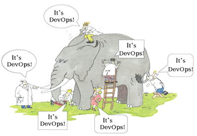
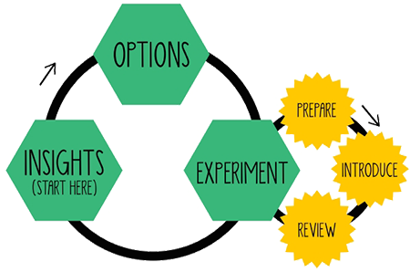
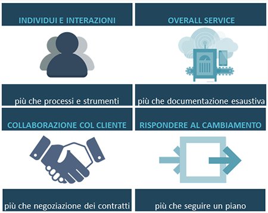
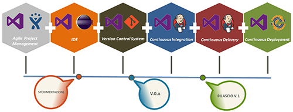
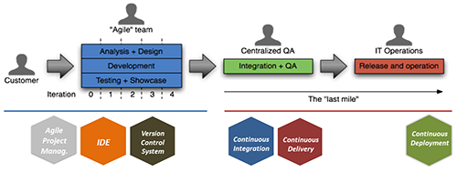
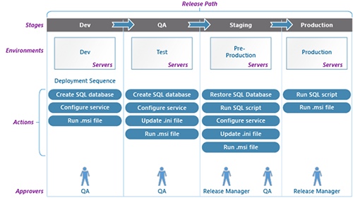
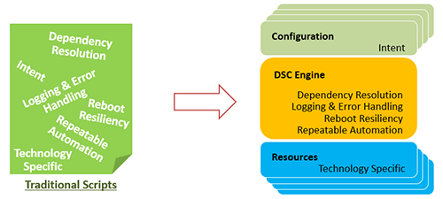

---
title: DevOps Jump Start 
description: DevOps Jump Start
author: felicepescatore
ms.date: 08/01/2016
ms.topic: how-to-article
ms.service: ALM
ms.custom: CommunityDocs
---

# DevOps Jump Start

#### di [Felice Pescatore](https://mvp.microsoft.com/it-it/mvp/Felice%20%20Pescatore-5001016) - Microsoft MVP

Blog/Sito Personale: [http://www.felicepescatore.it/](http://www.felicepescatore.it/)

ALM Blog: [http://www.getlatestversion.it](http://www.getlatestversion.it)

*Gennaio 2016* 

Introduzione
------------

**DevOps** è il nuovo cambiamento *Culturale* che sta invadendo il mondo
dell’IT.

Si tratta dell’abbattimento dei *silos* aziendali, non solo quelli che
tipicamente caratterizzano Developers e Operation ma dell’intera *Line
Of Business* in un’ottica di visione olistica delle attività. Ancora una
volta si rafforza la consapevolezza che nessuna moderna iniziativa di
Business può prescindere dal supporto delle soluzioni IT.

Come ogni trasformazione, DevOps viene spesso utilizzata in modo
generico in differenti contesti, dai blog agli eventi, associandola
spesso, impropriamente, in modo esclusivo alle soluzioni teconcologiche,
senza però coglierne la vera essenza e le reali motivazioni abilitanti.

Partendo proprio da questo aspetto, in questa serie di post andremo a
vedere cos’è realmente DevOps e darmo uno sguardo a come *Microsoft
Release Managment*, insieme ad altre soluzioni spesso provenienti dal
mondo Open Source, consenta di ottimizzare il *Value Stream*.

Cos’è realmente DevOps
----------------------

L’enorme confusione che ruota intorno a *DevOps* suggerisce di iniziare
il viaggio alla sua scoperta con un approccio inverso, andando prima a
chiarire cosa non è DevOps, attraverso l’ottima sintesi fatta da *Gene
Kim*:

1.  **DevOps non sostituisce un approccio Agile**. Quello che cambia è
    l’estensione del concetto di “Done”: quanto realizzato è considerato
    completato solo quando i test di accettazione sono superati e quando
    la soluzione è in erogazione. L’Agile è tipicamente concentrato
    sugli aspetti dello sviluppo e, anche se fortemente consigliato, non
    è una condizione obbligatoria per poter abbracciare DevOps;

2.  **DevOps non rimpiazza la metodologia ITIL**. Nel marasma generale,
    spesso si pensa che l’ampia documentazione e i diversi livelli di
    certificazione ITIL, non possano andare d’accordo con metodologie
    meno “burocratizzate”. In realtà ITIL nasce dai risultati sul campo
    ed è pienamente in sintonia con DevOps, spingendo ad automatizzare
    quanto più possibile *processi*, *configurazioni*, *deployment*,
    oltre ad una opportuna governance di *Change Management*;

3.  **DevOps non significa NoOps**. Esattamente come accaduto per il
    Cloud, i sistemisti non diventano “inutili” ma innalzano l’asticella
    delle proprie competenze e delle proprie attività. L’obiettivo è
    infatti quello di abbattere il *Lead Time (o Time-to-Market)* e
    migliorare la produttività degli sviluppatori in relazioni al
    deploy: invece di aprire un ticket ed attendere che Ops si preoccupi
    del deploy, andando ad interpretare decine di pagine di
    documentazione, tali attività diventa un *servizio di commodity*;

4.  **DevOps non è applicabile solo al mondo dell’Open Source**. Anche
    se il movimento DevOps trova molti casi di successo nel mondo Open
    Source, con i relativi strumenti a disposizione, tutto il mondo
    dello sviluppo software oggi offre soluzioni per abbracciare questo
    paradigma e i relativi pattern applicativi: *Test Automatizzati*,
    *Continuous Integration*, *Versioning delle Configurazioni degli
    ambienti*, ecc. In questo ambito Microsoft con *VSTS/TFS* e *Release
    Management* sta realizzando una delle soluzioni più robuste ed
    integrate che si possano trovare sul mercato;

5.  **DevOps non significa solo “infrastructure as a code” o
    automatizzazione**. Benché l’automatizzazione sia alla base di molti
    pattern applicativi DevOps, il cuore di questo approccio è la
    condivisione degli obiettivi lungo l’intero *Stream di Valore* che
    sottende la realizzazione delle soluzioni IT;

6.  **DevOps non è solo per le Startup e le Unicorn.** DevOps è un
    approccio applicabile a qualsiasi realtà aziendale, soprattutto
    quelle che riconoscono nell’IT la propria dorsale di supporto (note
    anche come *Horse*), al fine di garantire qualità, affidabilità
    e sicurezza. Chiaramente, in un’azienda strutturata si tratta di un
    cambiamento radicale che riavvicina la mentalità della divisione IT
    a quella di una Unicorn al fine di garantire una maggiore efficienza
    di quanto realizzato in ottica del Valore per il cliente, interno o
    esterno che sia

Ma allora cos’è relamente DevOps? Spulciando tra le risposte che spesso
vengono date in merito nei vari eventi e nei vari blog/forum, si
evidenziano molti elementi:
-   *DevOps … is a movement, a philosophy, a way of thinking;*
-   *DevOps … is a person who can perform both Dev and Ops roles;*
-   *DevOps … means cross skilling people;*
-   *DevOps … is continuous delivery;*
-   *DevOps … is a team of developers and operation staff;*
-   *DevOps …is a culture movement;*
-   *DevOps … is monitoring.*

Figura 1 - It's DevOps!

che trovano tutti un loro spazio nella seguente definizione, a cui
faremo riferimento anche nel seguito:

> **DevOps*** *è un* **approccio Culturale** *in cui l’intera Line of
> Business si assume la responsabilità della creazione di **Valore** per
> il cliente.
>
> In tale scenario, Developers e Operations sperimentano continuamente
> nuovi modi di lavorare insieme, andando a standardizzare e
> padroneggiare i processi attraverso la* **ripetitività** *e
> la* **pratica***.

Questa definizione sposa anche i due punti focali di DevOps evidenziati
sempre da *Gene Kim*:

1.  *enfatizzare le performance dell’intero sistema*, ovvero avere una
    visione olistica di quanto si sta realizzando;
2.  *creare più percorsi di feedback*, per assicurarsi di essere sempre
    allineati rispetto agli obiettivi di qualità e di valore.
arrivando a trasformare il termine DevOps in un vero e proprio acronimo:

> ***DevOps**: **D**elivery **E**nhanced **V**alues **O**ver **P**rocesses **S**mells
> \[F.P.\]*

Come ogni trasformazione Lean che si rispetti, il Team che realizza la
soluzione è il primo destinatario della trasformazione, aspetto che
viene colto egregiamente da *Jim Stoneham* di *Opsmatic*: **We
transformed from a team of employees to a team of owners**.

Proprio questo è il punto: non si tratta di ragionare in termini di
sviluppo o di operation, ma in termini di *Valore* prodotto per il
cliente, andando a ridurre il Lead-Time, e creando un circolo virtuoso
in cui il cliente si fida ed è soddosfatto della capacità dell’azienda
di rispondere alle proprie esigenze. In tale ottica, tutti diventano
responsabili in prima persona del successo dell’intero *Value Stream*.

Ma perché è così importante, anzi fondamentale, arrivare ad
un’integrazione automatizzata delle attività di sviluppo e di quelle
sistemistiche a supporto del prodotto? Ebbene, facciamo un esempio tipo
che ricalca un comune modello organizzativo di un’azienda IT, o una
divisione IT:

> *Il Team di Sviluppo realizza la nuova soluzione o una nuova feature,
> casomai lo fa con un approccio Agile/Lean volto alla qualità e
> all’ottenimento di un prodotto che rispecchia quanto desiderato dal
> cliente. Quando il Product Owner decide che è arrivato il momento di
> consegnare la soluzione nelle mani del cliente, è necessario
> pianificare la messa in esercizio con il Team di Operations che deve
> configurare i vari ambienti necessari, se non lo ha già fatto in
> precedenza. Pronti gli ambienti, il Team di Operations schedula il
> rilascio in produzione, effettua il deploy…. ma qualcosa non funziona
> cosa dovrebbe! *
>
> *Cos’è accaduto? Gli ambienti di sviluppo e produzione non sono
> allineati tra loro? La soluzione presenta qualche bug? Chi deve
> intervenire? Chi coordinata queste attività di verifica risoluzione
> incrociata?*

Ecco, qui troviamo il nocciolo della questione: i due team asseriscono,
separatamente, di aver completato correttamente quanto dovevano e non si
capisce chi deve fare cosa. Intanto il Time-to-Market si allunga, si
crea caos e il cliente vede ritardarsi la disponibilità della nuova
soluzione, cominciando ad innervosirsi non poco.

Attenzione: per il cliente è indifferente che il problema sia nel codice
o negli ambienti di esercizio perché lui non riesce ad utilizzare il
prodotto, per cui **il Valore di quello che faticosamente è stato
realizzato è pari zero**!

Risulta quindi evidente come la responsabilità del **deployment**,
inteso come momento di reale completamento della realizzazione di una
nuova soluzione, è una responsabilità condivisa, finanche al
middle-management che rappresenta la frontiera di dialogo e
comunicazione con il cliente, interno o esterno che sia.

Va da sé che il modo migliore per ragionare in chiave *Customer Value* è
quello di estendere all’intera catena IT un approccio Lean based,
ripensando all’idea del **deploy Big-Bang**, ovvero “effettuo il deploy
solo quando ho tutto pronto e funzionante sugli ambienti di QA”, in
favore di un approccio di **Continuous Deployment**, in cui i deploy
avvengono frequentemente (anche più volte al giorno) al fine di
rilasciare soluzioni incrementali in produzione.

Figura 2 - Continuous Deployment

In tal modo l’utente finale può realmente trarre benefico immediato
dalle nuove funzionalità introdotte e fornire feedback significativi per
focalizzare i nuovi obiettivi o rivedere parti di quanto realizzato.

I quattro Pilastri di DevOps
----------------------------

Cominciamo a concretizzare il nostro viaggio nel mondo DevOps,
descrivendo quelli che sono i 4 pilastri portanti: ***Comunicazione***,
***Integrazione***, ***Collaborazione*** e ***Automazione***.

Ognuno di questi elementi condensa dei fattori che vanno analizzati e
contestualizzati per ottenere il giusto bilanciamento degli interventi
da effettuare e tracciare il percorso da intraprendere per il
cambiamento. In chiave *Lean Change Management*, è possibile operare
secondo il ciclo **Insights-Options-Experiment** che permette di
ponderare i vantaggi rispetto ai rischi ed i costi del cambiamento
proposto.

Figura 3 - Insights-Options-Experiment \[rif. Lean Change Management\]

Così, tra i fattori su cui intervenire nella ***Comunicazione***
troviamo:
-   *Abbattere le barriere tra le aree funzionali aziendali;*
-   *Condividere le responsabilità individuando nuovi ruoli;*
-   *Distillare la conoscenza aziendale;*
-   *Focalizzarsi sui servizi a supporto del business, non sulla tecnologia;*
-   *Creare un senso di fiducia reciproco.*

per l’***Integrazione***:
-   *Abbattimento delle barriere tra Sviluppo e Operation;*
-   *Migliorare e automatizzare la collaborazione tra le varie Aree funzionali;*
-   *Rimuovere gli Ostacoli e i Colli di Bottiglia;*
-   *Favorire il flusso informativo dall’Idea alla Consegna al Cliente;*
-   *Creare Loop di Feedback ad ogni fase.*

per la ***Collaborazione***:
-   *Relazioni Face-to-face, real time;*
-   *Ridurre al minimo, idealmente abolire, le comunicazioni formali;*
-   *Team di piccole dimensioni focalizzati sul Business;*
-   *Condividere i problemi con i pari e gli altri colleghi;*
-   *Utilizzare strumenti di Visual Management / Information Radiator.*

per l’***Automazione***:
-   *Automatizzare l’Esecuzione dei Task, soprattutto quelli ripetitivi;*
-   *Automatizzare i Processi, connettendo task e decisioni;*
-   *Automatizzare Delivery e Deployment, in funzione del Business;*
-   *Trigger Decisionali, sfruttando Analytics e Monitoraggio delle Applicazioni.*

Ogni contesto applicativo è chiaramente diverso, per cui è necessario
lavorare con estrema attenzione e dedizione all’interno della propria
organizzazione per sviluppare il proprio modello operativo:

> *“DevOps isn’t something you can buy -- it’s something you have to do,
> and you have to do it yourself.” \[John Michelsen, CTO, CA
> Technologies\]*

Figura 4 – DevOps… It’s something you have to do!

Ognuno dei quattro pilastri va valutato in funzione del bilanciamento
*costi-benefici-rischi* che si vuole ottenere, ma anche rispetto
all’impatto che ha su tutti coloro coinvolti nella filiera di business.
Tale bilanciamento è supportato da un set di *Valori*, *Principi* e
*Pratiche* che fanno da cappello a tre aspetti primari:
-   *enfatizzare le performance dell’intero sistema, ovvero avere una visione olistica di quanto si sta realizzando;*
-   *consentire una rapida disponibilità delle nuove soluzioni a servizio del business;*
-   *ridurre i rischi ed i costi andando ad aumentare la qualità.*

I **Valori** sono praticamente gli stessi del *Manifesto Agile*, anche
se con una estensione nel caso del secondo (“Software funzionate più che
documentazione esaustiva”) che si trasforma in ***Overall Service più
che documentazione esaustiva***, ponendo l’accento sulla necessità di
creare un servizio complessivo al cliente e non limitarsi a creare
software che funziona.

Figura 5 - DevOps Values

I **Principi** ci avvicinano alle pratiche, concentrandosi su aspetti
che pervadono l’intero assett aziendale: *Focus Aziendale, Lean,
Integrazione, Condivisione, Monitoraggio, Miglioramento continuo*.

Proprio come un ponte collega due diverse sponde di un fiume, i principi
consentono di “trasferire” i Valori in **Pratiche** quotidiane:
-   *Partecipazione attiva degli Stakeholder;*
-   *Testing automatizzato;*
-   *Gestione della Configurazione Integrata;*
-   *Change Management;*
-   *Continuous Integration; *
-   *Continuous Delivery;*
-   *Planning del Deployment Integrato;*
-   *Continuous Deployment;*
-   *Supporto alla Produzione;*
-   *Monitoraggio delle Applicazioni;*
-   *Dashboard automatizzate.*

Figura 6 - Value-Principles-Practice bridge

È evidente come l’obiettivo sia quello di ottenere una forte
integrazione (idealmente completa) di tutti gli aspetti relativi allo
sviluppo di una soluzione IT, responsabilizzato l’intero Team dedicato e
non soltanto la parte dedicata allo sviluppo o al delivery.

Agile Deployment Pipeline
-------------------------

Per collocare correttamente DevOps all’intero dell’intero del ciclo di
*Application Lifecycle Management*, è utile sfruttare la seguente
schematizzazione che sintetizza un tipico flusso operativo di *product
delivery*:

Figura 7 – Product Delivery

In questa *Value Chain* possiamo identificare l’**Agile Deployment
Pipeline (ADP)** che descrive gli step che portano il software dal
Version Control System nelle «mani» dell’utente finale, andando a
formare l’*ultimo miglio* della nostra attività di creazione del Valore:

ADP si ispira al “Value Stream Maps” di Lean Software Development: *ogni
step produce un output che è prelevato (pull) dallo step successivo solo
quando quest’ultimo è pronto ad elaborarlo.*

Nello specifico, abbiamo 6 *Work Center* associati ad altrettanti fasi
specifiche dello sviluppo della soluzione e a una serie di tool di
supporto specificamente ideati:

-   **Agile Project Management**, accompagna la fase di governance del
    progetto (o dei progetti) sfruttando metodologie e tool che consento
    di legare direttamente i vari *artefatti* alle attività annesse al
    *processo*;
-   **Integrated Development Environment** **(IDE)**, è un ambiente
    omnicomprensivo che permette di sviluppare nel linguaggio di
    riferimento, sfruttando le funzionalità dei framework
    interconnettendosi con i vari sistemi a supporto;
-   **Version Control System (VCS)**, consente una gestione efficace
    della propria code-base, persistendo i file, tracciando le modifiche
    e gestendo l’history di sviluppo. Tutte le build devono avvenire
    prelevando gli artefatti esclusivamente dal VCS;
-   **Continuous Integration** si tratta una pratica di sviluppo
     software dove i membri di un team integrano il lavoro
     frequentemente, almeno una volta al giorno, supportato da appositi
     tool di automazione.;
-   **Continuous Delivery**, è un set di principi e di pratiche volte a
     rilasciare il software in ambiente di pre-produzione, velocemente
     e frequentamene. Il tutto avviene sfruttando strumenti
     automatizzati di building e testing;
-   **Continuous Deployment**, è la fase successiva alla Continuous
     Delivery, incentrata sul rilascio automatizzato in ambiente di
     produzione della soluzione precedentemente convalidata
     in pre-prod. Solo le build che superano gli UAT (User
     Acceptance Test) e i QA Test (Quality Assurance Test) vengono
     messe in erogazione automaticamente.

La **Continuous Deployment** dovrebbe essere l’obiettivo per la
maggioranza delle aziende, se non vincolate da obblighi normativi,
contrattuali o altre limitazioni. È evidente, quindi, come Il deploy
manuale del software è assimilabile ad un *anti-pattern*, soffrendo di
una serie rilevante di problemi:
-   *richiede molta documentazione che dettaglia ogni singola attività
    da eseguire;*
-   *non viene tipicamente avvallato da test in un ambiente di
    pre-produzione simili a quelli di produzione;*
-   *vengono effettuate correzioni ai package durante il deploy;*
-   *il deploy non è confermato da test automatizzati;*
-   *l’attività di rilascio di una nuova versione richiede diverse ore;*
-   *frequenti rollback per malfunzionamento: sulla mia macchina
     funzionava!*
-   *tipicamente fatti di notte.*

Attenzione a non confondere la Continuous Deployment con la pessima
abitudine di modificare direttamente il codice sorgente in produzione e
con l’obbligatorietà che ogni singola modifica deve essere resa
disponibile immediatamente su tale ambiente.

Anche se non esiste una definizione del tutto univoca di Continuous
Deployment, quello che ne contraddistingue il processo, e gli ambienti
afferenti, è tipicamente una maggiore **stabilità generale**.

Release Management
------------------

I software a supporto dell’adozione di DevOps sono numerosi e continuano
ad occupare spazi che prima erano lasciati ad attività manuali o a
soluzioni proprietarie.

Spesso, però, è complicato capirne i confini e l’utilità che, è bene
sottolinearlo, diventa realmente tangibile solo se contestualizzata alla
trasformazione *Culturale* ed *Operativa* fin qui evidenziata. Vale la
pena ribadire che proprio questa è la vera sfida e il vero obiettivo di
DevOps.

La soluzione Microsoft in chiave DevOps è **Release Management** (RM),
disponibile sia on-premises che in cloud, andando a completare tutto
l’ecosistema di strumenti legati al mondo *Visual Studio* con cui è
fortemente integrato al fine di offrire una omogeneità di impostazione e
utilizzo. RM è affiancato da *PowerShell DSC*, un linguaggio
dichiarativo per gestire la configurazione degli host fisici e delle
macchine virtuali.

Alla base del funzionamento logico di Release Management troviamo il
concetto di *Release Path* che descrive le azioni da eseguire
(verticale) e la successione di delivery sui vari ambienti di
riferimento (orizzontale).

Figura 8 - Release Path

Nella Release Path si possono individuare gli elementi logici portanti:
-   *Stages: la definizione della fase di Delivery;*
-   *Enviroments: gli ambienti di Delivery;*
-   *Actions: le azioni che accompagnano il Delivery;*
-   *Approvers: i responsabili della verifica del corretto completamento
    delle azioni previste.*

Detto questo, possiamo ora dare uno sguardo a quelle che sono le feature
che caratterizzano Release Management

>  ***Release Planning***, *definire come,
> cosa, quando e dove effettuare il rilascio;*
>
>  ***Release Definition**, definire la
> release pipeline e il workflow di approvazione;*
>
>  ***Environment management**,
> provisioning, configurazione e teardown di ambienti;*
>
>  ***Deployment Automation**,
> automatizzare l’effettiva messa in erogazione della Soluzione;*
>
>  ***Track Status and Progress**,
> monitorare lo stato e garantire strumenti di alert e rollback.*

Chi decide di utilizzare Release Management può contare su un ambiente
estremamente flessibile attraverso il quale configurare il proprio
**Workflow di Release** che consta di 5 step fondamentali:
-   ***Definizione della Release***
    -   Una Release specifica: (a) gli artefatti da deployare e (b) come
         effettuare il deploy attraverso una serie di task
         automatizzati da eseguire sui vari ambienti.
-   ***Aggiunta degli Ambienti***
    -   Sistemi target dei delivery. Ad esempio: ambiente di test, di
         QA, di Pre-Prod, ecc…
    -   Per ogni ambiente è possibile definire gli eventuali criteri di
         approvazione per il deploy e il relativo owner.
-   ***Aggiunta dei Task***
    -   Per ogni ambiente è possibile definire una serie di task che
         descrivono il deployment e il processo di test.
    -   Esiste un’ampia serie di task pre-definiti ed è possibile
         connettersi a servizi esterni.
-   ***Creare la Release ***
    -   La creazione della Release può essere avviata manualmente o
         automaticamente in seguito, ad esempio, al completamento di
         una build.
-   ***Tracciare i Deploy ***
    -   È possibile tracciare il progresso dei singoli deploy sui
         singoli ambienti grazie agli stati di approvazione e alla
         visualizzazione dei log durante la specifica azione
         di pubblicazione.

Come dicevamo, Release Management è disponibile sia on-premise, quindi
da installare sui propri ambienti di supporto allo sviluppo in
congiunzione a Team Foundation Services, sia in cloud, integrato in
*Visual Studio Team Services* (RM VSTS). Quest’ultima edizione è stata
rilasciata da poco e si appresta a diventare la soluzione ideale per chi
predilige l’uso dell’offerta ALM cloud di Microsoft.

Per quanto riguarda Release Management on-premise, tutte le operazioni
descritte dal workflow avvengono tramite una completa applicazione
desktop da cui è possibile gestire ogni aspetto.

Figura 9 - Release Management

Nel caso di RM VSTS, le attività di gestione avvengono direttamente
dalla web application di VSTS, con un’interfaccia coerente con il resto
dell’ambiente e con la possibilità di integrazione esterne, in
particolare con gli strumenti di Continuos Integration da cui attingere
le build per il deploy. Va da sé che la generazione delle Build
direttamente con VSTS è l’approccio suggerito, rappresentando anche il
possibile trigger da cui scatenare le azioni di delivery stesse.

Figura 10 - Release Management VSTS

È utile evidenziare come Release Management, in entrambe le edizioni,
pone particolare enfasi sull’automazione e sulla possibilità di seguire
ogni singolo passo delle azioni di delivery, disponendo di log
estremamente approfonditi che consentono di abbracciare uno dei dettami
DevOps: rivedere immediatamente il processo laddove si dovesse
verificare un problema.

Figura 11 - Release Management Log

Come accennato, a Release Management si affianca **PowerShell DSC**
(PowerShell Desired State Configuration) che, abbracciando il paradigma
*Infrastructure-as-a-Code, consente di:*
-   *Semplifica la configurazione degli host fisici e delle VM;*
-   *Impedisce che le configurazioni diventino incomprensibili e
    ingestibili;*
-   *Abilita alla Continuous Deployment.*

Figura 12 - PowerShell DSC

Per tutte le informazioni di dettaglio riguardanti le soluzioni
Microsoft, è possibile consultare le relative sezioni MSDN:
[*https://msdn.microsoft.com/en-us/Library/vs/alm/Release/overview-rmpreview*](https://msdn.microsoft.com/en-us/Library/vs/alm/Release/overview-rmpreview),
[*https://msdn.microsoft.com/en-us/Library/vs/alm/Release/overview-rm2015*](https://msdn.microsoft.com/en-us/Library/vs/alm/Release/overview-rm2015)
e
[*https://msdn.microsoft.com/en-us/powershell/dsc/overview*](https://msdn.microsoft.com/en-us/powershell/dsc/overview)

Adottare concretamente DevOps
-----------------------------

Nella pratica, quindi, come possiamo approcciare alla trasformazione
DevOps?

Ovviamente non esiste un modo univoco (diffidate sempre da chi vi
propone soluzioni preconfezionate senza conoscere la vostra cultura
aziendale attuale!), ma alcuni suggerimenti possono essere sicuramente
utili per iniziare:
-   *Identificare l’executive sponsor e tutti gli stakeholders interni
    che giornalmente lavorano per promuovere l’adozione dell’approccio
    DevOps;*
-   *Maturare una chiara comprensione di quella che è la catena del
    valore aziendale (Value Chain) e come il Valore viene creato
    attraverso di essa (Value Stream);*
-   *Abbattere i Silos che separano il team di development da quello di
    operation: l’obiettivo è ottenere un unico team integrato;*
-   *Rivedere le azioni incentivanti (es: bonus) che devono tener conto
    del risultato complessivo e non di quello parziale;*
-   *Ricercare processi ripetibili e standardizzabili per tutte le
    attività chiave lungo la catena del valore (pre-requisite to
    mastery);*
-   *Automatizzare quante più attività possibili: continuous
    integration, automated deployments e “infrastructure as code” sono
    un must;*
-   *Adottare degli opportuni sistemi di monitoraggio in grado di
    misurare le metriche fondamentali (key metrics). Nell’ultimo report
    annuale DevOps realizzato da Puppet Labs, emerge che le 4 metriche
    principalmente utilizzate sono: Change Frequency, Change Lead Time,
    Change Failure Rate e MTTR (Mean Time To Restore). A queste è
    sicuramente è utile aggiungere: Availability, Performance e MTBF
    (Mean Time Between Failures);*
-   *Individuare un meccanismo di feedback ben definito al fine di
    operare in chiave di continuous improvement.*

Si tratta quindi di investire su specifici aspetti aziendali, con un
approccio al cambiamento e alla sperimentazione continua, andando ad
operare un’azione di **Insight** senza la quale non è possibile
affacciarsi in modo corretto (forse in alcun modo!) ad una
trasformazione sostenibile del proprio Business.

Figura 13 - Aspetti aziendali di riferimento

È fondamentale comprendere che *Lean/Agile/DevOps* sono cambiamenti
culturali ed operativi orientati al Valore. Non si tratta, quindi, di
scegliere una nuova piattaforma per automatizzare le attività di
sviluppo o di operation, ma di avere una forte comprensione del proprio
modello organizzativo, individuando *i Work Center* e andando ad
estirpare le inefficienze.

Per raggiungere tale obiettivo è necessario contestualizzare DevOps,
avvalendosi di framework operativi come **CALMS**, definito, in
successione e tempi diversi, da *Damon Edwards* e *Jez Humble*:

-   ***Culture** - gestire il cambiamento focalizzandosi sulla
    > collaborazione e la comunicazione*
    -   *Hearts & Minds, Embrace Change;*

-   ***Automation** - rimuovere le azioni manuali lungo la catena del
    > valore*
    -   *Continuous Integration, Continuous Delivery/Deployment,
        Infrastructure-as-a-code;*

-   ***Lean** - utilizzare i principi Lean per velocizzare,
    > standardizzare e rendere efficienti le attività*
    -   *Customer Value focus, Small batch size;*

-   ***Metrics** - misurare qualsiasi cosa, utilizzando i risultati per
    > rifinire costantemente le attività*
    -   *Measure Everything, Show the improvement;*

-   ***Sharing**, condividere le esperienze di successo e di fallimento
    > per una crescita diffusa*
    -   *Open Information Sharing, Collaboration.*

Possiamo pensare a CALMS come ai cinque aspetti strategici per
implementare con successo DevOps all’interno della nostra
organizzazione, tenendo costantemente presente che ignorandone anche uno
soltanto si compromette fortemente l’efficienza complessiva della
trasformazione in atto. CALMS, inoltre, è a sua volta uno strumento
estremamente potente per avere un benchmark sui progressi attualmente
raggiunti e sugli obiettivi che si intendono raggiungere a breve e a
medio termine.

Si ipotizzi, a T0, di avere lo scenario di trasformazione CALMS-related
rappresentato nella figura seguente:

Figura 14 - T0 Scenario

Da esso risulta estremamente evidente che è stata posta una forte enfasi
sugli aspetti tecnologici, adottando strumenti di automazione (si pensi
a Visual Studio Team Services), e sulla condivisione delle informazioni
(ad esempio grazie a Slack).

Quello che si evince, al contempo, è però una bassa attenzione verso la
trasformazione generale della Cultura aziendale, cosa che non spinge al
considerare l’IT parte integrata del Business, generando diversi Silos a
scapito di azioni Value-oriented. Anche l’applicazione di Lean e delle
Metriche lascia decisamente a desidera.

A questo punto, su cosa si può decidere di investire? La risposta come
sempre è “dipende” (), ma in linea generale è fondamentale intervenire
sugli aspetti che hanno il maggior impatto sui propri clienti.

Facciamo un esempio: gli strumenti di automazione scelti hanno risolto
parte dei problemi di Continuous Deployment, ma dal momento in cui si è
pronti per il deploy, passa ancora troppo tempo. In questo scenario,
potremmo avere ad esempio che una delle *Stazioni di Lavoro* (Work
Center) è inefficiente ed intervenire sull’applicazione dei principi
Lean, cosa che sicuramente supporta l’ottimizzazione delle relative
attività in ottica di rendere il tutto maggiormente efficiente.

Detto questo, è possibile settare gli obiettivi, come, per esempio,
riportato nella figura seguente (T1 Scenario):

Figura 15 - T1 Scenario

Come si può notare anche la “Culture” subisce un’evoluzione diretta
(ottimizzare il processo vuol dire sicuramente capirne di più e
condividerne le modifiche tra tutti gli attori coinvolti), evidenziando
come i 5 pilastri siano inscindibilmente legati tra loro.

La definizione del significato di *Low*, *Medium* e *High* è
assolutamente “relativa” e l’obiettivo è quello di spostare sempre più
l’*High* verso l’alto: *High* non deve essere mai considerato il punto
di arrivo, ma solo il prossimo obiettivo da raggiungere! Una volta
raggiunto, l’*High* diventerà il nuovo *Low* e verranno individuati
nuovi e più ambiziosi obiettivi.

Il giusto bilanciamento relativo avviene grazie ad esperimenti continui
finalizzati a migliorare le varie aree chiave della vostra catena del
valore, ricordandosi di:
-   *Parlarsi!*
-   *Misurare;*
-   *Gestire la complessità, ma non abituarsi ad essa;*
-   *Creare micro-processi che accompagnano l’intero ciclo rilascio;*
-   *Iniziare con un processo di rilascio condiviso;*
-   *Automatizzare il processo di rilascio;*
-   *Creare molti punti di feedback;*
-   *Cambiare il sistema di incentivazione in funzione dei risultati
    generali;*
-   *Adattare l’organizzazione.*

E’ lecitio a questo punto chiedersi quanto DevOps sia oggi presente nel
mondo dell’IT.

Ebbene, facendo riferimento ai dversi elementi dell’ADP, la **Continuous
Integration** è ampiamente adotta, essendo relativamente semplice da
implementare. Analogo discorso per la **Continuous Delivery** che è
chiaramente più difficile, ma rappresenta un obiettivo che tutte le
software house, in modo contestualizzato, si stanno ponendo.

Infine resta l’ultimo step, quello del **Continuous Deployment**,
adottato molto raramente soprattutto perché i Clienti non la vogliono,
non sopportando di vedersi cambiare le cose sotto il naso.

Indipendentemente dal grado di automazione che si decide di raggiungere,
l’importante è che non si perda mai di vista l’obiettivo primario,
ovvero quello di **supportare in modo più efficace le moderne esigenze
di business**.
