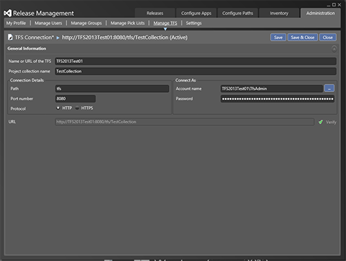
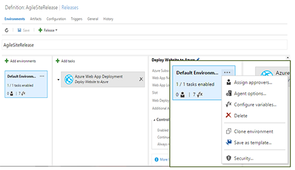
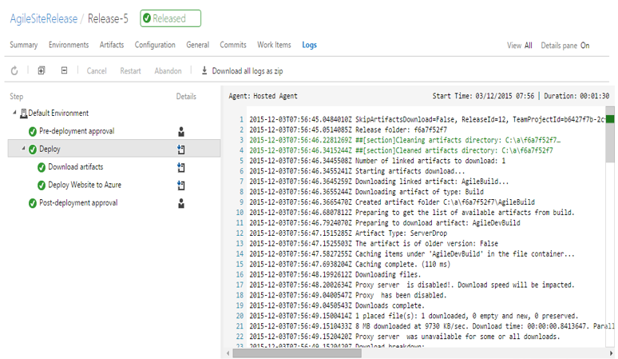

# DevOps Jump Start - Release Management

#### di [Felice Pescatore](https://mvp.microsoft.com/it-it/mvp/Felice%20%20Pescatore-5001016) - Microsoft MVP

Blog/Sito Personale: [http://www.felicepescatore.it/](http://www.felicepescatore.it/)

ALM Blog: [http://www.getlatestversion.it](http://www.getlatestversion.it)

*Gennaio 2016* 

Release Management
------------------

I software a supporto dell’adozione di DevOps sono numerosi e continuano
ad occupare spazi che prima erano lasciati ad attività manuali o a
soluzioni proprietarie.

Spesso, però, è complicato capirne i confini e l’utilità che, è bene
sottolinearlo, diventa realmente tangibile solo se contestualizzata alla
trasformazione *Culturale* ed *Operativa* fin qui evidenziata. Vale la
pena ribadire che proprio questa è la vera sfida e il vero obiettivo di
DevOps.

La soluzione Microsoft in chiave DevOps è **Release Management** (RM),
disponibile sia on-premises che in cloud, andando a completare tutto
l’ecosistema di strumenti legati al mondo *Visual Studio* con cui è
fortemente integrato al fine di offrire una omogeneità di impostazione e
utilizzo. RM è affiancato da *PowerShell DSC*, un linguaggio
dichiarativo per gestire la configurazione degli host fisici e delle
macchine virtuali.

Alla base del funzionamento logico di Release Management troviamo il
concetto di *Release Path* che descrive le azioni da eseguire
(verticale) e la successione di delivery sui vari ambienti di
riferimento (orizzontale).

Figura 8 - Release Path

Nella Release Path si possono individuare gli elementi logici portanti:
-   *Stages: la definizione della fase di Delivery;*
-   *Enviroments: gli ambienti di Delivery;*
-   *Actions: le azioni che accompagnano il Delivery;*
-   *Approvers: i responsabili della verifica del corretto completamento
    delle azioni previste.*

Detto questo, possiamo ora dare uno sguardo a quelle che sono le feature
che caratterizzano Release Management

>  ***Release Planning***, *definire come,
> cosa, quando e dove effettuare il rilascio;*
>
>  ***Release Definition**, definire la
> release pipeline e il workflow di approvazione;*
>
>  ***Environment management**,
> provisioning, configurazione e teardown di ambienti;*
>
>  ***Deployment Automation**,
> automatizzare l’effettiva messa in erogazione della Soluzione;*
>
>  ***Track Status and Progress**,
> monitorare lo stato e garantire strumenti di alert e rollback.*

Chi decide di utilizzare Release Management può contare su un ambiente
estremamente flessibile attraverso il quale configurare il proprio
**Workflow di Release** che consta di 5 step fondamentali:
-   ***Definizione della Release***
    -   Una Release specifica: (a) gli artefatti da deployare e (b) come
         effettuare il deploy attraverso una serie di task
         automatizzati da eseguire sui vari ambienti.
-   ***Aggiunta degli Ambienti***
    -   Sistemi target dei delivery. Ad esempio: ambiente di test, di
         QA, di Pre-Prod, ecc…
    -   Per ogni ambiente è possibile definire gli eventuali criteri di
         approvazione per il deploy e il relativo owner.
-   ***Aggiunta dei Task***
    -   Per ogni ambiente è possibile definire una serie di task che
         descrivono il deployment e il processo di test.
    -   Esiste un’ampia serie di task pre-definiti ed è possibile
         connettersi a servizi esterni.
-   ***Creare la Release ***
    -   La creazione della Release può essere avviata manualmente o
         automaticamente in seguito, ad esempio, al completamento di
         una build.
-   ***Tracciare i Deploy ***
    -   È possibile tracciare il progresso dei singoli deploy sui
         singoli ambienti grazie agli stati di approvazione e alla
         visualizzazione dei log durante la specifica azione
         di pubblicazione.

Come dicevamo, Release Management è disponibile sia on-premise, quindi
da installare sui propri ambienti di supporto allo sviluppo in
congiunzione a Team Foundation Services, sia in cloud, integrato in
*Visual Studio Team Services* (RM VSTS). Quest’ultima edizione è stata
rilasciata da poco e si appresta a diventare la soluzione ideale per chi
predilige l’uso dell’offerta ALM cloud di Microsoft.

Per quanto riguarda Release Management on-premise, tutte le operazioni
descritte dal workflow avvengono tramite una completa applicazione
desktop da cui è possibile gestire ogni aspetto.

Figura 9 - Release Management

Nel caso di RM VSTS, le attività di gestione avvengono direttamente
dalla web application di VSTS, con un’interfaccia coerente con il resto
dell’ambiente e con la possibilità di integrazione esterne, in
particolare con gli strumenti di Continuos Integration da cui attingere
le build per il deploy. Va da sé che la generazione delle Build
direttamente con VSTS è l’approccio suggerito, rappresentando anche il
possibile trigger da cui scatenare le azioni di delivery stesse.

Figura 10 - Release Management VSTS

È utile evidenziare come Release Management, in entrambe le edizioni,
pone particolare enfasi sull’automazione e sulla possibilità di seguire
ogni singolo passo delle azioni di delivery, disponendo di log
estremamente approfonditi che consentono di abbracciare uno dei dettami
DevOps: rivedere immediatamente il processo laddove si dovesse
verificare un problema.

Figura 11 - Release Management Log

Come accennato, a Release Management si affianca **PowerShell DSC**
(PowerShell Desired State Configuration) che, abbracciando il paradigma
*Infrastructure-as-a-Code, consente di:*
-   *Semplifica la configurazione degli host fisici e delle VM;*
-   *Impedisce che le configurazioni diventino incomprensibili e
    ingestibili;*
-   *Abilita alla Continuous Deployment.*

Figura 12 - PowerShell DSC

Per tutte le informazioni di dettaglio riguardanti le soluzioni
Microsoft, è possibile consultare le relative sezioni MSDN:
[*https://msdn.microsoft.com/en-us/Library/vs/alm/Release/overview-rmpreview*](https://msdn.microsoft.com/en-us/Library/vs/alm/Release/overview-rmpreview),
[*https://msdn.microsoft.com/en-us/Library/vs/alm/Release/overview-rm2015*](https://msdn.microsoft.com/en-us/Library/vs/alm/Release/overview-rm2015)
e
[*https://msdn.microsoft.com/en-us/powershell/dsc/overview*](https://msdn.microsoft.com/en-us/powershell/dsc/overview)

