# Gestione delle Branch in Git e Visual Studio

#### di [Gian Maria Ricci](http://mvp.microsoft.com/en-us/mvp/Gian%20Maria%20Ricci-4025635) – Microsoft MVP

*Giugno, 2013*

Branch
------

### Git come strumento di “shapshot”

La gestione delle branch in un sistema distribuito è radicalmente
differente rispetto ad un centralizzato, dove una branch non è altro che
una *“copia intelligente” di una cartella del source control.* A livello
concettuale una branch è una **“linea di codice”** che può essere
**sviluppata in maniera indipendente e che viene sincronizzata con le
altre linee di codice mediante operazioni di Merge**. Quando si
struttura il sorgente in un source control centralizzato, per poter poi
effettuare una branch è fondamentale creare cartelle di primo livello
come: main, branch, etc evitando di sviluppare direttamente nella
cartella radice del repository. Al contrario in un distribuito questa
necessità è completamente assente dato che il concetto di “linea di
codice” è insito nella struttura stessa del repository distribuito.

Per semplificare la discussione è conveniente adottare una *metafora su
git* e considerarlo uno *strumento per realizzare “snapshot del
contenuto di una cartella”*. L’operazione di *add* infatti specifica
quali modifiche dovranno essere incluse nel prossimo commit (il nostro
snapshot), e viene usato sia per “*aggiungere nuovi file*”, sia per
“*aggiungere i file già presenti nel repository ma che hanno subito
modifiche*”. Di fatto **tutti i file su cui viene fatto l’add vengono
*aggiunti* in una zona particolare chiamata staging area, che contiene
le modifiche da includere nel commit successivo**. Se si utilizza
l’addin di Visual Studio questa operazione viene fatta automaticamente
dal Plugin quando si aggiunge o si modifica un file ad un progetto e
quindi è trasparente. Al momento di effettuare il commit quello che
viene fatto, a grandi linee, è prendere il contenuto della staging area,
creare un blob binario, calcolarne l’hash e memorizzarlo nel repository
git in posizione successiva al commit puntato dalla HEAD.

Al termine delle operazioni precedenti il repository di esempio si
presenta come mostrato nella figura sottostante, da cui si evince la
differenza con un sistema centralizzato. Il commit 075007b ***ha infatti
due padri distinti***, (8bfb6a6 e 2a30849) una situazione non
contemplata in un sistema centralizzato, dove i vari update (Changesets
in TFS) sono strettamente sequenziali.

    

Il fatto di avere repository locali implica infatti che due sviluppatori
distinti hanno creato dei commit locali partendo dallo stesso padre e
quindi a tutti gli effetti si hanno due linee differenti di codice, una
per sviluppatore, ovvero entrambi hanno lavorato nella loro branch
locale.

Se ora si volesse riportare lo stato della cartella al primo commit, si
può utilizzare il **comando *git checkout \#hash ***dove \#hash
rappresenta l’hash del commit desiderato

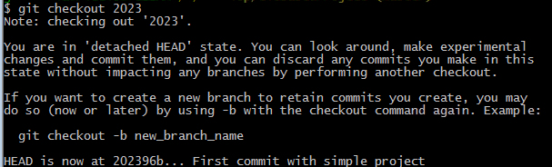

Riaprendo la solution si può verificare che effettivamente tutti i file
presenti nel nostro repository siano ora uguali a quelli del primo
commit. Il comando checkout ha quindi riportato la cartella allo stato
in cui era al momento del commit scelto e di fatto applica uno
“snapshot” alla cartella dove si sta lavorando.

Il messaggio di warning mostrato avverte che ci si trova in una
situazione di *detached HEAD*, ovvero **il puntatore HEAD (che indica il
commit attualmente attivo), non punta a nessuna branch**. Questa
situazione è poco utile ed ha senso solo quando si vuole visualizzare il
contenuto del repository in un precedente istante di tempo, ma non è
consigliabile usarla per lavorare e per effettuare altre modifiche.

Per tornare alla situazione iniziale si deve usare il comando *git
checkout master* che non fa altro che riportare il puntatore HEAD alla
posizione della branch master per continuare a lavorare.

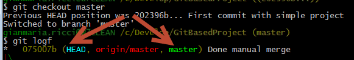

In ogni repository git come minimo si hanno due puntatori: il primo
viene chiamato HEAD e identifica il commit che è attualmente
rappresentato nella cartella, il secondo è il puntatore alla branch
master. Quando si parla di puntatore si intende dunque una semplice
variabile che punta ad uno specifico commit, e solitamente viene
chiamato **Branch.** Di fatto una branch non è quindi una “copia
intelligente” di una cartella, ma semplicemente un puntatore che indica
un particolare commit e permette di effettuare “shapshot” a partire da
quel commit.

Creare una branch locale 
-------------------------

Lavorando con un VCS distribuito si ha la comodità di effettuare il push
solamente quando i propri sorgenti sono pronti per essere pubblicati,
**ma spesso si può avere anche la necessità di effettuare dei
“tentativi” in locale che non fanno parte della linea principale di
sviluppo** (branch locale). Supponiamo si voglia fixare un bug
complesso, ma nel contempo si voglia comunque continuare a sviluppare
sulla master locale. In questo caso si ha la necessità di tenere due
linee distinte di codice in locale: la master e quella dove verrà
corretto il bug. In un centralizzato questa opzione non è disponibile,
l’unica analogia è creare una branch nel server, che però sarà visibile
a tutto il team.

Per creare una nuova linea di codice è sufficiente creare una nuova
branch con il comando *git checkout -b nomebranch commitid*. In questo
caso il commitid può anche essere omesso ad indicare che la branch verrà
creata a partire dalla HEAD. Questa operazione può essere effettuata
tranquillamente anche all’interno di Visual Studio con la voce di menu
New Branch.

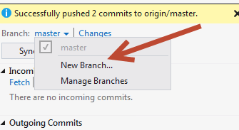

A questo punto basta specificare il nome della branch

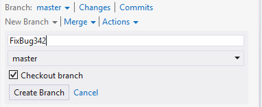

L’opzione Checkout branch effettua un checkout immediato alla nuova
branch, ovvero sposta il puntatore HEAD sul puntatore della branch
appena creata.

Questo significa che il prossimo commit che verrà effettuato aggiornerà
il puntatore FixBug342 e non il master, se si modifica un file e si
effettua un commit si può infatti verificare questo comportamento.

In questo caso il commit bfbc290 è stato effettuato sulla branch
FixBug342, è il puntatore della branch master è rimasto ferma al commit
075007b. La HEAD invece indica cosa è attualmente rappresentato nella
cartella, ed in questo caso specifica che il contenuto è relativo al
commit bfbc290 della branch FixBug342. Da questo semplice esempio si
capisce come **in Git il concetto di Branch sia intrinseco nello
strumento, dato che è semplicemente un ulteriore puntatore (rispetto al
master sempre presente) che punta ad un commit al quale verrà applicato
il successivo snapshot**.

Naturalmente è possibile avere una visualizzazione grafica delle branch
presenti direttamente dal plugin di Visual Studio.

    

In questo caso è evidente che la nuova branch creata è solamente locale,
non è quindi pubblicata sull’origin (ovvero TF Service). Nel tab dei
Commits viene data una spiegazione più dettagliata

    

In questo caso il Push è disabilitato, perché non esiste una upstream
branch configured, ovvero non è presente nessun collegamento tra la
branch locale ed una corrispondente branch presente su un remote. In
questo modo la branch creata rimane solamente nel repository locale e
non verrà vista da nessuno.

Se si vuole tornare a sviluppare sulla branch master, e sospendere le
operazioni di fix del bug basta scegliere la branch da attivare in
Visual Studio

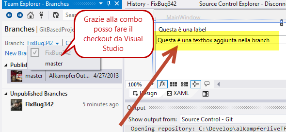
    

In questo caso è stata aperta una finestra WPF XAML a destra dove è
stata aggiunta una textbox e poi le modifiche sono state committate. Se
dalla combo del team explorer si cambia la branch, tornando ad esempio
sulla master, Visual Studio si può notare come il designer si aggiorni
automaticamente.

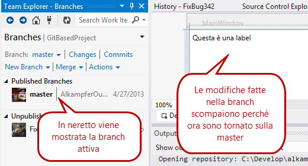
    

L’operazione fatta da Visual Studio in riga di comando è: *git checkout
nomebranch (es git checkout master)* la comodità di effettuarla dal Team
Explorer di Visual Studio è che Visual Studio sa esattamente quali file
sono differenti tra le due branch, per cui il designer e tutti i file
aperti si aggiornano immediatamente.

Se ad esempio si aggiunge un nuovo progetto nella branch FixBug342, e
poi si effettua un git checkout master da riga di comando, Visual Studio
avvertirà che i file della solution sono cambiati da un processo esterno
e chiede se si vuole ricaricare la solution stessa, mentre cambiando
branch dall’apposito menù, l’operazione è automatica.

Avendo ora a disposizione due branch locali e quindi due puntatori ecco
come si presenta il repository locale dopo due commit sulla branch
locale ed un commit nella master.

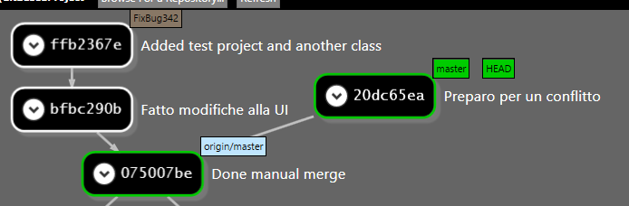
    

In questo caso seegit mostra in maniera eloquente la presenza di due
rami di commit, attualmente la branch attiva è la master (dove è stato
modificato un file modificato anche nella branch per generare conflitto)
e la origin/master (la branch del remote) è ferma a 075007be.

Se i due commit sulla branch FixBug342 sono sufficienti a correggere il
bug, si procede a reintegrare la branch con la master con una operazione
di merge.

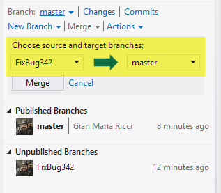

Da Visual Studio l’operazione di merge è banale da impostare: basta
selezionare la branch sorgente e quella destinazione e premere il
bottone Merge. Nella figura precedente è infatti mostrato come fare la
merge della branch in cui è stato corretto il bug sulla master.

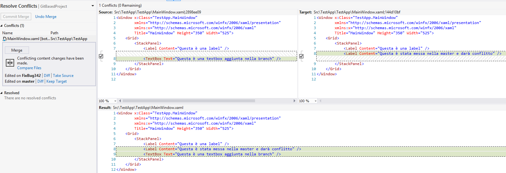

Anche in questo caso al verificarsi di conflitti si procede alla
risoluzione manuale da Visual Studio. Una volta che ogni conflitto è
stato risolto, è necessario effettuare un nuovo commit con la loro
risoluzione. Visual Studio mostra anche un comodo riepilogo di tutti i
conflitti risolti con l’opzione *View the resolved conflicts*.

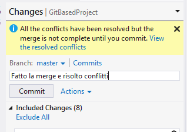
    

Ecco quindi visualizzato con SeeGit come appare il repository locale
dopo che si è risolto il conflitto localmente e si è effettuato il
commit con le risoluzioni.

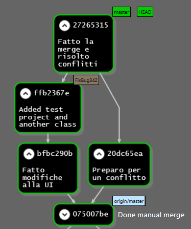
    

Come si può vedere il risultato è analogo a alla risoluzione di
conflitti causati dai due sviluppatori che hanno modificato lo stesso
file nei rispettivi repository locali, il concetto è analogo. Nel caso
precedente il conflitto si verificava tra la master locale e la master
del remoto (operazione di pull = fetch + merge), in questo caso il
conflitto si genera tra due branch locali. Le due situazioni sono quindi
analoghe, git prende tutti gli shapshot delle varie branch per
applicarli tutti al commit di partenza, chiedendo all’utente di
risolvere eventuali conflitti.

Dopo avere risolto i conflitti tra le branch locali, è chiaramente
possibile avere ulteriori conflitti sulla master, causati da altri
sviluppatori che hanno modificato gli stessi file, come mostrato nella
figura sottostante.

La situazione si complica ecco infatti una rappresentazione grafica con
seeGit.

In locale dal commit 075007be escono tre branch: due locali (di cui è
stata già effettuata la merge, e la origin/master che è stata scaricata
con il fetch. È necessario quindi effettuare una nuova merge di
origin/master con la propria master. Il risultato è rappresentato nella
figura sottostante.

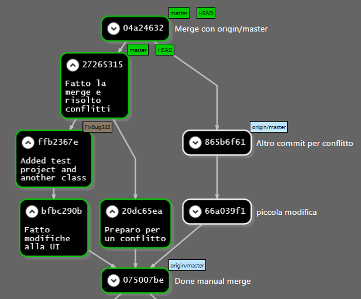

In questo caso abbiamo due branch locali ed una remota, tutte le merge
sono state effettuate e quindi si può procedere a fare push verso il
repository centrale (origin/master).

Una volta che il tutto è stato inviato è possibile anche cancellare la
branch locale con il *comando git branch –d nomebranch*. Spesso le
branch locali usate per fixare bug o per fare esperimenti non hanno più
senso di esistere dopo la merge e vengono cancellate. **L’operazione di
cancellazione non fa altro che cancellare il puntatore, tutti i commit
effettuati però rimangono sempre**. Come si può vedere dalla figura
sottostante i commit sono rimasti, l’unica cosa che è cambiata è che non
è più presente il puntatore alla branch FixBug342

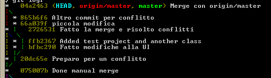

### Effetti delle branch locali per gli altri sviluppatori

Uno degli aspetti interessanti è capire cosa gli altri sviluppatori
vedono una volta che effettuano un pull e recuperano le modifiche dello
sviluppatore che ha fatto la merge locale. Vediamo quindi cosa accade ad
un altro sviluppatore del team che effettua un pull.

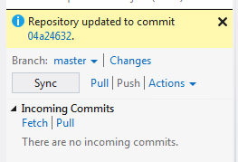

Dato che tutti i conflitti sono stati risolti dall’altro sviluppatore,
Visual Studio avverte semplicemente che sono state scaricare modifiche
ed il repository è stato aggiornato (figura sopra). Ecco quello che vede
l’altro sviluppatore.

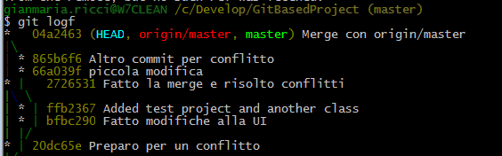

Come si può notare, tutti i commit che il precedente sviluppatore aveva
effettuato nella sua branch FixBug342 e di cui ha fatto merge con la
master, sono replicati in maniera eguale nel repository locale
dell’altro sviluppatore. Se si tiene a mente la metafora di git come
strumento di “shapshot di cartelle”, l’operazione di push consiste
nell’inviare tutti gli snapshot locali al server centrale e questi
ultimi verranno riscaricati in maniera identica da tutti gli altri
membri del team.

Questa situazione spesso tende a spingere le persone a non usare branch
locali per non complicare il repository centrale, ma questo fa perdere
gran parte del vantaggio dello strumento. Git è infatti uno strumento
molto potente, che permette di risolvere egregiamente questo problema.

Branch avanzato – Rebase
------------------------

Si supponga che **il secondo sviluppatore lamenti di avere una
situazione confusa nel suo repository** perché la branch locale, fatta
dal primo sviluppatore, ha reso più complesso la struttura del
repository. Se tutti gli sviluppatori usano branch locali, il repository
centrale può diventare ingestibile.

Il primo sviluppatore deve ora fixare un ulteriore bug complesso, vuole
mantenere la comodità di usare una branch locale e, come nel caso
precedente, crea una nuova branch FixBug42, effettuando poi due commit
su tale branch e due commit sulla master locale. La situazione è analoga
a quella che aveva nella precedente situazione

Se ora lo sviluppatore procedesse ad effettuare una merge tra la branch
FixBug42 e la master locale, si creerebbe lo stesso scenario precedente,
tutti i commit verranno inviati al server con l’operazione di push,
rendendo visibile la struttura dei commit locali agli altri
sviluppatori.

Dato che la branch locale FixBug42 verrà poi cancellata dopo il merge,
perché il suo scopo, (poter sviluppare un bugfix locale in maniera
concorrente alla master) è oramai esaurito, **git permette di usare un
comando avanzato chiamato Rebase che “linearizza” il repository**.

Questa opzione non è disponibile ancora nella interfaccia di Visual
Studio e permette di ***riposizionare* una branch su di un’altra**.
Questa affermazione è abbastanza complessa per chi non ha dimestichezza
con un SCS distribuito, ma si tenga a mente sempre il paradigma dello
snapshot.

Chiedendo un rebase della branch FixBug42 sulla master locale git cerca
di riapplicare i commit di una branch su di un’altra. Inizia dal primo
commit della branch che non ha ancora subito merge con la master; in
questo caso non essendo mai stata fatta nessuna merge, il commit è il
21874aae. **Individuato questo commit, procede ad applicarlo sull’ultimo
commit della master**. Dato che git a tutti gli effetti può essere
assimilato ad un tool di snapshot di cartelle, che per ogni commit
memorizza il differenziale con lo stato precedente, tutte queste
informazioni possono essere usate per tentare di riapplicare le
modifiche differenziali a padri differenti. Se non si generano conflitti
(ovvero stessi file modificati) l’operazione va a buon fine, e **git
procede a con il commit seguente fino a terminare tutti i commit della
branch che subisce il rebase**.

   

Come si può vedere spostandosi con un comando di checkout sulla branch e
chiedendo un rebase sulla master quello che viene fatto è un rewind
della head per tentare un replay sul top della master. Per branch locali
limitate a bugfix i conflitti spesso non accadono e quindi l’operazione
riesce. In caso di conflitti si deve procedere ad una merge standard,
**ricordando però che potenzialmente è possibile avere conflitti per
ogni commit della branch che subisce rebase**. Questo significa che una
volta risolti i conflitti per un commit, è possibile che git ripresenti
nuovamente una serie di conflitti da risolvere.

Ecco ora come si presenta il repository locale.

    

La branch FixBug42 è stata spostata sulla master, a questo punto
eseguendo il merge tra la FixBug42 e la master viene effettuato un
semplice fast forward, dato che è sufficiente spostare il puntatore
master al commit 1aa45ea0.

    

Ecco come si presenta il repository locale al termine delle operazioni
di merge; essendo ora il repository lineare il merge è stato fatto
semplicemente aggiornando il puntatore master.

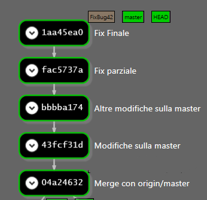

Ora si può cancellare la branch FixBug42 ed effettuare push senza la
paura di complicare la situazione dei repository locali degli altri
sviluppatori. Quando essi effettueranno il pull vedranno infatti tutti i
commit come se fossero stati effettuati linearmente e non vi è più
traccia della branch FixBug42.

### Rebase interattivo e squash

In realtà è anche possibile effettuare una ulteriore operazione avanzata
per rendere ancora più chiaro agli altri sviluppatori il lavoro
effettuato in locale. **I due ultimi commit: fac5737a e 1aa45ea0 sono
infatti quelli relativi al fix del bug 42 realizzati nella branch
locale, e potrebbe essere interessante fonderli in un unico commit**.
Una volta che il bug è corretto non vi è più la necessità di tenere i
commit separati, dato che entrambi concettualmente sono parte di un
unico bugfix. Ogni qualvolta si vuole fondere più commit in uno, si può
utilizzare il rebase interattivo. Ad esempio se si vuole fondere gli
ultimi 2 commit in uno si usa il comando

    git rebase –i HEAD\~2

L’opzione -i richiede il rebase interattivo e HEAD\~2 indica il padre
del commit da cui si vuole partire, in questo caso due commit
antecedenti alla HEAD. Questo comando apre un editor testo (esterno alla
command line o direttamente interno con vim) **che rappresenta lo script
in formato testo con le istruzioni per il rebase**. Il nostro compito è
ora compilare lo script per ottenere il risultato desiderato, partendo
da uno script precostituito il cui scopo è non modificare nulla.

    

Per ogni commit è presente il comando pick, il suo hash ed il commento.
In questo caso il comando pick lascia il commit inalterato, mentre se si
vuole “fondere” due commit in uno si può usare il comando squash che
permette di fondere il commit con il suo precedente.

Nella figura precedente è mostrato lo script per richiedere lo squash
del commit 1aa45ea sul fac5737; ora questo punto si può salvare il file
di script e chiudere l’editor. Git procede quindi ad eseguire lo script
e dopo avere effettuato le operazioni di rebase interattive, presenta
una finestra con il commento che verrà associato al commit finale.

    

Questo commento può essere modificato, di base vengono inclusi tutti i
commenti dei commit che hanno subito squash (come sempre le linee che
iniziano per \# sono ignorate perché rappresentano le istruzioni su come
compilare il file) e se si inserisce un messaggio vuoto l’operazione di
squash viene abortita. Solitamente il commento viene riscritto in modo
che abbia un significato chiaro.

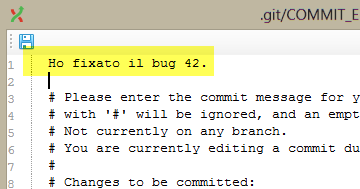
    

In questo caso il commento inserito non tiene nessuna traccia
dell’operazione di squash, è una unica linea che indica il fix di un
determinato bug. Ecco quindi come si presenta il repository locale.

    

La regola d’oro da ***non infrangere mai*** ***è effettuare rebase su
commit di cui si è già effettuato il push sul repository origin***.
Senza entrare nel dettaglio, questa operazione genera una catena di
problemi veramente ardui per tutti gli altri sviluppatori, perché i
commit che si erano precedentemente inviati al server non sono ora più
presenti in locale dopo disallineando i due repository.

Le operazioni di rebase sono utili per modificare la struttura locale
linearizzandola e semplificandola, prima di effettuare un push, in modo
da mantenere la struttura del server origin (repository centrale) più
pulita. Ecco cosa vedono gli altri sviluppatori dopo un pull.

La parte in giallo evidenziata è relativa al precedente push e
rappresenta la situazione di branch locale di cui è stato effettuato
merge e push senza rebase. Come si può vedere anche gli altri
sviluppatori vedranno questa strutturazione, mentre grazie al rebase, il
fix del bug 42 è un unico commit ed il flusso è lineare.

#### di [Gian Maria Ricci](http://mvp.microsoft.com/en-us/mvp/Gian%20Maria%20Ricci-4025635) – Microsoft MVP

