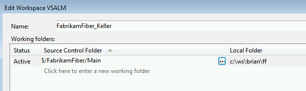
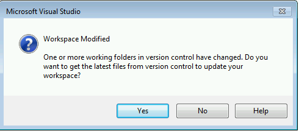
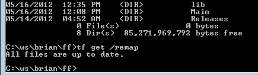
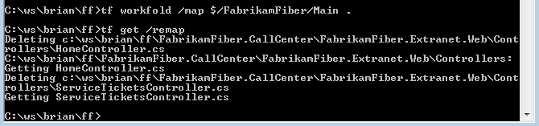

# Gestire il pattern Branch per Product Backlog Item con TFS

#### di [Gian Maria Ricci](http://mvp.microsoft.com/en-us/mvp/Gian%20Maria%20Ricci-4025635) – Microsoft MVP

*Maggio, 2013*

Pattern: Branch Per Product Backlog Item
----------------------------------------

Talvolta si ha la necessità di sviluppare le varie funzionalità di un
progetto in maniera completamente separata l’una dall’altra ed avere poi
la possibilità di fare il **Merge** di tali funzionalità in maniera
indipendente nella **trunk (Main)**.  *L’unica soluzione disponibile
usando il Source Control Centralizzato di TFS è utilizzare una branch
per ogni Feature*. Questa soluzione si rende necessaria perché non è
possibile effettuare il merge di changeset non contigui, per cui è
necessario che ogni funzionalità venga sviluppata in una branch
separata.

L’alternativa possibile è quella di utilizzare *feature flag*, ovvero
delle semplici impostazioni che possano *disattivare / attivare* le
varie funzionalità direttamente da configurazione. Se ad esempio una
funzionalità è implementata lato UI da una nuova pagina web, spesso
basta nascondere il link a tale pagina per far si che questa
funzionalità sia attiva / disattiva per l’utente. Non sempre questo
percorso è possibile, per questo è necessario avere la possibilità di
implementare alcune funzionalità in modo indipendente e per questo si
deve ricorrere ad una branch.

Problemi nell’implementazione
-----------------------------

Questa soluzione spesso non viene adottata perché in questo modo gli
sviluppatori lamentano nel proprio Hard Disk la presenza di una copia
intera di tutti i sorgenti per ogni PBI o funzionalità da sviluppare. In
questo scenario le branch crescono rapidamente di numero ed è poco
pratico fare il Get-Latest la mattina e vedere nel proprio HD dieci
copie nuove di tutti i sorgenti perché il giorno precedente è partito lo
sviluppo di un nuovo sprint. Avendo tante branch e cartelle locali molto
grandi, le operazioni di Get-Latest possono rallentarsi utilizzando i
Workspace Locali, perché il numero di file e cartelle da monitorare
diventa decisamente troppo grande. In generale quindi si tende a
limitare il numero di Branch utilizzate, ma conoscendo a fondo le
possibilità offerte da TFS, si vedrà come queste limitazioni possano
essere superate.

Prima di tutto è forse superfluo, ma è bene notare, che **a livello di
server non esiste nessuna duplicazione di sorgenti**, la branch è una
operazione molto leggera, e quindi avere tante branch non appesantisce
il source control. *A livello di macchina dello sviluppatore invece è
necessario fare un uso più corretto e intelligente del concetto di
**workspace***. Il problema maggiore è che le persone spesso usano un
unico workspace per tutti i Team Project, e quindi la loro cartella
locale rappresenta in maniera speculare la struttura del server.

Una delle soluzioni consigliate è usare un workspace per ogni Team
Project e mappare solamente la branch su cui si sta lavorando, come
potete vedere nella figura sottostante.

    

In questo caso l’utente Keller ha mappato la branch Main del progetto
FabrikamFiber nella cartella c:\\ws\\brian\\ff. Questo mapping gli
permette di: *scaricare solamente gli aggiornamenti di quella branch
durante un Get-Latest, occupare meno spazio sull’HD locale ed ignorare
ogni modifica che viene fatta in branch differenti*. Rimane ora da
capire come si possa lavorare su branch multiple mantenendo sempre e
comunque il mapping con la stessa cartella locale su disco.

Si supponga di dover iniziare a sviluppare il PBI (Product Backlog Item)
con Id 1435, la prima operazione da effettuare è creare la nuova branch
in un percorso specifico: \$/NomeTeamProject/**Pbi/** ad indicare
appunto che in questa cartella si troveranno tutte le branch delle
funzionalità attive.

    

Come si può notare si sta effettuando una normale branch della Main in
\$/FabrikamFiber/Pbi/1435 e si è messo un commento che spiega in maniera
completa il perché della sua creazione. Una volta creata, il Source
Control Explorer permette di visualizzarla, *ma chiaramente in grigio,
perché è fuori dal percorso mappato nel workspace.* In questo caso
infatti l’unico percorso mappato nel proprio HD dall’utente Keller è
\$/FabrikamFiber/Main e quindi non è possibile accedere alla branch
appena creata dato che non ha una corrispondente destinazione nel disco
locale.

    

Se si vuole iniziare a lavorare su questa branch, è sufficiente aprire
la definizione del workspace dal Source Control Explorer e procedere a
cambiare il mapping affinche **la stessa cartella locale punti alla
nuova branch**, come mostrato nella figura sottostante.

Quello che è stato fatto è rimappare la cartella locale
c:\\ws\\brian\\ff sulla nuova branch, in questo modo si utilizza una
sola cartella locale per mappare di volta in volta la branch su cui si
sta lavorando, riducendo lo spazio occupato nel proprio HD. Appena si
effettua il cambiamento Visual Studio, accorgendosi che il mapping del
workspace è cambiato, propone all’utente di effettuare subito un Get
Latest per aggiornare la cartella locale con la nuova cartella remota
del server.

    

Rispondendo yes viene effettuato un Get Latest, il quale però procede
con una cancellazione preventiva di tutti i vecchi file per poi
riscaricare nuovamente da zero il nuovo percorso mappato. Questo si può
vedere chiaramente dalla finestra di output che inizia con indicare il
comando di replacing c:\\ws\\brian\\ff …. seguito da una serie di delete
dei vecchi file ed un successivo get di tutti i file dal nuovo percorso.

    

Risoluzione dei problemi con tf get /remap
------------------------------------------

Questa operazione è abbastanza logica, avendo infatti rimappato
interamente una cartella locale ad un differente percorso nel server, il
client decide di cancellare tutto il vecchio contenuto e scaricare il
nuovo cosi da riaggiornare il workspace. Il problema è che, essendo il
nuovo percorso una branch del vecchio, *ci si attenderebbe un
comportamento più intelligente che non è presente nella UI, ma è
disponibile solamente da riga di comando tramite un **tf get /remap***

Questo comando verifica se il cambiamento di mapping è stato fatto tra
due branch correlate, ed in caso affermativo verifica le differenze ed
effettuare solo gli aggiornamenti richiesti. Come si può vedere dalla
figura sopra, dato che la branch rimappata è stata appena creata ed il
contenuto è identico a quello della Main, il comando non fa
assolutamente nulla dato che capisce che tutti i file sono già
aggiornati e termina immediatamente. Ora si può tranquillamente aprire
la solution da c:\\ws\\brian\\ff ed iniziare a lavorare nella nuova
branch. Per questo esempio si sono modificati due file di Controller MVC
aggiungendo un semplice commento ed è stato fatto check-in, il tutto
quindi nella branch **\$/FabrikamFiber/Pbi/1435. **

Se si ha la necessità di lavorare su di un’altra funzionalità, oppure
tornare a sviluppare sulla main, è sufficiente modificare nuovamente il
workspace, rimappando la cartella c:\\ws\\brian\\ff sula branch
desiderata ed effettuare nuovamente un **tf get /remap. **

Entrambe le operazioni possono tranquillamente essere fatte da riga di
comando e si può pensare di automatizzarle semplicemente in un batch,
ecco ad esempio i due comandi che permettono di switchare e di tornare a
sviluppare nella Main Branch.

    

Come si può vedere *il comando **tf workfold** effettua una rimappatura
della cartella locale (indicata dal punto finale) ad un nuovo percorso*
ed il **tf get /remap** che segue esegue un get verificando le
differenze tra la branch mappata precedentemente e la main. *In questo
esempio nella branch erano stati modificati due file, il comando quindi
li cancella e li scarica dalla branch correntemente mappata*, il tutto
in meno di un secondo. Creando un semplice file batch
chiamato SwitchToPbi.bat con queste due righe di codice

    tf workfold $/FabrikamFiber/Pbi/%1
    tf get /remap

si può effettuare la chiamata **SwitchToPbi 1435** per cambiare
velocemente la branch mappata nella cartella con la branch della feature
(in questo caso la 1453) su cui si vuole lavorare.

Questa soluzione è fondamentale in progetti complessi in cui la
grandezza della cartella sorgenti può essere tranquillamente di qualche
centinaia di MB. In questi scenari effettuare un get completo di tutti i
file ogni volta che si vuole cambiare branch di lavoro, anche se il TFS
è in rete locale, è sicuramente una perdita di tempo e di risorse del
sistema. 

Il problema maggiore di questa struttura invece è che lo sviluppatore
deve fare molta attenzione alla branch attualmente attiva, dato che la
cartella locale è sempre la stessa. In questo caso il suggerimento
migliore è quello di aprire sempre la solution dall’Source Explorer del
Team Explorer, in questo modo si può subito osservare quale è la branch
mappata perché è l’unica che non sarà rappresentata in grigio.

Gian Maria.

#### di [Gian Maria Ricci](http://mvp.microsoft.com/en-us/mvp/Gian%20Maria%20Ricci-4025635) – Microsoft MVP

