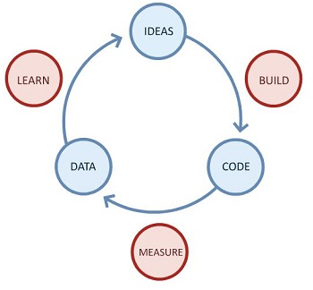
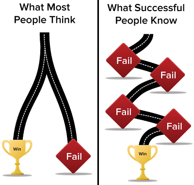

# Lean Startup, Jump Start (parte 1/3)

#### di [Felice Pescatore](https://mvp.microsoft.com/it-it/mvp/Felice%20%20Pescatore-5001016) - Microsoft MVP
Blog/Sito Personale: <www.felicepescatore.it>
ALM Blog: <http://www.getlatestversion.it/>

Introduzione
------------

Le startup sono una forma particolare di organizzazione, pensate per
**sperimentare** un modello di business sostenibile che consenta di
perseguire la propria Vision. Ma le startup sono più di quella che è
l’immagine collettiva dei geni sregolati in un garage: per avere
successo ci vuole metodo e un approccio scientifico al management.

**Lean Startup** ci fornisce gli strumenti per trasformare una startup
in un’azienda sostenibile e di successo, al di là del seguito il
contesto di riferimento. Detto ciò, di seguito il contesto di
riferimento sarà relativo al mondo dell’Information Technologies.

Lean Startup: la startup è un continuo esperimento
--------------------------------------------------

**Lean Startup** propone un approccio lean-based alla creazione di un
nuovo business e/o di una nuova startup, assimilando tale atto creativo
ad un **continuo esperimento**. Così come suggerito da *Eric Ries*, in
primis, ma anche da *Steve Blank* e altri pionieri di Lean Startup, una
nuova startup non è un’azienda in miniatura e quindi la cosiddetta
“*dollhouse theory of startups*” è assolutamente errata.

> *“A startup is a human institution designed to create something new *
>
> *under conditions of extreme uncertainty”*

L’obiettivo di una startup è quello di trasformare la propria Vision in
un business sostenibile, creando opportuni prodotti e servizi a supporto
di esso. In linea generale, non si ha inizialmente bisogno di tutte le
strutture tipiche di un’azienda rodata come, ad esempio, marketing o
finance, bensì di una struttura snella con un mix di competenze in
costante evoluzione. Essendo la Vision l’unico punto fermo, il processo
di realizzazione del prodotto (sevizio) annesso deve adattarsi a
condizioni assolutamente incerte, in cui il problema è *parzialmente
noto* (o addirittura in alcuni casi sconosciuto) e la *soluzione è
sconosciuta*. In tale contesto, non è possibile ipotizzare l’utilizzo di
approcci classici, ovvero:

-   **Waterfall-like** (*known problem, known solution*), richiede la
    conoscenza approfondita sia del problema e sia della soluzione che
    si vuole realizzare;

-   **Agile** (*known problem, unknown solution*), in cui il problema da
    risolvere è noto (in linea generale) ma non è ben chiaro quale
    soluzione realizzare per risolverlo ed il modo migliore per farlo.

Nel caso di una startup, siamo in una condizione di *(partially) unknown
problem - unknown solution*, ovvero una combinazione delle condizioni
precedenti in chiave peggiorativa. Lean Startup suggerisce di
considerare lo sviluppo del business (e del prodotto/servizio)
attraverso il ciclo **build-measure-learn** che va velocizzato il più
possibile al fine di sfruttare al massimo in concetto di *Validation
Learning*, ovvero validare scientificamente le proprie assunzioni (o
come li definisce Ries, atti di fede – “Leap of Faith”).

Figura 1 - Build-Measure-Learn

Ma l’apprendimento va associato a delle metriche affidabili e
verificabili, altrimenti si tratta di supposizioni che non portano a
vedere ciò che si vuole (*Vanity Metrics*) e a considerare livelli di
crescita (growth) falsati da valori non connessi ai miglioramenti
ottenuti nell’ultima esecuzione del loop Build-Measure-Learn.

Un esempio: *se si utilizzano delle metriche generiche che consentono
solo di vedere l’incremento dei download del prodotto, com’è possibile
capire se essi sono dovuti alle nuove features introdotte o ad un
aumento delle campagne di advertising?*

Questi elementi sono ben esplicitati nella pratica definita *Innovation
Accounting,* ovvero nella formulazione e nella verifica di una serie di
metriche affidabili (*Actionable Metrics*) definite sulla base di alcune
“semplici” domante:

-   *Cosa vogliamo imparare nel prossimo loop?*

-   *Cosa è necessario misurare per fare ciò?*

-   *Cosa dobbiamo realizzare (es: MVP) per raggiungere il nostro
    obiettivo?*

Tramite l’Innovation Accounting è possibile capire se si stanno facendo
progressi o se la strategia adottata va modificata (PIVOT) perché non
produce i risultati attesi, motivo che spinge, chiaramente, ad
accelerare il più possibile i loop build-measure-learn.

Chiudiamo questo primo appuntamento con l’enfasi sul “fallimento”: se la
scelta strategia risulta errata, ovvero le assunzioni fatte non sono
valide, ciò non vuol dire che è necessario arrendersi, bensì che bisogna
adeguare le proprie scelte e le future azioni ai risultati ottenuti. Il
pattern di riferimento di Lean Startup non è quindi: **win-or-fail** ma
**fail-fail-win**, andando ad abbracciare egregiamente il principio
**Genchi Gembutsu**: «vai e verifica di persona», che invita
l’imprenditore a non rilassarsi e ad essere sempre presente e vigile
nelle azioni chiave finalizzare alla creazione del nuovo business.

Figura 2 - win-fail vs fail-fail-win

[L'articolo prosegue qui](LeanStartupJumpStart2.md)

