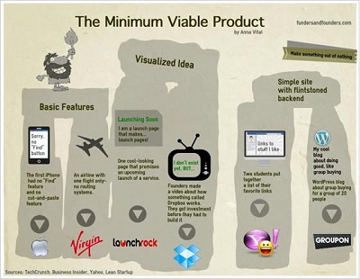
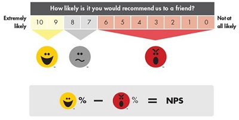
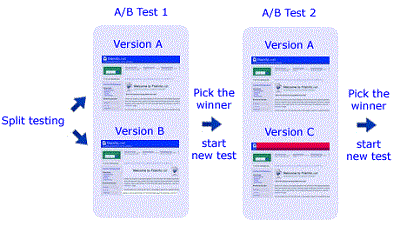
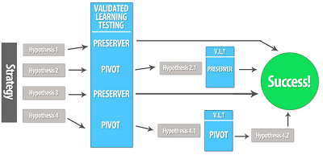

# Lean Startup, Jump Start (parte 2/3) - Build-Measure-Learn

#### di [Felice Pescatore](https://mvp.microsoft.com/it-it/mvp/Felice%20%20Pescatore-5001016) - Microsoft MVP

Blog/Sito Personale: <www.felicepescatore.it>

ALM Blog: <http://www.getlatestversion.it/>

Lean Startup: Buil-Measure-Learn
--------------------------------

Entriamo ora nel vivo dell’operatività della metodologia di Ries,
andando ad occuparci del ciclo **Build-Measure-Learn** e dei tool
annessi. Prima di continuare è opportuno ricordare che l’obiettivo di
una startup è quello di accelerare tale loop in modo da ricevere
velocemente i feedback dagli *early adopters*, i primi utilizzatori che
condividono la Vision generale e che possono contribuire al suo
raggiungimento. L’individuazione degli *early adopters* è fondamentale:
tali utenti possono tranquillamente tollerare inefficienze e un prodotto
parzialmente funzionante, perché sono “affamati” di novità e hanno
“desiderio” di contribuire alla sua evoluzione.

La prima fase è quella di **Build**, in cui l’idea viene codificata e
presentata agli *early adopters* (e successivamente ai clienti) per i
feedback.

Figura 3 - Build phase

Dal passaggio dell’idea alla codifica, il tool fondamentale è il
***Minimum Viable Product*** (MVP), sostanzialmente un prodotto/servizio
che implementa il set minimo di funzionalità per la convalida della
strategia. L'approccio di sviluppo, strutturato in termini di *Validate
Learning*, si contrappone decisamente alla logica del “release
maximum-feature”, in cui si cerca di rilasciare quante più features
possibili, abbracciando la filosofia “release early, release often” che
prevede di rilasciare velocemente e spesso nuove release della propria
soluzione (Continuous Delivery). In tal modo si va ad abbattere quello
che tipicamente viene indicato come l’8 MUDA di Lean (spreco), ovvero il
**sotto-utilizzo delle risorse umane**, nello specifico gli
early-adopters.

Ma cos’è concretamente un MVP? Possiamo immaginarlo come un qualsiasi
artefatto che ci permetta di verificare le nostre ipotesi e i nostri
“atti-di-fede” (*act of faith*): dal prototipo, ad una semplice pagina
web, fino anche ad un video in cui si descrive il prodotto/servizio.

Figura 4 - The MVP

La fase di codifica vera e propria trova nelle metodologie Agile e Lean
Software Development un ottimo strumento di riferimento, considerando
anche l’estrema incertezza in cui si opera tipicamente una startup
(ricordiamoci che sia il problema che la soluzione sono sconosciuti).

Attenzione però: il *Program Backlog* non va pensato in chiave standard,
ovvero composto dalle Feature, bensì va popolato con le ipotesi da
verificare ad ogni nuovo loop, mentre l’azione di sviluppo è gestibile
attraverso un *Iteration Backlog* in chiave classica.

Da un punto di vista della realizzazione è possibile utilizzare
strumenti come *PowerPoint* per la creazione di mock nelle primissime
iterazione e *Visual Studio LightSwitch* per la creazione dei primi
prototipi.

Figura 5 - PowerPoint Story Board

Una volta consegnato l’MVP, è possibile avere due scenari: se, quanto
realizzato, non dovesse confermare le assunzioni (*Innovation
Accounting*), è possibile ripartire dallo step precedente ed attuare le
opportune azioni di PIVOT. Dualmente, se l’MVP le convalida, è possibile
passare allo step successivo aggiungendo nuove funzionalità ad esso: si
opera, sostanzialmente, in un’ottica di *Continuous Integration*,
andando ad abbattere due dei MUDA di Lean: la *Sovrapproduzione*
(over-production) e le *Scorte* (over-stocking). Ciò avviene
concentrandosi solo su quello che è funzionale all’obiettivo imminente,
integrandolo rapidamente nel nuovo MVP da consegnare agli early-adopters
per le fasi successive.

Tornano alla *Continuous Delivery* è doveroso evidenziare che essa può
diventare pericolosa nel momento in cui comincia ad essere necessario
garantire una reliability di una certa robustezza, soprattutto quando si
passa dagli early-adopters ai clienti di riferimento. Ad esempio: cosa
accade se l’ultima modifica intacca il sistema di e-commerce?
Chiaramente le revenue diminuiscono e la startup comincia a soffrire di
liquidità.

Per tutelarsi da situazioni indesiderate, oltre agli strumenti di
*Quality Assurance* tipici delle attività di sviluppo (si pensi, al TDD
e al BDD, tanto per restare in chiave Agile), è possibile creare un
*Cluster Immune System*, ovvero un sistema che monitora (*Actionable
Metrics*) quanto accade nel sistema e ripristina la precedente
situazione laddove l’ultimo deploy ha generato problemi evidenti. E’
possibile approcciare tale sistema sia in modo automatizzato (ad esempio
tramite *Microsoft Release Management*) che parzialmente-automatizzato,
ma si tratta comunque di un percorso lungo e complesso, anche se inizia
con semplici regole e best-practice. Al di là della scelta specifica, la
cosa fondamentale è consentire al Team di lavorare con serenità,
evitando che i fallimenti (che ricordiamo, ci saranno e devono esserci)
si trasformino in qualcosa di diverso da strumento di apprendimento.

Creato l’MVP si passa alla “misurazione” della reazione dei nostri
clienti (early/potenziali/finali) al fine di poter applicare le pratiche
annesse all’**Innovation Accounting**, che, come descritto
precedentemente, consentono di capire se si stanno facendo progressi o
se la strategia adottata va modificata (PIVOT) perché non produce i
risultati attesi.

Figura 6 - Measure phase

Per poter misurare correttamente i *reali* miglioramenti ottenuti è
fondamentale affidarsi a **Metriche Perseguibili** (**Actionable
Metrics**), che consentono di effettuare analisi su dati che fotografano
lo stato reale del business, eliminando false valutazioni (**Vanity
Metrics**). In generale, una metrica è perseguibile se è:

-   *Impugnabile*: deve essere possibile stabilire un rapporto di
    causa-effetto, in modo che sia possibile comprendere quando e quanto
    le azioni (causa) modifichino il valore della metrica (effetto);

-   *Accessibile*: tutte le figure chiave coinvolte nello sviluppo del
    business devono essere in grado di accedere e soprattutto
    comprendere tale metrica, non deve essere troppo tecnica o confusa;

-   *Controllabile*: i dati devono essere attendibili, ovvero deve
    essere possibile affermarne, oltre ogni ragionevole dubbio, la
    correttezza dei dati.

Bisogna quindi avere una *reale* comprensione di ciò che si vuole
misurare e del campione di utenza di riferimento, cosa che ci porta
nell’ambito della **Cohort Analysis**, in cui le valutazioni sono basate
su gruppi temporanei, omogenei ed indipendenti di utilizzatori con
caratteristiche ed interessi affini. La Cohort Analysis, che si
contrappone alla pratica di considerare gli utenti come “un unico
gruppo”, è molto utile per analizzare la crescita andando a considerare
i nuovi utenti in modo distinto da quelli precedenti. In tal modo, ad
esempio, una startup può validare la capacità delle modifiche apportate
di attrarre nuovi clienti, così come un’eventuale regressione. Per ogni
Cohort (gruppo) deve essere possibile rispondere a domande come:

-   *Quanti utenti del gruppo hanno utilizzato la nuova funzionalità?*

-   *Quanti utenti del gruppo hanno acquistato il prodotto?*

-   *Quanti utenti hanno lamentato un peggioramento della user
    experience?*

E’ interessante evidenziare la possibilità di sfruttare la Cohort
Analysis per la cosiddetta pratica del “*killing features*”: viene
rimossa una funzionalità e si verifica cosa accade. Se le metriche di
rilievo non subiscono cambiamenti significativi è possibile migliorare
il prodotto nel complesso eliminando la funzionalità in modo da renderlo
più snello e semplice da manutenere.

Nell’attività di analisi del nostro gruppo di clienti, è possibile
sfruttare un’analisi **Conversion Funnel**. Nata nel mondo
dell’e-commerce, tale analisi consente di tracciare il percorso (pagine)
fatto da un cliente da quando clicca su un banner pubblicitario a quando
finalizza l’acquisto, ottenendo *Actionable Metrics* legate, ad esempio,
all’analisi delle pagine (o aree tematiche) su cui i clienti si
soffermano maggiormente, piuttosto che conteggiare banalmente il numero
di visitatori (*Vanity Metrics*).

Figura 7 - Conversion Funnels

A cosa ci serve la Conversion Funnel Analysis? Gli usi sono chiaramente
molteplici, ma proviamo a fare un semplice esempio: dalla nostra analisi
“misuriamo” che su 100 visitatori (potenziali clienti), 30 arrivano ad
inserire un acquisto in catalogo, ma solo 3 completano l’acquisto
stesso. Una delle ipotesi di tale riduzione è che il “carrello” abbia
difficoltà intrinseche nel far completare la fase di acquisto, possiamo
quindi scegliere di provare, ad esempio, a modificare la User Interface
relativa per semplificare la fase finale di acquisto.

Un’ulteriore strumento di analisi, legato al comportamento del singolo
cliente/utilizzatore, è il **Net Promoter Score (NPS)**, che, in modo
semplicistico, è possibile definire come il “*tasso di passa parola*”:

> “*Qual è la probabilità che lei raccomandi il prodotto ad un amico o
> un collega?”*

La domanda base può essere riformulata in diversi modi \[Sean Ellis\]:

*“Sarebbe molto deluso se non potesse più utilizzare il prodotto?”
oppure*

*“Ritiene il prodotto un must-have?”*

In pratica si analizza la *penetrazione virale* della soluzione,
consentendo alla startup di essere sempre focalizzata sul risultato
finale che si vuole ottenere. Se si supera una percentuale del 40% di
risposte affermative, la strategia intrapresa può essere ritenuta valida
(stima empirica), altrimenti è ora di operare un PIVOT!

Uno strumento particolarmente efficace per la creazione di Actionable
Metrics è *Microsoft Power BI,* che consente di visualizzare i dati,
condividere individuazioni e collaborare in modi nuovi e intuitivi.

Figura 8 - Net Promoter Score

Fin ora abbiamo ragionato in termini di variabilità degli utenti, ma se
si utilizza un campione di riferimento costante, o se si stanno
eseguendo i primissimi loop *build-measure-learn* in cui gli utenti sono
gli *early adopters*, uno strumento particolarmente utile è lo **Split
Testing** (o anche A/B testing), attraverso il quale è possibile
verificare la reazione alle modifiche dividendo il campione in due
macro-gruppi e consegnando loro due versioni leggermente differenti
della soluzione.

Figura 9 - Split Testing

Le differenze devono essere veramente minime (a livello atomico di
modifica): *una feature presente solo in una delle due alternative, il
cambio di un bottone sulla UI, la modifica dei colori, ecc*. In tal modo
è possibile misurare in modo puntuale la reazione dei due gruppi alle
alternative presentate e capire quali di esse risponde in maniera
migliore alle esigenze degli utilizzatori.

Lo split testing è, inoltre, un ottimo approccio per misurare la reale
utilità di una nuova feature: se si rilasciano due MVP in cui solo uno è
dotato di una feature extra e questa viene praticamente ignorata dal
gruppo di utilizzatori di riferimento, vuol dire che essa non è
percepita come valore e non è utile investire su essa. In generale, uno
split testing ben impostato segue due regole basilari:

-   *Semplice da implementare da un punto di vista del codice (on-line
    development);*

-   *Facile da utilizzare per le metriche di analisi sui cui prendere
    specifiche decisioni.*

Ad onor del vero lo split test può essere usato sempre, anche quando si
è in fase di acquisizione di nuovi clienti, ma ciò rende più difficile
valutare le reazioni perché i fattori da considerare si moltiplicano.

Una volta realizzato l’MVP e Misurate le risposte degli utenti, early
adopters o clienti che siano, è giunto il momento di “tirare le somme”
ed eliminare gli sprechi: siamo nella fase di **Learn** in cui, oltre
alla valutazione *indiretta* del comportamento degli utenti delle
**Actionable Metrics**, viene abbinata un’analisi *diretta*, utilizzando
strumenti ben noti al mondo del marketing come le
*Interviste/Questionari* o i *Focus Group*.

Figura 10 - Learn phase

Bisogna fare attenzione a valutare con parsimonia i risultati che si
ottengono dall’approccio diretto, perché vale sempre la massima che
“*spesso il cliente non sa quello che vuole o non sa come
specificarlo*”. Quasi sempre l’analisi dei risultati è orientata alla
ricerca del risultato negativo: si cerca di capire se si ha un riscontro
negativo del prodotto/servizio in modo da confutare le proprie tesi. Gli
utenti, lo ricordiamo, non sono tutti uguali, e nel processo di crescita
attraverso i vari loop *build-measure-learn*, è fondamentale sceglierli
accuratamente tenendo ben ferma la propria Vision. Quello che bisogna
essere pronti a cambiare è la *Strategia*, laddove, oggettivamente, la
strada intrapresa non stia dando i risultati sperati. Lean Startup
raccoglie questa sfida con il **PIVOT** tool, che reagisce ad una
domanda fondamentale: **I miei dati validano la mia ipotesi iniziale?**

-   *\[no\] Pivot, le ipotesi sono fondamentalmente sbagliate ed è
    necessario cambiarle;*

-   *\[si\] Preserve, si continua sulla strada intrapresa.*

Figura 11 - PIVOT

Fondamentalmente, “fare PIVOT” consiste nella formulazione di una nuova
ipotesi e nella sua validazione attraverso un nuovo ciclo di *Validate
Learning Testing*. Ricordiamo che in un terreno incerto come quello in
cui operano le startup, l’apprendimento convalidato (**validated
learning**) è il fattore di misura dei progressi raggiunti, esattamente
come la qualità dei prodotti può esserlo per il settore manifatturiero.

Esistono diversi tipi di PIVOT:

-   **Zoom In**: una feature diventa l’intero prodotto;

-   **Zoom Out:** un prodotto diventa una feature di un nuovo prodotto
    più grande;

-   **Customer Segment**: il prodotto funziona, per un segmento diverso
    da quello a cui era stato destinato. Si reagisce facendo diventare
    questo segmento inaspettato il target principale;

-   **Customer Need Pivot**: il prodotto va bene in parte, l’ipotesi era
    parzialmente vera, l’utente stesso comunica, però, che vuole una
    cosa leggermente diversa;

-   **Platform Pivot**: il prodotto viene trasformato da applicazione a
    piattaforma o viceversa;

-   **Business Architecture Pivot**: si passa da una struttura ad alto
    margine e basso volume (B2C) ad una a basso margine ed alto volume
    (B2B), o viceversa;

-   **Value Capture Pivot**: viene cambiato il revenue model;

-   **Engine of growth pivot**: viene cambiato l’engine della crescita;

-   **Channel pivot**: ad essere modificato è il canale di vendita;

-   **Technology Pivot**: scelgo un’altra tecnologia da adottare, ma non
    modifico il business.

Nella valutazione della risposta degli utenti è fondamentale capire
quali sono le cause di insoddisfazione e dei problemi riscontrati. Per
fare ciò Lean (Startup) propone la **Five Whys Analysis**, uno strumento
di *root analysis* pensato per scalfire la superfice del problema ed
arrivare al vero motivo del perché esso si è verificato grazie ad una
*drill down analysis*.

Il tool è semplice da applicare e consta di due fasi:

-   *analisi*, si attua ponendo ripetutamente (max per 5volte) la
    domanda “perché” ad ogni risposta inerente il problema al fine di
    identificarne la causa radice. Ad esempio si sopre che : “*L’azienda
    non ha investito in formazione*”, partendo da un problema di down
    del DB non gestito per mancanza dell’unico DBA presente in azienda;

-   *azioni risolutive bilanciate*, consta nell’intervenire ad ognuno
    dei livelli evidenziati, proporzionalmente all’incidenza
    sul problema. Sempre nel caso di esempio, il maggior investimento
    sarà fatto, presumibilmente, nel formare un nuovo DBA.

Agli strumenti metodologici contemplati da Lean Startup è utile dare uno
sguardo a quelli tecnologici che ci consentono di raggiungere
l’obiettivo fondamentale di velocizzare ogni nuova iterazione
build-measure-learn. Lo strumento principe, salvo rare eccezioni, è una
***piattaforma Cloud*** che consente di creare una infrastruttura IT in
modo rapido e dinamico, estendendola progressivamente e pagando solo per
il suo reale utilizzo. I principali vantaggi dell’utilizzo del Cloud
sono:

-   *Pay-per-use & Continuous Innovation*: si paga solo ciò che
    realmente si consuma, contenendo al minimo le spese e accedendo da
    subito a tecnologie all’avanguardia;

<!-- -->

-   *Mobilizzazione del Capitale*, passaggio dalle spese in conto
    capitale (CapEx) alle spese operative (OpEx);

-   *Riduzione del Time-to-Market*, ovvero del tempo che intercorre
    dall'ideazione di un prodotto alla sua effettiva
    commercializzazione/disponibilità;

-   *Scalabilità, Affidabilità e Sicurezza*, garantite in modo costante;

-   *Riduzione della Complessità Operativa*, semplificando il modello di
    costo e abbattendo drasticamente i relativi costi operativi
    di gestione.

Per la fase di Build, inoltre, è fondamentale l’utilizzo di *framework*
e *middleware* che dispongono di un’ampia community di supporto,
consentendo così di velocizzarne l’apprendimento e la risoluzioni di
eventuali problemi. Questo aspetto è sicuramente primario rispetto a
quello tanto enfatizzato dell’open/closed source, poiché bisogna essere
in grado di quantizzare il vantaggio nella sua interezza. Ad esempio: se
l’utilizzo di un framework open-source implica una curva di
apprendimento molto ampia, ciò rallenterà l’esecuzione del loop
build-measure-learn, in contrasto con l’obiettivo stesso di Lean
Startup.

Entrambi questi aspetti sono egregiamente
contemplati dal programma **BizSpark per Startup di Microsoft** (il
primo tramite Azure ed il secondo tramite Visual Studio e il dotNet
Framework), che mira a fornire supporto diretto, e in larga parte
gratuito, alle startup. Per i dettagli si rimanda al [*link
ufficiale*](http://www.microsoft.com/bizspark/).

[Lean Startup, Jump Start (parte 3/3) - Growth Engine](LeanStartupJumpStart3.md)

