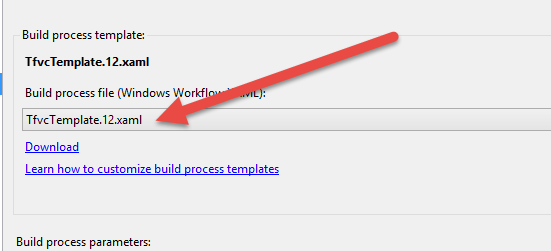
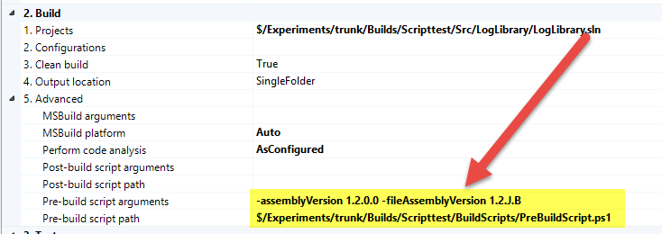
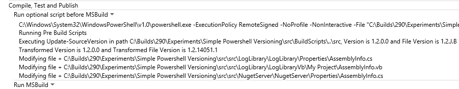
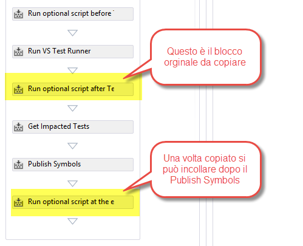
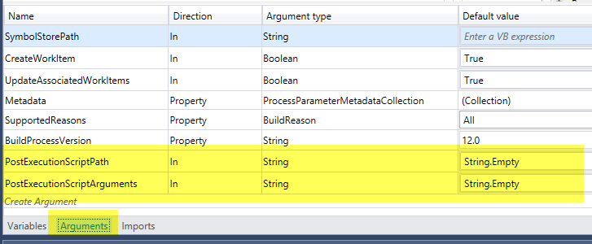
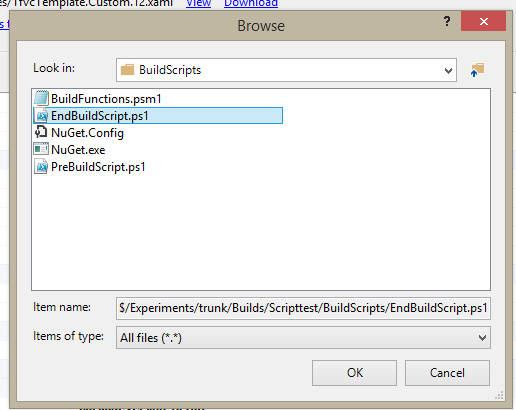
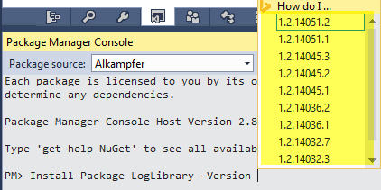
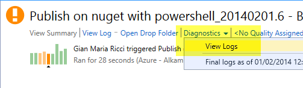
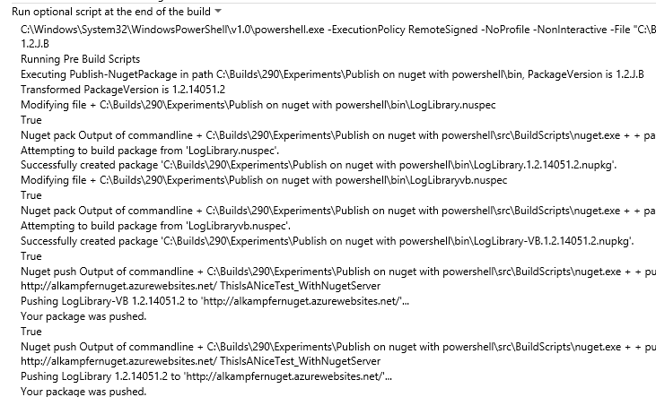
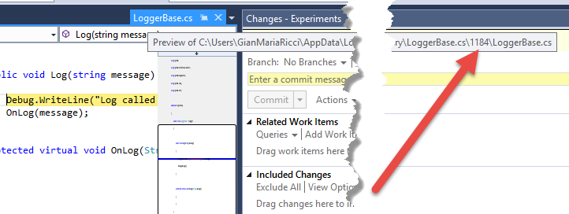

# Pubblicare automaticamente un pacchetto NuGet durante una build TFS

#### di [Gian Maria Ricci](http://mvp.microsoft.com/en-us/mvp/Gian%20Maria%20Ricci-4025635) – Microsoft MVP

Blog inglese: <http://www.codewrecks.com>

Blog Italiano ALM: <http://www.getlatestversion.it/author/alkampfer/>

Blog Italiano: <http://blogs.ugidotnet.org/rgm>


*Marzo, 2014*

**Nota:** Questo articolo contiene informazioni valide per la vecchia build XAML e non è più attuale con l'attuale sistema di build. Se avete ancora build XAML operative, il suggerimento è aggiornarle alla nuova versione, prima che il build controller venga completamente rimosso in una delle future versioni di TFS.

Versionare gli assembly
-----------------------

Ho già parlato in un precedente articolo dal titolo: [Gestire la
numerazione degli assembly durante la
build](http://msdn.microsoft.com/it-it/library/jj714729.aspx) su come
utilizzare un componente open source, disponibile su codeplex, per
gestire la numerazione automatica degli assembly durante una build di
TFS. Vi invito a leggerlo per acquisire le conoscenze di base
sull’argomento, ma in questo articolo presenterò una modalità
alternativa resa possibile dalla nuova struttura di build disponibile
con TFS 2013 e in Visual Studio Online. Sfruttando queste nuove
possibilità spiegherò inoltre come pubblicare automaticamente un
pacchetto NuGet durante una build.

Di base l’approccio al versioning descritto nel precedente articolo
soffre di alcuni punti deboli.

- Personalizzare il workflow di una Build non è un operazione banale,
    soprattutto per chi non ha familiarità con Workflow Foundation
- *Cambiando la versione di TFS ed i build agents è necessario
    ricompilare le azioni per referenziare le nuove versioni degli
    assembly delle build di TFS.*
- Non è possibile debuggare in locale in maniera semplice il codice
    che si è scritto


**Il punto due è quello sicuramente più fastidioso, perché rende più
complessi gli scenari di aggiornamento**. Questo problema è mitigato da
una nuova funzionalità introdotta con l’Update 2 di TFS, che permette a
TFS di utilizzare i Build Server della versione precedente, permettendo
quindi di posticipare l’aggiornamento delle azioni personalizzate delle
build ad un momento successivo rispetto all’upgrade di TFS. In generale
però, per le suddette problematiche, è preferibile personalizzare le
build utilizzando degli script piuttosto di andare a modificare il
workflow base.

**Il nuovo workflow**, chiamato TfvcTemplate.12.xaml (ne esiste una
versione analoga per i progetti basati su Git) **permette infatti, by
design, di specificare degli script che verranno eseguiti in alcuni
punti specifici**, ovvero: prima e dopo la build e prima e dopo
l’esecuzione dei test. In questo caso quindi, per effettuare il
versionamento degli assembly è possibile utilizzare uno script
Powershell eseguito prima della build, il cui scopo è semplicemente
quello di modificare tutti i file assemblyinfo.cs ed assemblyinfo.vb
mettendo il valore corretto del versioning.


Grazie alle potenzialità di powershell, creare uno script che cerca in
tutte le cartelle dei sorgenti tutti i file assemblyinfo.cs ed
assemblyinfo.vb per poi modificarli con una regex, è questione di poche
righe di codice.

```powershell
function Update-SourceVersion
{
    Param
    (
        [string]$SrcPath,
        [string]$assemblyVersion,
        [string]$fileAssemblyVersion
    )
     
    $buildNumber = $env:TF_BUILD_BUILDNUMBER
    if ($buildNumber -eq $null)
    {
        $buildIncrementalNumber = 0
    }
    else
    {
        $splitted = $buildNumber.Split('.')
        $buildIncrementalNumber = $splitted[$splitted.Length - 1]
    }

    if ($fileAssemblyVersion -eq "")
    {
        $fileAssemblyVersion = $assemblyVersion
    }

    Write-Host "Executing Update-SourceVersion in path $SrcPath, Version is $assemblyVersion and File Version is $fileAssemblyVersion"

    $AllVersionFiles = Get-ChildItem $SrcPath AssemblyInfo.cs -recurse

    $jdate = Get-JulianDate
    $assemblyVersion = $assemblyVersion.Replace("J", $jdate).Replace("B", $buildIncrementalNumber)
    $fileAssemblyVersion = $fileAssemblyVersion.Replace("J", $jdate).Replace("B", $buildIncrementalNumber)

    Write-Host "Transformed Version is $assemblyVersion and Transformed File Version is $fileAssemblyVersion"

    foreach ($file in $AllVersionFiles)
    {
        Write-Host "Modifying file " + $file.FullName
        #save the file for restore
        $backFile = $file.FullName + "._ORI"
        $tempFile = $file.FullName + ".tmp"
        Copy-Item $file.FullName $backFile
        #now load all content of the original file and rewrite modified to the same file
        Get-Content $file.FullName |
        %{$_ -replace 'AssemblyVersion("[0-9]+(.([0-9]+|*)){1,3}")', "AssemblyVersion(""$assemblyVersion"")" } |
        %{$_ -replace 'AssemblyFileVersion("[0-9]+(.([0-9]+|*)){1,3}")', "AssemblyFileVersion(""$fileAssemblyVersion"")" }  > $tempFile
        Move-Item $tempFile $file.FullName -force
    }
}
```

Non essendo io uno specialista di powershell, questo script
probabilmente non è ottimale, ma serve comunque allo scopo e a
familiarizzare con questa nuova modalità di personalizzare la build.

Gli **script di personalizzazione possono inoltre accedere a particolari
variabili di ambiente impostate dal build engine**, come ad esempio il
numero della build, presente nella variabile
\$env:TF\_BUILD\_BUILDNUMBER. In questo modo lo script ha accesso alle
informazioni contestuali della build. **La lista completa delle
variabili disponibili può essere [trovata a questo
indirizzo](http://msdn.microsoft.com/en-us/library/hh850448.aspx)**. Il
codice PowerShell sopra mostrato viene incluso in un file con estensione
psm1 (PowerShell module) e verrà richiamato dal reale script impostato
per l’esecuzione prima della build.

Personalizzare la build tramite script
--------------------------------------

Come detto precedentemente, con TFS 2013 è stato fornito un nuovo
process template, di cui esistono due versioni praticamente identiche,
una per TFVC e l’altra per Git, che permettono out-of-the-box la
personalizzazione tramite script.



Una volta selezionato questo nuovo tipo di template, potrete vedere che
**i parametri per la configurazione sono molto differenti da quelli
presenti nella vecchia versione**. L’aspetto interessante è che questo
template è stato semplificato, togliendo tutte le opzioni ridondanti e
non utili. Per il nostro esempio è sufficiente andare a specificare la
posizione nel source control degli script Powershell che intendiamo far
eseguire.

In questo specifico esempio, **nella cartella trunk/Builds/ScriptTest ho
due sottocartelle, una chiamata src dove risiedono tutti i file
sorgenti, nella BuildScripts ho invece inserito gli script di build**.
In questo modo si può semplicemente eseguire lo script in locale al di
fuori di qualsiasi build, sfruttando i percorsi relativi. La cartella
src, dove risiedono tutti i file sorgenti si trova infatti in
**_..\\src_**. Nella cartella ScriptTest si trova il modulo powershell
discusso precedentemente, oltre che uno script chiamato
PreBuildScripts.ps1 che contiene semplicemente il codice necessario ad
invocare la funzione del modulo descritto precedentemente.


```powershell
Param
(
[string] $assemblyVersion,
[string] $fileAssemblyVersion
)

Write-Host "Running Pre Build Scripts on Powershell host:"
Write-Host ($PSVersionTable | Format-Table | Out-String)

Import-Module $scriptRoot\BuildFunctions

if ($assemblyVersion -eq "")
{
$assemblyVersion = "1.0.0.0"
$fileAssemblyVersion = "1.0.J.B"
}

Update-SourceVersion $scriptRoot\..\src $assemblyVersion $fileAssemblyVersion
```

Rimane solamente da specificare nei parametri della build lo script e
tutti i parametri da lui richiesti. Per chi non ha familiarità di
PowerShell è importante notare i parametri sono dichiarati
esplicitamente all’inizio dello script stesso con la direttiva Param; in
questo modo il parsing della riga di comando verrà fatto direttamente
dal motore di PowerShell.



L’aspetto interessante è che **prima di lanciare la build si può aprire
lo script con Powershell ISE, eseguirlo e verificarne la correttezza
andando ad accertarsi che i file assemblyinfo.vb e assemblyinfo.cs siano
stati modificati in maniera corretta**. In questo modo si può effettuare
test e debug del proprio script nella macchina locale prima di
configurare la build.

Una volta che lo script viene eseguito correttamente in locale si può
eseguire la build ed al termine scaricare la drop folder per verificare
che il versioning sia stato eseguito correttamente.


L’aspetto interessante è capire come si procede se lo script non ha
funzionato, ad esempio se le dll non hanno il corretto File Version. Se
nelle funzioni si sono utilizzate semplici chiamate alla cmdlet
Write-Host per fare output di log, si ritroverà tutto l’output nelle
diagnostiche delle build.



Questo permette di visualizzare l’esatta riga di comando che utilizzata
dall’agent di build per lanciare lo script, seguita da tutti i log fatti
con Write-Host. **Se si ha un accesso con remote desktop al build server
si può tranquillamente connettersi, andare nella cartella dove viene
eseguire la build ed effettuare il debug dello script con PowerShell
ISE**, nella stessa cartella utilizzata per la build e con l’esatta
stringa di comando. Questo approccio sicuramente è più flessibile
rispetto all’avere inserito delle azioni custom nel process template
perché vi permette di eseguire e debuggare lo script nello stesso
ambiente in cui viene eseguito.

Deploy di un package NuGet
--------------------------

Anche in questo caso il deploy di un package NuGet può tranquillamente
essere effettuato usando un normalissimo script PowerShell. **Nella
cartella degli script per comodità si sono inclusi anche gli eseguibili
di nuget, in modo che durante la build vengano scaricati automaticamente
assieme agli script stessi**.

Per rendere la procedura la più semplice e stabile possibile, si può
procedere alla creazione del file .nuspec in maniera manuale nel
progetto, lasciando allo script il solo compito di cambiare la versione
e di pubblicarlo nel repository NuGet. Un possibile esempio di .nuspec
file potrebbe essere il seguente.

```xml
<?xml version="1.0"?>
<package >
  <metadata>
    <id>LogLibrary</id>
    <version>1.0.0.0</version>
    <authors>Ricci Gian Maria</authors>
    <owners>Ricci Gian Maria</owners>
    <requireLicenseAcceptance>false</requireLicenseAcceptance>
    <description>Simple log library project to verify build+nuget.</description>
    <releaseNotes>ContinuousIntegration.</releaseNotes>
    <copyright>Copyright 2014 - Ricci Gian Maria</copyright>
    <tags>Example</tags>
  </metadata>

  <files>
    <file src="LogLibrary.dll" target="libNET40" />
    <file src="LogLibrary.pdb" target="libNET40" />
  </files>
</package>
```

Lo script Powershell che invece si occupa di pubblicare su nuget è il
seguente

```powershell
function Publish-NugetPackage
{
  Param
  (
    [string]$SrcPath,
    [string]$NugetPath,
    [string]$PackageVersion,
    [string]$NugetServer,
    [string]$NugetServerPassword
  )
    $buildNumber = $env:TF_BUILD_BUILDNUMBER
    if ($buildNumber -eq $null)
    {
        $buildIncrementalNumber = 0
    }
    else
    {
        $splitted = $buildNumber.Split('.')
        $buildIncrementalNumber = $splitted[$splitted.Length - 1]
    }

    Write-Host "Executing Publish-NugetPackage in path $SrcPath,PackageVersion is $PackageVersion"

    $jdate = Get-JulianDate
    $PackageVersion = $PackageVersion.Replace("J", $jdate).Replace("B", $buildIncrementalNumber)

    Write-Host "Transformed PackageVersion is $PackageVersion "

    $AllNuspecFiles = Get-ChildItem $SrcPath*.nuspec

    #Remove all previous packed packages in the directory

    $AllNugetPackageFiles = Get-ChildItem $SrcPath*.nupkg

    foreach ($file in $AllNugetPackageFiles)
    {
        Remove-Item $file
    }

    foreach ($file in $AllNuspecFiles)
    {
        Write-Host "Modifying file " + $file.FullName
        #save the file for restore
        $backFile = $file.FullName + "._ORI"
        $tempFile = $file.FullName + ".tmp"
        Copy-Item $file.FullName $backFile -Force

        #now load all content of the original file and rewrite modified to the same file
        Get-Content $file.FullName |
        %{$_ -replace '<version>[0-9]+(.([0-9]+|*)){1,3}</version>', "<version>$PackageVersion</version>" } > $tempFile
        Move-Item $tempFile $file.FullName -force

        #Create the .nupkg from the nuspec file
        $ps = new-object System.Diagnostics.Process
        $ps.StartInfo.Filename = "$NugetPathnuget.exe"
        $ps.StartInfo.Arguments = "pack `"$file`""
        $ps.StartInfo.WorkingDirectory = $file.Directory.FullName
        $ps.StartInfo.RedirectStandardOutput = $True
        $ps.StartInfo.RedirectStandardError = $True
        $ps.StartInfo.UseShellExecute = $false
        $ps.start()
        if(!$ps.WaitForExit(30000))
        {
            $ps.Kill()
        }
        [string] $Out = $ps.StandardOutput.ReadToEnd();
        [string] $ErrOut = $ps.StandardError.ReadToEnd();
        Write-Host "Nuget pack Output of commandline " + $ps.StartInfo.Filename + " " + $ps.StartInfo.Arguments
        Write-Host $Out
        if ($ErrOut -ne "")
        {
            Write-Error "Nuget pack Errors"
            Write-Error $ErrOut
        }

        #Restore original file

        #Move-Item $backFile $file -Force
    }

    $AllNugetPackageFiles = Get-ChildItem $SrcPath*.nupkg
    foreach ($file in $AllNugetPackageFiles)
    {
        #Create the .nupkg from the nuspec file
        $ps = new-object System.Diagnostics.Process
        $ps.StartInfo.Filename = "$NugetPathnuget.exe"
        $ps.StartInfo.Arguments = "push `"$file`" -s $NugetServer $NugetServerPassword"
        $ps.StartInfo.WorkingDirectory = $file.Directory.FullName
        $ps.StartInfo.RedirectStandardOutput = $True
        $ps.StartInfo.RedirectStandardError = $True
        $ps.StartInfo.UseShellExecute = $false
        $ps.start()
        if(!$ps.WaitForExit(30000))
        {
            $ps.Kill()
        }
        [string] $Out = $ps.StandardOutput.ReadToEnd();
        [string] $ErrOut = $ps.StandardError.ReadToEnd();
        Write-Host "Nuget push Output of commandline " + $ps.StartInfo.Filename + " " + $ps.StartInfo.Arguments
        Write-Host $Out
        if ($ErrOut -ne "")
        {
            Write-Error "Nuget push Errors"
            Write-Error $ErrOut
        }
    }
}
```

Come si può vedere il funzionamento è molto semplice, dopo avere
determinato il numero di versione, in maniera analoga a quanto fatto per
il versionamento degli assembly, si procede ad individuare tutti i file
con estensione .nuspec presenti nella cartella dei file binari.

Per ogni file si procede poi alla rimozione preventiva di eventuali file
.nupkg già compilati, dato che si vuole procedere alla rigenerazione del
package sulla base del numero di versione appena calcolato. A questo
punto basta **modificare tutti i file .nuspec andando a sostituire il
numero di versione per poi utilizzare il System.Diagnostic.Process ed
andare a invocare nuget.exe due volte: la prima per creare il package e
la seconda per pubblicarlo automaticamente nel server**.

Anche questa funzione viene inserita nello stesso modulo powershell
discusso precedentemente, in modo da poter essere richiamata dal reale
script che verrà invocato dopo la build.

```powershell
Param
(
[string] $PackageVersion = "1.0.J.B",
[string] $NugetServer = "http://alkampfernuget.azurewebsites.net/",
[string] $NugetServerPassword = "ThisIsANiceTest_WithNugetServer"
)

Write-Host "Running Pre Build Scripts"

$scriptRoot = Split-Path -Parent -Path
$MyInvocation.MyCommand.Definition

#Remove-Module BuildFunctions
Import-Module $scriptRoot\BuildFunctions
$binPath = $env:TF_BUILD_BINARIESDIRECTORY
if ($binPath -eq $null)
{
    Write-Host "Not running in build, using relative path to identify
    bin location."
    $binPath = $scriptRoot + "\..\..\bin"
}

Publish-NugetPackage $env:TF_BUILD_BINARIESDIRECTORY $scriptRoot $PackageVersion $NugetServer $NugetServerPassword
```

**In questo modo si può creare un modulo Powershell che verrà poi
utilizzato da più build e da più Team Project, semplicemente invocando
le Cmdlet in esso incluse**.

Invocare la cmdlet Publish-NugetPackage durante la build 
---------------------------------------------------------

A questo punto rimane solamente da decidere in che momento della build
eseguire lo script che richiama la Publish-NugetPackage. Chiaramente
vale la pena usare l’indicizzazione delle dll con una libreria di
simboli, dato che è una opzione molto utile e che necessita solamente di
specificare uno share di rete dove risiede il symbol server. In questo
caso però **è necessario procedere alla pubblicazione su nuget solamente
dopo che l’azione di pubblicazione dei simboli è stata eseguita**.
L’indicizzazione infatti modifica i file .pdb inserendo le corrette
informazioni per recuperare l’esatta versione dei file sorgenti
utilizzati per compilare la specifica versione.

Sfortunatamente il workflow base di TFS permette solamente di eseguire
uno script

- Prima della build
- Dopo la build
- Prima dei test
- Dopo i test


Per questo è necessario **creare una build personalizzata che permetta
di eseguire uno script al termine di tutte le azioni del workflow**. In
questo caso la personalizzazione però non richiede nessuna azione custom
e sarà quindi valida per tutte le build di tutti i progetti. Rispetto
all’uso di azioni Workflow personalizzate, la modifica di un template
utilizzando semplicemente azioni standard fornite da TFS è un’opzione
molto più semplice da manutenere.

Il primo passo è quello di scaricare in una posizione del codice
sorgente la definizione della build utilizzata, dato che in TFS 2013 i
workflow non vengono più inseriti automaticamente nella cartella
BuildProcessTemplates, ma sono memorizzati direttamente nel database di
TFS.


Una volta scaricato il template TfvcTemplate.12.xaml in locale con un
nome significativo lo si può modificare e poi reinserire in una cartella
mappata in qualche percorso del codice sorgente. Per mantenere una certa
compatibilità e nomenclatura con le vecchie versioni di TFS consiglio di
inserire questo template nella cartella BuildProcessTemplate in modo da
poterlo localizzare più facilmente.

**Chi ha già modificato i vecchi template, potrà con piacere notare che
questa nuova versione è molto semplificata ed è di più facile
gestione.** In questo scenario è infatti sufficiente localizzare il
blocco *Run Optional Script After Test* e con un banale copia ed
incolla, copiarne una ulteriore versione come ultimo step della build.



Ora è necessario andare ad inserire negli argomenti del workflow due
nuovi argomenti, il path dello script da eseguire ed i parametri da
passare.



I due nuovi parametri sono di tipo stringa e sono evidenziati nella
figura precedente. Una volta definiti possono essere utilizzati come
argomenti nel blocco appena incollato.


Come ultimo passo è necessario localizzare un argomento particolare
chiamato Metadata, il quale contiene una serie di informazioni sugli
argomenti del workflow. Quello che si deve fare è aggiungere le
informazioni sui due argomenti appena inseriti *PostExecutionScriptPath
e PostExecutionScriptArguments*.


Ora si può premere il bottone Add e poi inserire le informazioni per
entrambi gli argomenti definiti in precedenza. Ecco ad esempio la
definizione di *PostExecutionScriptPath*.


Come si evince dalla figura, nei metadata si specifica il nome del
Parametro, un Display Name che rappresenta il nome da visualizzare
nell’editor della build, la categoria che inizia con un numero preceduto
da un hash che indica dove verrà posizionato il parametro nell’editor,
una descrizione e l’editor specifico da utilizzare.

**Il parametro Editor è molto importante, perché permette di specificare
quale sarà l’editor visuale usato per valorizzare il parametro**. Nel
caso in questione, il parametro è una semplice stringa che rappresenta
il percorso dello script nel Source Control, per cui si può utilizzare
la classe predefinita

> Microsoft.TeamFoundation.Build.Controls.ServerFileBrowserEditor,
    Microsoft.TeamFoundation.Build.Controls

A questo punto si può salvare il workflow, fare check-in e lo si può
scegliere come workflow per la build di pubblicazione Nuget.


Grazie ai metadati i due nuovi argomenti appariranno nella sezione
specificata rendendo semplice per l’utente valorizzarli nelle nuove
definizioni di build.


Grazie all’editor specificato, trovate (evidenziato dalla freccia nella
figura precedente) un bottone che vi permetterà di selezionare lo script
direttamente navigando nel codice sorgente.



Eseguire la build e verificare la pubblicazione su nuget
--------------------------------------------------------

A questo punto non rimane altro che andare ad eseguire la build e poi
verificare che effettivamente la pubblicazione sia andata a buon fine.


Grazie al feed di Nuget dopo ogni build dovreste vedere una nuova
versione pubblicata. Per verificare che la versione sia corretta è anche
possibile utilizzare la Package Manager Console, che grazie
all’intellisense vi lista tutte le versioni disponibili.



**Se la build fallisce, è sempre possibile visualizzare i log
diagnostici per verificare l’output dello script**. Ogni riga che viene
scritta nello stream di error fa infatti fallire la build.


Lo svantaggio è che purtroppo ogni linea scritta da PowerShell
nell’error output genera un distinto errore nella build, ma questo è un
problema secondario, perché è comunque possibile visualizzare i dettagli
dell’errore andando nella diagnostica della build e comunque la lista
degli errori rende comunque possibile capire perché la build non è
riuscita.



In questo caso si può visualizzare tutto l’output che lo script ha fatto
con il Write-Host. Questa funzionalità è particolarmente utile se la
build riesce, ma il risultato non è quello desiderato.



Il consiglio è quindi quello di inserire un buon numero di Write-Host
nei vostri script in modo da poter diagnosticare il più velocemente
possibile eventuali errori nella build.

Per verificare che tutto funzioni correttamente potete ora creare un
progetto console di test ed aggiungere un riferimento tramite NuGet, per
poi verificare che sia possibile entrare in debug nei sorgenti grazie al
server dei simboli.



In questo caso come si può vedere dall’immagine precedente, s**i è in
grado di entrare in debug sui sorgenti della libreria, e Visual Studio
si occuperà di contattare TFS per scaricare la versione del file
corretta, come evidenziato dalla freccia**. In questo caso infatti
Visual Studio contatta il server dei simboli e da li capisce quale è la
versione esatta del file utilizzato per compilare quella dll, lo scarica
in una cartella temporanea e vi permette il debug.

Conclusioni
-----------

La gestione di librerie interne al proprio team di sviluppo è sentita in
moltissime realtà ed il rischio di cadere in una situazione di
“anarchia” è decisamente grande. Grazie a Team Foundation Server è
possibile con poche righe di PowerShell razionalizzare il rilascio
interno/esterno delle proprie librerie ottenendo

1.  Versionamento automatico delle Dll
2.  Punto centrale di distribuzione grazie ad un Nuget Server
3.  Debug automatico dei sorgenti utilizzati per compilare ogni precisa
    versione di dll

Il tutto in maniera completamente automatica.

Trovate sorgenti e script collegati a questo articolo
[qui](http://1drv.ms/1dTpVkK) (nel file NugetPublish.zip)

#### di [Gian Maria Ricci](http://mvp.microsoft.com/en-us/mvp/Gian%20Maria%20Ricci-4025635) – Microsoft MVP

Blog inglese: <http://www.codewrecks.com>

Blog Italiano ALM: <http://www.getlatestversion.it/author/alkampfer/>

Blog Italiano: <http://blogs.ugidotnet.org/rgm>


