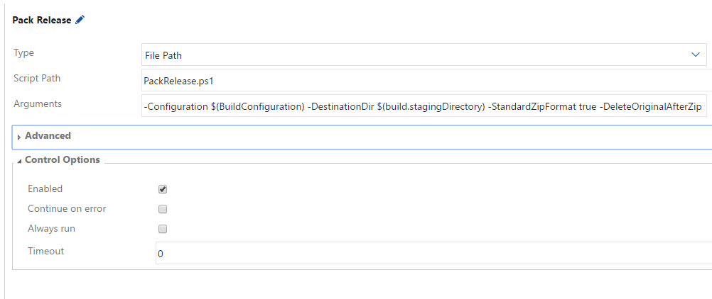
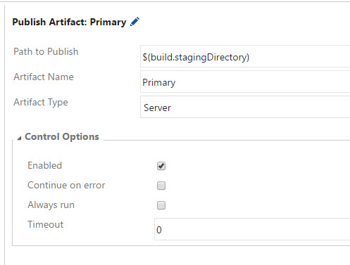
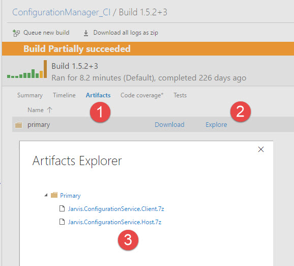
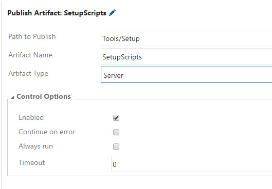
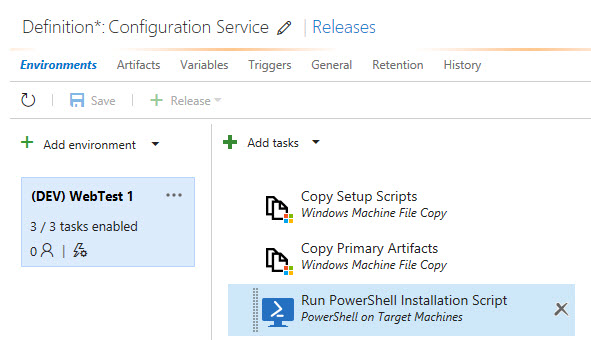
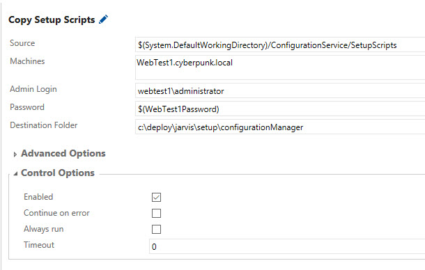
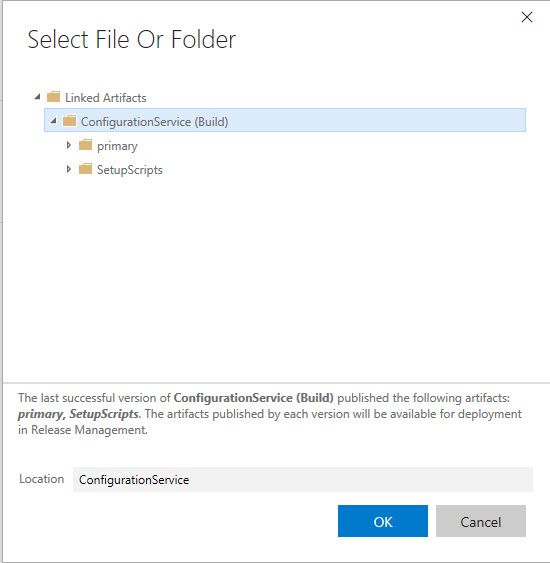
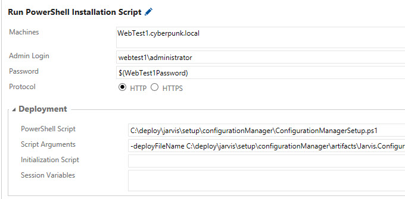
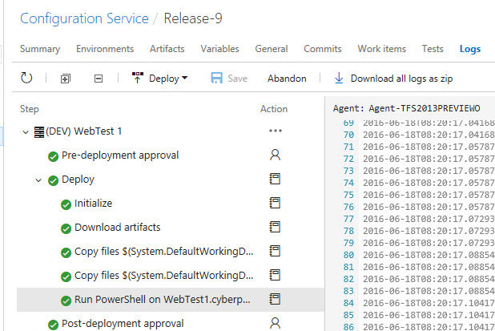

# Utilizzare Release Management con script PowerShell

#### di [Gian Maria Ricci](https://mvp.microsoft.com/en-us/PublicProfile/4025635) – Microsoft MVP

Blog inglese: <http://www.codewrecks.com/blog>

Blog Italiano ALM: <http://www.getlatestversion.it/author/alkampfer/>

Blog Italiano: <http://blogs.ugidotnet.org/rgm>

*Gennaio, 2017*

Scenario standard: rilascio di una applicazione non web
----------------------------------------------------

Quando si parla di Release Management (nella versione VSTS e TFS 2017 o superiore) l'esempio più classico è quello di una applicazione web hostata su Azure o su IIS, ma su progetti reali molto spesso è necessario **rilasciare semplici applicazioni di tipo Console o Desktop**. 

Grazie al self host offerto da Owin e Katana è anche possibile **creare una applicazione web basata su paradigma SPA (Single Page Application) che si appoggia ad API di tipo ASP.NET Web Api hostate direttamente in un applicativo Desktop**, spesso di tipo Console. Usando librerie come [TopShelf](https://github.com/Topshelf/Topshelf) si può facilmente installare e configurare l'applicativo come servizio di Windows.

Questo tipo di applicazioni richiede talvolta installazioni leggermente più complesse, che possono comunque essere automatizzate utilizzando un linguaggio di scripting come PowerShell. L'uso di tecnologie come PowerShell, al posto di adottare sistemi di packaging proprietari (come potrebbero essere quelli di Octopus o similari), permette di generare uno script di installazione che può essere eseguito in qualsiasi ambiente e non richiede nessuna dipendenza.
 
Artefatti per l'installazione
---------------------------------------

Prima di procedere alla realizzazione dello script PowerShell che effettua l'installazione del nostro applicativo bisogna chiedersi, dove lo script andrà a reperire tutti i file che costituiscono il Setup. In uno scenario standard ci si attende di avere un insieme di Dll e file .exe più alcuni file di configurazione ed eventualmente dipendenze esterne. Tralasciando queste ultime, il problema che ci si deve porre è: Dove lo script andrà a prelevare tutte queste risorse necessarie al funzionamento della nostra applicazione?

In realtà esiste una seconda domanda ancora più importante, perchè più del **dove** andare a recuperare le risorse da installare, la vera domanda è **chi produce e valida queste risorse?**. La risposta è quasi scontata: *Il Build Server*. Uno degli scopi dell'integrazione continua infatti è quella di preparare gli *artefatti per l'installazione*, in modo da rendere ripetibile il processo di installazione.

Uno dei problemi maggiori che si incontrano nei rilasci manuali è la mancata tracciabilità di ciò che viene rilasciato. Questo problema accade perchè spesso il rilascio viene effettuato compilando un progetto da una macchina di uno sviluppatore che poi **in qualche modo rilascia sull'ambiente di produzione**. I problemi di questo approccio sono 2

1. Non è possibile ricreare la build
1. Non si ha una tracciabilità di cosa è stato veramente rilasciato.

Per risolvere questi problemi è necessario che tutte le risorse che debbono essere rilasciate, chiamate semplicemente artefatti, siano generate dal server di build in maniera automatica e ripetibile.

Come primo passo consiglio la lettura di un vecchio articolo che spiega come "[Gestire la Semantic Versioning con GitFlow e GitVersion in una Build](https://msdn.microsoft.com/it-it/library/mt634392.aspx)". In questo caso la build avrà una numerazione automatica con cui generare gli artefatti, che permette di identificare immediatamente la branch che stiamo rilasciando. Il passo successivo è generare gli artefatti.

Come generare gli artefatti con PowerShell
---------------------------------------

Ho già parlato nel mio blog inglese sulla [gestione degli artefatti in una build](http://www.codewrecks.com/blog/index.php/2015/06/30/manage-artifacts-with-tfs-build-vnext/) e di base l'aspetto sicuramente più importante è la possibilità di

1. Manipolare i file dopo la build
1. Riorganizzare i file nella struttura desiderata
1. Comprimere tutto in file zip.

Molto spesso infatti l'output di una normale build o anche del task publish di MSBuild non è sufficiente per poter effettuare un rilascio. **Spesso è necessario andare a manipolare i file di configurazione, effettuando sostituzioni ed aggiungendo token, spesso anche l'organizzazione dei file non è quella desiderata**.

Per questa ragione la soluzione più semplice e conveniente è uno script PowerShell che viene invocato dalla build e che va semplicemente a generare uno o più zip contententi tutti i file necessari per il rilascio, previa manipolazione e riorganizzazione degli stessi. 

Lo script ha solitamente pochi parametri

	Param
	(
	    [String] $Configuration,
	    [String] $DestinationDir = "",
	    [Bool] $DeleteOriginalAfterZip = $true
	)

Il primo parametro indica la configurazione (debug, release, ...) il secondo specifica la cartella di destinazione ed infine il terzo permette di richiedere la cancellazione dei file di artefatti dopo che è stato effettuato lo zip. Un esempio di questo approccio può essere trovato in questo progetto open source [https://github.com/ProximoSrl/Jarvis.ConfigurationService/blob/master/PackRelease.ps1](https://github.com/ProximoSrl/Jarvis.ConfigurationService/blob/master/PackRelease.ps1).

Come pubblicare gli artefatti in una build
---------------------------------------

Questa parte è sicuramente la più semplice, dato che in TFS / VSTS la build ha una azione che consente di allegare gli artefatti alla build prendendoli semplicemente da una cartella. **Nella build è quindi possibile richiamare lo script precedentemente realizzato e richiedere che il o i file di output vengano allegati alla build come artefatti**.

Il primo passo è quindi quello di inserire nella build una semplice azione di tipo PowerShell e configurarla per invocare lo script PackRelease.ps1, come mostrato in Figura 1.

**Figura 1:** *Configurare una azione di tipo PowerShell per andare a generare gli artefatti nella Staging Directory*

Uno degli argomenti più interessanti dello script è la DestinationDir, che viene messa pari al valore $(build.stagingDirectory), il cui valore contiene il path della cartella di *staging*, utilizzata appunto per gestire la generazione di file temporanei nella build e che viene *cancellata all'inizio di ogni build*.

A questo punto, per pubblicare effettivamente gli artefatti è sufficiente andare a configurare una azione di tipo "Publish Artifacts" come mostrato in Figura 2:

**Figura 2:** *Pubblicare tutto il contenuto della staging directory come artefatto*

In questo caso si è deciso di pubblicare tutta la cartella di staging, dato che contiene solamente i file di artefatti generati con il task precedente. Al fine di verificare che tutto sia stato configurato correttamente è sufficiente eseguire una build e dal risultato controllare che il file zip degli artefatti sia stato correttamente allegato alla build stessa.

**Figura 3:** *Esplorazione degli artefatti allegati alla build*

Come si può vedere dalla Figura 3 è sufficiente andare a selezionare il tab Artifact dalla build (1) per poi scegliere di esplorarne il contenuto (2) e verificare che tutti i file siano presenti. In questo caso i due file presenti sono lo zip della parte Host e quello della dll client, entrambi compressi in formato 7zip. L'uso o meno del formato 7zip o quello di un classico zip è una questione di preferenza, il formato 7z è solitamente migliore, ma non disponibile su tutte le macchine.

Installare da un file zip
---------------------------------------

Una volta che si hanno tutti gli artefatti in un file zip è necessario creare uno script PowerShell che, prendendo come output questo file zip ed alcuni parametri (es. la directory di installazione), installa il programma nella macchina corrente.

Per questa parte non vi sono consigli specifici, nel caso in esame il programma è una console application che viene eseguita come servizio di windows tramite TopShelf e lo script di installazione è incluso anche esso nel codice sorgente. **Ogni applicazione avrà i suoi passi specifici, ma sicuramente qualsiasi operazione può essere facilmente automatizzata con PowerShell.**

Il grande vantaggio di utilizzare PowerShell per installare il proprio programma è che si può verificare l'installazione e debuggarla tramite PowerShell ISE, rendendo molto veloce lo sviluppo degli script di installazione. Una volta che gli script sono finiti, possono essere eseguiti manualmente su più server/configurazioni e possono essere verificati sia con l'applicazione non installata oppure nel caso di upgrade.

Una volta terminata questa fase, il rilascio manuale si riduce al copiare gli artefatti nella macchina destinazione e nell'eseguire lo script PowerShell. **A questo punto l'installazione può essere automatizzata tramite TFS / VSTS Release Management**. In questo caso Release Management può automaticamente prelevare gli artefatti da una build, e dato che dovrà utilizzare gli script di installazione, anche questi ultimi sono aggiunti come artefatti nella build, sempre utilizzando il task *Publish Artifacts" configurato come mostrato in Figura 4. In questo caso si è semplicemente deciso di includere tutti i file presenti nella cartella Tools/Setup.

**Figura 4:** *Pubblicare come artifacts tutta la cartella Tools/Setup*

Tutto è ora pronto per generare una release automatica.

Creare la definizione della release in VSTS
---------------------------------------

La situazione attuale è 

1. Tutti i file necessari per l'installazione vengono automaticamente inclusi in un file zip
2. Il file zip viene allegato alla build 
3. Una serie di script PowerShell è in grado di installare l'applicativo nella macchina locale partendo dal file zip del punto 1
4. Questa serie di file script PowerShell è manutenuta e inclusa nel source control, e pubblicata come artefatto in una build.

Se tutti questi prerequisiti sono soddisfatti, creare una definizione di Release Management è decisamente semplice. Una volta creata una definizione di build vuota si può procedere selezionando il tab "artifacts" e scegliere poi la build che produce gli artefatti da installare.

**Figura 5:** *Dal tab Artifacts è possibile scegliere la/le build che producono gli artefatti*

In questo caso come si può vedere dalla Figura 5, si è scelta la build discussa precedentemente come sorgente degli artefatti. 
**Una volta scelti gli artefatti si può semplicemente andare a selezionare gli ambienti in cui si vuole effettuare il rilascio dell'applicativo.** Di base un ambiente non è altro che una serie di task che effettuano l'installazione effettiva. In questo caso molti dei task utilizzabili sono condivisi con i task delle build. Naturalmetne nel nostro caso servono solamente due task, il copia file in macchina remota e l'esecuzione di script PowerShell in macchina remota.

Per effettuare il rilascio dell'applicativo in questione i passi da effettuare sono infatti tre: 

1. Copiare nella macchina target lo zip con gli artefatti
2. Copiare nella macchina target il/i file PowerShell per installare l'applicazione
3. Lanciare lo script PowerShell nella macchina remota.

La reale comodità di questo approccio è la possibilità di verificare e creare gli script di installazione direttamente in una qualsiasi macchina per poi poterli utilizzare in modo semplice e veloce direttamente in Release Management. Tutta la definzione del rilascio è quindi rappresentata in Figura 6

**Figura 6:** *La definizione di rilascio in un ambiente di test in tre semplici steps*.

I primi due steps sono quasi identici, il loro scopo è semplicemente quello di copiare i file necessari nella macchina destinazione. In Figura 7 è ad esempio rappresentata la configurazione per il primo task, quello che effettua la copia dei file di installazione.

**Figura 7:** *Configurazione del task di copia file*.

Nella variabile SystemDefaultWorkingDirectory vengono copiati automaticamente gli artefatti che sono linkati alla release. Per semplificare il tutto, l'azione permette di configurare il parametro Source direttamente sfogliando i file degli artefatti correlati, come mostrato in Figura 8.

**Figura 8:** *Gli artefatti collegati possono essere sfogliati direttamente da Web*.

Sempre in Figura 7 si possono osservare gli altri parametri necessari, il nome della macchina dove copiare i file, le credenziali amminsitrative per copiare i file e la cartella di destinazione. **Per quanto riguarda la password da utilizzare è consigliabile inserire la password tra le variabili di release e proteggerla cosi da non renderla disponibile a chiunque abbia il permesso di editare la definizione di rilascio.**

Infine in Figura 9 viene mostrata la configurazione dell'ultimo task, che ha il compito di eseguire lo script di installazione precedentemente copiato dal primo step, passando tutti i parametri necessari.

**Figura 9:** *Configurazione del task di esecuzione script PowerShell*.

Lanciare la release e verificare i risultati
---------------------------------------

Una volta che la definizione è stata creata è sufficiente creare una nuova release e verificare che tutto venga eseguito correttamente. In Figura 10 si può notare come Release management mostri nel rilascio tutto l'output per ogni step 

**Figura 10:** *Configurazione del task di esecuzione script PowerShell*.

Come si può notare, effettuando un approccio di installazione basato su zip e script PowerShell, si ha il doppio vantaggio di rendere semplice verificare l'istallazione (basta effettuare un debug dello script con PowerShell ISE) e si può creare molto velocemente una definizione di Release con pochi semplici passi.

#### di [Gian Maria Ricci](http://mvp.microsoft.com/en-us/mvp/Gian%20Maria%20Ricci-4025635) – Microsoft MVP

Blog inglese: <http://www.codewrecks.com/blog>

Blog Italiano ALM: <http://www.getlatestversion.it/author/alkampfer/>

Blog Italiano: <http://blogs.ugidotnet.org/rgm>
