# Riscrivere la storia in Git

#### di [Gian Maria Ricci](http://mvp.microsoft.com/en-us/mvp/Gian%20Maria%20Ricci-4025635) – Microsoft MVP

Blog inglese: <http://www.codewrecks.com>

Blog Italiano ALM: <http://www.getlatestversion.it/author/alkampfer/>

Blog Italiano: <http://blogs.ugidotnet.org/rgm>

*Giugno, 2014*

Perché riscrivere
-----------------

Il primo vantaggio che si percepisce nell’uso di un source control
distribuito è la possibilità di lavorare offline, eseguire commit locali
e sincronizzare con uno o più repository in modo da condividere il
proprio lavoro solamente quando è in uno stato stabile. Git è però molto
più di questo e per evitare problemi ed utilizzarlo al meglio, è
necessario avere la piena padronanza di gestione del repository locale.
Questo eviterà problemi in futuro, soprattutto i classici problemi di
sviluppatori che sbagliando merge o rebase *sostengono di avere perso
del codice.*

Gli strumenti di questo articolo saranno quindi solamente due, la prima
è la command line di git, installabile dall’url
<http://msysgit.github.io/> il secondo è un semplice strumento di
visualizzazione utilizzato per i tutorial chiamato GitViz disponibile a
questo indirizzo <https://github.com/Readify/GitViz>.

Lo scopo del presente articolo è quello di acquisire una serie di
conoscenze e strumenti per avere il pieno controllo del proprio
repository locale, per sfruttare sempre meglio le funzionalità offerte
da Git.

Come git memorizza internamente il grafo dei commit
---------------------------------------------------

Nel corso di questo esempio verranno usati due sviluppatori fittizi,
Marco e Gianni, che lavorano in maniera concorrente su un progetto,
inizialmente composto di un solo commit. Aprendo GitViz e selezionando i
due repository, la situazione è quella rappresentata in figura.

Ovvero abbiamo un unico commit (85e6ef7 composto di un singolo file
foo.txt) in entrambi i repository. Il primo concetto di ***fondamentale
importanza è che in git tutto accade nel repository locale, non esistono
logiche “server”***. Git di base è uno strumento che permette di
eseguire snapshot dello stato di una cartella, e questa serie di
snapshot costituisce un Directed Acyclic Graph, ovvero un grafo in cui
ogni commit ha un puntatore al commit precedente e contiene l’immagine
dei file modificati. Questo grafo è contenuto nella cartella .git ed in
particolare tutti i blob dei vari file sono contenuti nella cartella
.git/objects, dove ogni file è un blob binario compresso identificato
dal suo hash SHA1. ***Al suo interno quindi git non fa altro che
memorizzare una serie di blob binari ognuno identificato con il suo SHA1
univoco. ***

Come si può vedere dalla figura il primo commit non punta a nessun altro
commit e costituisce l’inizio del grafo. Supponiamo ora che Marco
effettui una modifica al file foo.txt (aggiunta di una riga) e poi
esegua un commit locale. Ecco come si presenta il suo repository

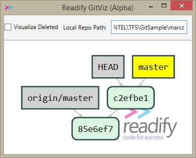
    

Come si può vedere il secondo commit ha un puntatore al primo. Questo
significa che il commit c2efbe1 punta a 85e6ef7. Git ha una serie di
comandi detti *plumbing commands* che permettono di effettuare
operazioni a basso livello, ad esempio scrivendo ***git cat-file –p
c2efbe1*** viene richiesta la visualizzazione dell’esatto contenuto del
commit specificato.

    

Un commit non è altro quindi che un ***file di testo*** in cui
all’interno è memorizzato come prima informazione lo SHA1 del blob che
contiene la struttura della directory in un oggetto tree (un tree è un
file di testo che contiene riferimenti ad altri tree e file e
rappresenta l’alberatura della directory). Successivamente viene
memorizzato lo SHA1 del parent commit seguito da informazioni
sull’autore e dal commento.

Dato che ogni commit punta al commit precedente, la domanda che ci
facciamo è: *chi punta l’ultimo commit per poter quindi lavorare con il
grafo?* Se osservate la figura precedente noterete che l’ultimo commit è
infatti “puntato” da due entità: HEAD e master. Tra i due, *master* è
quello che permette di “raggiungere” il grafo di oggetti. Questo
puntatore è quindi detto *ref* perché costituisce appunto un riferimento
ad un Commit.

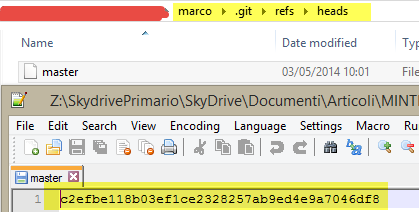

Come potete vedere, nella cartella .git (dove risiede tutto il
repository git) esiste una cartella chiamata refs, dove vengono
memorizzati tutti i ref. In questa cartella esiste una sottocartella
chiamata heads, che memorizza tutti i puntatori alle “teste” del grafo,
ovvero agli ultimi commit di ogni ramo (branch) del grafo. Dentro questa
cartella troviamo una serie di file testo che rappresentano infine le
refs (o riferimenti). In un repository semplice con una sola branch
(chiamata *master)*, si troverà solamente il ref *master* che contiene
l’hash del commit più recente.

***Se avete metabolizzato questo concetto l’apprendimento e l’uso di git
saranno entrambi molto più semplici***. Conoscere alcuni degli aspetti
interni di Git è infatti molto utile per poter comprendere come usare al
meglio le sue funzionalità.

Ricapitolando:

1.  Git è uno strumento per creare snapshot o immagini dello stato di
    una cartella
2.  Ogni snapshot/immagine è un commit, ovvero una serie di blob binari
    che contiene i riferimenti ai file modificati rispetto al
    commit precedente. Per questo ogni commit memorizza un puntatore al
    commit precedente.
3.  Il risultato è un grafo di commit dove ogni commit punta al
    precedente
4.  Per identificare l’ultimo commit di ogni ramo del grafo, git
    memorizza nella cartella .git/refs/heads un file che contiene l0
    SHA1 dell’ultimo commit di ogni ramo.

Amending
--------

Armati della conoscenza che si è acquisita con il paragrafo precedente,
iniziamo ora a presentare situazioni pratiche che richiedono la
“riscrittura della storia” del repository locale.

***Supponiamo che Marco voglia modificare qualcosa dell’ultimo commit,
ad esempio il commento, oppure aggiungere un altro file perché magari si
era dimenticato di includerlo.***

In git la modifica dell’ultimo commit viene chiamata *amending* e può
essere effettuata semplicemente aggiungendo l’opzione --amend al comando
commit. Supponiamo di partire da questo log.

Ora Marco vuole cambiare il commento dell’ultimo commit, per questo
esegue il seguente comando

> git commit -m "Added a line to Foo.txt because I needed it" --amend

A questo punto il log si presenta in questo modo.

**_È di fondamentale importanza notare che l’id del commit è cambiato_**
ed ora vale dd465ee134… Se avete metabolizzato il primo paragrafo,
questo fatto è naturale. Cambiando infatti il commento, il contenuto del
file che rappresenta il commit è cambiato e quindi ha uno SHA1
differente dal precedente. Questo significa che il vecchio commit
c2efbe, ora non è più presente ed è stato sostituito con un nuovo
commit.

**_Abbiamo quindi riscritto la storia, ovvero abbiamo cambiato il grafo
sostituendo ad un nodo un altro con differente contenuto_**. **_È DI
FONDAMENTALE IMPORTANZA CAPIRE CHE LA RISCRITTURA DEL GRAFO LOCALE NON
DEVE MAI E POI MAI ESSERE EFFETTUATA SU DEI COMMIT DEI QUALI SI È GIA
EFFETTUATO IL PUSH SU UN REMOTE_**.

Un remote non è altro infatti che un “repository remoto nel quale
copiare i propri commit per condividere il proprio grafo con altre
persone”. Questo significa che se si esegue una riscrittura di commit
già inviati ad un remote, quando si andrà ad effettuare push questo
verrà rifiutato, perché il grafo non è più compatibile. Avrete comunque
l’opzione **_--force_** che permette di riscrivere forzatamente la
storia anche nel remote, ma questo genererà ogni sorta di problemi alle
altre persone che già avevano recuperato i vecchi commit, ***per cui è
un’operazione da non fare mai.***

Con l’amending, è possibile non solamente riscrivere il commento, ma ad
esempio aggiungere un file che magari si era dimenticato di includere
nel commit precedente, oppure fare una piccola modifica e decidere di
includerla nel commit precedente senza creare un altro. Supponiamo di
avere un nuovo file chiamato bar.txt che si è dimenticato di aggiungere,
ecco come procedere.

> git add bar.txt
> git commit --amend -m "Added a line to Foo.txt because I needed it and added bar.txt"

Come si può vedere è sufficiente procedere normalmente aggiungendo file
alla staging area con il comando *git add* per poi procedere ad un
normalissimo commit usando l’opzione --amend.

*In pratica l’opzione --amend non fa altro che riscrivere la storia
fondendo le modifiche attuali e quelle dell’ultimo commit in un unico
commit.*

Ecco cosa restituisce il log dopo questa ulteriore operazione.

Ancora una volta si è riscritta la storia.

Commit irraggiungibili
----------------------

Cosa succede internamente quando viene fatto un amending? A livello
macroscopico, git prende il contenuto dell’ultimo commit, esegue le
modifiche al tree includendo tutti gli eventuali ulteriori file inclusi
con *git add*, cambia il commento, ricrea il nuovo file per il commit e
lo memorizza in un nuovo blob in .git/objects. A questo punto modifica
il contenuto della ref attuale, nella cartella .git/refs/heads e ne
cambia il contenuto affinché punti a questo nuovo commit.

**_Di base quindi il commit precedente non viene cancellato,
semplicemente ne viene creato un altro che internamente punta allo
stesso padre, il puntatore attivo (in questo caso master) viene poi
aggiornato affinché punti a questo nuovo commit. In questo modo il
vecchio commit non è ora più puntato da nessuna ref e a tutti gli
effetti è irraggiungibile._**

Se in gitviz si abilita il “visualize deleted” (opzione presente se
usate gitviz dalla mia fork su github, altrimenti nella versione base è
sempre abilitato) potrete notare che i vecchi commit riscritti sono in
effetti ancora presenti.

In questo caso il dd465ee ed il c2efbe1 sono mostrati in modo
traslucido, ad indicare appunto che sono *irraggiungibili (unreachable
commits)*. Per avere la lista di tutti i commit irraggiungibili si può
usare il comando

> git fsck –lost-found

In questo caso avrete la lista che mostrerà solamente lo SHA1 degli
oggetti non più raggiungibili, assieme al loro tipo. Nel nostro esempio
infatti abbiamo due commit, quelli appunto che hanno subito amending.

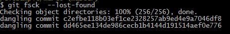

Un altro comando ancora più utile in queste situazione è *git reflog*
che non fa altro che listare gli ultimi commit a cui la HEAD (ovvero il
contenuto attuale della cartella) ha puntato in passato. La HEAD infatti
è un puntatore speciale che indica il commit a cui si riferisce
l’attuale contenuto della cartella. Di base questo puntatore punta a
*master*, per cui quando master viene aggiornato si aggiorna anche la
HEAD di conseguenza.

Grazie alla lista di tutti i commit a cui la HEAD ha puntato in
precedenza, abbiamo la lista cronologica dei commit su cui abbiamo
lavorato. Questa lista naturalmente comprende anche i commit che nel
frattempo sono diventati irraggiungibili.

Questo concetto è fondamentale, perché ci assicura che in git *non
esiste modo di perdere il contenuto di un commit con una riscrittura
della storia.* Questa affermazione è vera per un certo numero di giorni,
dopo il quale, se il repository cresce git potrebbe andare a rimuovere
tutti i commit irraggiungibili, per liberare spazio su disco e fare
pulizia del file system.

Annullare una merge
-------------------

Supponiamo che Marco abbia fatto push del suo commit, e nel frattempo
Gianni abbia anche lui modificato il file foo.txt ed abbia fatto un
commit locale. La situazione è quella mostrata in figura, con marco
sulla sinistra e Gianni sulla destra.

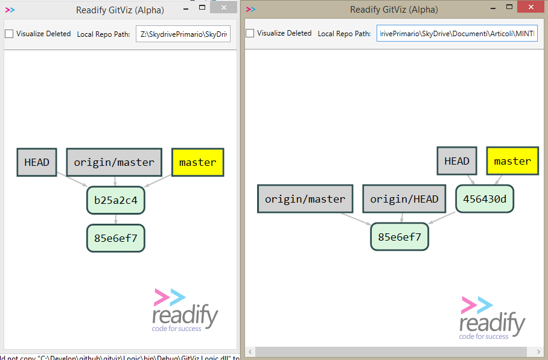

Entrambi hanno effettuato un commit dopo 85e6ef7, Marco (sulla sinistra)
ha già effettuato il push verso il remote origin. Come mostrato da
gitwiz il suo repository è completamente sincronizzato dato che
origin/master punta allo stesso commit della master locale. Gianni
invece deve ancora sincronizzare, ma ecco cosa accade quando tenta di
effettuare un push

Due sono gli aspetti interessanti della figura precedente. Il primo è il
messaggio di errore che spiega la ragione per cui non è possibile fare
push della branch master, nel remote esistono commit non presenti
localmente. Il secondo aspetto interessante è che per questo esempio ho
utilizzato come remote una semplice cartella locale, come potete vedere
dal messaggio evidenziato dalla freccia.

***Questo aspetto è utile per spiegare che non esiste nessuna logica
“server”, un remote non è altro che un posto dove “spostare il proprio
grafo” affinché sia disponibile ad altre persone (downstream). Una
cartella sul proprio computer è più che sufficiente allo scopo, cosi
come una cartella condivisa in rete. Ricordate quindi che in git non
esiste un concetto di “Server”. ***

Il messaggio di errore è semplice, prima di spostare tutti i blob locali
relativi ai nuovi commit, git verifica che nel remote il grafo sia
compatibile, ovvero che tutti i commit che sono attualmente
raggiungibili dalla branch corrente di cui si vuole effettuare il push
(la master), siano presenti anche in locale. Qualora questa condizione
non sia verificata, significa che altri hanno effettuato push, per cui è
necessario procedere al recupero in locale di questi nuovi commit ed
alla risoluzione ***sempre in locale*** delle eventuali incompatibilità.
***Anche in questo caso affrontiamo un altro concetto fondamentale di
git: ogni operazione: rebase, merge, risoluzione di conflitti etc non
può che avvenire nel repository locale.***

A questo punto invece di fare un git pull, che non è altro che un git
fetch seguito da un git merge origin/master, procediamo per passi in
modo da comprendere a pieno come si procede per la risoluzione di un
conflitto. Gianni effettua un

> git fetch

per recuperare in locale i commit “nuovi” che sono stati nel frattempo
inviati ad origin da altri. Gitviz mostra egregiamente cosa è successo
(come al solito a sinistra troviamo il grafo di Marco e a destra quello
di Gianni dopo che ha effettuato il fetch).

In questo caso il commit b25a2cb, che era stato creato da Marco e di cui
era stato effettuato il push in origin, è stato scaricato in locale da
Gianni, e come si può vedere dalla figura sopra, viene puntato da un
puntatore chiamato origin/master. Anche in questo caso, affinché il ramo
del grafo sia raggiungibile si ha la necessità di un puntatore che
rappresenta la copia del puntatore master di origin.

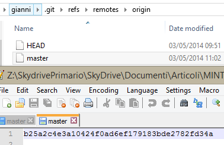

Anche origin/master è un file contenuto nella cartella
.git/refs/remotes/origin chiamato master ed il cui contenuto è lo SHA1
del commit puntato. A questo punto è necessario risolvere il conflitto,
per cui Gianni può semplicemente richiedere un semplice merge

> Git merge origin/master

Con questo comando si è semplicemente richiesto a git di effettuare il
merge tra la branch attuale (master) quella del remote (origin/master).
Git esamina quindi il grafo, trova il nodo comune da cui entrambi i rami
del grafo sono partiti, analizza tutte le differenze ed effettua il
merge.

Se non ci sono conflitti, ovvero file modificati da entrambi il merge è
automatico, ma in questo caso si è verificato un conflitto, per cui ecco
cosa git risponde a Gianni.

In questo caso si hanno dei file per cui esiste conflitto, quindi git
richiede all’utente di

1.  Risolvere i conflitti
2.  Effettuare il commit dei file una volta che i conflitti sono risolti

Il merge è una operazione delicata, perché è necessario andare a
integrare modifiche di due o più persone. Il comando *git* *status*
permette di visualizzare i file che hanno generato conflitto.

Il file bar.txt è quello da Marco e chiaramente non ha generato alcun
conflitto. Il file foo.txt invece presenta come stato “both modified” ad
indicare appunto che è stato modificato da entrambi gli sviluppatori. Se
si visualizza il contenuto del file si possono vedere le modifiche con
la sintassi standard usata per avere la diff inline.

Ora si deve editare tutti i file che presentano conflitti, risolverli e
salvare le modifiche risultanti, includerli nella staging area ed infine
effettuare il commit di merge. Naturalmente il merge dei file viene
fatto da strumenti grafici, per cui basta chiedere a git di effettuare
il merge con uno strumento GUI

> Git mergetool

Ora git richiederà quale strumento di risoluzione utilizzare (si può
usare qualsiasi strumento, anche Visual Studio [come descritto
qui](http://www.codewrecks.com/blog/index.php/2013/03/19/how-to-configure-diff-and-merge-tool-in-visual-studio-git-tools/)).
In questo esempio non avendo configurato nulla, git tenta di usare
alcuni tra gli strumenti più comuni come tortoisemerge, emerge o vidiff

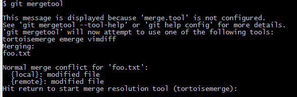

Nel mio sistema ho tortoisemerge e questa è quindi l’unica opzione che
mi viene presentata. In questo caso si è modificata una sola linea, per
cui il merge è semplice, ma in situazioni reali, spesso si ha a che fare
con merge complicate. *Supponiamo che Gianni sbagli ad effettuare il
merge, non includendo le sue modifiche*. Se pensiamo a progetti in cui
vi sono grandi file la possibilità di sbagliare esiste.

Una volta uscito dallo strumento di merge Gianni ha questa situazione

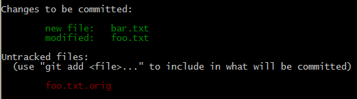
    

A questo punto si effettua un commit scrivendo

> Git commit -m “merge del fix bug 42”

È fondamentale capire che ancora si sta lavorando nel repository locale,
come visibile da GitViz

Quello che si è fatto è creare un nuovo commit 992c109 che contiene il
risultato del merge tra il ramo master locale e quello di origin che nel
frattempo era stato cambiato. Se si visualizza il contenuto binario di
questo commit si ha

> Git cat-file -p 992c109

È importante notare che questo commit ha due parent, dato che
rappresenta un commit di merge. A questo punto Gianni nota con sgomento
che ha sbagliato ad effettuare il merge, perché non vede le righe da lui
inserite:

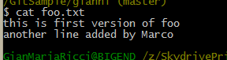

In questo caso Gianni può procedere in due modi, il primo è usare
l’amend come visto precedentemente. I passi sono

1)  Capire cosa ha sbagliato nel merge effettuando il diff dei file
    errati nelle varie branch
2)  Correggere i file errati e verificare che tutto sia ok
3)  Aggiungere tutti i file corretti con git add
4)  Effettuare un commit --amend con lo stesso commento del commit
    precedente

Ecco come si presenterebbe il grafo locale dopo questa serie di
operazioni.

In questo caso se si effettua un amend del commit di merge, il nuovo
commit sarà nuovamente un commit di merge.

*In realtà l’amend di un merge è fattibile solamente se gli errori in
fase di merge sono semplici e si sa già dove cercare*. Talvolta può
essere più semplice annullare completamente tutte le operazioni di merge
e ricominciare daccapo. In questo caso ricordiamo come si presentava il
grafo appena prima del merge (sinistra) e dopo il merge (destra)

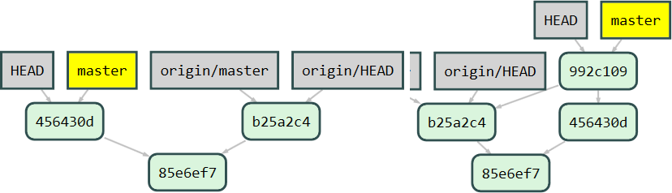

In pratica il merge ha semplicemente creato il commit 992c109 che
contiene appunto le modifiche necessarie ad integrare le due branch. Se
questo commit è sbagliato e si vuole effettuare nuovamente il merge, è
sufficiente far sì che il puntatore master torni a puntare al commit
456430d (la vecchia HEAD locale prima della merge). Cambiare il
contenuto del ref corrente può essere fatto con il comando reset –hard
come visibile nella figura seguente.

Il comando reset con l’opzione --hard seguito dallo SHA1 di un commit
non fa altro che andare a cambiare il contenuto del ref attuale (in
questo caso master).

Come si può vedere la situazione è ora identica a quella che si aveva
prima del merge, con l’unica differenza di avere un commit
irraggiungibile che rappresenta il primo tentativo di merge (992c109).
Ora si può nuovamente effettuare un ulteriore tentativo di merge sempre
con il comando

> git merge origin/master

Una volta terminata la merge ecco come si presenta il grafo

Supponiamo che Gianni non sia nemmeno questa volta convinto del
risultato della merge, situazione che può avvenire con merge difficili.
Non solo, Gianni sospetta che il tentativo precedente fosse addirittura
migliore del nuovo, in questo caso può usare il comando git reset –hard
per tornare al merge precedente.

> git reset --hard 992c109

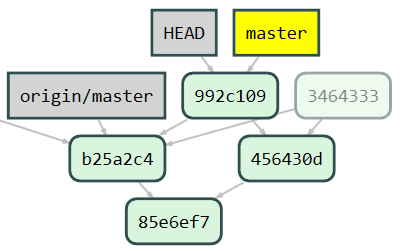

Se si comprende il funzionamento interno di git e si metabolizza la
gestione del grafo, ci si rende conto che le possibilità offerte da git
sono cosi avanzate che, una volta entrati nell’ottica giusta, non si può
più tornare indietro. In questo caso Gianni ha la possibilità di fare
quanti tentativi vuole, con la certezza che ogni volta può azzerare,
ripetere il merge, o recuperare tentativi precedenti.

Creare puntatori
----------------

Supponiamo che Gianni sia veramente in difficoltà, ha tentato due
differenti merge, ma nessuno dei due è convincente, a questo punto la
soluzione migliore è chiedere l’aiuto di un altro membro del team
(probabilmente Marco che ha effettuato le modifiche di cui sta facendo
il merge). In questo caso Gianni vuole mostrare entrambi i tentativi di
merge per fare una revisione di codice, per questo è conveniente creare
due branch che puntano ad entrambi i tentativi.

Il comando branch, in git viene usato per creare un nuovo ref, creando a
tutti gli effetti un branch del grafo. Nella figura seguente vengono
mostrati i due comandi che esegue Gianni per creare dei ref ai due
tentativi di merge.

Ecco il risultato

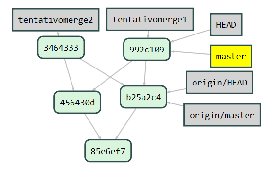

Avere due branch (puntatori refs) che puntano ai due tentativi di merge
permette di andare dall’uno all’altro in modo semplice con git checkout
nomebranch (es git checkout tentativomerge1). In questo modo Gianni può
switchare velocemente tra i due tentativi di branch oppure usare degli
strumenti grafici per vedere le differenze tra i due tentativi. In una
situazione reale il progetto è aperto in una IDE come Visual Studio, e
cambiando le branch si possono vedere le effettive modifiche fatte nei
due tentativi di merge.

Con un comando git diff tentativomerge1 tentativomerge2 si possono anche
visualizzare le differenze tra i due tentativi di merge. Questo modo di
procedere è disponibile solamente con un distribuito, la cui storia non
è lineare ma è un grafo. In questo caso infatti si ha ad esempio la
possibilità, in una merge difficile, di procedere per tentativi e poter
tenere tutti i tentativi disponibili per ragionare sulla merge stessa.

Supponiamo ora che Marco suggerisca a Gianni che il tentativo 2 è il più
corretto, ma che sia necessario effettuare una piccola modifica.

1)  Ci si sposta su quel tentativo con git checkout tentativomerge2
2)  Marco effettua le modifiche che correggono il tentativo di merge di
    Gianni
3)  Si aggiungono i file modificati alla staging area con git add
4)  Si fa un amend del commit di merge con git commit --amend

Ecco come si presenta la situazione

A questo punto abbiamo un terzo commit di merge (e70131c) che è il
risultato del tentativo2 di Gianni a cui Marco ha aggiunto le sue fix.
Il commit precedentemente puntato da tentativomerge2 (3464333) è ora
irraggiungibile, mentre la branch tentativomerge1 è ancora disponibile.
A questo punto si può fare pulizia.

1.  Ci si sposta sulla branch master con git checkout master. Dato che ora tentativomerge2 punta al commit di merge corretto, spostiamo la master su di esso con git reset --hard tentativomerge2 (ecco come si presenta il grafo ora) 

2.  A questo punto le due branch tentativo non sono più necessarie e si
    cancellano con git branch -d tentativomerge2 seguito da un git
    branch -D tentativomerge2.

Nel punto 3 per cancellare la tentativomerge2 si è usata l’opzione d
minuscola, perché il commit puntato da essa è puntato anche da master;
per cancellare tentativomerge1 si deve usare invece la D maiuscola,
per indicare a git che si è sicuri di cancellare una branch il cui
commit (992c109) è puntato solamente da lei e diventerà quindi irraggiungibile.

Chiaramente siete coscienti che anche usando -D maiuscolo per cancellare una branch di cui non si è effettuata la merge, non si sta
perdendo nulla, perché i commit sono sempre tutti nel grafo, solamente diventeranno irraggiungibili.

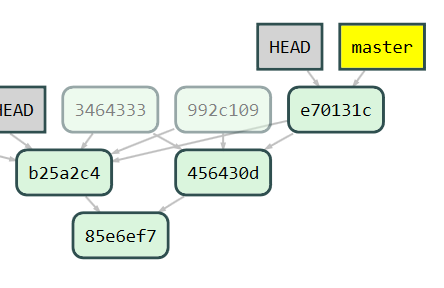

Push di commit con storia riscritta
-----------------------------------

A questo punto Gianni può tentare il push, che riuscirà se nel frattempo
nessun altro ha effettuato push di ulteriori modifiche su origin.

    

Se ora Gianni effettua una nuova riscrittura della storia, supponiamo
che voglia cambiare semplicemente il commento del commit di merge con un
amend. A questo punto se tenta un push riceverà un errore

    

Il perché dovrebbe essere oramai chiaro, avendo fatto un amend
dell’ultimo commit il suo grafo è ora cambiato, ed il commit che ha
subito amend (e70131c) in questo caso non diventa irraggiungibile,
perché avendo subito push, ora è puntato dalla origin/master. In
sostanza ora Gianni ha creato una situazione in cui il suo commit
risultato dell’amend sta facendo conflitto con il commit prima che fosse
avvenuto l’amend.

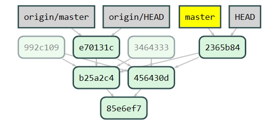

In questo caso l’unico modo per Gianni di continuare a lavorare è

1.  Fare un reset hard della master, riportandola ad origin/master,
    d’altronde ha violato una delle regole d’oro di git: **_mai fare un
    rewrite di history per commit di cui si è fatto push._**
2.  Alternativamente può effettuare una nuova merge tra il vecchio
    commit di merge e quello che ha subito l’amend del solo commento.

L’opzione 2 non fa altro che complicare ulteriormente il repository, per
cui ricordate, per la terza volta vi cito la regola d’oro di git: ***mai
effettuare rewrite di commit di cui si è fatto push***

Questa regola ha un corollario che suggerisce, soprattutto dopo merge
complesse, di effettuare un buon numero di test e verifiche per essere
sicuri che la propria merge sia corretta, prima di effettuare push. Una
volta effettuato il push infatti, modificare il merge diventa una
operazione non piu banale.

#### di [Gian Maria Ricci](http://mvp.microsoft.com/en-us/mvp/Gian%20Maria%20Ricci-4025635) – Microsoft MVP

Blog inglese: <http://www.codewrecks.com>

Blog Italiano ALM: <http://www.getlatestversion.it/author/alkampfer/>

Blog Italiano: <http://blogs.ugidotnet.org/rgm>
