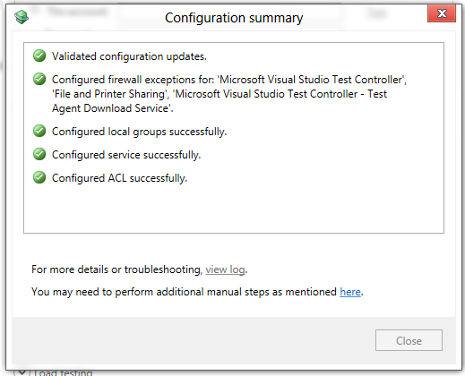
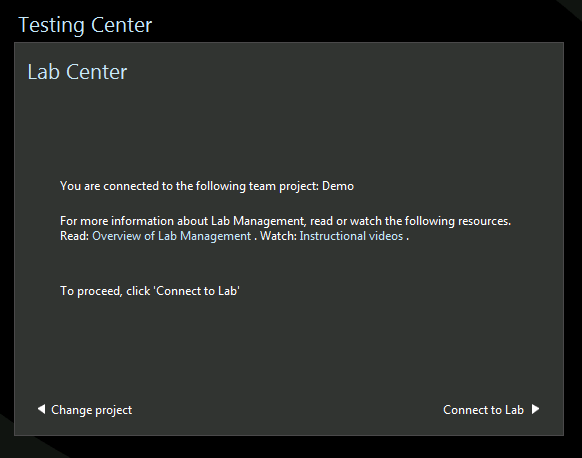
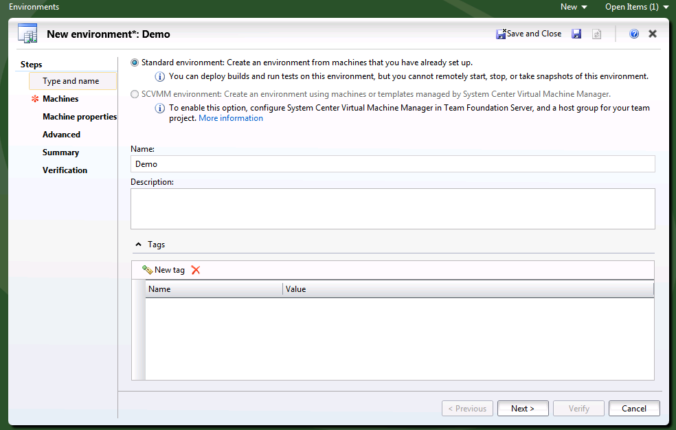
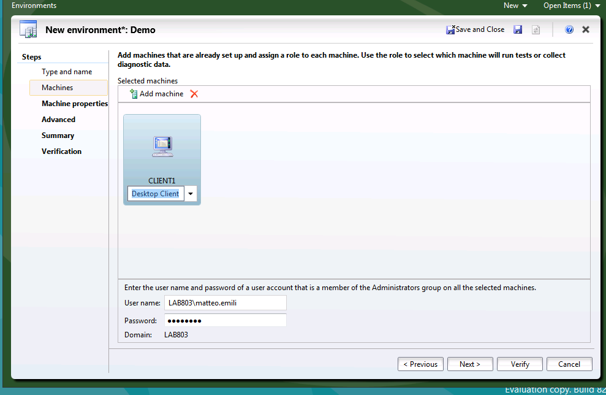
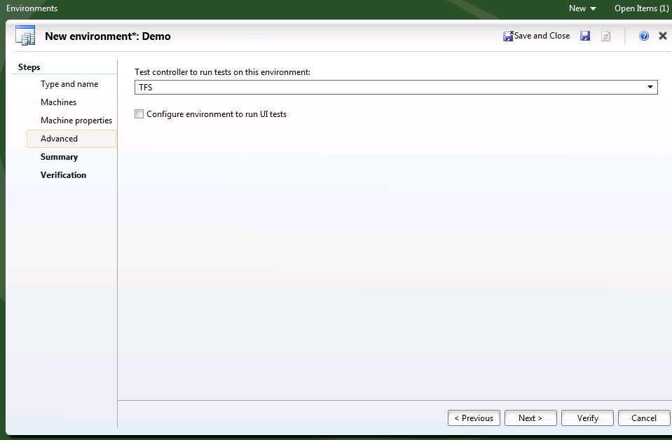
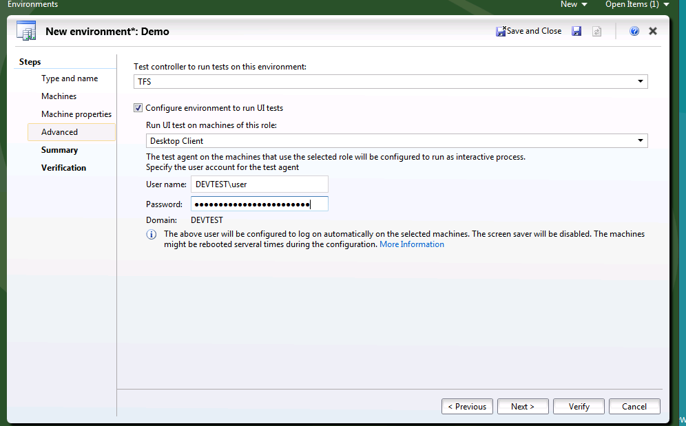
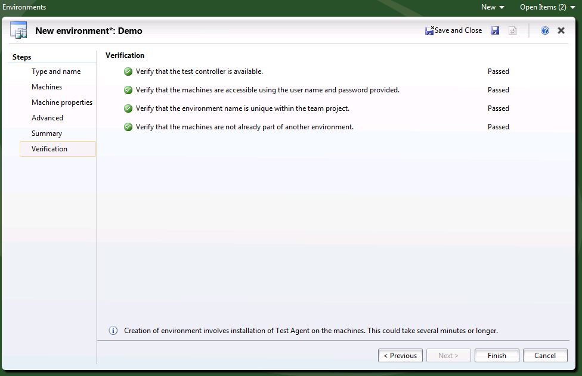
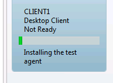

#### di [Matteo Emili](https://mvp.support.microsoft.com/profile/Matteo.Emili) - Microsoft MVP

1.  {width="0.5938331146106737in"
    height="0.9376312335958005in"}

*Giugno, 2012*

Uno dei limiti della versione 2010 del Team Lab Management era il
supporto alle macchine non Hyper-V. Si potevano utilizzare macchine
fisiche ma l’esperienza finale non era delle migliori.

Con la versione 2012 il Team Lab Management si arricchisce di una nuova
funzionalità che permette di utilizzare qualunque tipo di macchina non
Hyper-V (quindi fisica o virtuale di altri vendor) con un’esperienza
complessiva molto simile a quella che si avrebbe con l’uso di macchine
virtuali sull’hypervisor di Microsoft, con il vantaggio di non
richiedere un’implementazione di System Center Virtual Machine Manager
per gestirle.

In questo modo anche piccole realtà di sviluppo software possono
affacciarsi a strumenti di Quality Assurance basati su laboratori,
oppure realtà con un datacenter virtuale (ma non Hyper-V) in produzione
che vuole inserire attività di QA su lab senza modificare la propria
infrastruttura.

Installazione del Test Controller
---------------------------------

Per implementare uno Standard Environment abbiamo necessariamente
bisogno di un Test Controller installato nella Team Build. I motivi sono
molteplici: deve gestire il deploy degli agent di test e lab sulle
macchine, oltre a verificare l’esecuzione dei test all’interno del
laboratorio stesso.

Configurazione del Test Controller
----------------------------------

La configurazione necessaria per il Test Controller di uno Standard
Environment è estremamente intuitiva: è sufficiente indicare la Team
Project Collection di riferimento. Ovviamente è possibile aggiungere
altre informazioni come la configurazione per il Load Testing, ma non è
strettamente necessario ai fini dello Standard Environment

1.  {width="3.2220297462817147in"
    height="3.6226410761154857in"}

    {width="3.2924529746281714in"
    height="2.614897200349956in"}

    {width="3.358490813648294in"
    height="2.719498031496063in"}

Creazione di uno Standard Environment
-------------------------------------

Ora posso creare uno Standard Environment. La configurazione di macchine
supportata è con macchine facenti parte di un dominio Active Directory,
ma è possibile utilizzare macchine in Workgroup avvalendosi di
cosiddetti Shadow Accounts, ossia account identici sulle diverse
macchine, in modo tale che NETLOGON possa avere una relazione di trust
con il Test Controller e non faccia distinzioni fra le macchine
differenti.

Per creare l’ambiente si deve utilizzare il Microsoft Test Manager, e
dopo la connessione al Team Foundation Server, si deve selezionare il
Lab Center:

1.  {width="6.065972222222222in"
    height="4.773611111111111in"}

Dunque mi connetto al Lab e posso creare la macchina, cliccando su New.

1.  {width="1.5in"
    height="1.3868055555555556in"}

    {width="4.839583333333334in"
    height="3.084722222222222in"}\
    Oltre al nome della macchina, se necessario posso inserire anche dei
    tag ad identificarla e il ruolo che dovrà ricoprire.

Inserisco poi la macchina, con il suo nome, il ruolo che ricoprirà e le
credenziali dell’utente che verrà utilizzato. Questo deve avere permessi
amministrativi sulla macchina di test.

1.  {width="6.5in"
    height="4.226388888888889in"}

Il ruolo è indicativo di ciò che la macchina svolgerà. Ho a disposizione
i seguenti ruoli:

-   Desktop Client

-   Web Client

-   Server

-   Web Server

-   Database Server

-   Domain Controller

A seguire si devono configurare le capability di test, ossia la capacità
della macchina di eseguire test automatici (indicando il Test
Controller) oppure anche Coded UI Test.

1.  {width="5.905555555555556in"
    height="3.8680555555555554in"}

Per configurare la macchina per l’esecuzione di Coded UI Test è
necessario inserire l’utenza che avrà accesso interattivo al desktop
della macchina.

1.  {width="6.5in"
    height="4.028472222222222in"}

Infine dopo la verifica dei prerequisiti si procede con la
configurazione.

1.  {width="6.5in"
    height="4.197916666666667in"}

Durante la fase di deploy posso notare come l’installazione degli agent
sia totalmente automatica.

1.  {width="2.0097222222222224in"
    height="1.4715277777777778in"}

    {width="6.5in"
    height="4.065972222222222in"}

Una volta terminato il deploy dei componenti necessari a Test Manager la
macchina è pronta per essere utilizzata.

#### di [Matteo Emili](https://mvp.support.microsoft.com/profile/Matteo.Emili) - Microsoft MVP

1.  *Altri articoli di Matteo Emili nella Libreria*
    {width="0.1771084864391951in"
    height="0.1771084864391951in"}

