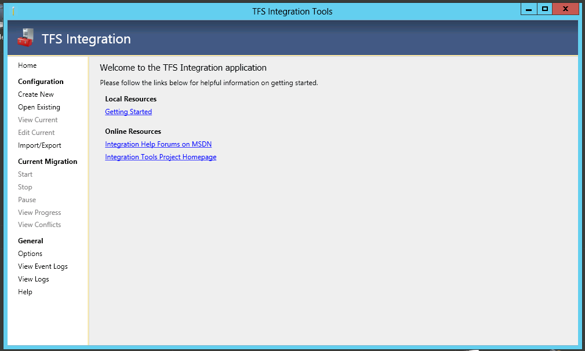
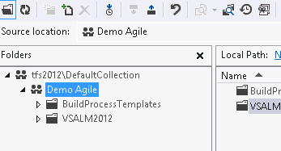
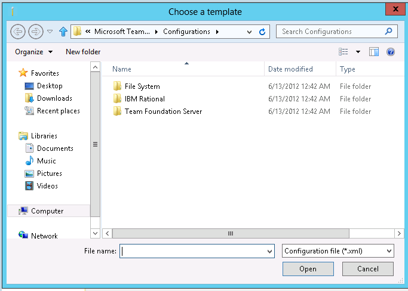
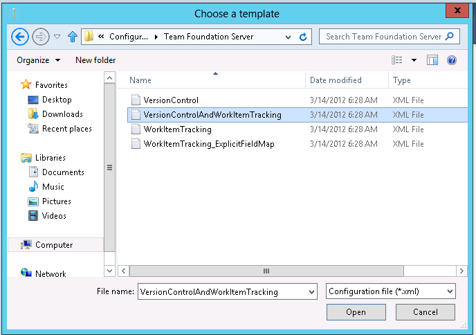
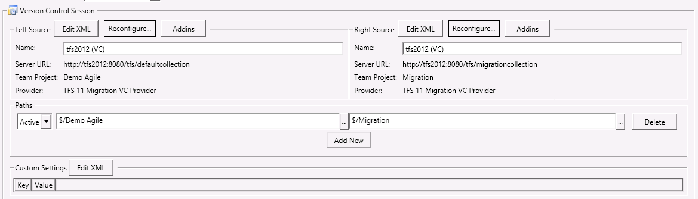
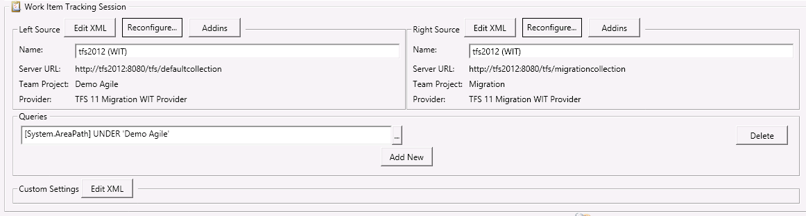
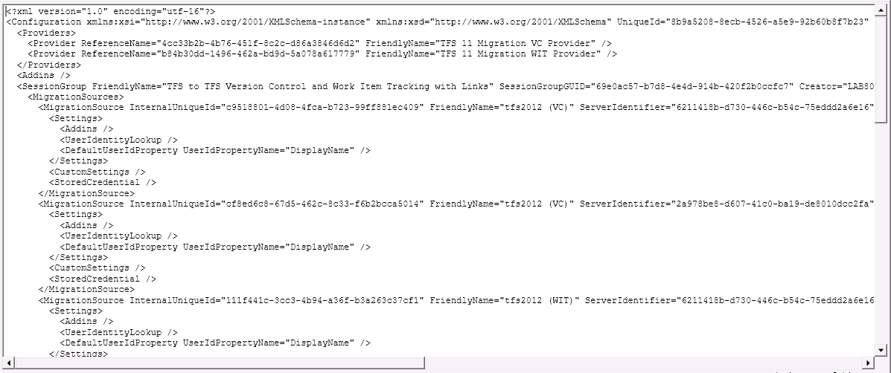

#### di [Matteo Emili](https://mvp.support.microsoft.com/profile/Matteo.Emili) - Microsoft MVP

1.  {width="0.5938331146106737in"
    height="0.9376312335958005in"}

*Giugno, 2012*

Fino ad oggi integrare Team Foundation Server con altri strumenti di ALM
(spaziando da CVS fino ad altri TFS) era estremamente complesso,
necessitava di codice custom e, in definitiva, era un gran dispendio di
tempo ed energie che difficilmente sarebbe stato poi riutilizzabile in
altri scenari.

Sollevato il problema, quelli che erano ieri i Visual Studio Team System
Rangers (oggi Visual Studio ALM Rangers, un gruppo di persone
selezionate dalle community, dai Microsoft Consulting Services, e dai
team di sviluppo) hanno avviato lo sviluppo di una soluzione.\
E questa soluzione si chiama Team Foundation Server Integration
Platform.

Si tratta di uno strumento molto potente, ed inoltre è un progetto
opensource (ospitato all’indirizzo
<http://tfsintegration.codeplex.com>). Essendo l’unico strumento di
migrazione supportato da Microsoft, l’ultima versione con supporto è
disponibile in Visual Studio Gallery
(<http://visualstudiogallery.msdn.microsoft.com/eb77e739-c98c-4e36-9ead-fa115b27fefe>),
mentre su CodePlex si trovano sia i sorgenti che tutte le beta e la
documentazione.

Vediamo cosa troviamo, una volta installato:

1.  I tools

    Il TFS Migration Service

    L’SDK

    Una serie di adapter già pronti (altri sono scaricabili, ed il
    modello a plugin permette di scriverne in tempi relativamente brevi)

    Tantissima documentazione

    1.  

Nella versione attuale (Marzo 2012, stabile) il tool principale (dal
quale si effettua il 99% della configurazione e dell’esecuzione) è già
comprensivo della GUI! Per chi ha lavorato con le precedenti Alpha e
Beta, sapeva che non esisteva nulla di tutto ciò, e si utilizzava
esclusivamente a linea di comando.

1.  {width="6.5in"
    height="3.904166666666667in"}

Architettura
------------

1.  {width="6.5in" height="5.025in"}

Gli attori sono tre: l’Adapter, il Synchronization Orchestrator e la
Pipeline.

Il primo è un oggetto che permette di interpretare la sorgente o la
destinazione, ed è quello che permette il dialogo fra la Pipeline ed il
server.

La Pipeline è il cuore di tutto, e contiene il Synchronization
Orchestrator.

Il Synchronization Orchestrator è l’oggetto che coordina i tre motori
interni alla Pipeline.

C’è anche una comparsa, nell’ombra: un database.

Ora, cosa succede quando andiamo a fare una migrazione (per ora non ci
addentriamo nelle configurazioni, rimaniamo nel teorico)?

Premettendo che tutto gira sotto la direzione del Synchronization
Orchestrator, la prima cosa che accade è la generazione dei delta
(relazioni comprese) della sorgente e della destinazione da parte
dell’Analysis Engine. In caso di conflitti, il Conflict Resolution
Engine li solleva e risolve automaticamente ove possibile (nel caso in
cui non sia possibile, interviene l’utente). Una volta risolti, vengono
salvati nel database tutti i dati e trasferiti dal Migration Engine.

Configurazioni
--------------

Le configurazioni possibili sono molteplici:

1.  One-way migration, ossia la cosiddetta “snapshot migration”
    (migrazione totale ad un preciso istante temporale)

    Two-way sync (sincronizzazione bidirezionale che avviene magari per
    allineare un TFS appena installato a quello già esistente,
    ad esempio)

    Custom

    1.  

Ed è con la configurazione Custom che si aprono gli scenari più ampi in
materia di integrazione. Perchè è possibile specificare oltre alla
direzione (unidirezionale o bidirezionale) la frequenza.

La frequenza può essere:

1.  One Time

    Continuous Manual

    Continuous Automatic

    1.  

Quest’ultima ci fa capire che può essere utilizzata anche come servizio
di sincronizzazione continua (con l’ausilio del TFS Migration Service).

Adapter e Provider
------------------

Come abbiamo visto esiste un adapter per far comunicare la pipeline
della Integration Plaform con i nostri strumenti. All’interno di un
adapter è possibile ospitare dei provider, ognuno con un ruolo ben
preciso.

Di default per Team Foundation Server ne abbiamo due, uno che si occupa
del Version Control e l’altro dei Work Item. Ovviamente è possibile
utilizzarne uno solo o più insieme, non siamo limitati, e soprattutto è
possibile scriverne altri, mediante l’SDK.

Attualmente esistono provider per Team Foundation Server, IBM ClearCase
e ClearQuest, Subversion e il File System.

Scenario
--------

Utilizziamo uno scenario abbastanza semplice, per comodità: snapshot
migration di Version Control e Work Items fra due Team Foundation Server
2012.

In un TFS ho una Project Collection (DefaultCollection) contenente un
Team Project chiamato “Demo Agile” con del codice ed alcuni Work Item,
legati fra di loro con una relazione padre-figlio.

Nell’istanza “vuota” invece ho la Project Collection di default
contenente un Team Project chiamato “Migration”, completamente vuoto.

1.  {width="3.6145833333333335in"
    height="1.9479166666666667in"}

    {width="5.65625in"
    height="1.6979166666666667in"}

    {width="4.114583333333333in"
    height="4.135416666666667in"}

Demo
----

Apriamo la console, e creiamo una nuova configurazione per la
migrazione.

1.  {width="4.96875in"
    height="3.5520833333333335in"}

Devo scegliere un template. Ne ho a disposizione diversi, che spaziano
dall’integrazione fra TFS fino a connettori per IBM Rational ClearCase e
ClearQuest, o anche al file system.

1.  {width="5.690363079615048in"
    height="4.065933945756781in"}

Nel nostro caso, fra quelli per Team Foundation Server, scelgo quello
che mi permette di fare migrazione di VC e WIT.

1.  {width="6.5in"
    height="4.572916666666667in"}

Fatto questo, assegno un nome alla configurazione e lascio invariato il
tipo di workflow (one-way migration, in questo caso). Configuro le
sorgenti e le destinazioni mediante la stessa user interface che
utilizzo nel Team Explorer per selezionare il Team Project a cui mi
debbo collegare.

Una piccola nota: per “Left Source” si intende sempre la partenza,
quindi bisogna inserire il Team Foundation Server contenente i dati da
sincronizzare.

E’ possibile aggiungere alcuni settaggi personalizzati (cosa che per ora
non faremo), ma soprattutto qualunque impostazione è completamente
modificabile sia da UI, che da visualizzazione XML.

1.  {width="6.5in"
    height="1.8569444444444445in"}

    {width="6.5in"
    height="1.7506944444444446in"}

Tutto quello che è visualizzato proviene da un file di configurazione.

1.  {width="6.5in"
    height="2.7256944444444446in"}

Fatto ciò salviamo nel database la configurazione, e siamo pronti a far
partire la migrazione.

1.  {width="6.5in"
    height="3.9194444444444443in"}

Verranno sollevati alcuni conflitti che il Conflict Resolution Engine
non è riuscito a risolvere. Ecco come si presentano:

1.  {width="5.145833333333333in"
    height="0.7708333333333334in"}

    {width="6.5in"
    height="1.6534722222222222in"}

A volte, basterà un retry dell’operazione senza alcuna modifica,
altrimenti potrebbe essere necessario scegliere uno dei due file, oppure
eseguire un merge dei due changeset (che potrà essere ancora una volta
automatico o manuale, come ben sappiamo). In questo caso, la versione da
tenere in considerazione è quella della sorgente, quindi risolviamo
rapidamente indicando il changeset di riferimento.

Esiste inoltre un Rules Manager, per impostare delle regole da far
eseguire automaticamente.

Alla fine, otteniamo un confortante feedback:

1.  {width="4.25in"
    height="0.6458333333333334in"}

Oltre a delle statistiche sulla migrazione ed i conflitti:

1.  {width="4.5in" height="2.21875in"}

Migrazione terminata.

Limiti
------

Gli oggetti che vengono migrati sono, evidentemente, solo i Work Item ed
il codice sorgente (con i relativi collegamenti fra di loro).

Non vengono preservati gli ID dei Work Item ed i changeset numbers, ma
sono riassegnati sequenzialmente durante la migrazione (mantenendo
comunque validi tutti i link), cosi come i timestamps delle revisioni
sono tutti azzerati al momento della migrazione.

#### di [Matteo Emili](https://mvp.support.microsoft.com/profile/Matteo.Emili) - Microsoft MVP

1.  [*Altri articoli di Matteo Emili nella
    Libreria*](http://sxp.microsoft.com/feeds/3.0/msdntn/TA_MSDN_ITA?contenttype=Article&author=Matteo%20Emili)
    {width="0.1771084864391951in"
    height="0.1771084864391951in"}

