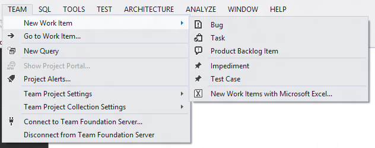
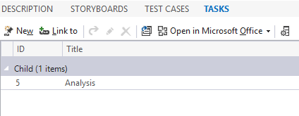
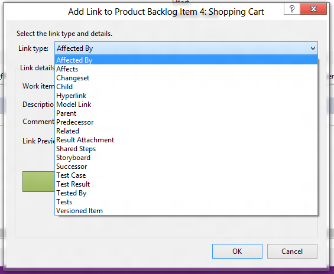
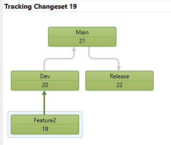
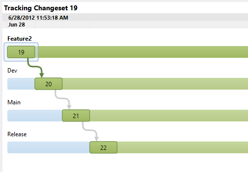

#### di [Matteo Emili](https://mvp.support.microsoft.com/profile/Matteo.Emili) - Microsoft MVP

1.  {width="0.5938331146106737in"
    height="0.9376312335958005in"}

*Luglio, 2012*

Parte essenziale del ciclo di vita del software è il trattamento dei
requisiti e la loro trasformazione in funzionalità del software che
verrà poi rilasciato, oltre alla creazione dell’albero del Source
Control nel modo più adeguato alle esigenze del team di sviluppo.

Storicamente si può approcciare la Branching Strategy in diversi modi:

1.  Branch per Feature

    Branch per Release

    Branch per Team

    Branch per Maintenance

    1.  

Nella Branch per Feature si creano ramificazioni basate sulle feature da
implementare, per poi reintegrarle nella Development line.

Nella Branch per Release si adotta un approccio di branching per ogni
release che viene sviluppata. E’ molto efficace in contesti agili, come
con Scrum, in quanto si basa su rilasci molto ravvicinati e frequenti.

L’approccio di Branch per Team si utilizza quando si hanno molti team
piccolo da far lavorare senza essere soggetti a modifiche sostanziali
nella loro sezione, oppure che possono lavorare in parallelo verso
obiettivi unici.

Infine la Branch per Maintenance è un approccio molto efficace nei casi
di manutenzione di codebase legacy, in quanto non destabilizza ciò che è
preesistente.

Ognuno di questi approcci ha dei pro e dei contro, che vanno valutati a
seconda del progetto sul quale si sta lavorando, su quale processo è
basato, quali sono le restrizioni, etc. Ci sono però delle regole fisse
consigliate, che vanno oltre la Branching Strategy che sceglieremo di
seguire.

Molto semplicemente, lo scheletro di qualunque Branching Strategy
dovrebbe seguire il seguente flusso:

1.  {width="3.34375in" height="1.53125in"}

Dove all’interno di Dev deve essere presente tutto ciò che è sviluppo,
quindi instabile, ed all’interno di Release soltanto il codice stabile e
prossimo al rilascio (e poi rilasciato).

Tracciabilità mediante Work Item
--------------------------------

Essendo Team Foundation Server una soluzione di Application Lifecycle
Management e non solamente un Version Control System, mette a
disposizione una serie di strumenti per la tracciabilità delle attività,
di cui il principe è ovviamente la funzionalità di Work Item Tracking.

Un Work Item mette a disposizione diverse varianti di attività a seconda
del Process Template scelto.

1.  MSF for Agile Software Development 6.0

<!-- -->

1.  {width="6.5in"
    height="2.5833333333333335in"}

<!-- -->

1.  MSF for CMMI Process Improvement 6.0

<!-- -->

1.  {width="6.5in" height="2.53125in"}

<!-- -->

1.  Visual Studio Scrum 2.0

<!-- -->

1.  {width="6.5in" height="2.5625in"}

Ogni Work Item è completamente customizzabile, e permette di trasformare
tutti i requisiti, i bug, e i task in qualcosa di integrato nel sistema.
Inoltre supportano le gerarchie, quindi è possibile replicare in modo
fedele tutto quello che fino ad oggi è stato “su carta”.

Prendendo ad esempio un progetto basato su Visual Studio Scrum 2.0,
avremo un Product Backlog con diversi Product Backlog Item, ossia dei
Work Item di alto livello che definiscono i requisiti del nostro
progetto.

1.  {width="6.437007874015748in"
    height="2.7913385826771653in"}

In un PBI abbiamo tutte le informazioni relative al requisito in
oggetto. I campi a disposizione permettono di identificare in modo
chiaro ed immediato a chi è assegnata l’attività, quali sono i criteri
di accettazione e validazione, una descrizione dell’attività da
svolgere, e svariate altre informazioni.

A partire da un PBI, posso creare nuovi Work Item linkati, in modo tale
da creare e replicare una gerarchia di informazioni.

1.  {width="6.5in" height="4.03125in"}

Ed ovviamente è visualizzabile dalla scheda Tasks del PBI, che riepiloga
tutti i Work Item collegati ad esso.

1.  {width="4.416666666666667in"
    height="1.71875in"}

E’ possibile collegare non solo task con rapporto gerarchico
padre-figlio, ma anche con una serie di attributi che permettono di
replicare in modo fedele i vari rapporti fra gli attori del progetto

1.  {width="5.885416666666667in"
    height="4.833333333333333in"}

Il legame con le branch
-----------------------

Potendo collegare i Work Item con i check-in, è quindi possibile
tracciare l’evoluzione del progetto. In questo modo ad ogni operazione è
collegata un’attività, ed è facile gestire processi di deployment e fix,
oltre al normale sviluppo del software.

1.  {width="2.3958333333333335in"
    height="4.15625in"}

Utilizzando invece la funzionalità di Changeset Tracking possiamo
verificare in modo visuale l’evoluzione e la vita di un check-in
all’interno del progetto. Ad esempio, una funzionalità può essere
portata in produzione con una Branching Strategy di tipo Branch per
Feature, ed avere questo flusso:

1.  {width="3.6875in" height="3.125in"}

<!-- -->

1.  Visualizzazione gerarchica del Changeset

<!-- -->

1.  {width="5.270833333333333in"
    height="3.65625in"}

<!-- -->

1.  Visualizzazione temporale del Changeset

L’uso delle funzionalità di tracking all’interno di Visual Studio
permette una rapida ed efficace identificazione del flusso avvenuto
all’interno del progetto, che utilizzati unitamente ad altri strumenti
come la History e l’Annotate aumentano la qualità generale e
diminuiscono la probabilità di errori durante le fasi di branch e merge.

#### di [Matteo Emili](https://mvp.support.microsoft.com/profile/Matteo.Emili) - Microsoft MVP

1.  [*Altri articoli di Matteo Emili nella
    Libreria*](http://sxp.microsoft.com/feeds/3.0/msdntn/TA_MSDN_ITA?contenttype=Article&author=Matteo%20Emili)
    {width="0.1771084864391951in"
    height="0.1771084864391951in"}

