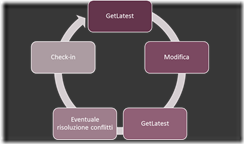
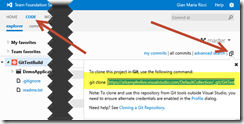
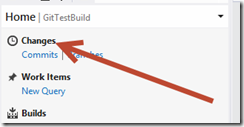
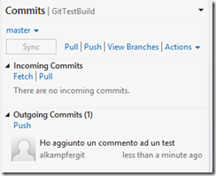

#### di [Gian Maria Ricci](http://mvp.microsoft.com/en-us/mvp/Gian%20Maria%20Ricci-4025635) – Microsoft MVP

1.  {width="0.5938331146106737in"
    height="0.9376312335958005in"}

*Aprile, 2013*

Sistemi di Version Control System centralizzati {#sistemi-di-version-control-system-centralizzati .ppSection}
===============================================

Tradizionalmente un VCS (Version Control System) è un sistema di
gestione di file, che prevede un server centrale dove viene manutenuto
lo storico di tutte le modifiche solitamente chiamato *repository*.
Questo modello si basa sull’assunzione che le modifiche al *repository*
non vengano effettuate direttamente nel server, ma tramite creazione di
copie del *repository* stesso, fatte nei computer locali degli
sviluppatori, le quali vengono modificate e poi sincronizzate con il
server centrale quando necessario.

Nel gergo di Team Foundation Server le copie locali vengono chiamate
*workspace*, la loro identità è costituita da tre valori: **nome
computer / nome utente / percorso locale**, in questo modo un utente può
avere più *workspace* in una o più macchine ed avere più copie distinte
del server centrale.

1.  {width="2.5416666666666665in"
    height="1.7291666666666667in"}

Le modalità di lavoro supportate dai vari VCS possono variare, ma si
racchiudono tutte in un flusso di lavoro che può essere semplicemente
rappresentato in questo modo.

1.  {width="2.5416666666666665in"
    height="1.5in"}

· **GetLatest:** Viene contattato il server e viene scaricata in locale
l’ultima versione dei sorgenti, la copia locale è cosi allineata al
*repository*

· **Modifica:** Vengono modificati i file in locale

· **GetLatest:** Prima di inviare i file al server, viene ricontattato
il server e riaggiornato con eventuali modifiche che possono essere
state inviate da altri durante la fase di modifica

· **Conflitti:** Se le nostre modifiche riguardano file che sono stati
modificati anche da altri è necessario risolvere i conflitti.

Se non ci sono conflitti si procede tranquillamente

Se ci sono conflitti, una volta risolti, si effettua nuovamente un
GetLatest fino a che non vi sono più conflitti

1.  

· **Check-in:** Invio dei file modificati al *repository*

Il VCS di TFS supporta attualmente due tipi di *workspace* (ricordate
che worspace = copia locale) chiamate *Server Workspace* e *Local
Workspace*. Senza entrare in dettaglio nello specifico funzionamento, le
differenze sostanziali sono nel modello di lavoro supportato.

Nel **workspace server**, prima di poter modificare un file è necessario
informare il *repository* attraverso una operazione di check-out. In
questo modo si può conoscere in ogni momento chi sta modificando quale
file ed è possibile anche mettere lock sui file impedendo agli altri di
iniziare una modifica; ad esempio se si sta modificando un file su cui è
impossibile risolvere conflitti (Es. un immagine). *Tutti i file nel
workspace hanno l’attributo read-only*, e solamente dopo che è stata
effettuata correttamente l’operazione di check-out nel server, il
read-only viene rimosso ed il file può essere modificato. Gli strumenti
integrati come Visual Studio effettuano queste operazioni in modo
trasparente quando si inizia ad editare un file. Questo modello di
lavoro viene detto ***check-out / check-in***.

Questo modello è poco efficiente per lavorare offline, dato che non è
possibile contattare il server per iniziare le operazioni di modifica e
naturalmente quando si lavora con strumenti non integrati in TFS (es.
Photoshop); tali strumenti non sono infatti in grado di contattare il
server per il check-out e rimuovere il readonly dal file. In questo
ultimo scenario si usano solitamente i TFS Power Tools, che comprendono
un integrazione con l’esplora risorse di Windows che permette di
eseguire queste operazioni al di fuori di Visual Studio.

Nei workspace client il modello di lavoro viene invece detto ***edit /
commit*** dato che non esiste un contatto continuo con il server. I file
non sono read-only, e possono essere modificati senza problemi con
qualsiasi programma (fase ***edit***). Quando si vuole inviare i file al
*repository*, il server viene contattato, viene verificato quali sono i
file che sono stati editati localmente (il workspace tiene traccia di
queste info in una cartella nascosta chiamata *\$tf*) ed i file sono poi
inviati al server (fase ***commit***).

Questo modello è più intuitivo, supporta scenari offline e di lavoro con
strumenti non integrati, ma si perde la possibilità di sapere chi sta
lavorando a quale file ed i lock in check-out. Ovvero non è possibile
impedire di iniziare a modificare un file (non esiste contatto con il
server per il check-out), ma è solamente possibile impostare un lock di
check-in, ovvero impedire che qualcuno invii un file al server.

Sistemi distribuiti {#sistemi-distribuiti .ppSection}
===================

Il modello centralizzato non è adatto per tutti gli scenari, in
particolar modo ha delle mancanze che in alcune situazioni possono
rendere difficile il lavoro di tutti i giorni.

· Lavoro offline

· Parti di team che lavorano senza avere accesso al server centrale

Oltre queste mancanze, alcuni scenari possono essere comunque gestiti da
un VCS centralizzato, ma in modo limitato o inefficiente

· Team altamente distribuiti

· Codice sorgente altamente modulare

Per questa ragione negli ultimi anni è emerso un nuovo modello di VCS
chiamato “*distribuito*” il cui paradigma di base è molto differente da
quello centralizzato. Mentre un VCS centralizzato ha un server centrale
e una serie di copie locali nei computer degli utilizzatori, che vengono
periodicamente sincronizzate con il server, in un VCS distribuito tutti
gli utilizzatori hanno un *repository* locale, ed il sistema permette di
sincronizzare i vari *repository* tra loro. In un distribuito quindi i
flussi di lavoro possono essere molteplici e gli scenari supportati sono
molto più vasti e spesso complessi.

Per evitare di perdersi, soprattutto se si viene da anni di uso di un
VCS centralizzato, è opportuno approcciare un VCS distribuito con molto
pragmatismo:

· Studiare bene lo strumento scelto

· Verificare i modelli supportati

· Scegliere un modello ed attenersi a quello

Il rischio maggiore infatti è quello di andare fuori controllo, dato che
ogni utilizzatore può decidere di sincronizzare il proprio lavoro con il
*repository* di chiunque altro, creando quindi una delocalizzazione
completa dei sorgenti. Un altro errore tipico è approcciare un VCS
distribuito allo stesso modo in cui si approccia un centralizzato e
quindi attendersi gli stessi comportamenti. La chiave di volta è sempre
essere coscienti che si sta lavorando con uno strumento differente
adatto a risolvere scenari differenti.

L’Abc di Git {#labc-di-git .ppSection}
============

Tra i VCS distribuiti (da qui in poi DVCS) negli ultimi anni sicuramente
Git è emerso su tutti gli altri, soprattutto grazie al supporto per
l’opensource fornito da GitHub. Per questa ragione il team di Team
Foundation Server ha deciso di fornire supporto DVCS in TFS integrando
Git, invece di sviluppare un DVCS custom. Attualmente l’opzione Git è
disponibile solamente per chi usa TF Service
([*http://tfs.visualstudio.com*](http://tfs.visualstudio.com/)), ma in
futuro sarà comunque disponibile anche per chi deciderà di usare TFS
on-premise.

Premettendo che non sono un utilizzatore con anni di esperienza su Git,
posso fin da subito affermare che il modo peggiore di approcciare questo
strumento è tentare di usarlo come si usa un normale VCS centralizzato.
Vediamo quindi l’ABC di come sia possibile usare git con i tool di
Visual Studio 2012 Update 2, tenendo sempre in considerazione che alcune
operazioni debbono essere fatte in command line.

Supponiamo di avere creato un repository Git su TF Service, navigando
sul tab **CODE** dall’interfaccia web è possibile notare un icona a
destra che permette di recuperare l’indirizzo del repository.

1.  {width="2.5416666666666665in"
    height="1.2916666666666667in"}

È possibile a questo punto fare clone da riga di comando se avete
installato Msysgit
([*https://code.google.com/p/msysgit/*](https://code.google.com/p/msysgit/))
usando il comando suggerito (git clone https://.....), oppure installare
l’Update2 di Visual studio 2012 ed installare l’integrazione di Git con
il Team Explorer
([*http://visualstudiogallery.msdn.microsoft.com/abafc7d6-dcaa-40f4-8a5e-d6724bdb980c*](http://visualstudiogallery.msdn.microsoft.com/abafc7d6-dcaa-40f4-8a5e-d6724bdb980c))
a questo punto connettersi al Team Project e nel Team Explorer avrete la
possibilità di fare clone direttamente dalla UI di VS2012.

1.  {width="2.5416666666666665in"
    height="1.5833333333333333in"}

L’operazione di ***clone*** effettua due macro-operazioni distinte, la
prima è creare nella cartella locale una copia *del repository presente
in TF Service* e la seconda è configurare un remote per la
sincronizzazione.

È comunque bene fin da subito fare familiarità con la riga di comando,
perché data la complessità di Git, solamente un sottoinsieme dei comandi
è disponibile nella UI di Visual Studio (potete trovare dettagli
ulteriori qui
[*http://blogs.msdn.com/b/visualstudioalm/archive/2013/03/08/use-the-git-command-prompt-to-supplement-visual-studio.aspx*](http://blogs.msdn.com/b/visualstudioalm/archive/2013/03/08/use-the-git-command-prompt-to-supplement-visual-studio.aspx)).

Per usare la command line in modo efficace, una volta installato Msysgit
basta selezionare una cartella con un repository locale, fare tasto
destro e scegliere *Git bash here*.

1.  {width="2.5416666666666665in"
    height="1.8229166666666667in"}

A questo punto avete una bash che permette di lavorare in riga di
comando sul repository, è utile appena avete installato msysgit definire
alcuni alias, ad esempio

git config --global alias.logf "log --graph --oneline --all --decorate"

questo alias non fa altro che creare un nuovo comando fittizio chiamato
*logf* per fare log del repository con alcune opzioni di default, senza
dovere ogni volta digitare tutto il comando. Il parametro --global
applica questa configurazione al settaggio globale per cui sarà poi
disponibile per tutti i repository dell’utente.

A questo punto digitando

git logf

viene effettuato il log del contenuto del proprio repository.

1.  {width="2.5416666666666665in"
    height="1.1979166666666667in"}

L’aspetto interessante è che l’operazione di clone ha scaricato tutta la
storia del repository e nel proprio hard disk locale è presente una
copia esatta del repository remoto di TF Service.

Aprendo da Visual Studio una solution presente nel repository, si può
notare come siano presenti le stesse icone di quando il progetto è
connesso a TFS, per cui si può semplicemente iniziare ad editare i file
e lavorare in maniera normale.

1.  {width="2.46875in"
    height="1.1041666666666667in"}

Come potete vedere nella figura sopra, il file UnitTest1 è stato
modificato e questo viene indicato da un semplice segno di spunta,
assolutamente identico a quando si è connessi al VCS standard di TFS. La
reale differenza si ha quando si vuole inviare le modifiche al
repository, in questo caso nel menu del Team Explorer trovate un menu
differente, dato che siete connessi ad un repository Git.

1.  {width="2.5416666666666665in"
    height="1.3229166666666667in"}

In questo menu potete premere Changes per visualizzare i file modificati
che debbono essere *committati,* in maniera analoga alla finestra
Pending Changes che si ha usando il normale VCS di TFS*.* A questo punto
basta inserire un commento e premere *Commit* per effettuare **il commit
nel proprio repository locale (e non in TF Service).** Questo fatto è
molto importante, in un DVCS quando si effettua un commit lo si fa nel
proprio repository locale e la sincronia con eventuali repository remoti
viene invece effettuata da una schermata differente. Questo permette di
lavorare localmente, anche offline se necessario, e sincronizzare
solamente quando si vuole che il resto del team veda le modifiche
effettuate.

Una volta effettuato il commit potete tornare alla home del Team
Explorer e scegliere il link Commits

1.  {width="2.5416666666666665in"
    height="2.0729166666666665in"}

Come potete vedere viene listato il commit appena effettuato nella
sezione ***Outgoing Commits*** ad indicare che è un *commit locale* e
deve ancora essere inviato al server. Questa sincronia viene fatta con
una operazione detta ***Push***, potete infatti verificare che
immediatamente al di sopra del commit è presente un link **Push**,
operazione che invia le modifiche al TF Service.

Prima di effettuare push potete effettuare un *git logf* da riga di
comando per vedere lo stato del repository locale

1.  {width="2.5416666666666665in"
    height="0.2604166666666667in"}

Questa immagine è molto interessante, in rosso viene infatti mostrata la
posizione attuale della branch master (è la branch principale che esiste
di default) nel server remoto (di default i server remoti vengono
chiamati origin). In questo modo si indica che la origin/master, ovvero
il repository remoto di TF Service, è attualmente posizionata al commit
1d200e8 mentre la versione locale (HEAD, master) è avanti di un commit.

In git ogni commit è infatti identificato da un hash del commit stesso,
questo significa che non avete un flusso lineare di changeset, ma
soprattutto che non avete un flusso lineare di tutto il repository, data
appunto la natura distribuita del tool e la possibilità per chiunque di
fare commit sul proprio repository locale e sincronizzare poi con
qualsiasi altro repository.

**Nota per gli utilizzatori di git:** se come me usate già git per altri
progetti, es github, è probabile che i vostri tool siano già settati con
l’utente di github, se osservate la figura precedente, noterete che
l’utente che ha effettuato il checkin si chiama alkampfergit che è il
mio utente di github, e soprattutto che l’immagine dell’utente non viene
rappresentata, nonostante in TF Service il mio profilo abbia
un’immagine. Questo accade perché la configurazione globale di git è
stata precedentemente configurata con quell’utente, e dato che Visual
Studio e TF Service utilizzano una versione *completamente standard* di
git, durante il commit viene usato l’utente globale impostato. Questo
significa che dopo avere fatto il primo clone di Visual Studio dovete
settare username ed email corrette, ad esempio da riga di comando

1.  {width="2.5416666666666665in"
    height="0.2604166666666667in"}

Naturalmente è possibile anche impostare questi valori andando nella
sezione settings del team explorer, che ha una nuova sezione chiamata
**git**, nella quale trovate **Git Settings** che vi permette di
configurare i settaggi da Visual Studio. La maniera migliore di
configurare git rimane però sempre la riga di comando :), anche perché
come potete vedere sotto Visual Studio vi permette di configurare i
Global Settings, mentre se si lavora con più server, è consigliabile che
ogni repository abbia la sua corretta configurazione locale.

1.  {width="2.1875in"
    height="2.5416666666666665in"}

Questo problema accade perché i tool di VS sono ancora in beta, e quindi
sono ancora leggermente acerbi. L’opzione interessante è comunque la
“enable donwload of Author images from 3rd party source” che permette di
recuperare le immagini dell’autore anche dai repository di terze parti
come github (ad esempio usando gravatar)

Ora che avete riconfigurato correttamente il vostro username e password
localmente, potete modificare nuovamente un file, ed effettuare un
secondo commit.

1.  {width="2.5416666666666665in"
    height="1.125in"}

Come potete vedere il primo commit ha ora l’immagine (si usa gravatar),
ed il secondo commit riporta l’autore corretto, alkampfer, invece di
quello di github presente nel commit precedente. Premendo push invierete
le modifiche al server,e se non ci sono conflitti, avete sincronizzato
il *repository* remoto con quello locale.

Come potete vedere dalla figura seguente, che rappresenta la visione del
sorgente dall’interfaccia web, entrambi i commit sono stati inviati al
server, ma il primo non ha immagine, ed è associato al mio utente di
github.

1.  {width="2.5416666666666665in"
    height="0.6979166666666666in"}

#### di [Gian Maria Ricci](http://mvp.microsoft.com/en-us/mvp/Gian%20Maria%20Ricci-4025635) – Microsoft MVP

1.  [*Altri articoli di Gian Maria Ricci nella
    Libreria*](http://sxp.microsoft.com/feeds/3.0/msdntn/TA_MSDN_ITA?contenttype=Article&author=Gian%20Maria%20Ricci)
    {width="0.1771084864391951in"
    height="0.1771084864391951in"}

