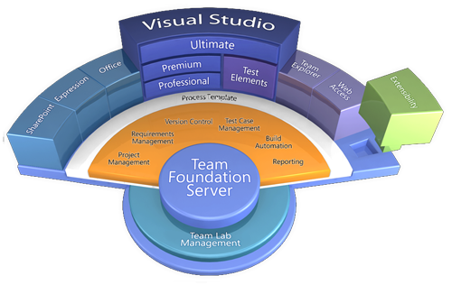

#### di [Felice Pescatore (MVP)](http://mvp.microsoft.com/en-us/mvp/Felice%20Pescatore-5001016)

Blog/Sito Personale:
[www.felicepescatore.it](http://www.felicepescatore.it)

ALM Blog: <http://www.getlatestversion.it/>

1.  {width="0.59375in" height="0.9375in"}

*Dicembre 2014*

Introduzione
------------

L’Application Lifecycle Management (ALM) dà il meglio di sé quando si
riescono a coniugare e bilanciare, opportunamente, metodologie e
strumenti di supporto. Nonostante non esista una soluzione ready-to-use
(e vi invito a diffidare di chi ve la propone!), cerchiamo di descrivere
una “soluzione tipo” basata su **Scrum** e **VSO/TFS** (Visual Studio
Online / Team Foundation Server) pensata per la gestione di un progetto
di media complessità.

Scrum + TFS ed oltre
--------------------

La produzione del software ha raggiunto nell’ultimo decennio un livello
tale di complessità da considerarla oggi una delle attività più onerose
e difficili da realizzare. Se si guarda al *Cynefin* framework, un
sistema è definito “complesso” quando non può essere modellato secondo
un approccio lineare (matematicamente secondo equazioni lineari) perché
il funzionamento olistico è più della somma del funzionamento delle
singole parti, dipendendo anche dalla sua evoluzione e dalla sua storia.

1.  {width="4.7194083552056in"
    height="3.7505238407699037in"}

<!-- -->

1.  Figura 2 - Cynefin framework

Questo ragionamento si applica all’intero ciclo di vita del prodotto,
richiedendo la definizione di una strategia complessiva e di tattiche
specifiche che lo accompagnano dalla progettazione allo sviluppo, fino
ad arrivare alla sua dismissione: **Application Lifecycle Management**,
appunto.

Volendo riportare una buona definizione di cos’è l’ALM (ne esistono
diverse, con focus differenziato sui vari aspetti), possiamo affidarci
alla più classica delle fonti, Wikipedia:

“Application Lifecycle Management (ALM) is a* ***continuous
process* ***of managing the life of an application through governance,
development and maintenance. ALM is the* ***marriage*** *of **business
management* ***to* ***software engineering* ***made possible
by* ***tools*** *that facilitate and* ***integrate*** *requirements
management, architecture, coding, testing, tracking, and release
management.”

Ma qual è il “core” dell’ALM? Soddisfare le esigenze del cliente (Key
stakeholder), fornendo gli strumenti e le pratiche utili a catturare i
feedback e a riorganizzare le attività in funzione della loro priorità.
E qui il connubio con l’Agile è assolutamente evidente e “naturale”.

1.  {width="5.173458005249344in"
    height="3.8958333333333335in"}

<!-- -->

1.  Figura 3 - Application Lifecycle Management

In particolare, tra le diverse metodologie e i diversi framework Agile
disponibili, **Scrum** si è imposto nell’ultimo decennio come
riferimento per un approccio moderno alla gestione dello sviluppo del
software.

1.  {width="5.604569116360455in"
    height="2.9928390201224846in"}

<!-- -->

1.  Figura 4 – Scrum big picture

Il successo di Scrum è dovuto ad un fattore principale: funziona ed è in
grado di adattarsi a contesti fortemente eterogenei. Questo grazie al
fatto che la metodologia creata da *Ken Schwaber* e *Jeff Sutherland*
definisce una serie di ruoli, artefatti e momenti di
riflessione/analisi, lasciando “libero” il Team di applicarli al proprio
contesto. Attenzione: ciò non vuol dire che vige l’anarchia perché Scrum
è difficile da implementare correttamente e va applicato nella sua
interezza, altrimenti non si sta utilizzando Scrum! Quindi, niente
“*Scrum… but*”!\
Possiamo descrivere, sinteticamente, l’applicazione dello Scrum process
come segue:

Il {Product Owner (PO)}, dopo essersi confronta con gli stakeholder,
definisce e priorizza le attività in quello che viene chiamato {Product
Backlog}. A questo punto, lo {Scrum Master (SM)} riunisce il Team
(compreso il PO) e, insieme ad esso, crea lo {Sprint Backlog}
selezionando le attività da sviluppare nella successiva Iterazione
{Sprint}. Prima di fare ciò, però, il Team ha definito il significato di
“DONE”, ovvero quando una attività si può definire terminata (sviluppo,
testing, documentazione, ecc..). Per ogni attività vengono definiti task
unitari di lavoro, ne viene stimato il tempo di sviluppo in ore e,
assolutamente fondamentale, i relativi *criteri di accettazione*.

Terminato lo {Sprint Planning}, lo Sprint (1sett. – 1mese) parte e i
task individuati cominciano ad essere sviluppati. Giornalmente, prima di
iniziare le attività, il Team tiene un meeting di 15minuti chiamato
{Daily Scrum} in cui ci si confronta su cosa è stato fatto, cosa si farà
nell’immediato e quali sono gli eventuali impedimenti.

Solo le attività che rispecchiano in pieno la definizione di “DONE” sono
considerate terminate e, una volta raggiunta la fine dello Sprint, si
procedete con uno {Sprint Review} in cui si mostra quanto realizzato al
PO e agli stakeholder e uno {Sprint Retrospective} che consente al Team
di analizzare la propria organizzazione al fine di migliorarla e
migliorarsi.

Se ci si allontana dal processo e si guarda ai **Valori**, Scrum
chiaramente abbraccia quanto dichiarato nel manifesto Agile, raffinando
il Valore esplicitamente dedicato alle persone: “*Gli individui e le
interazioni più che i processi e gli strumenti*” in 5 Valori “derivati”:
*Openness, Courage, Respect, focus e Commitment*.

1.  {width="6.657179571303587in"
    height="2.614948600174978in"}

<!-- -->

1.  Figura 5 - The 5 Scrum Values

Vediamo gli *Scrum Values* in dettaglio, evidenziandoli per ogni
componente dello Scrum Team (Scrum Master \[SM\], Product Owner \[PO\] e
Development Team \[DT\]):

**Focus**. Lo SM è concentrato sulla rimozione degli impedimenti e
sull’applicazione di Scrum all’interno del Team e nel contesto
aziendale. Il PO è concentrato sull’ottenimento del massimo Valore per
il prodotto in essere, organizzando opportunamente il Product Backlog.
Il DT è focalizzato sullo sviluppo della soluzione in funzione della
Definition of Done;

**Coraggio (Courage)**. Lo SM deve avere coraggio per “proteggere” e
“guidare” il Team, così come il PO per fidarsi delle attività in essere
e dialogare con gli stakeholder. Il DT deve impegnarsi nella
realizzazione dei Work Item, superando i propri limiti in un’ottica
inspect-and-adapt;

**Apertura (Openness)**. L’intero Team deve essere aperto ai
cambiamenti, sia che provengano dall’interno che dall’esterno
(stakeholder). In aggiunta, il DT deve guardare a nuove soluzioni,
soprattutto tecniche, per ottimizzare la qualità di quanto realizzato;

**Impegno (Commitment)**. Il DT sottoscrive il proprio impegno in ogni
Sprint Planning, quando vengono decisi i Work Item da realizzare nella
prossima iterazione. Lo SM ha un impegno costante nel far penetrare
culturalmente Scrum nello specifico contesto. Il PO si impegna con gli
stakeholder per ottenere costantemente (ad ogni Sprint) un incremento
della soluzione disponibile, in ottica sempre di accrescimento del
Valore complessivo;

**Respect (Rispetto)**. Questo è il valore più difficile da conquistare,
perché il rispetto si estende oltre i ruoli, toccando il personale. Il
DT e lo SM devono rispettare le decisioni del PO, l’unico ad avere la
parola finale su cosa realizzare. Dualmente il PO deve rispettare
l’autonomia del DT sul come fare le cose e come raggiungere la DoD, così
come deve rispettare lo SM nella propria attività di guida metodologica.
Lo SM, dal proprio canto, deve essere un “leader servente” e non il
techincal leader o il team leader vecchio stile command-and-control.
Infine ogni singolo membro dello Scrum Team deve rispettare i propri
colleghi nell’ottica della Prima Direttiva delle Retrospettive (Norman
Kerth):

> **“Regardless of what we discover, we understand and truly believe
> that everyone did the best job they could, given what they knew at the
> time, their skills and abilities, the resources available, and the
> situation at hand.”**

1.  

Una cosa da sottolineare con fermezza è che i Valori appartengono a
tutto il Team ed è sua responsabilità farli maturare ed applicare al
proprio interno. Non esiste, insomma, un “Value Scrum Master”, ma la
responsabilità è egualmente distribuita su tutti, sia per l’applicazione
individuale che per quella complessiva.

Il processo di sviluppo definito da Scrum può essere eseguito senza
l’ausilio di alcun supporto digitale, sfruttando, ad esempio, i classici
post-it, ma ciò diventa poco pratico se si è in un contesto medio-grande
con una struttura, eventualmente, delocalizzata in varie aree
geografiche. Inoltre, diventa difficile effettuare attività manuali di
data-mining e associare le attività/task a quanto realmente sviluppato,
per non parlare di tracciare agevolmente i feedback degli stakeholder e
altre operazioni annesse. Per questo, e non solo, uno strumento digitale
di supporto all’ALM è sicuramente di estremo aiuto, soprattutto se
flessibile ed integrato con le tecnologie di sviluppo stesse,
esattamente come nel caso di **VSO**/**TFS.**

1.  {width="4.5795559930008745in"
    height="2.894278215223097in"}

<!-- -->

1.  Figura 6 - Team Foundation Server ecosystems

Evitando di entrare negli aspetti di gestione del codice, della relativa
integrazione con le piattaforme di sviluppo Microsoft (.Net in primis) e
degli strumenti di *Continuous Integration*, due elementi rendono
VSO/TFS particolarmente attraente e flessibile: l’*indipendenza* dalla
metodologia di gestione adottata e la sua *estendibilità*. Il primo
elemento si ottiene grazie ai *Process Template*, ovvero un “pacchetto”
che definisce gli elementi caratterizzanti la metodologia scelta (es per
Scrum: workitem, bug, impediment, ecc.) e le loro caratteristiche. E’
possibile definire un Process Template custom e continuare a utilizzare,
in accordo con esso, tutti gli strumenti disponibili, senza dover
modificare praticamente nulla nella piattaforma di supporto. L’altro
punto di forza, come detto, è l’*estendibilità*, che consente di
estendere TFS ed interrogarlo direttamente dai propri servizi/strumenti,
sfruttando, ad esempio, le *Team Foundation Server OData API*.

Il nostro viaggio è solo all’inizio, nel prossimo articolo della serie
vedremo come creare un nuovo *Scrum Project* in VSO/TFS e gestire il
Program/Product Backlog, in congiunzione all’esecuzione dello Sprint
Planning.

#### di [Felice Pescatore (MVP)](http://mvp.microsoft.com/en-us/mvp/Felice%20Pescatore-5001016)

Blog/Sito Personale:
[www.felicepescatore.it](http://www.felicepescatore.it)

ALM Blog: <http://www.getlatestversion.it/>
