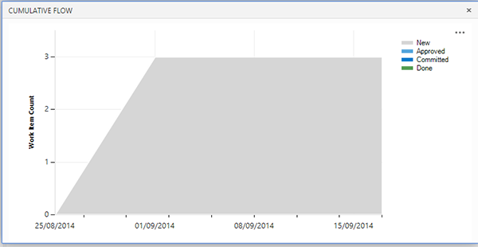
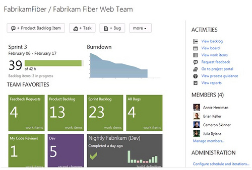
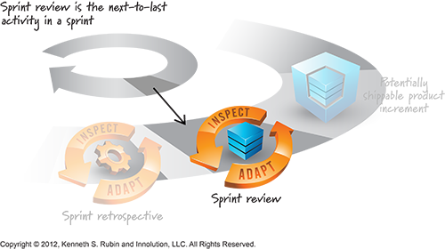
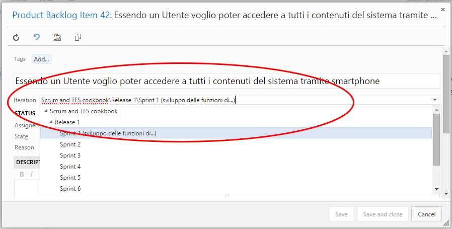
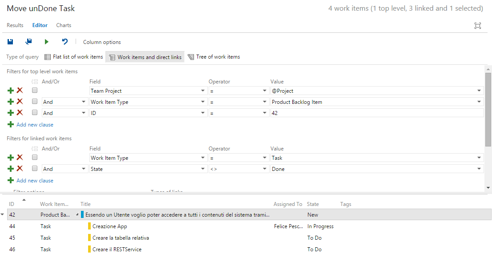

#### di [Felice Pescatore (MVP)](http://mvp.microsoft.com/en-us/mvp/Felice%20Pescatore-5001016)

Blog/Sito Personale:
[www.felicepescatore.it](http://www.felicepescatore.it)

ALM Blog: <http://www.getlatestversion.it/>

1.  {width="0.59375in" height="0.9375in"}

*Dicembre 2014*

Sprint by Sprint
----------------

Nel precedente articolo, abbiamo visto come settare il nostro ambiente,
popolare il Program ed il Backlog, effettuare lo Sprint Planning e, di
conseguenza, creare lo Sprint Backlog. Ora non ci resta che tuffarci in
quello che è il cuore pulsante e operativo delle attività di sviluppo in
Scrum: lo **Sprint**.

1.  {width="5.330570866141732in"
    height="3.134375546806649in"}

<!-- -->

1.  Figura 32 – A Sprint Activity: Daily Scrum

Si tratta di un intervallo time-boxed, tipicamente di 1-4 settimane
(mediamente 2 settimane), all’interno del quale il Team concretizza lo
*Sprint Goal* definito durante lo “Sprint Planning” e realizza le User
Story, o, più in generale, i Work item inseriti nello Sprint Backlog.

Lo Sprint raccoglie in se alcune delle cerimonie fondamentali di Scrum:

1.  **Daily Scrum**: si tratta di uno stand-up meeting mattutino di una
    decina di minuti al massimo in cui tutti i membri del Team, a turno,
    illustrando cosa hanno realizzato (What have I done yesterday?),
    cosa si apprestano a fare (What will I do today?) e le eventuali
    difficoltà incontrante (What keeps me from doing my work?);

    **Sprint Review**: si effettua alla chiusura dello Sprint. Il
    Product Owner mostra quanto realizzato agli stakeholder, al fine di
    validare in ultima analisi il tutto e raccogliere i feedback;

    **Sprint Retrospective**: si effettua alla chiusura dello Sprint ed
    è dedicata al Team. Ha il compito fondamentale di ragionare sui
    processi adottati e sul loro miglioramento.

    1.  

In relazione allo Sprint, esiste un elemento che è fondamentale
introdurre prima di proseguire: **Definition of Done** (DoD).
Esattamente come per lo *Sprint Goal*, il Team (nella sua interezza)
definisce cosa intende per “DONE”, ovvero quando è possibile considerare
un Work Item finito. Tale definizione evolve durante lo sviluppo del
prodotto e può avere una prima formalizzazione associata ai primi
*Product Backlog Grooming* o al primo Sprint. In pratica, si definisce
una short list di attività da effettuare per ogni elemento del Backlog o
per un suo insieme:

1.  \[MUST\] Superamento dei Test di Accettazione (Acceptance Criteria);

    \[MUST\] Definizione, esecuzione e superamento dei Test di Unità;

    Test Code Coverage superiore ad una certa %;

    Documentazione funzionale;

    ….

    …

    1.  

Tipicamente, per i Team che si sono imbarcati in Scrum da poco, è
possibile limitarsi alle prime due attività, anche se si tratta di
un’assunzione debole. Quello che invece è fondamentale evidenziare è che
tanto più lunga è la lista delle attività annesse alla DoD, tanto più
lungo sarà il tempo necessario per completare una User Story, incidendo,
probabilmente, anche sulla sua complessità relativa (Story Point). In
sintesi:

la Velocity è inversamente proporzionale alla complessità della DoD

La cosa interessante, più volte ripetuta, è che Scrum dice cosa fare ma
non dice come farlo, lasciando la libertà al Team di auto organizzarsi e
di scegliere le pratiche che più si ritengono opportune. In
quest’ottica, per lo sviluppo vero e proprio, spesso i Team prendono “in
prestito” le pratiche contemplate da eXtreme Programming (XP), il TDD e
altro, in base alle proprie esigenze e alla propria maturità.

VSO/TFS dispone di una serie di strumenti trasversali che consentono di
svolgere le attività intrinseche ad uno Sprint, a partire dalla *Sprint
Board*, di cui abbiamo già parlato e che consente di gestire agevolmente
tutte le attività di organizzazione dei Work Item e dei Task.

1.  {width="4.2375in"
    height="1.8229166666666667in"}

<!-- -->

1.  Figura 33 - Sprint Board

Il monitoraggio avviene attraverso una serie di strumenti visuali: lo
*Sprint* *Burndown Chart*, il *Release Burndown Chart*, il *Cumulative*
Flow, l’*Histogram of Velocity*, ecc. Ma, probabilmente, l’elemento più
importante è la *Dashboard*, visionabile accedendo da Web e che presenta
una sintesi dello stato del progetto, con Cruscotti e Tiles
personalizzabili in grado di evidenziare aspetti specifici del progetto
relativo. Per gli amanti dell’Agile si tratta di un vero e proprio
*Information* *Radiator Digitale* in linea con la regola del 3+3: avere
chiaro il quadro generale guardando la Board in 3secondi da 3metri.

1.  {width="1.9264020122484689in"
    height="1.3333333333333333in"}
    {width="2.6354166666666665in"
    height="1.3616316710411198in"}

<!-- -->

1.  Figura 34 - Sprint Burndown e Cumulative Flow

<!-- -->

1.  {width="4.083333333333333in"
    height="2.760333552055993in"}

<!-- -->

1.  Figura 35 - TFS Web Access / VSOnline Web App

Tali strumenti visuali sono fondamentali per comunicare rapidamente con
persone (es: manager o stakeholder) poco interessati agli aspetti di
dettagli dello sviluppo ma focalizzati sul quadro complessivo. Il
supporto dell’ambiente non si limita però a ciò, abbracciando un set di
funzionalità legate alla verifica della **Qualità del Codice** (Code
Quality), anche se, per inciso, sono strumenti integrati più nell’IDE
Visual Studio (Premium e Ultimate) che in TFS/VSO. Tra essi troviamo:

1.  **Code Clone Detection**, per la ricerca di codice duplicato;

    **Code Metrics**, per misurare la complessità e la manutenibilità
    del codice;

    **Code Profiler**, per analizzare l’utilizzo della memoria da parte
    del codice ed individuare colli di bottiglia nelle performance;

    **Static Code Analysis**, per effettuare un check del codice basato
    su standard di riferimento (es: best practice per lo sviluppo .NET:
    i nomi dei metodi devono iniziare con la Maiuscola);

    **Unit Testing / Coded UI Tests /Code Coverage**, supporto allo Unit
    Test (MSTest, xUnit o altri);

    **Fakes Framework**, per la generazione automatizzata di Mocks e
    Stubs;

    1.  

Nonostante esistano strumenti ad-hoc per ognuna delle aree evidenziate,
con funzionalità estreme, il grande vantaggio della soluzione Microsoft
è la completa integrazione, consentendo così di produrre in modo
efficiente codice di maggiore qualità rispettando i vincoli decisi con
la DoD. In particolare, l’utilizzo delle batterie automatizzate per il
Test e il settaggio dei Build Agent permettono di abbracciare in pieno
la pratica della *Continuous Integration* (CI) che prevede
un’integrazione completa e testata di quanto sviluppato sulla main-line
di sviluppo. Gli strumenti forniti consento di impostare opportune
policy (per esempio: inibire il check-in se non si superano i test di
unità presenti nella solution) in modo da automatizzare il tutto.

Sia le operazioni di Build che le attività di Testing sono gestibili
tramite la Web App di VSO/TFS o direttamente da Visual Studio.

1.  {width="2.71875in"
    height="3.2019236657917762in"}

A proposito di main-line: dalla versione 2013, VSO/TFS supporta
pienamente sia il source control centralizzato proprietario (TFVC) che
il distribuito GIT, consentendo di applicare le politiche di gestione
del codice sorgente che più si adattano al proprio contesto.

1.  {width="2.7851148293963255in"
    height="2.8541666666666665in"}

<!-- -->

1.  Figura 36 - TFVC & GIT

Se si lavora in ottica Scrum e Continuous Integration (se non praticate
quest’ultima vi consiglio vivamente di “incamminarvi” su questa strada)
e si ha un accordo con il cliente basato su *contratti progressivi*, si
può adottare una strategia di branch “**Sprint-to-Branch**” in cui si
crea un nuovo branch ad ogni nuovo Sprint, legandoli direttamente tra
loro.

1.  {width="4.125in"
    height="2.728885608048994in"}

<!-- -->

1.  Figura 37 - Branch Strategy: Sprint-to-Branch

Tornando allo Sprint, lo stesso si conclude con due appuntamenti
(cerimonie) fondamentali: lo **Sprint Review** e lo **Sprint
Retrospective**.

1.  {width="4.564732064741907in"
    height="2.5562489063867018in"}

<!-- -->

1.  Figura 38 - Sprint Review and Sprint Retrospective meeting

Lo *Sprint Review* è dedicato alla presentazione del lavoro svolto, o
meglio, dell’attuale stato del prodotto, comprendente tutto quanto
sviluppato finora, integrato e testato. Ad esso partecipano praticamente
tutti: gli *stakeholder* (interni ed esterni), lo *Scrum Team* al
completo, *uditori*, ecc… Scrum prevede di effettuare lo Sprint Review
alla fine di ogni Sprint ma, in realtà, è sempre più frequente
l’utilizzo del concetto di *Minimum Viable Product* (mvp), ovvero
l’insieme minimo di funzionalità che rappresentano un incremento
significativo dal punto di vista del cliente. Se applicato (cosa di
frequente soprattutto quando lo sviluppo del prodotto coinvolge più
Team) la cosa si traduce nell’avere uno Sprint Review interno minimale e
uno Sprint Review più consistente ogni N-Sprint.

Durante lo Sprint Review vengono evidenziati eventuali problemi di
sviluppo che si sono verificati e come evitarli in futuro. Tra essi, uno
dei più frequenti, è il comportamento da adottare rispetto a User Story
completate solo parzialmente.

Personalmente, suggerisco al Team di applicare due semplici regole:

1.  Una User Story non completata (o meglio, che non ha raggiunto lo
    stato di “Done”) non contribuisce al calcolo della Velocity;

2.  L’intera User Story, compresi i Task completati e non, vengono
    traslati nel nuovo Sprint.

3.  

Un approccio alternativo al punto 2 è quello di “splittare” la User
Story in *UserStoryA* e *UserStoryB*, la prima comprende i Task
completati e la seconda quelli non completati. In questo modo la
UserStoryA contribuisce anche alla Velocity dello Sprint attuale, mentre
il resto va nello Sprint successivo. Questo approccio ha lo svantaggio
di dover ri-estimare anche la complessità delle due nuove User Story e,
in generale, non è del tutto compliance con l’essenza di Scrum.

Il primo supporto a questa fase da parte di VSO/TFS è chiaramente legato
alla *Continuous Integration* (che consente di ottenere una soluzione
completa e testata delle nuove funzionalità realizzate in modo
automatizzato. Lo strumento ALM di Microsoft ci viene incontro anche
nell’attività di riallocare una User Story con tutti i relativi task in
modo semplice e veloce: basta selezionare la User Story specifica e
cambiare la sua “assegnazione”.

1.  {width="5.941435914260717in"
    height="3.0104166666666665in"}

<!-- -->

1.  Figura 39 - User Story Iteration Assignment

Se si desidera spostare solo i task non competi, la procedura è un po’
più complessa: VSO/TFS, in modo automatizzato, permette lo “share” di
una User Story tra più Sprint (Iterazioni), quindi non è necessario
effettuare la ri-stima per due User Story differenti. Vediamo come fare:
prima di tutto bisogna creare una query che selezioni i task “un-done”.

1.  {width="4.3805555555555555in"
    height="2.2604166666666665in"}

<!-- -->

1.  Figura 40 - Done / un-Done Task query

Dopodiché selezionate il risultato ottenuto (sia la User Story che i
Task), cliccate con il tasto destro sulla selezione e scegliete “Move to
Iteration”.

1.  {width="5.354166666666667in"
    height="3.7314730971128607in"}

<!-- -->

1.  Figura 41 - Move to Iteration

Una volta confermato il tutto avrete la User Story presente sia
nell’iterazione corrente, con i relativi Task in Done state, e
nell’iterazione successiva (o quella che avete indicato) con i Task in
un-Done state.

1.  {width="4.895833333333333in"
    height="1.4172419072615923in"}

<!-- -->

1.  Figura 42 – Shared User Story: Sprint attuale

<!-- -->

1.  {width="4.583333333333333in"
    height="1.6877209098862642in"}

<!-- -->

1.  Figura 43 – Shared User Story split: Sprint successivo

Essendo la User Story in “share”, risulterà ancora aperta alla fine
dello Sprint corrente e, automaticamente, non correrà al calcolo della
Velocity.

A valle delle operazioni di “aggiustamento”, lo Sprint Review si
conclude con una serie di domande molto simili a quelle poste durate il
Daily Scrum, di preparazione al prossimo Sprint Planning:

1.  What did you like the most ?

    What did you not like?

    What would you like to improve?

    1.  

Una volta terminato lo Sprint Review, lo Scrum Team (e solo esso) si
riunisce per circa 2-3 ore per effettuare la **Scrum Retrospective**.
Questo meeting è caratterizzato da una serie di Activity che consento di
ispezionare l’applicazione di Scrum stesso e il comportamento del Team
come tale, al fine di migliorare l’aspetto metodologico del lavoro.
Spesso, come Activity, si utilizzano dei Retrospective Game come lo
*Starfish* che consentono di raccogliere in modo chiaro e coinvolgente i
vari aspetti che caratterizzano il Team.

1.  {width="4.092202537182852in"
    height="2.936130796150481in"}

<!-- -->

1.  Figura 44 - Starfish game

Da questo punto di vista, VSO/TFS non offre un grande supporto avendo,
come detto, nella versione 2013 eliminato lo “Sprint Work Item”.
L’opzione potrebbe essere quella di creare, a questo punto, un Work Item
generico nella cui descrizione si inseriscono gli obiettivi (agenda)
della retrospettiva e si allegano le foto dei vari artefatti realizzati.

1.  {width="5.770833333333333in"
    height="2.8620647419072616in"}

<!-- -->

1.  Figura 45 - Retrospective Work Item

Si tratta di un Work Item utile per aver traccia di quanto discusso
nella retrospettiva, legandolo in modo diretto allo Sprint.

Epilogo
-------

Siamo giunti alla fine del nostro viaggio dopo aver visto alcune
soluzioni pratiche che consentono a VSO/TFS di supportare in modo
diretto l’utilizzo di Scrum all’interno della propria organizzazione.

Sperando che il tutto vi abbia incuriositi e che possa servirvi come
start-point per le vostre esigenze, chiudo ricordandovi che sia VSO/TFS
che Scrum vanno sempre calati nello specifico contesto di esercizio e
che solo un loro utilizzo serio e disciplinato porta ad vero valore per
le proprie attività.

#### di [Felice Pescatore (MVP)](http://mvp.microsoft.com/en-us/mvp/Felice%20Pescatore-5001016)

Blog/Sito Personale:
[www.felicepescatore.it](http://www.felicepescatore.it)

ALM Blog: <http://www.getlatestversion.it/>
