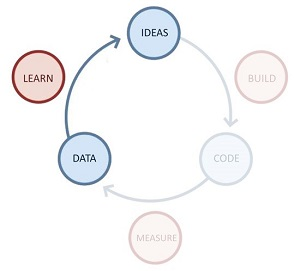

Lean Startup, Jump Start
========================

Introduzione
------------

Le startup sono una forma particolare di organizzazione, pensate per
**sperimentare** un modello di business sostenibile che consenta di
perseguire la propria Vision. Ma le startup sono più di quella che è
l’immagine collettiva dei geni sregolati in un garage: per avere
successo ci vuole metodo e un approccio scientifico al management.

**Lean Startup** ci fornisce gli strumenti per trasformare una startup
in un’azienda sostenibile e di successo, al di là del seguito il
contesto di riferimento. Detto ciò, di seguito il contesto di
riferimento sarà relativo al mondo dell’Information Technologies.

Lean Startup: la startup è un continuo esperimento
--------------------------------------------------

**Lean Startup** propone un approccio lean-based alla creazione di un
nuovo business e/o di una nuova startup, assimilando tale atto creativo
ad un **continuo esperimento**. Così come suggerito da *Eric Ries*, in
primis, ma anche da *Steve Blank* e altri pionieri di Lean Startup, una
nuova startup non è un’azienda in miniatura e quindi la cosiddetta
“*dollhouse theory of startups*” è assolutamente errata.

{width="4.166146106736658in"
height="2.520518372703412in"}

> *“A startup is a human institution designed to create something new *
>
> *under conditions of extreme uncertainty”*

L’obiettivo di una startup è quello di trasformare la propria Vision in
un business sostenibile, creando opportuni prodotti e servizi a supporto
di esso. In linea generale, non si ha inizialmente bisogno di tutte le
strutture tipiche di un’azienda rodata come, ad esempio, marketing o
finance, bensì di una struttura snella con un mix di competenze in
costante evoluzione. Essendo la Vision l’unico punto fermo, il processo
di realizzazione del prodotto (sevizio) annesso deve adattarsi a
condizioni assolutamente incerte, in cui il problema è *parzialmente
noto* (o addirittura in alcuni casi sconosciuto) e la *soluzione è
sconosciuta*. In tale contesto, non è possibile ipotizzare l’utilizzo di
approcci classici, ovvero:

-   **Waterfall-like** (*known problem, known solution*), richiede la
    conoscenza approfondita sia del problema e sia della soluzione che
    si vuole realizzare;

-   **Agile** (*known problem, unknown solution*), in cui il problema da
    risolvere è noto (in linea generale) ma non è ben chiaro quale
    soluzione realizzare per risolverlo ed il modo migliore per farlo.

Nel caso di una startup, siamo in una condizione di *(partially) unknown
problem - unknown solution*, ovvero una combinazione delle condizioni
precedenti in chiave peggiorativa. Lean Startup suggerisce di
considerare lo sviluppo del business (e del prodotto/servizio)
attraverso il ciclo **build-measure-learn** che va velocizzato il più
possibile al fine di sfruttare al massimo in concetto di *Validation
Learning*, ovvero validare scientificamente le proprie assunzioni (o
come li definisce Ries, atti di fede – “Leap of Faith”).

{width="3.47839457567804in" height="3.22in"}

Figura 1 - Build-Measure-Learn

Ma l’apprendimento va associato a delle metriche affidabili e
verificabili, altrimenti si tratta di supposizioni che non portano a
vedere ciò che si vuole (*Vanity Metrics*) e a considerare livelli di
crescita (growth) falsati da valori non connessi ai miglioramenti
ottenuti nell’ultima esecuzione del loop Build-Measure-Learn.

Un esempio: *se si utilizzano delle metriche generiche che consentono
solo di vedere l’incremento dei download del prodotto, com’è possibile
capire se essi sono dovuti alle nuove features introdotte o ad un
aumento delle campagne di advertising?*

Questi elementi sono ben esplicitati nella pratica definita *Innovation
Accounting,* ovvero nella formulazione e nella verifica di una serie di
metriche affidabili (*Actionable Metrics*) definite sulla base di alcune
“semplici” domante:

-   *Cosa vogliamo imparare nel prossimo loop?*

-   *Cosa è necessario misurare per fare ciò?*

-   *Cosa dobbiamo realizzare (es: MVP) per raggiungere il nostro
    obiettivo?*

Tramite l’Innovation Accounting è possibile capire se si stanno facendo
progressi o se la strategia adottata va modificata (PIVOT) perché non
produce i risultati attesi, motivo che spinge, chiaramente, ad
accelerare il più possibile i loop build-measure-learn.

Chiudiamo questo primo appuntamento con l’enfasi sul “fallimento”: se la
scelta strategia risulta errata, ovvero le assunzioni fatte non sono
valide, ciò non vuol dire che è necessario arrendersi, bensì che bisogna
adeguare le proprie scelte e le future azioni ai risultati ottenuti. Il
pattern di riferimento di Lean Startup non è quindi: **win-or-fail** ma
**fail-fail-win**, andando ad abbracciare egregiamente il principio
**Genchi Gembutsu**: «vai e verifica di persona», che invita
l’imprenditore a non rilassarsi e ad essere sempre presente e vigile
nelle azioni chiave finalizzare alla creazione del nuovo business.

{width="4.166146106736658in"
height="3.9890846456692914in"}

Figura 2 - win-fail vs fail-fail-win

Lean Startup: Buil-Measure-Learn
--------------------------------

Entriamo ora nel vivo dell’operatività della metodologia di Ries,
andando ad occuparci del ciclo **Build-Measure-Learn** e dei tool
annessi. Prima di continuare è opportuno ricordare che l’obiettivo di
una startup è quello di accelerare tale loop in modo da ricevere
velocemente i feedback dagli *early adopters*, i primi utilizzatori che
condividono la Vision generale e che possono contribuire al suo
raggiungimento. L’individuazione degli *early adopters* è fondamentale:
tali utenti possono tranquillamente tollerare inefficienze e un prodotto
parzialmente funzionante, perché sono “affamati” di novità e hanno
“desiderio” di contribuire alla sua evoluzione.

La prima fase è quella di **Build**, in cui l’idea viene codificata e
presentata agli *early adopters* (e successivamente ai clienti) per i
feedback.

{width="3.125in"
height="2.8229166666666665in"}

Figura 3 - Build phase

Dal passaggio dell’idea alla codifica, il tool fondamentale è il
***Minimum Viable Product*** (MVP), sostanzialmente un prodotto/servizio
che implementa il set minimo di funzionalità per la convalida della
strategia. L'approccio di sviluppo, strutturato in termini di *Validate
Learning*, si contrappone decisamente alla logica del “release
maximum-feature”, in cui si cerca di rilasciare quante più features
possibili, abbracciando la filosofia “release early, release often” che
prevede di rilasciare velocemente e spesso nuove release della propria
soluzione (Continuous Delivery). In tal modo si va ad abbattere quello
che tipicamente viene indicato come l’8 MUDA di Lean (spreco), ovvero il
**sotto-utilizzo delle risorse umane**, nello specifico gli
early-adopters.

Ma cos’è concretamente un MVP? Possiamo immaginarlo come un qualsiasi
artefatto che ci permetta di verificare le nostre ipotesi e i nostri
“atti-di-fede” (*act of faith*): dal prototipo, ad una semplice pagina
web, fino anche ad un video in cui si descrive il prodotto/servizio.

{width="5.555555555555555in"
height="4.305555555555555in"}

Figura 4 - The MVP

La fase di codifica vera e propria trova nelle metodologie Agile e Lean
Software Development un ottimo strumento di riferimento, considerando
anche l’estrema incertezza in cui si opera tipicamente una startup
(ricordiamoci che sia il problema che la soluzione sono sconosciuti).

Attenzione però: il *Program Backlog* non va pensato in chiave standard,
ovvero composto dalle Feature, bensì va popolato con le ipotesi da
verificare ad ogni nuovo loop, mentre l’azione di sviluppo è gestibile
attraverso un *Iteration Backlog* in chiave classica.

Da un punto di vista della realizzazione è possibile utilizzare
strumenti come *PowerPoint* per la creazione di mock nelle primissime
iterazione e *Visual Studio LightSwitch* per la creazione dei primi
prototipi.

{width="3.3125in"
height="3.411874453193351in"}

Figura 5 - PowerPoint Story Board

Una volta consegnato l’MVP, è possibile avere due scenari: se, quanto
realizzato, non dovesse confermare le assunzioni (*Innovation
Accounting*), è possibile ripartire dallo step precedente ed attuare le
opportune azioni di PIVOT. Dualmente, se l’MVP le convalida, è possibile
passare allo step successivo aggiungendo nuove funzionalità ad esso: si
opera, sostanzialmente, in un’ottica di *Continuous Integration*,
andando ad abbattere due dei MUDA di Lean: la *Sovrapproduzione*
(over-production) e le *Scorte* (over-stocking). Ciò avviene
concentrandosi solo su quello che è funzionale all’obiettivo imminente,
integrandolo rapidamente nel nuovo MVP da consegnare agli early-adopters
per le fasi successive.

Tornano alla *Continuous Delivery* è doveroso evidenziare che essa può
diventare pericolosa nel momento in cui comincia ad essere necessario
garantire una reliability di una certa robustezza, soprattutto quando si
passa dagli early-adopters ai clienti di riferimento. Ad esempio: cosa
accade se l’ultima modifica intacca il sistema di e-commerce?
Chiaramente le revenue diminuiscono e la startup comincia a soffrire di
liquidità.

Per tutelarsi da situazioni indesiderate, oltre agli strumenti di
*Quality Assurance* tipici delle attività di sviluppo (si pensi, al TDD
e al BDD, tanto per restare in chiave Agile), è possibile creare un
*Cluster Immune System*, ovvero un sistema che monitora (*Actionable
Metrics*) quanto accade nel sistema e ripristina la precedente
situazione laddove l’ultimo deploy ha generato problemi evidenti. E’
possibile approcciare tale sistema sia in modo automatizzato (ad esempio
tramite *Microsoft Release Management*) che parzialmente-automatizzato,
ma si tratta comunque di un percorso lungo e complesso, anche se inizia
con semplici regole e best-practice. Al di là della scelta specifica, la
cosa fondamentale è consentire al Team di lavorare con serenità,
evitando che i fallimenti (che ricordiamo, ci saranno e devono esserci)
si trasformino in qualcosa di diverso da strumento di apprendimento.

Creato l’MVP si passa alla “misurazione” della reazione dei nostri
clienti (early/potenziali/finali) al fine di poter applicare le pratiche
annesse all’**Innovation Accounting**, che, come descritto
precedentemente, consentono di capire se si stanno facendo progressi o
se la strategia adottata va modificata (PIVOT) perché non produce i
risultati attesi.

{width="3.163695319335083in"
height="2.8645833333333335in"}

Figura 6 - Measure phase

Per poter misurare correttamente i *reali* miglioramenti ottenuti è
fondamentale affidarsi a **Metriche Perseguibili** (**Actionable
Metrics**), che consentono di effettuare analisi su dati che fotografano
lo stato reale del business, eliminando false valutazioni (**Vanity
Metrics**). In generale, una metrica è perseguibile se è:

-   *Impugnabile*: deve essere possibile stabilire un rapporto di
    causa-effetto, in modo che sia possibile comprendere quando e quanto
    le azioni (causa) modifichino il valore della metrica (effetto);

-   *Accessibile*: tutte le figure chiave coinvolte nello sviluppo del
    business devono essere in grado di accedere e soprattutto
    comprendere tale metrica, non deve essere troppo tecnica o confusa;

-   *Controllabile*: i dati devono essere attendibili, ovvero deve
    essere possibile affermarne, oltre ogni ragionevole dubbio, la
    correttezza dei dati.

Bisogna quindi avere una *reale* comprensione di ciò che si vuole
misurare e del campione di utenza di riferimento, cosa che ci porta
nell’ambito della **Cohort Analysis**, in cui le valutazioni sono basate
su gruppi temporanei, omogenei ed indipendenti di utilizzatori con
caratteristiche ed interessi affini. La Cohort Analysis, che si
contrappone alla pratica di considerare gli utenti come “un unico
gruppo”, è molto utile per analizzare la crescita andando a considerare
i nuovi utenti in modo distinto da quelli precedenti. In tal modo, ad
esempio, una startup può validare la capacità delle modifiche apportate
di attrarre nuovi clienti, così come un’eventuale regressione. Per ogni
Cohort (gruppo) deve essere possibile rispondere a domande come:

-   *Quanti utenti del gruppo hanno utilizzato la nuova funzionalità?*

-   *Quanti utenti del gruppo hanno acquistato il prodotto?*

-   *Quanti utenti hanno lamentato un peggioramento della user
    experience?*

E’ interessante evidenziare la possibilità di sfruttare la Cohort
Analysis per la cosiddetta pratica del “*killing features*”: viene
rimossa una funzionalità e si verifica cosa accade. Se le metriche di
rilievo non subiscono cambiamenti significativi è possibile migliorare
il prodotto nel complesso eliminando la funzionalità in modo da renderlo
più snello e semplice da manutenere.

Nell’attività di analisi del nostro gruppo di clienti, è possibile
sfruttare un’analisi **Conversion Funnel**. Nata nel mondo
dell’e-commerce, tale analisi consente di tracciare il percorso (pagine)
fatto da un cliente da quando clicca su un banner pubblicitario a quando
finalizza l’acquisto, ottenendo *Actionable Metrics* legate, ad esempio,
all’analisi delle pagine (o aree tematiche) su cui i clienti si
soffermano maggiormente, piuttosto che conteggiare banalmente il numero
di visitatori (*Vanity Metrics*).

{width="2.8958333333333335in"
height="2.639344925634296in"}

Figura 7 - Conversion Funnels

A cosa ci serve la Conversion Funnel Analysis? Gli usi sono chiaramente
molteplici, ma proviamo a fare un semplice esempio: dalla nostra analisi
“misuriamo” che su 100 visitatori (potenziali clienti), 30 arrivano ad
inserire un acquisto in catalogo, ma solo 3 completano l’acquisto
stesso. Una delle ipotesi di tale riduzione è che il “carrello” abbia
difficoltà intrinseche nel far completare la fase di acquisto, possiamo
quindi scegliere di provare, ad esempio, a modificare la User Interface
relativa per semplificare la fase finale di acquisto.

Un’ulteriore strumento di analisi, legato al comportamento del singolo
cliente/utilizzatore, è il **Net Promoter Score (NPS)**, che, in modo
semplicistico, è possibile definire come il “*tasso di passa parola*”:

> “*Qual è la probabilità che lei raccomandi il prodotto ad un amico o
> un collega?”*

La domanda base può essere riformulata in diversi modi \[Sean Ellis\]:

*“Sarebbe molto deluso se non potesse più utilizzare il prodotto?”
oppure*

*“Ritiene il prodotto un must-have?”*

In pratica si analizza la *penetrazione virale* della soluzione,
consentendo alla startup di essere sempre focalizzata sul risultato
finale che si vuole ottenere. Se si supera una percentuale del 40% di
risposte affermative, la strategia intrapresa può essere ritenuta valida
(stima empirica), altrimenti è ora di operare un PIVOT!

Uno strumento particolarmente efficace per la creazione di Actionable
Metrics è *Microsoft Power BI,* che consente di visualizzare i dati,
condividere individuazioni e collaborare in modi nuovi e intuitivi.

{width="4.166666666666667in"
height="2.09375in"}

Figura 8 - Net Promoter Score

Fin ora abbiamo ragionato in termini di variabilità degli utenti, ma se
si utilizza un campione di riferimento costante, o se si stanno
eseguendo i primissimi loop *build-measure-learn* in cui gli utenti sono
gli *early adopters*, uno strumento particolarmente utile è lo **Split
Testing** (o anche A/B testing), attraverso il quale è possibile
verificare la reazione alle modifiche dividendo il campione in due
macro-gruppi e consegnando loro due versioni leggermente differenti
della soluzione.

{width="4.166666666666667in"
height="2.3541666666666665in"}

Figura 9 - Split Testing

Le differenze devono essere veramente minime (a livello atomico di
modifica): *una feature presente solo in una delle due alternative, il
cambio di un bottone sulla UI, la modifica dei colori, ecc*. In tal modo
è possibile misurare in modo puntuale la reazione dei due gruppi alle
alternative presentate e capire quali di esse risponde in maniera
migliore alle esigenze degli utilizzatori.

Lo split testing è, inoltre, un ottimo approccio per misurare la reale
utilità di una nuova feature: se si rilasciano due MVP in cui solo uno è
dotato di una feature extra e questa viene praticamente ignorata dal
gruppo di utilizzatori di riferimento, vuol dire che essa non è
percepita come valore e non è utile investire su essa. In generale, uno
split testing ben impostato segue due regole basilari:

-   *Semplice da implementare da un punto di vista del codice (on-line
    development);*

-   *Facile da utilizzare per le metriche di analisi sui cui prendere
    specifiche decisioni.*

Ad onor del vero lo split test può essere usato sempre, anche quando si
è in fase di acquisizione di nuovi clienti, ma ciò rende più difficile
valutare le reazioni perché i fattori da considerare si moltiplicano.

Una volta realizzato l’MVP e Misurate le risposte degli utenti, early
adopters o clienti che siano, è giunto il momento di “tirare le somme”
ed eliminare gli sprechi: siamo nella fase di **Learn** in cui, oltre
alla valutazione *indiretta* del comportamento degli utenti delle
**Actionable Metrics**, viene abbinata un’analisi *diretta*, utilizzando
strumenti ben noti al mondo del marketing come le
*Interviste/Questionari* o i *Focus Group*.

{width="3.125in"
height="2.8229166666666665in"}

Figura 10 - Learn phase

Bisogna fare attenzione a valutare con parsimonia i risultati che si
ottengono dall’approccio diretto, perché vale sempre la massima che
“*spesso il cliente non sa quello che vuole o non sa come
specificarlo*”. Quasi sempre l’analisi dei risultati è orientata alla
ricerca del risultato negativo: si cerca di capire se si ha un riscontro
negativo del prodotto/servizio in modo da confutare le proprie tesi. Gli
utenti, lo ricordiamo, non sono tutti uguali, e nel processo di crescita
attraverso i vari loop *build-measure-learn*, è fondamentale sceglierli
accuratamente tenendo ben ferma la propria Vision. Quello che bisogna
essere pronti a cambiare è la *Strategia*, laddove, oggettivamente, la
strada intrapresa non stia dando i risultati sperati. Lean Startup
raccoglie questa sfida con il **PIVOT** tool, che reagisce ad una
domanda fondamentale: **I miei dati validano la mia ipotesi iniziale?**

-   *\[no\] Pivot, le ipotesi sono fondamentalmente sbagliate ed è
    necessario cambiarle;*

-   *\[si\] Preserve, si continua sulla strada intrapresa.*

{width="4.168351924759405in"
height="2.0112292213473317in"}

Figura 11 - PIVOT

Fondamentalmente, “fare PIVOT” consiste nella formulazione di una nuova
ipotesi e nella sua validazione attraverso un nuovo ciclo di *Validate
Learning Testing*. Ricordiamo che in un terreno incerto come quello in
cui operano le startup, l’apprendimento convalidato (**validated
learning**) è il fattore di misura dei progressi raggiunti, esattamente
come la qualità dei prodotti può esserlo per il settore manifatturiero.

Esistono diversi tipi di PIVOT:

-   **Zoom In**: una feature diventa l’intero prodotto;

-   **Zoom Out:** un prodotto diventa una feature di un nuovo prodotto
    più grande;

-   **Customer Segment**: il prodotto funziona, per un segmento diverso
    da quello a cui era stato destinato. Si reagisce facendo diventare
    questo segmento inaspettato il target principale;

-   **Customer Need Pivot**: il prodotto va bene in parte, l’ipotesi era
    parzialmente vera, l’utente stesso comunica, però, che vuole una
    cosa leggermente diversa;

-   **Platform Pivot**: il prodotto viene trasformato da applicazione a
    piattaforma o viceversa;

-   **Business Architecture Pivot**: si passa da una struttura ad alto
    margine e basso volume (B2C) ad una a basso margine ed alto volume
    (B2B), o viceversa;

-   **Value Capture Pivot**: viene cambiato il revenue model;

-   **Engine of growth pivot**: viene cambiato l’engine della crescita;

-   **Channel pivot**: ad essere modificato è il canale di vendita;

-   **Technology Pivot**: scelgo un’altra tecnologia da adottare, ma non
    modifico il business.

Nella valutazione della risposta degli utenti è fondamentale capire
quali sono le cause di insoddisfazione e dei problemi riscontrati. Per
fare ciò Lean (Startup) propone la **Five Whys Analysis**, uno strumento
di *root analysis* pensato per scalfire la superfice del problema ed
arrivare al vero motivo del perché esso si è verificato grazie ad una
*drill down analysis*.

Il tool è semplice da applicare e consta di due fasi:

-   *analisi*, si attua ponendo ripetutamente (max per 5volte) la
    domanda “perché” ad ogni risposta inerente il problema al fine di
    identificarne la causa radice. Ad esempio si sopre che : “*L’azienda
    non ha investito in formazione*”, partendo da un problema di down
    del DB non gestito per mancanza dell’unico DBA presente in azienda;

-   *azioni risolutive bilanciate*, consta nell’intervenire ad ognuno
    dei livelli evidenziati, proporzionalmente all’incidenza
    sul problema. Sempre nel caso di esempio, il maggior investimento
    sarà fatto, presumibilmente, nel formare un nuovo DBA.

Agli strumenti metodologici contemplati da Lean Startup è utile dare uno
sguardo a quelli tecnologici che ci consentono di raggiungere
l’obiettivo fondamentale di velocizzare ogni nuova iterazione
build-measure-learn. Lo strumento principe, salvo rare eccezioni, è una
***piattaforma Cloud*** che consente di creare una infrastruttura IT in
modo rapido e dinamico, estendendola progressivamente e pagando solo per
il suo reale utilizzo. I principali vantaggi dell’utilizzo del Cloud
sono:

-   *Pay-per-use & Continuous Innovation*: si paga solo ciò che
    realmente si consuma, contenendo al minimo le spese e accedendo da
    subito a tecnologie all’avanguardia;

<!-- -->

-   *Mobilizzazione del Capitale*, passaggio dalle spese in conto
    capitale (CapEx) alle spese operative (OpEx);

-   *Riduzione del Time-to-Market*, ovvero del tempo che intercorre
    dall'ideazione di un prodotto alla sua effettiva
    commercializzazione/disponibilità;

-   *Scalabilità, Affidabilità e Sicurezza*, garantite in modo costante;

-   *Riduzione della Complessità Operativa*, semplificando il modello di
    costo e abbattendo drasticamente i relativi costi operativi
    di gestione.

Per la fase di Build, inoltre, è fondamentale l’utilizzo di *framework*
e *middleware* che dispongono di un’ampia community di supporto,
consentendo così di velocizzarne l’apprendimento e la risoluzioni di
eventuali problemi. Questo aspetto è sicuramente primario rispetto a
quello tanto enfatizzato dell’open/closed source, poiché bisogna essere
in grado di quantizzare il vantaggio nella sua interezza. Ad esempio: se
l’utilizzo di un framework open-source implica una curva di
apprendimento molto ampia, ciò rallenterà l’esecuzione del loop
build-measure-learn, in contrasto con l’obiettivo stesso di Lean
Startup.

{width="1.5623042432195975in"
height="0.624922353455818in"} Entrambi questi aspetti sono egregiamente
contemplati dal programma **BizSpark per Startup di Microsoft** (il
primo tramite Azure ed il secondo tramite Visual Studio e il dotNet
Framework), che mira a fornire supporto diretto, e in larga parte
gratuito, alle startup. Per i dettagli si rimanda al [*link
ufficiale*](http://www.microsoft.com/bizspark/).

Lean Startup: Growth Engine
-------------------------------------------------------------------------------------------------------------------------

{width="1.0416666666666667in"
height="0.8229166666666666in"}L’approccio scientifico proposto da *Lean
Startup* consente di validare le proprie ipotesi, accelerando quanto più
possibile il loop *build-measure-learn*. Finora abbiamo posto l’enfasi
sul creare il “giusto” prodotto/servizio in linea con la Vision,
rispondendo alla seguente domanda:

-   ***A value hypothesis**: What product or service will satisfy that
    demand?*

Ma la strategia scelta deve, inoltre, confutare una ulteriore e
fondamentale ipotesi:

-   ***A growth hypothesis**: How can growth be made sustainable so that
    it happens without requiring new funding?*

che ci proietta sulle questioni inerenti la crescita del proprio
business, andando a trasformare rapidamente, anche se gradualmente, il
nostro “esperimento” in un’azienda in grado di generare e sostenere
profitto.

{width="3.125in"
height="1.8958333333333333in"}

Figura 12 - Strategy: 2 values

Si tratta di ricercare un modello di crescita dipendente dal contesto
che, per forza di cose, può evolvere in qualcosa di decisamente
complesso. Tale attività rientra nelle “cose noiose” che sono il succo
dell’*Innovation Accounting*, fondamentali per il successo del nuovo
business.

La crescita passa, banalmente, dall’acquisizioni di nuovi clienti. Tale
processo è ben rappresentato da *Steve Blank* (“*The Startup Owners
Manual*”) che definisce tre step fondamentali per attuarlo, andando a
coniare l’acronimo: **GKG**: **Get** (Customer) **Keep** (Customer)
**Grow** (Customer). In sintesi, l’obiettivo primario è quello di
acquisire (GET) un numero iniziale di clienti sufficienti a sostenere il
proprio business, creando le condizioni per fidelizzarli (Keep) e quelle
affinché si riesca ad ottenere una crescita sostenibile (Grow) che porti
nuove risorse finanziare da investire in nuovi esperimenti.

Durante la fase di crescita bisogna fare particolare attenzione ai nuovi
fattori, spesso in contrasto:

-   *esigenze dei clienti attuali;*

-   *ricerca di nuovi clienti;*

-   *gestione (aggiustamento) dell’attuale modello di business;*

-   *esplorazione di nuovi business model.*

Tali fattori (non esclusivi) vanno bilanciati attraverso pratiche di
gestione (anche qui, Innovation Accounting docet), come:

-   ***gestione oculata delle risorse, finite ma garantite**. Un budget
    eccessivo può portare a rilassarsi, mentre è fondamentale che quello
    allocato non venga tagliato al fine di garantire una tranquillità
    nelle attività;*

-   ***concedere autonomia nello sviluppo**. I Team impegnati nella
    sperimentazione devono essere relativamente liberi di organizzarsi e
    provare nuove soluzioni;*

-   ***stimolare e premiare i dipendenti**. Stock options e bonus sono
    un buono strumento per spronare i dipendenti a dare il meglio
    di se.*

Blank propone di approcciare al GKG secondo lo schema seguente:

Figura 13 - The Startup Owner’s Manual”: Get-Keep-Grow

in cui le varie fasi possono contare su una serie di tool e soluzioni,
ben riassunte nella figura seguente:

{width="4.8848064304461944in"
height="6.7387412510936135in"}

Figura 14 - GKG tools and solutions

La **crescita**, in particolare, garantisce la trasformazione della
startup in un’azienda consolidata, grazie alle revenue annesse e alla
possibilità di investire in nuovi progetti/iniziative/servizi. Non
sorprende, quindi, la sua trattazione esplicita in Lean Startup, che si
concentra sui cosiddetti **motori di crescita** (*Growth Engines*) da
applicare al proprio “esperimento” ed inquadrabili in due modelli
fondamentali:

-   **Jump-start Engine**, basati su azioni una tantum, come, ad
    esempio, l’acquisto di ADV slot sui più noti motori di ricerca;

-   **Sustainable Engine**, basati su azioni che generano un flusso
    continuativo di crescita.

Soprassedendo sul modello “Jump-start”, di facile comprensione, il
modello “sostenibile” è suddivisibile in tre specifiche categorie:

-   **Sticky**: i clienti che provano il prodotto/soluzione decidono di
    > utilizzarlo regolarmente (es. acquisti ripetuti o abbonamenti).
    > Questo modello di crescita spinge la startup a concentrarsi sui
    > clienti che ha già acquisito: un cliente felice vale più di 100
    > passaggi pubblicitari!

<!-- -->

-   **Viral**: basato sul passaparola (*word of mouth*), diretto
    o indiretto. Nel primo caso l’utente fa da promotore esplicito del
    prodotto, nel secondo è l’utilizzo implicito che contagia gli altri
    (*side effect*: l’esempio più ricorrente è il colore delle cuffie
    bianche dell’ipod che ne hanno spinto le vendite). La “misura del
    contagio” può essere fatta attraverso un *viral coefficient (VC)*,
    ovvero il numero dei nuovi utenti generati dai vecchi:

    -   *VC molto inferiore a 1, il trend di crescita è breve. Si
        immagini di avere VC=0.1, ciò significa che 100 utenti ne
        portano 10, quei 10 ne porteranno 1 e poi l’effetto virale
        termina;*

    -   *VC uguale (o molto vicini) ad 1, il trend di crescita è
        costante;*

    -   *VS maggiore di 1, crescita esponenziale.*

> L’ideale è che ogni cliente “contagi” almeno 1 nuovo utilizzatore
> (meglio più di uno, chiaramente) a provare il prodotto/servizio.
>
> Tale motore è particolarmente difficile da attuare perché richiede che
> il prodotto superi le attese stesse dei clienti e che il target di
> riferimento sia perfettamente inquadrato: in caso contrario l’effetto
> virale termina rapidamente e il numero di clienti tende presto a
> stagnarsi;

-   **Paid Growth**: ottenimento di nuovi clienti tramite
    > investimento diretto. La forma più comune di questo approccio è,
    > banalmente, la pubblicità, ma possiamo anche citare l’impiego dei
    > call center o l’apertura di sedi di rappresentanza in punti
    > strategici particolarmente trafficati. Il fattore predominante è
    > il *profitto marginale*, ovvero la differenza tra il *valore
    > totale del cliente* (*lifetime customer value*, il profitto legato
    > al cliente) e il *costo marginale* (costo di acquisizione
    > del cliente).

> Questo motore richiede che si verifichi costantemente la copertura dei
> costi: finché si ottiene un profitto su ogni cliente, è possibile
> investire i profitti stessi in ulteriore pubblicità per accelerare la
> crescita.

Ovviamente, i modelli di growth engine possono essere combinati, ma per
ottenere delle metriche specifiche che ne convalidino i risultati
(*Actionable Metrics*) è fondamentale che si riesca a misurare
puntualmente il loro effetto. Bisogna, inoltre, tener presente che un
growth engine va legato ad un breve/periodo di riferimento, dopodiché
può perdere rapidamente efficacia rendendo necessario un rinnovamento di
strategia o, in extremis, un PIVOT.

Prima di concludere è cruciale evidenziare che quando l’azienda passa da
uno stato di startup ad uno stato “consolidato”, non è ovviamente più
possibile fare esperimenti continui sul prodotto o sulla soluzione core,
dovendo garantire un alto livello di qualità ai propri clienti. In tal
caso è opportuno approcciare una (mini) divisione o un (mini) Team che
ha il compito di continuare a sperimentare soluzioni innovative
parallelamente al core business.
