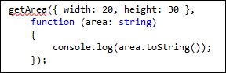

#### di [Andrea Boschin](http://mvp.microsoft.com/profiles/Andrea.Boschin) – Microsoft MVP

1.  {width="0.5938331146106737in"
    height="0.9376312335958005in"}

*Marzo, 2013*

Come indica il nome "TypeScript", una delle principali ragioni
dell'introduzione di questo linguaggio, è la necessità di risolvere uno
dei maggiori problemi di Javascript, ovvero la mancanza si un sistema di
tipi verificato staticamente. Dire che Javascript non sia tipizzato è un
errore, infatti nella realtà esso dispone di un certo numero di tipi, i
quali però vengono risolti a tempo di esecuzione e non a tempo di
compilazione. Questo può portare a errori comuni che si possono
verificare come vere e proprie eccezioni oppure come più subdoli errori
logici. Vediamo il seguente esempio:

1.  Typescript

<!-- -->

1.  1: var a = 10;

    2: var b = '32';

    3: console.log(a + b);

Il risultato di questo snippet Javascript è la implicita concatenazione
di stringhe che deriva dalla conversione del valore numerico 10 in
stringa per ottenere il risultato finale "1032" anzichè, come ci si
potrebbe attendere 42. In un linguaggio che ha il controllo dei tipi a
tempo di compilazione, questo tipo di operazione non sarebbe mai
arrivata all'esecuzione e il problema non si sarebbe posto. L'intervento
del compilatore sarebbe intervenuto indicando che è impossibile
applicare l'operatore '+' tra numerici e stringhe.

Pur prendendo origine da codice Javascript e producendo come output
sempre Javascript, Typescript ha l'intento di aggiungere questa verifica
statica, a tempo di compilazione, che prevenga gli errori suddetti
consentendo così la realizzazione di applicazione real-world in cui
sarebbe inamissibile/costoso il rischio di arrivare con un errore in
produzione. Il supporto al type-checking in Typescript inizia fin da
subito grazie alla capacità di inferire i tipi dall'utilizzo e applicare
il risultato di questa inferenza come vere e proprie dichiarazioni di
tipo. Vediamo uno snippet di esempio:

1.  Typescript

<!-- -->

1.  1: function getArea()

    2: {

    3: var width = 20;

    4: var height = '30';

    5: var area = width \* height / 2;

    6: alert(area);

    7: }

Il risultato della compilazione di questo codice - che ad una attenta
analisi contiene due palesi errori che Javascript rivelerebbe solo a
runtime - come facilmente intuibile è il seguente:

(5,15): Operator '\*' cannot be applied to types 'number' and 'string'\
(6,4): Supplied parameters do not match any signature of call target

In buona sostanza avviene proprio che il compilatore inferisce il tipo
delle variabili width, height e area e sulla base del risultato
determina che l'operazione di moltiplicazione "width \* height" e il
passaggio di un valore numerico ad "alert" sono errati. Possiamo
ovviamente correggere rapidamente l'errore e beneficiare dell'aiuto
offerto dal compilatore ma in Typescript possiamo anche tutelarci da
ulteriori errori esprimendo esplicitamente il tipo delle variabili come
segue:

1.  Typescript

<!-- -->

1.  1: function getArea()

    2: {

    3: var width: number = 20;

    4: var height: number = 30;

    5: var area: number = width \* height / 2;

    6: alert(area.toString());

    7: }

La differenza in questo caso non è immediatamente apprezzabile se non
nel fatto che, riproducendo l'errore precedente esprimendo il valore
'30' come stringa, l'errore sarà evidenziato nell'esatto punto in cui si
verifica:

(4,25): Cannot convert 'string' to 'number'

Il beneficio diventa più evidente se introduciamo dei parametri di
ingresso della funzione, ai quali venga applicato il calcolo:

1.  Typescript

<!-- -->

1.  1: function getArea(width, height)

    2: {

    3: return width \* height / 2;

    4: }

    5: 

    6: var area = getArea(20, '30');

    7: alert(area.toString());

Il problema in questo caso passa inosservato anche all'inferenza in
quanto i due parametri vengono interpretati di tipo "any". Quest'ultimo
è il tipo che Typescript adotta come "nativo" delle variabili Javascript
e ad esso è impossibile applicare alcuna verifica. Per questo motivo
l'operazione "width \* height" passa il controllo perchè "any" potrebbe
contenere un "number". A tutela di questa situazione esprimere il tipo
dei parametri è essenziale:

1.  Typescript

<!-- -->

1.  1: function getArea(width: number, height: number) : number

    2: {

    3: return width \* height / 2;

    4: }

    5: 

    6: var area = getArea(20, '30');

    7: alert(area.toString());

"any", "number", "string" e "bool" sono i soli tipi primitivi
disponibili in Typescript ma grazie ad essi il codice, come dimostra la
funzione qui sopra, risulta decisamente più solido e al sicuro da
sorprese.

Tuttavia Typescript è in grado di fare molto di più applicando il
concetto di "structural typing". Questo concetto è in grado, con il
minimo dispendio in termini di codice, di gestire anche i tipi impliciti
tipici di Javascript. Facciamo un esempio per chiarezza:

1.  Typescripts

<!-- -->

1.  1: function getArea(s: { width: number; height: number; }): number

    2: {

    3: return s.width \* s.height / 2;

    4: }

    5: 

    6: var area = getArea({ width: 20, height: 30 });

    7: console.log(area.toString());

In questo esempio la dichiarazione del parametro "s" impone che esso
debba avere almeno le proprietà "width" e "height". A questo parametro
sarà possibile passare l'istanza di qualunque tipo che soddisfi questo
requisito minimo. Nelle riga 6 ad esempio viene fornito un JSON che
rispetta questo vincolo. Rimuovendo l'uno o l'altro delle proprietà il
compilatore ci avviserà che il tipo non è conforme alle aspettative

1.  {width="6.5in"
    height="1.5340277777777778in"}

Inutile rimarcare l'utilità di questa caratteristica che ha un valore
decisamente importante nella tutela del codice. Ricordo che, pur se in
questo esempio l'intervento di Visual Studio rende più leggibile la
condizione di errore, è chiaro che essa è attribuibile al compilatore
perciò sarà evidenziata con un messaggio di errore anche se il codice è
scritto con un editor alternativo (notepad, Vim, Emacs, SublimeText,
etc...).

Interessante notare che, nella dichiarazione del parametro possiamo
rendere opzionale uno dei campi, salvo poi avere l'onere della verifica.
A titolo di esempio modifichiamo il tipo di cui sopra aggiungendo la
proprietà "color".

1.  Typescript

<!-- -->

1.  1: function getArea(s: { width: number; height: number; color?:
    string; }): number

    2: {

    3: if (typeof color !== "undefined")

    4: {

    5: // qui posso usare "color".

    6: }

    7: 

    8: return s.width \* s.height / 2;

    9: }

    10: 

    11: var area = getArea({ width: 20, height: 30 });

    12: console.log(area.toString());

La proprietà color, grazie all'utilizzo del carattere "?", è a tutti gli
effetti opzionale e di conseguenza alla riga 11, una istanza che
contiene solo "width" e "height" è perfettamente ammissibile.
Naturalmente all'interno del metodo sarà necessario effettuare il
controllo per "undefined" allo scopo di evitare errori.

La potenza dello "structural typing" è tale che potremmo applicarla non
solamente a proprietà, ma anche a funzioni e metodi. una delle
caratteristiche dei metodi Javascript, è spesso di richiedere il
passaggio come argomento di funzioni di callback. Mediante una opportuna
dichiarazione sarà possibile verificare la firma del metodo passato come
gestore del callback:

1.  Typescript

<!-- -->

1.  1: function getArea(

    2: s: { width: number; height: number; },

    3: callback: (area: number) =&gt; void): void

    4: {

    5: callback(

    6: s.width \* s.height / 2);

    7: }

    8: 

    9: getArea({ width: 20, height: 30 },

    10: function (area)

    11: {

    12: console.log(area.toString());

    13: });

In questo esempio è simulato una chiamata asincrona, in cui il metodo
gestore deve ricevere un valore di tipo "number". Il requisito è
espresso mediante la dichiarazione con l'operatore "=&gt;" (arrow), da
non confondere con le lambda expression di C\#. Passando come argomento
un metodo che non rispetti il requisito, il compilatore ci avviserà
puntualmente dell'anomalia:

1.  {width="3.0004188538932635in"
    height="0.9688856080489939in"}

E' del tutto evidente che i costrutti che abbiamo visto finora sono
propri di Typescript. Tali dichiarazioni rispettano i dettami delle
nascenti specifiche Ecmascript 6.0 ma a tutti gli effetti sono poi
trasformate in un codice che sarà compatibile con Ecmascript 3.0 o 5.0 a
scelta. Dato che queste ultime specifiche non supportano il controllo di
tipo al suo interno questo sarà rimosso ma lavorando sempre con
Typescript potremo beneficiare di un controllo "*not provably safe*" ma
sufficiente a consentirci una sicurezza molto più vicina a quella di un
linguaggio di alto livello.

#### di [Andrea Boschin](http://mvp.microsoft.com/profiles/Andrea.Boschin) - Microsoft MVP 

*twitter*: @aboschin

*blog italiano*: <http://blog.boschin.it>

*blog inglese*: http://xamlplayground.org

*facebook***:** <http://www.facebook.com/thelittlegrove>

*profilo***:** <http://slpg.org/AndreaBoschin>

Articolo pubblicato anche [sul Blog
italiano](http://blog.boschin.it/post/2013/03/18/Typescript-Static-type-checking.aspx)
