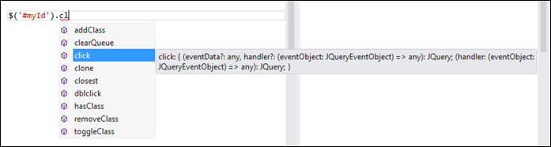

# Typescript e le librerie di terze parti


#### di [Andrea Boschin](http://mvp.microsoft.com/en-us/mvp/Andrea%20Boschin-4000289) – Microsoft MVP


*Giugno, 2013*

Una questione di fondamentale importanza, quando si lavora con
Javascript, è l'utilizzo delle più comuni librerie di terze parti. Se ne
possono nominare innumerevoli - tra le più conosciute troviamo as
esempio JQuery - e sicuramente ne rimarrebbero fuori altrettante. Gran
parte del successo di Javascript in effetti dipende dalla disponibilità
di questi insostituibili strumenti, più che dal linguaggio stesso. Nel
passare a Typescript, non è possibile immaginare il successo di un
linguaggio che non tenga conto di questa peculiarità, ed infatti,
cardine nella progettazione del linguaggio è stato proprio il fatto che
tali librerie potessero funzionare senza alcun tipo di modifica.

I definition file
-----------------

Se si prova ad analizzare con calma quello che ci si presenta davanti
agli occhi quando scriviamo in Typescript, diventa immediatamente chiaro
che, aldilà di un linguaggio efficace, c'è anche dell'altro. Proviamo ad
esempio, in un banale esercizio a scrivere quanto segue:

```typescript
var element: HTMLAnchorElement =

<HTMLAnchorElement>document.getElementById('myLink');

element.href = 'http://www.xamlplayground.org';
```

La specifica di HTMLAnchorElement, qui utilizzata sia come dichiarazione
di una variabile che come cast, in effetti rivela che vi è un substrato
di tipi definiti che ci supportano nella stesura del codice, consentendo
al compilatore di verificare che alle chiamate di proprietà e metodi
rispondano costrutti che esistono realmente. Ora, se siamo in Visual
Studio 2012, possiamo semplicemente andare con il cursore al tipo
HtmlAnchorElement e premere F12 (Go To Definition) per ottenere quanto
segue:

```typescript
interface HTMLAnchorElement extends HTMLElement,
    MSHTMLAnchorElementExtensions, MSDataBindingExtensions {
    rel: string;
    protocol: string;
    search: string;
    coords: string;
    hostname: string;
    pathname: string;
    target: string;
    href: string;
    name: string;
    charset: string;
    hreflang: string;
    port: string;
    host: string;
    hash: string;
    rev: string;
    type: string;
    shape: string;
    toString(): string;
}

declare var HTMLAnchorElement: {
    prototype: HTMLAnchorElement;
    new(): HTMLAnchorElement;
}
```

Il codice qui evidenziato, corrispondente alla dichiarazione del tipo
suddetto, è estrapolato da un file denominato "lib.d.ts". Questo file è
automaticamente incluso al momento della compilazione ed è anche
riconosciuto dall'intellisense di Visual Studio. Come si vede si tratta
di una semplice dichiarazione ma la sua utilità, assieme a le
innumerevoli altre presenti nel file, è di grande utilità per supportare
lo sviluppo all'interno di una pagina HTML, esponendo oggetti, metodi,
proprietà ed eventi.

I file di definizione in effetti possono essere facilmente redatti e
inclusi nella compilazione del proprio codice, per supportare qualunque
libreria di terze parti oppure propria. Infatti è importante ricordare
che qualunque spezzone di codice Javascript valido è anche un Typescript
valido, pertanto con il supporto di un file di definizione saremo
nettamente agevolati nell'utilizzo di tali librerie.

Una libreria a caso... JQuery
-----------------------------

Chiunque abbia sviluppato recentemente in Javascript non può esimersi
dal riconoscere le enormi potenzialità di JQuery, che consente
facilmente di interagire con il DOM della pagina e ottenere con
semplicità dei risultati anche molto efficaci e accattivanti. Ed è
scontato che la prima tentazione sarà quella di usare questa libreria in
congiunzione con Typescript. Vediamo quindi di soddisfare immediatamente
questa legittima esigenza e di spiegare nel contempo come comportarsi in
questo caso.

La prima attività da compiere è quella di includere nella pagina JQuery
stesso, prima del punto in cui il codice Javascript output del nostro
Typescript è incluso. Questa operazione è fatta come comune utilizzando
il tag &lt;script&gt; impostandone l'attributo "src" e serve a
consentire al browser di caricare la libreria. In termini di sviluppo
essa ha esclusivamente l'obbiettivo di consentirci il normale
funzionamento del software ma, dal punto di vista delle definizioni non
ha alcun effetto pratico. Per consentire al compilatore Typescript di
conoscere le definizioni occorre innanzitutto procurarsi il file di
definizione "jquery.d.ts". Esso è reperibile all'interno del repository
di Typescript, tra gli esempi.

<http://typescript.codeplex.com/sourcecontrol/latest#typings/jquery.d.ts>

Il file in questione è relativo la versione 1.7 della libreria quindi
occorre caricare nella pagina la corrispondente versione per essere
certi di non avere sorprese. Una volta che il file è incluso nella
soluzione esso deve essere referenziato dal nostro file Typescript con
una sintassi basata su un commento:

/// &lt;reference path="../Libs/typings/jquery/jquery.d.ts" /&gt;

Grazie a questa referenza il compilatore inizierà ad accorgersi della
presenza di tipi di JQuery e di conseguenza a fornire l'intellisense
come atteso:



Attenzione che la presenza di un file di definizione non ha solo lo
scopo di supportare lo sviluppo alimentando l'intellisense. La vera
utilità sta nel fatto che solo se il compilatore conosce i tipi sarà in
grado di validare il nostro codice. Scrivere del codice che usa JQuery
senza un file si definizione è pari a tentare di scrivere una classe C\#
senza gli opportuni "using"

E' del tutto evidente che la medesima tecnica può essere utilizzata
anche per creare delle proprie librerie da condividere tra differenti
progetti. Ma in tale caso potremmo anche esimerci dal utilizzare un file
di definizioni, per collegare direttamente la libreria al sorgente:

/// &lt;reference path="../Libs/Utils.ts" /&gt;

E' chiaro che all'interno di questo file importato dovremo organizzare i
tipi secondo dei namespace opportunamente organizzati per facilitarne
l'utilizzo.

```typescript
/// <reference path="typings/jquery/jquery.d.ts" 

module Utils
{
    export class Page
    {
        run(): void
        {
            $(() => this.onLoad());
        }

        onLoad(): void { }
    }
}
```

Nello snippet si vede l'utilizzo di "module" per creare un namespace.
All'interno di esso ciascuna classe che è marcata con "export" (ma
attenzione che vale anche per proprietà, metodi, tipi statici e anche
semplici variabili) diverrà visibile all'esterno. Questo consente una
ottima organizzazione, mediante un corretto incapsulamento di tipi
privati che supportano tipi pubblici. Nello stesso esempio si può vedere
anche l'uso di una referenza a jquery.d.ts.

Spesso e volentieri ci si trova nell'esigenza di includere sempre i
medesimi file, e quindi a replicare potenzialmente all'infinito le
referenze. In tale caso sarà consigliabile creare un file references.ts
che contenga le referenze utilizzate da tutti i componenti. A questo
punto sarà sufficiente collegare sempre tale file a tutti i sorgenti e
avremmo il beneficio di aver accentrato la definizione in un unico
punto.

E le altre librerie?
--------------------

Una volta compreso il meccanismo che sta alla base dei definition file,
l'ultima cosa che rimane da fare è procurarsi le definizioni per le
librerie di cui si necessita. Dato che pensare di scriversi in proprio
una definizione è piuttosto azzardato e richiede un tempo e una
attenzione di cui raramente si dispone, bisogna indirizzarsi alla rete.
In particolare, su github esiste una collezione di definizioni molto
estesa e aggiornata che potete trovare a questo indirizzo:
<https://github.com/borisyankov/DefinitelyTyped>. Ma, da utenti di
Visual Studio la cosa migliore è di accedere a nuget e cercare
"Definitelytyped" associato al nome della libreria di cui si cercano le
definizioni. Grazie a nuget sarà possibile accedere direttamente alle
definizioni ed agganciarle al progetto.

#### di [Andrea Boschin](http://mvp.microsoft.com/en-us/mvp/Andrea%20Boschin-4000289) - Microsoft MVP 

*twitter*: @aboschin

*blog italiano*: <http://blog.boschin.it>

*blog inglese*: <http://xamlplayground.org>

*facebook***:** <http://www.facebook.com/thelittlegrove>

*profilo***:** <http://slpg.org/AndreaBoschin>

Articolo pubblicato anche [sul Blog
italiano](http://blog.boschin.it/post/2013/06/07/Typescript-e-le-librerie-di-terze-parti.aspx)


