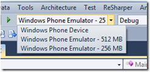
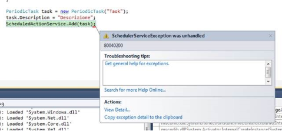
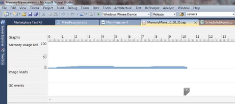
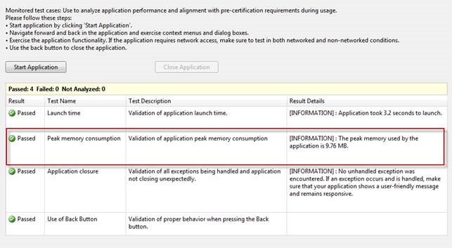

# Come rendere le proprie applicazioni con i nuovi device di fascia bassa

#### di [Matteo Pagani](https://mvp.microsoft.com/profile/Matteo.Pagani), Microsoft MVP


*Settembre 2012*

In questo articolo vedremo come i tool e il sistema operativo si sono
aggiornati per supportare questa nuova generazione di device. Nel corso
dell’articolo ho introdotto la nuova modalità con cui, da codice, siamo
in grado di determinare la tipologia di device su cui sta girando la
nostra applicazione: ora vedremo in concreto i casi da gestire a seconda
della quantità di memoria disponibile.

L’emulatore
-----------

Per poter testare le nostre applicazioni su entrambe le tipologie di
device senza doverli fisicamente possedere la nuova versione dei tool di
sviluppo include un nuovo emulatore, in grado di simulare la presenza di
512 o 256 MB di RAM.

L’utilizzo è molto semplice: avete presente il menu a tendina incluso in
Visual Studio che vi permette di specificare il target del deploy tra
Windows Phone Device e Windows Phone Emulator? Questo menu è stato
modificato, per supportare, oltre ovviamente al device, anche le due
nuove tipologie di emulatore, come potete vedere nell’immagine:




Una volta lanciato l’emulatore, questi si comporterà come se avesse il
limite di memoria che avete scelto, restituendo perciò un’eccezione nel
momento in cui lo superate oppure nel caso in cui stiate usando qualche
funzionalità non consentita sui device di fascia bassa.

Come identificare il tipo di device da codice
---------------------------------------------

La strada migliore per poter supportare qualsiasi tipo di device è
quella di migliorare il più possibile le performance della nostra
applicazione, stando attenti agli sprechi e a consumi eccessivi che
potrebbero essere risolti magari semplicemente con una progettazione
migliore.

Ci sono però alcuni casi in cui proprio non è possibile ridurre il
consumo di memoria, ad esempio perchè state utilizzando elementi
multimediali (audio, video, immagini, ecc.) ad alta qualità. Quello che
possiamo fare perciò, ad esempio, è non caricare determinate elementi
oppure utilizzane degli altri di qualità inferiore. In questo caso ci
serve però un meccansimo per riconoscere su che tipo di device è in
esecuzione la nostra applicazione e, proprio per questo motivo,
Microsoft ha aggiunto una nuova proprietà che ci restituisce la quantità
massima di RAM disponibile all’applicazione stessa.

Per ottenere questa informazione dobbiamo usare la classe
**DeviceExtendedProperties**, disponibile sin dalla prima versione di
Windows Phone, che ci permette di estrarre tutta una serie di dati
riguardo al device come, ad esempio, l’ID univoco del device, la
versione del firmware, ecc.

Nell’ultimo aggiornamento del sistema operativo è stata inclusa una
nuova proprietà, chiamata **ApplicationWorkingSetLimit**, che
rappresenta la massima quantità di memoria utilizzabile da
un’applicazione. Tale valore sarà sempre inferiore ai 90 MB per i device
con 256 MB di RAM: vi basta perciò recuperare questa proprietà per
capire la tipologia di device. Vediamo come fare:

```C#
long memory = (long)DeviceExtendedProperties.GetValue("ApplicationWorkingSetLimit");
```

Questa istruzione vi restituirà la massima quantità di memoria
utilizzabile dall’applicazione espressa in byte: il valore di
riferimento è 94371840, che corrisponde a 90 MB (vi ricordo infatti che
1 KB corrisponde a 1024 byte, perciò non si tratta di un mulitplo
preciso di 10).

La proprietà **ApplicationWorkingSetLimit** è disponibile però solo sui
device che hanno già ricevuto l’update all’ultima versione di Windows
Phone: può verificarsi perciò che la riga di codice riportata sopra
restituisca un’eccezione di tipo **ArgumentOutOfRangeException**. In
questa situazione avrete la certezza di trovarvi in presenza di un
dispositivo con 512 MB di RAM (dato che i device di nuova generazione
dotati di una quantità di RAM inferiore usciranno già in commercio con
la versione più recente del sistema operativo). Per gestire questa
casistica, la classe **DeviceExtendedProperties** espone un metodo
**TryGetValue**, che accetta un ulteriore parametro in out. Cosa
significa? Che il metodo proverà a recuperare l’informazione richiesta
e, in caso non si verifichino errori, andarà a salvarne il risultato
nella variabile che abbiamo contrassegnato come **out**. In caso
contrario, non si verificherà alcuna eccezione ma semplicemente il
metodo restituirà **false** e la variabile indicata come **out** sarà
impostata a **null**. Il codice seguente fa esattamente questa cosa:
dopo aver dichiarato preventivamente una variabile di nome **memory**,
cerchiamo di recuperare il valore della proprietà
**ApplicationWorkingSetLimit**. Se il valore della variabile **memory**
è a null oppure superiore a 94371840, allora siamo in presenza di un
device dotato di 512 MB di RAM; in caso contrario, si tratta di uno dei
nuovi device da 256 MB.

```C#
object memory;

DeviceExtendedProperties.TryGetValue("ApplicationWorkingSetLimit", out memory);

if (memory == null || (long)memory &gt; 94371840)
{
MessageBox.Show("Device con 512 MB di RAM");
}
else

{
MessageBox.Show("Device con 256 MB di RAM");
}
```

Identificare il tipo di device usando la classe IsolatedStorageSettings
-----------------------------------------------------------------------

Si può evitare di utilizzare Il codice mostrato nel post precedente per
identificare il tipo di device tutte le volte che è necessario: si
tratta infatti di un tipo di informazione che possiamo richiedere
all’avvio dell’applicazione e poi mantenere in memoria o, ancora meglio,
salvare nello storage e riutilizzarla per le esecuzioni successive. E’
decisamente improbabile, infatti, che un device dotato di 256 MB di RAM
possa essere aggiornato e montare un quantitativo di memoria superiore.

Per fare questo, possiamo sfruttare la classe
**IsolatedStorageSettings**, che chi sviluppa applicazioni per Windows
Phone dovrebbe già conoscere bene: si tratta infatti di un’astrazione
dello storage dell’applicazione per leggere e scrivere in maniera
semplice e veloce informazioni identificate da una chiave univoca
(concettualmente, si tratta di un Dictionary). Il vantaggio è che,
basandosi sullo storage, queste informazioni verranno memorizzate in
maniera permanente, perlomeno fino a quando l’utente non disinstallerà
l’applicazione.

Ecco un esempio:

```C#
private bool isLowMemoryDevice;

public bool IsLowMemoryDevice
    {
    get
        {
        if (IsolatedStorageSettings.ApplicationSettings.Contains("IsLowMemDevice"))
            isLowMemoryDevice = (bool)IsolatedStorageSettings.ApplicationSettings["IsLowMemDevice"];
        else
            {
            object memory;

            DeviceExtendedProperties.TryGetValue("ApplicationWorkingSetLimit", out memory);

            if (memory == null || (long)memory > 94371840)
                {
                IsolatedStorageSettings.ApplicationSettings["IsLowMemDevice"] = false;
                isLowMemoryDevice = false;
                }
            else
                {
                IsolatedStorageSettings.ApplicationSettings["IsLowMemDevice"] = true;
                isLowMemoryDevice = true;
                }
            }
        return isLowMemoryDevice;
        }
    }
```

Con questo semplice meccanismo ci basterà recuperare in qualsiasi
momento il valore della proprietà **IsLowMemoryDevice**, che ci
restituirà true se si tratta di un device con 256 MB di RAM, in caso
contrario false. Il vantaggio è che non andremo ad interrogare tutte le
volte la classe **DeviceExtendedProperties**: verrà fatto solo alla
prima richiesta, dopo di che il valore verrà recuperato direttamente
dallo storage.

Background agents
-----------------

I background agents di tipo periodico (ovvero i Periodic task e i
Resource Intensive tasks) sono l’unica feature di Windows Phone 7.5 che
non è disponibile sui device con 256 MB di RAM: questo perchè, a causa
della ridotta quantità di memoria disponibile, l’utilizzo di servizi in
grado di girare in background potrebbe avere un impatto considerevole
sulle prestazioni delle applicazioni in uso.

Se la vostra applicazione fa uso di un background agent, vi trovate
nella situazione in cui dovete identificare la quantità di memoria
disponibile nel device: se cercate infatti di aggiungere allo
**ScheduledActionService** (la classe che rappresenta il gestore dei
task in background in Windows Phone) un **PeriodicTask** o un
**ResourceIntensiveTask** si scatenerà un’eccezione di tipo
**SchedulerServiceException** con codice di errore 80040200.




Sfruttando la proprietà che abbiamo definito prima, il nostro codice
dovrebbe diventare qualcosa del genere:

```C#
if (!IsLowMemoryDevice)
    {
    PeriodicTask task = new PeriodicTask("Task")
        {
        Description = "Description of the task"
        };
    ScheduledActionService.Add(task);
    }
```

Qualche considerazioni sui giochi
---------------------------------

I giochi sviluppati con XNA sono sicuramente quelli che possono soffrire
di più di questo limite, dato che tradizionalmente sono le applicazioni
che richiedono maggiore memoria a causa dell’utilizzo di grafica 3D,
suoni, musica, texture, ecc.

Alcuni consigli per ridurre il consumo di memoria ci arrivano
direttamente dalla documentazione Microsoft:

- Valutare bene la qualità dei sample audio che si utilizzano. I
    giochi per Windows Phone vengono utilizzati in device dotati di una
    potenza di riproduzione audio inferiore rispetta a quella di una
    console, ad esempio: non sempre è necessario perciò utilizzare la
    massima qualità possibile.

- Limitare il numero di sample audio utilizzati, cercando di
    riutilizzare il più possibile quelli già allocati in memoria.

- Ricordarsi di effettuare il dispose degli oggetti di tipo
    SoundEffect una volta che si è terminato di usarli.


Qualche considerazione sulle applicazioni
-----------------------------------------

Le applicazioni “tradizionali” (tipicamente basate su Silverlight)
possono soffrire meno di questa limitazione, dato la minore necessità di
risorse: questo non significa però che non si debba stare attenti alle
performance, soprattutto nell’utilizzo di alcuni controlli o in presenza
di una grande quantità di dati da manipolare e visualizzare.

In particolare, i controlli **Web Browser** e **Bing Maps** possono
avere un impatto non indifferente sulla quantità di memoria utilizzata,
perciò se li utilizzate all’interno della vostra applicazione
assicuratevi che non ci siano problemi anche con i device dotati di 256
MB di RAM. In caso affermativo, una possibile soluzione è quella di
utilizzare i launcher appositi (**WebBrowserTask** e **BingMapsTask**)
che, demandando l’operazione alle applicazioni native di Windows Phone,
non vanno ad incidere sulla quantità di memoria utilizzata dalla vostra
applicazione.

Un’altra considerazione è relativa alle liste: è facile rischiare di
saturare la memoria se la nostra lista contiene una grande quantità di
dati, o utilizza un template che mostra molte informazioni (magari anche
complesse come immagini).

Il consiglio in questi casi è di ridurre al minimo indispensabile le
informazioni mostrate nel template (delegandole magari alla pagina di
dettaglio) e, eventualmente, implementare un meccanismo di paginazione,
in modo che in memoria vengano mantenuti solamente i dati correntemente
visualizzati.

Come testare le performance?
----------------------------

L’SDK di Windows Phone ci mette a disposizione due tool per ottimizzare
le performance e capire l’effettivo consumo di memoria della nostra
applicazione:

**Windows Phone Performance Analysis** è un tool integrato nell’SDK
    a partire dalla versione 7.1 ed è un profiler molto potente che
    permette di valutare il consume effettivo di memoria, CPU e risorse
    di sistema della nostra applicazione. L’utilizzo è molto semplice:
    dopo aver collegato il nostro device, ci basta andare da Visual
    Studio nel menu **Debug** e scegliere l’opzione **Start Windows
    Phone Performance Analysis**. A questo punto potremo scegliere il
    tipo di analisi (relativa all’esecuzione o all’uso di memoria) e
    lanciare il profiler: l’applicazione verrà lanciata sul telefono e
    noi dovremo utilizzarla come se fossimo un utente normale. Una volta
    terminato, possiamo premere il pulsante **Stop profiling** in Visual
    Studio: il profiler elaborerà i dati raccolti e ce li presenterà
    sotto forma di grafico. Nell’immagine qui sotto potete vedere un
    esempio di profiling della memoria utilizzata da un’applicazione di
    test:




Vi suggerisco [il seguente post sul
blog](http://windowsteamblog.com/windows_phone/b/wpdev/archive/2012/02/01/memory-profiling-for-application-performance.aspx)
del team di Windows Phone per approfondire l’argomento.

**Il Marketplace Test Kit**: sempre a partire dalla versione 7.1 dei
    tool di sviluppo l’SDK include il Marketplace Test Kit, ovvero lo
    strumento utilizzato dal team di certificazione del marketplace per
    effettuare tutt i test automatici che precedono la validazione
    di un’applicazione. Tra questi test c’è anche quello relativo al
    consumo della memoria: l’approccio è simile a quello del profiler
    spiegato in precedenza. Cliccando con il tasto destro su un
    progetto, possiamo accedere al tool dalla voce **Open Marketplace
    Test Kit**: da lì possiamo accedere ai **Monitored Test** e, dopo
    aver collegato un device, lanciare il tutto con il pulsante **Start
    Application**. Anche in questo caso dovremmo utilizzare
    l’applicazione normalmente, per poi terminare il test con il
    pulsante **Close Application**. La differenza sarà che come
    risultato avremo semplicemente il consumo massimo di memoria
    raggiunto dall’applicazione, come nell’immagine seguente:

   


E se non posso ridurre il consumo di memoria?
---------------------------------------------

Ci possono essere particolari tipologie di applicazioni per cui non è
possibile in alcun modo ridurre il consumo di memoria sotto i 90 MB: un
gioco particolarmente elaborato, oppure un’applicazione fortemente
legata all’utilizzo di background agent e che, senza di questi,
perderebbe di valore.

In questi casi, abbiamo la possibilità di specificare nel file di
manifest (WMAppManifest.xml) che la nostra applicazione utilizza più di
90 MB di RAM, evitando così che chi ha un device con 256 MB di RAM possa
scaricarla dal Marketplace.

Per farlo, vi basta aggiungere il seguente blocco all’interno del nodo
**App** del file **WMAppManifest.xml** (contenuto all’interno della
cartella **Properties** di un progetto Windows Phone):

```XML
    <Requirements>
        <Requirement Name="ID\_REQ\_MEMORY\_90" />
    </Requirements>
```
Se siete sicuri che la vostra applicazioni utilizzi più di 90 MB di RAM,
è molto importante che vi ricordiate di aggiungere questa dichiarazione:
in caso contrario, anche gli utenti con 256 MB di RAM potranno
scaricarla e magari lasciarvi delle recensioni negative perchè
sperimentano problemi di crash che non sono legati a bug della vostra
applicazione, ma al quantitativo di memoria usata.

#### di [Matteo Pagani](https://mvp.microsoft.com/profile/Matteo.Pagani), Microsoft MVP


