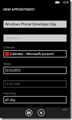
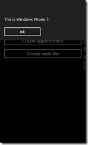
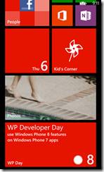

# Supportare i dispositivi Windows Phone 8 da un’applicazione Windows Phone 7.x

#### di Matteo Pagani - Microsoft MVP


*Febbraio 2013*

Windows Phone 8 è ormai una realtà: da più di un mese è disponibile la
nuova versione dell’SDK, per sviluppare applicazioni per la nuova
piattaforma ed è possibile trovare nei negozi i device di nuova
generazione.

Windows Phone 8 presenta molte novità, in particolare per quanto
riguarda quello che sta “dietro le quinte”: Microsoft ha abbandonato il
vecchio kernel, basato sul core di Windows Mobile, per introdurre un
kernel più moderno, basato su quello di Windows 8. Di conseguenza, anche
l’architettura è profondamente cambiata: non troviamo più Silverlight e
il framework .NET, ma il Windows Runtime.

Allo scopo però di non costringere gli sviluppatori a riscrivere
completamente le loro applicazioni per supportare la nuova piattaforma
Microsoft ha introdotto due importanti feature:

- La **quirk mode:** grazie ad un mapping tra le vecchie API e quelle
nuove, tutte le applicazioni Windows Phone 7.x sono in grado di
funzionare su Windows Phone 8 nel 99% dei casi senza alcuna modifica.
- Le **.NET API for Windows Phone**, ovvero una serie di librerie
presenti nel Windows Runtime che corrispondono a quelle che erano
presenti in Windows Phone 7. In questo modo, nel momento in cui uno
sviluppatore decide di portare il proprio progetto su Windows Phone 8,
si può concentrare sull’implementazione delle nuove feature, senza dover
riscrivere il codice realizzato in precedenza.

Il modo migliore per sfruttare le novità di Windows Phone 8 è aggiornare
il nostro progetto alla nuova versione, tramite l’opzione disponibile in
Visual Studio.

Questo approccio richiede però allo sviluppatore di mantenere due
progetti differenti per la stessa applicazione, dato che le applicazioni
Windows Phone 8 non sono compatibili con le versioni precedenti del
sistema operativo. In alcuni casi, il costo di questa operazione può
essere troppo oneroso, soprattutto nel caso in cui la vostra
applicazione rientri in una categoria tale per cui non sarebbe in grado
di trarre particolari benefici dalle nuove feature.

Nel corso di questo articolo andremo a vedere due soluzioni che ci
permetteranno di mantenere un unico progetto per Windows Phone 7, ma di
adattarlo affinchè anche i possessori di un device Windows Phone 8
possano sfruttare al meglio la nostra applicazione.

Supportare le nuove risoluzioni
===============================

Una delle novità principali di Windows Phone 8 è il supporto a
risoluzioni superiori rispetto a quella originale, ovvero 800x480. Di
conseguenza l’iconografia utilizzata nel nostro progetto non è pensata
per alte risoluzioni e, soprattutto se abbiamo utilizzato immagini di
scarsa qualità, un utente in possesso di un device con risoluzione
1280x768 o 1280x720 potrebbe notarlo.

Di conseguenza Microsoft ha modificato i controlli effettuati dai test
automatici dello store: ora è possibile caricare nel proprio progetto
immagini per l’iconografia richiesta (tile e icona nell’elenco delle
applicazioni installate) con una risoluzione superiore, ovvero 336x336
per le tile e 99x99 per l’icona.

In questo modo anche chi è in possesso di un device di nuova generazione
potrà beneficiare di immagini di alta qualità.

Vi basta sovrascrivere le immagini originali utilizzandone di nuove a
risoluzione più alta, preparare un nuovo XAP e fare submit dell’update
sullo store.

Utilizzare alcune feature di Windows Phone 8
============================================

Tramite un meccanismo chiamato **reflection** esiste la possibilità di
sfruttare alcune feature di Windows Phone 8 da un’applicazione Windows
Phone 7.x, nel caso in cui questa sia in esecuzione su un device di
nuova generazione.

In cosa consiste questo meccanismo? La reflection permette di utilizzare
metodi, proprietà e classi contenuti all’interno di una libreria DLL
senza che questa sia referenziata direttamente dal progetto Visual
Studio. Con questa procedura è possibile interagire con alcune delle
nuove librerie di Windows Phone 8 direttamente da un progetto Windows
Phone 7.x, nonostante Visual Studio non sia in grado di mostarle.

Le feature che è possibile utilizzare con questo approccio sono:
- I nuovi launcher e chooser (come quelli per aggiungere un appuntamento
al calendario o accedere al download delle mappe).
- I nuovi formati e template di tile.

L’utilizzo della reflection è più complicato rispetto all’uso di una
libreria nella maniera tradizionale: dato che non c’è una reference, non
abbiamo a disposizione l’intellisense e non possiamo creare oggetti e
invocare metodi come siamo abituati a fare normalmente.

Per questo motivo Rudy Hyun, MVP su Windows Phone, ha sviluppato una
libreria chiamata **Mangopollo** (il curioso nome deriva dall’incrocio
tra Mango, il nome in codice di Windows Phone 7.5, e Apollo, il nome in
codice di Windows Phone 8), che contiene una serie di classi e metodi
che fanno da “wrapper” alle operazioni effettuate tramite reflection e
consentono di interagire con queste funzionalità utilizzando l’approccio
tradizionale a cui siamo abituati.

Mangopollo è un progetto open source e disponibile su
[*Codeplex*](http://mangopollo.codeplex.com/) e su NuGet in due
versioni: **Mangopollo** e **Mangopollo.Light**. La differenza tra i due
è che la seconda versione contiene solo le librerie necessarie per
interagire con le nuove tipologie di tile e può essere usata, perciò,
anche in un background agent, così da poter aggiornare periodicamente le
nuove tile, utilizzando le notifiche locali.

Il metodo più semplice per aggiungere Mangopollo al vostro progetto è
utilizzare NuGet: cliccate con il tasto destro sul vostro progetto per
Windows Phone 7.5, selezionate **Manage NuGet packages** e cercate e
installate il package chiamato **Mangopollo.**

A questo punto avete la possibilità di interagire con i nuovi launcher e
chooser (contenuti nel namespace **Mangopollo.Tasks**) e i nuovi formati
di tile (tramite le classi contenute nel namespace
**Mangopollo.Tiles**).

Vediamo due esempi di utilizzo di questa nella libreria: nel primo caso
andremo ad utilizzare il launcher **SaveAppointmentTask** per dare la
possibilità all’utente di aggiungere un nuovo appuntamento al
calendario.

Utilizzare i launcher

Ecco un esempio di codice dell’utilizzo del launcher
**SaveAppointmentTask:**

```C#
private void OnCreateAppointmentClick(object sender, RoutedEventArgs e)
    {
    if (Utils.IsWP8)
        {

        SaveAppointmentTask task = new SaveAppointmentTask();

        task.Subject = "Windows Phone Developer Day";

        task.StartTime = new DateTime(2012, 12, 5);

        task.IsAllDayEvent = true;

        task.Show();

        }
    else

        {

        MessageBox.Show("This is Windows Phone 7!");

        }

    }
```

La prima cosa da fare prima di utilizzare le nuove feature è verificare
che ci troviamo effettivamente in presenza di un device Windows Phone 8,
in caso contrario otterremmo un errore.

Lo facciamo tramite il booleano **Utils.IsWP8**: nell’esempio, in caso
contrario, mostriamo un semplice messaggio di avvertimento.

In caso invece sia un telefono Windows Phone 8 creiamo un nuovo oggetto
di tipo **SaveAppointmentTask** e definiamo alcune proprietà che
definiscono le caratteristiche dell’appuntamento: il titolo, la data e
così via. La definizione dei launcher e chooser di Mangopollo rispecchia
quella di Windows Phone 8: i nomi di classi e metodi corrispondono a
quelli esposti dalle API disponibili nella nuova SDK.

Infine, invochiamo il chooser chiamando il metodo **Show**. Ora testiamo
l’applicazione utilizzando entrambi gli emulatori disponibili: quello di
Windows Phone 8 e quello di Windows Phone 7.

Nel primo caso, vedremo in azione il launcher che ci permetterà di
completare i dettagli dell’appuntamento e salvarlo nel calendario; nel
secondo, invece, comparirà il messaggio di avvertimento che abbiamo
preparato.





Interagire con le tile
======================

Windows Phone 8 supporta tre nuovi formati di tile e tre nuovi template.
I formati sono:

- **Small**: l’icona ha una dimensione di ¼ rispetto a quella originale.

- **Medium**: è la dimensione tradizionale delle icone di Windows Phone 7.

- **Wide**: è la dimensione rettangolare, che occupa lo spazio di due
tile Medium affiancate.

I template, invece, sono:

- **Flip**: è il template che era già disponibile in Windows Phone 7 e
che consente di inserire informazioni (immagini o testi) sul fronte e
sul retro della tile, la quale ruoterà periodicamente per mostrarle.
- **Cycle**: è possibile includere fino a 9 immagini, che vengono
mostrate a rotazione nella tile.
- **Iconic**: permette di ricreare tile con lo stesso look & feel di
quelle native, come Mail o Messages. Supporta la possibilità di
visualizzare un’icona, un contatore o del testo.

Come sviluppatori, oltre a poter scegliere il template, abbiamo la
possibilità di interagire con le tile a seconda del loro formato:
possiamo mostrare del contenuto supplementare nel caso in cui l’utente
utilizzi un formato più grande, ad esempio.

Vediamo ora un esempio di codice di utilizzo del template **Iconic**,
rappresentato dalla classe **IconicTileData,** per creare una tile
secondaria.

```C#
private void OnCreateWideTileClick(object sender, RoutedEventArgs e)
    {
        if (Utils.IsWP8)
        {
            var tile = new IconicTileData
            {
            Title = "WP Day",
            Count = 8,
            BackgroundColor = Colors.Transparent,
            IconImage = new Uri("/Assets/Tiles/IconicTileMediumLarge.png", UriKind.Relative),
            SmallIconImage = new Uri("/Assets/Tiles/IconicTileSmall.png",
            UriKind.Relative),
            WideContent1 = "WP Developer Day",
            WideContent2 = "use Windows Phone 8 features",
            WideContent3 = "on Windows Phone 7 apps"
            }.ToShellTileData();

            ShellTileExt.Create(new Uri("/MainPage.xaml?Id=5", UriKind.Relative), tile, true);
        }
        else
        {
            MessageBox.Show("This is Windows Phone 7");
        }
    }
```

Il codice è racchiuso all’interno di un controllo analogo a quello visto
nell’esempio è precedente: andiamo ad eseguire l’operazione solo se ci
troviamo in presenza di un dispositivo Windows Phone 8.

Se avete già avuto modo di lavorare con le tile il codice vi sarà
familiare: creiamo un nuovo oggetto di tipo **IconicTileData** (che
rappresenta il template Iconic) e andiamo a valorizzare una serie di
proprietà che rappresentano le informazioni mostrate sulla tile.
Possiamo notare che andiamo a valorizzare anche tre proprietà
caratterizzate dal prefisso **WideContent:** queste informazioni saranno
mostrate solo nel momento in cui l’utente sceglierà di utilizzare il
formato Wide.

La tile secondaria viene effettivamente creata sfruttando il metodo
**Create** della classe **ShellTileExt,** che funziona esattamente come
la classe nativa **ShellTile** ma fa parte di Mangopollo e supporta
alcune informazioni specifiche per le nuove tile: tra i parametri
passati, infatti, troviamo (oltre all’url che rappresenta il deep link
della tile e il template) anche un booleano, che indica se la tile
supporta la modalità wide oppure no.

Anche in questo caso se eseguiamo il codice sull’emulatore Windows Phone
8 l’applicazione uscirà e sarà creata la nuova tile: se proviamo a
giocare con i vari formati ci accorgeremo che, nel momento in cui
passiamo al formato wide, saranno mostrate le informazioni che abbiamo
specificato usando le proprietà **WideContent.** Se invece lo eseguiamo
sull’emulatore Windows Phone 7 otterremo il solito messaggio di
avvertimento.




E se invece volessimo aggiornare la tile? E’ molto semplice, come
possiamo vedere nell’esempio:

```C#
private void OnUpdateTileClick(object sender, RoutedEventArgs e)
    {
        if (Utils.IsWP8)
        {

            IconicTileData tile = new IconicTileData
            {
            WideContent1 = "This is the new content",
            WideContent2 = "The tile has been updated",
            WideContent3 = "with success"
            };

        Uri navigationUri = new Uri("/MainPage.xaml?Id=5", UriKind.Relative);
        ShellTile.ActiveTiles.FirstOrDefault(x => x.NavigationUri == navigationUri).Update(tile);
        }
    }
```

Ci limitiamo a creare un nuovo template utilizzando sempre la classe
**IconicTileData** e andando a valorizzare solo le proprietà che
vogliamo modificare rispetto alla definizione originale del template
(nell’esempio, il testo mostrato nella tile wide).

Dopodichè la procedura di aggiornamento segue l’approccio standard che
abbiamo imparato a conoscere in Windows Phone 7.5 ed è indipendente dal
template utilizzato: si recupera la tile da aggiornare dalla collezione
**ShellTile.ActiveTiles** in base all’Uri di navigazione e si chiama il
metodo **Update** passando il template aggiornato. Dato che questo
metodo accetta un parametro di tipo **ShellTileData**, che è la classe
base dalla quale ereditano tutti i template di Windows Phone, possiamo
passare uno qualsiasi dei tipi dei template supportati, anche quelli
nuovi definiti in Mangopollo.

Il codice di aggiornamento che abbiamo appena visto può essere
utilizzato anche all’interno di un background agent, affinchè la tile
venga aggiornata periodicamente: l’unica accortezza, come sottolineato
nell’introduzione, è che installiate il package **Mangopollo.Light**
all’interno del progetto del vostro agent.

In conclusione
==============

In questo articolo abbiamo visto come poter sfruttare alcune feature di
Windows Phone 8 da un’applicazione Windows Phone 7, dandovi la
possibilità di migliorare l’esperienza d’uso degli utenti che hanno
acquistato un device di nuova generazione senza costringervi a mantenere
due progetti differenti.

Si tratta di una soluzione molto valida, anche se ovviamente mostra dei
limiti rispetto al vero e proprio aggiornamento del progetto a Windows
Phone 8: le nuove feature non si limitano infatti ai launcher e ai
chooser o alle nuove tile, ma comprendono tanti, tantissimi scenari
(come il supporto a NFC, Wallet, o le Lens Apps) che non sono
disponibili utilizzando le strategie presentate nel corso dell’articolo.

Sta a voi (e alla tipologia della vostra applicazione) scegliere la
strada più adatta! Di seguito trovate la possibilità di scaricare un
progetto di esempio.

#### di Matteo Pagani ([blog](http://www.qmatteoq.com/)) – Microsoft MVP


