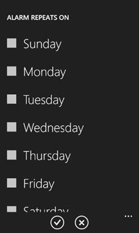
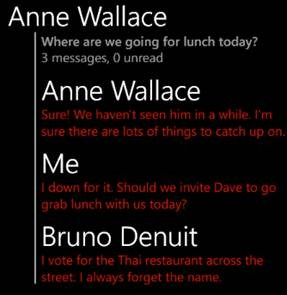
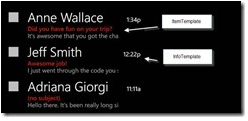
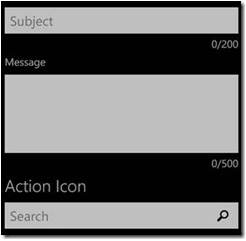

#### di [Matteo Pagani](https://mvp.support.microsoft.com/profile=19D4248B-0204-4B23-AC27-62CD4E60A569)

1.  {width="0.5938331146106737in"
    height="0.9376312335958005in"}

*Marzo 2012*

Sin dalla prima release il Silverlight Toolkit si è dimostrato uno dei
“migliori amici” di ogni sviluppatore Windows Phone: ricco di controlli
e utility (molte delle quali utilizzate direttamente nelle applicazioni
native), è usato al giorno d’oggi in tantissime tra le applicazioni
disponibili sul Marketplace.

Complice l’imminente uscita di Mango, la nuova versione di Windows Phone
per cui è disponibile la versione Release Candidate dell’SDK e per cui è
già possibile pubblicare applicazioni sul Marketplace, alla fine di
Agosto è stata rilasciata una nuova versione del toolkit, pienamente
compatibile con la nuova versione.

Oltre alla compatibilità con Mango (ad esempio, i controlli come
DatePicker ora supportano tutte le nuove lingue) e una serie di notevoli
miglioramenti nelle performance, questa nuova release porta con sé
diversi nuovi controlli, molti dei quali vengono già utilizzati nelle
nuove applicazioni native.

In questo articolo vedremo in dettaglio quali sono questi controlli e
come utilizzarli all’interno delle nostre applicazioni. Per una
panoramica sui controlli già presenti nelle precedenti release potete
fare riferimento ad una serie di articoli pubblicati sul mio blog.

Date & Time Converter
---------------------

I Converter sono una delle feature più utili di Silverlight e consiste
nella possibilità di creare delle classi (le quali ereditano
dall’interfaccia IValueConverter) in grado di ricevere un dato in input
in un’operazione di binding e di elaborarlo prima di visualizzarlo.

Il nuovo toolkit include una serie di converter già pronti molto utili
se dobbiamo lavorare con date e ore. Nello specifico, ecco i converter
disponibili:

1.  **RelativeTimeConverter**: produce una stringa di testo con la
    rappresentazione relativa rispetto alla data corrente (ad esempio,
    “5 minuti fa”, “10 giorni fa”, ecc.)

    **ListViewDateTimeConverter**: produce una stringa di testo che non
    include mai l’anno, ma solo un riferimento temporale variabile in
    base a quanto tempo è trascorso rispetto alla data corrente
    (dall’ora in caso di un DateTime molto vicino alla coppia giorno /
    mese in caso di una data più lontata nel tempo).

    **FullViewDateTimeConverter**: produce una stringa di testo con la
    rappresentazione completa di data e ora, ma senza includere l’anno
    (ad esempio, Giò 2/9 17:25)

    **HourlyDateTimeConverter**: produce una stringa di testo con una
    rappresentazione che include sempre l’ora. Il formato della data è
    invece variabile rispetto a quanto tempo è trascorso rispetto alla
    data corrente (può non essere inserita del tutto in caso di DateTime
    relativi al giorno stesso, oppure essere visualizzata nel formato
    esteso giorno / mese / anno nel caso di date passate).

    **DailyDateTimeConverter**: produce una stringa di testo con una
    rappresentazione che include sempre il giorno a cui la data
    fa riferimento. In caso di date passate viene usato il formato
    esteso (ad esempio, 12/11/2010), in caso di date più vicine viene
    usata l’ora e il nome del giorno della settimana (ad esempio, Giò
    2/9 17.25).

    1.  

Vi ricordo che per usare un converter dovete dichiararlo tra le risorse
dell’applicazione o della pagina corrente, come nell’esempio:

1.  XML

<!-- -->

1.  &lt;phone:PhoneApplicationPage.Resources&gt;

    &lt;toolkit:RelativeTimeConverter
    x:Key="RelativeTimeConverter"/&gt;\
    &lt;toolkit:ThreadDateTimeConverter
    x:Key="ThreadDateTimeConverter"/&gt;

    &lt;toolkit:ListViewDateTimeConverter
    x:Key="ListViewDateTimeConverter"/&gt;

    &lt;toolkit:FullViewDateTimeConverter
    x:Key="FullViewDateTimeConverter"/&gt;

    &lt;toolkit:HourlyDateTimeConverter
    x:Key="HourlyDateTimeConverter"/&gt;

    &lt;toolkit:DailyDateTimeConverter
    x:Key="DailyDateTimeConverter"/&gt;

    &lt;/phone:PhoneApplicationPage.Resources&gt;

Dopodiché per usarlo vi basta sfruttare la markup extension
**Converter** all’interno dell’espressione di binding:

1.  XAML

<!-- -->

1.  &lt;TextBlock Text="{Binding DateAndTime, Converter={StaticResource
    RelativeTimeConverter}}" /&gt;

ListPicker con selezione multipla
---------------------------------

Il ListPicker faceva già parte dei controlli inclusi sin dalla prima
release del Silverlight Toolkit: fondamentalmente, serve per gestire
opzioni di scelta tra una lista di elementi ed è rappresentato da una
TextBox che funge sia da dropdown (in caso gli elementi della lista
siano pochi), sia da elemento di apertura di una nuova lista a tutto
schermo (in caso gli elementi siano molti).

Questo controllo è usato nativamente soprattutto nella sezione
Impostazioni del device: ad esempio, troviamo entrambe le modalità di
utilizzo nella sezione dedicata alla personalizzazione del tema.

Una novità introdotta nel nuovo toolkit è il supporto per la selezione
multipla: possiamo proporre all’utente una lista di elementi, dei quali
ne potrà essere selezionato più di uno. E’ quello che accade ad esempio
nell’applicazione Sveglia quando dobbiamo definire in quali giorni la
sveglia che stiamo configurando sarà attiva.

1.  {width="2.375in" height="3.96875in"}

Attivare questa modalità è molto semplice: ci basta impostare la
proprietà **SelectionMode** a **Multiple**, come nell’esempio:

1.  XAML

<!-- -->

1.  &lt;toolkit:ListPicker Header="Print in colors"

    SelectionMode="Multiple"

    x:Name="PrintInColors"&gt;

Dopodiché, tramite la proprietà **SelectedItems** avremo accesso a tutti
gli elementi che sono stati selezionati.

Expander
--------

Questo controllo dovrebbe essere già familiare a chi ha avuto modo di
provare Mango: viene infatti utilizzato nella nuova versione di Outlook
per gestire le conversazioni. Questo controllo permette perciò di
raggruppare una serie di elementi, che possono essere espansi o
collassati a piacimento con un tap.

1.  {width="2.9892104111986in"
    height="3.0725328083989503in"}

Ecco un esempio di come viene definito il controllo nello XAML:

1.  XAML

<!-- -->

1.  &lt;toolkit:ExpanderView x:Name="Exp"

    IsNonExpandable="False"

    Header="Mails"

    Expander="Some mails to read"

    NonExpandableHeader="Just 1 mail to read"

    ItemsSource="{Binding Path=Mails}"

    /&gt;

<!-- -->

1.  La proprietà **IsNonExpandable** è di tipo booleano e serve per
    definire se il controllo in questione può essere espanso o meno.
    Tipicamente si tratta di una proprietà che occorre valutare
    dinamicamente in base al numero di elementi da visualizzare: ad
    esempio, se la lista di elementi contiene un solo item allora la
    proprietà andrà impostata a True.

    La proprietà **Header** contiene il testo che viene visualizzato
    come header dell’intero controllo (in Outlook, coincide con il nome
    del mittente dell’ultima mail facente parte della conversazione).

    La proprietà **Expander** contiene il testo che viene visualizzato
    appena sotto l’header quando il controllo può essere espanso e
    contiene più elementi. In Outlook, questa proprietà viene utilizzata
    per visualizzare l’oggetto e il numero di mail contenute all’interno
    della conversazione.

    La proprietà **NonExpandableHeader** contiene invece il testo che
    viene visualizzato come header del controllo nel momento in cui la
    proprietà **IsExpandable** è impostata a **true** (tipicamente,
    quando c’è un solo elemento).

    La proprietà **ItemsSource**, analogamente al controllo **ListBox**,
    viene usata per indicare la collezione di elementi che verrà
    visualizzata all’interno del controllo.

    1.  

    <!-- -->

    1.  {width="2.6253663604549433in"
        height="2.229478346456693in"}

Abbiamo detto che queste proprietà contengono quasi tutte dei testi: in
realtà, si tratta di proprietà più complesse, in quanto possono essere
messe in binding con oggetti. Abbiamo infatti la possibilità di
personalizzare la UI tramite l’uso di un template. Nello specifico,
possiamo personalizzare:

1.  **HeaderTemplate**, per definire l’aspetto dell’header.

    **NonExpandableHeaderTemplate**, per definire l’aspetto dell’header
    quando il controllo non è espandibile.

    **ExpanderTemplate**, per definire l’aspetto del testo visualizzato
    sotto l’header.

    **ItemTemplate**, per definire l’aspetto di un singolo item
    visualizzato all’interno.

    1.  

Ecco un esempio di definizione della proprietà **ItemTemplate**,
ipotizzando che la proprietà **ItemsSource** sia in binding con una
collezione di oggetti (ad esempio, un’ipotetica classe Person) che
esponga la proprietà **Name** e **Surname**.

1.  XAML

<!-- -->

1.  &lt;toolkit:ExpanderView.ItemTemplate&gt;

    &lt;DataTemplate&gt;

    &lt;StackPanel&gt;

    &lt;TextBlock Text="{Binding Path=Name}" /&gt;

    &lt;TextBlock Text="{Binding Path=Surname}" /&gt;

    &lt;/StackPanel&gt;

    &lt;/DataTemplate&gt;

    &lt;/toolkit:ExpanderView.ItemTemplate&gt;

Nel progetto di esempio del Silverlight Toolkit trovate un’ottima
dimostrazione dell’uso di questo controllo, inserito all’interno del
template di una ListBox per gestire una lista di mail fittizie.

Hubtile
-------

Il controllo HubTile riprende il look & feel delle tile di Windows
Phone, incluse tutte le feature introdotte in Mango, come la possibilità
di inserire delle informazioni sul retro, che vengono alternate al
contenuto principale con un’animazione.

Ecco un esempio di definizione di un controllo HubTile nello XAML:

1.  XAML

<!-- -->

1.  &lt;toolkit:HubTile Title="Seattle"

    Notification="Washington"

    DisplayNotification="True"

    Source="/Images/Seattle.jpg"

    GroupTag="Cities"

    /&gt;

Le proprietà disponibili sono le seguenti:

1.  **Title**: rappresenta il titolo della tile, che viene visualizzato
    sul lato principale con un font più grosso e alternato con
    un’animazione all’immagine.

    **Notification**: rappresenta il titolo del retro della tile. Quando
    la tile viene ruotata, il valore di questa proprietà viene
    visualizzato come titolo con un font più grosso, mentre il valore
    della proprietà **Title** viene visualizzato in fondo alla tile con
    un font più piccolo.

    **Source**: l’immagine che viene mostrata sul lato principale
    della tile.

    **DisplayNotification**: si tratta di una proprietà booleana che
    permette di abilitare o meno la visualizzazione del retro
    della tile. Se viene impostata a **false**, l’animazione della tile
    si limiterà ad alternare il titolo all’immagine, senza mai mostrare
    il retro.

    **GroupTag**: grazie a questa proprietà è possibile raggruppare più
    tile all’interno di un gruppo identificato da un nome univoco. Come
    vedremo a breve, questa proprietà ci sarà utile per effettuare delle
    operazioni su più tile contemporaneamente.

    1.  {width="2.5836942257217848in"
        height="2.979582239720035in"}

Una nota molto importante: il controllo **HubTile** richiede
obbligatoriamente la valorizzazione della proprietà **Source** con
un’immagine, altrimenti si verificheranno dei comportamenti anomali
(come ad esempio la visualizzazione di titolo e notifica capovolti).
Questo perchè il controllo HubTile non è stato pensato per essere
utilizzato senza un’immagine.

In combinazione con il controllo HubTile il toolkit include una classe
chiamata **HubTileService**, che ci permette di effettuare delle
operazioni sui controlli HubTile inseriti nella nostra vista.

Una buona regola (suggerita anche dagli sviluppatori stessi) è quella di
fermare l’animazione delle tile nel momento in cui non sono più in primo
piano (ad esempio, perchè inserite in un controllo Panorama o Pivot e
posizionate in un item diverso da quello corrente). L’HubTileService
nasce proprio per questo scopo, dandoci la possibilità di bloccare una
singola tile o un intero gruppo.

1.  C\#

<!-- -->

1.  HubTileService.FreezeHubTile(tile);

    HubTileService.FreezeGroup("Cities");

<!-- -->

1.  Il metodo **FreezeHubTile** serve per bloccare una singola tile e
    accetta in input il riferimento al controllo HubTile (tipicamente
    coincide con il valore della proprietà **x:Name**)

    Il metodo **FreezeGroup** serve per bloccare tutte le tile che fanno
    parte dello stesso gruppo, il cui nome viene passato come parametro
    del metodo.

Se vogliamo gestire invece il freeze di una singola tile direttamente
dallo XAML o senza usare l’HubTileService, possiamo sfruttare la
proprietà **IsFrozen** del controllo, che accetta un valore di tipo
booleano.

Possiamo anche interagire con le tile, grazie all’evento **Tap**, che
viene scatenato quando l’utente tocca il controllo.

Lockable Pivot
--------------

Se siete sviluppatori Windows Phone saprete già cos’è il pivot: è
infatti uno degli elementi visuali (assieme al controllo Panorama) più
utilizzati nelle applicazioni Windows Phone. Le stesse applicazioni
native ce ne danno un esempio: pensiamo ad Outlook, che permette di
sfogliare le diverse categorie in cui è raggruppata la posta (non letta,
urgente, ecc.). Oppure pensiamo a Pictures, che permette di sfogliare le
foto ordinate in maniera differente (per album, per data, ecc.)

Il controllo Lockable Pivot è un pivot in tutto e per tutto, che però
espone una proprietà chiamata **IsLocked**: quando è a **true**, l’item
corrente diventa quello principale e tutti gli altri vengono nascosti,
impedendo così la navigazione verso gli altri elementi. Vediamo un
esempio.

1.  XAML

<!-- -->

1.  &lt;toolkit:LockablePivot x:Name="pivot"&gt;

    &lt;controls:PivotItem Header="First"&gt;

    &lt;TextBlock Text="First pivot" /&gt;

    &lt;/controls:PivotItem&gt;

    &lt;controls:PivotItem Header="Second"&gt;

    &lt;TextBlock Text="Second pivot" /&gt;

    &lt;/controls:PivotItem&gt;

    &lt;controls:PivotItem Header="Third"&gt;

    &lt;TextBlock Text="Third pivot" /&gt;

    &lt;/controls:PivotItem&gt;

    &lt;/toolkit:LockablePivot&gt;

Come vedete, l’unico controllo proveniente dal nuovo toolkit è
**LockablePivot**: per definire i vari item del pivot si usa lo stesso
controllo (**PivotItem**) utilizzato all’interno di un pivot
tradizionale.

Ora da codice possiamo bloccare la navigazione sull’item corrente in
questo modo:

1.  C\#

<!-- -->

1.  pivot.IsLocked = true;

<!-- -->

1.  {width="5.125715223097113in"
    height="1.9377701224846895in"}

Questo controllo può essere molto utile, ad esempio, se stiamo
implementando un wizard all’interno della nostra applicazione per
bloccare gli step successivi a quello corrente fino a che non le
condizioni necessarie per proseguire non sono state soddisfatte (ad
esempio, tutti i campi della vista corrente devono essere compilati).

MultiSelectList
---------------

Anche questo controllo arriva direttamente da una delle applicazioni
native e più precisamente da Outlook: nel client di posta avete infatti
la possibilità, facendo tap di fianco alla mail, di abilitare la
modalità “selezione multipla”; una serie di checkbox appariranno di
fianco ad ogni mail, dandovi la possibilità di selezionarne più di una
contemporaneamente.

Il controllo MultiSelectList serve proprio per implementare questa
logica anche all’interno della vostra applicazione. Vediamo un esempio:

1.  XAML

<!-- -->

1.  &lt;toolkit:MultiselectList x:Name="EmailList"

    SelectionChanged="EmailList\_SelectionChanged"IsSelectionEnabledChanged="EmailList\_IsSelectionEnabledChanged"ItemsSource="{Binding
    Path=EmailCollection}"&gt;

Il controllo si comporta come una ListBox tradizionale, con però due
importanti differenze:

1.  Di default, la modalità di selezione multipla viene abilitata nel
    momento in cui facciamo tap a sinistra di un elemento. Esiste però
    una proprietà **IsSelectionEnabled**, che ci permette di abilitare
    tale modalità in maniera programmatica. Legato a questa proprietà
    esiste anche un evento, chiamato **IsSelectionEnabledChanged**, che
    viene scatenato quando la proprietà **IsSelectionEnabled** cambia di
    stato: questo evento ci permette di gestire, ad esempio
    l’abilitazione o meno di determinati pulsanti per interagire con
    gli elementi. In Outlook ad esempio le icone della application bar
    cambiano nel momento in cui la selezione multipla viene abilitata,
    dandoci la possibilità di cancellare o spostare tutte le email
    selezionate in una volta sola.

    Il controllo espone una proprietà chiamata **SelectedItems**, che
    rappresenta una collezione di tipo **IList** di tutti gli elementi
    selezionati nella lista.

    1.  

Oltre al solito **ItemTemplate** (che ci permette di personalizzare
l’aspetto degli item che vengono visualizzati nella lista), abbiamo a
disposizione anche un **ItemInfoTemplate**, che ci permette di
personalizzare le eventuali informazioni che vogliamo mostrare a destra
degli item (sempre in Outlook questa sezione è usata per mostrare
l’orario della mail).

1.  {width="2.5836942257217848in"
    height="1.2605927384076991in"}

PhoneTextBox
------------

L’ultimo dei nuovi controlli inseriti nel toolkit può essere considerato
come una TextBox evoluta, che offre una serie utili funzioni normalmente
non disponibili nel controllo standard di Silverlight.

1.  {width="2.5628576115485564in"
    height="2.510767716535433in"}

Le nuove proprietà esposte da questo controllo sono:

1.  **Hint**: permette di specificare un placeholder per indicare lo
    scopo della textbox (ad esempio, “Inserisci il nome”). Tale
    placeholder sparisce in automatico nel momento in cui si inizia ad
    inserire del testo.

    **MaxLength**: è possibile limitare il numero di caratteri
    inseribili nella TextBox assegnando un valore intero a
    questa proprietà.

    **LimitIndicatorVisible**: in caso si sia abilitato un limite al
    numero di caratteri, è possibile attivare un contatore (analogo a
    quello che compare quando state scrivendo un sms, ad esempio) che
    mostra il numero di caratteri inseriti e il massimo numero di
    caratteri consentiti.

    **LengthIndicatorThreshold**: è possibile rendere visibile il
    contatore di caratteri solo quando si supera un certo numero di
    caratteri inseriti assegnando un numero intero a questa proprietà.
    Se non si imposta questa proprietà e **LimitIndicatorVisible** è a
    **true**, il contatore verrà invece sempre visualizzato.

    **DisplayedMaxLenght**: di default, il contatore di caratteri mostra
    come numero di caratteri massimo il valore della proprietà
    **MaxLength**. E’ possibile personalizzare questo valore assegnando
    un numero a questa proprietà.

    **AcceptsReturn**: quando questa proprietà è impostata a **true**, è
    possibile andare a capo con il testo premendo il pulsante **Return**
    della tastiera virtuale.

    **ActionIcon**: è possibile inserire un’icona alla fine della
    TextBox, con la quale l’utente potrà interagire per
    eseguire un’azione. Ad esempio, una TextBox dedicata alla ricerca
    potrebbe contenere l’icona di una lente d’ingrandimento che, quando
    viene toccata, lancia la funzione di ricerca.

    **ActionIconTapped**: è l’evento scatenato nel momento in cui si fa
    tap sulla **ActionIcon**.

    1.  

Ecco alcuni esempi di uso del controllo PhoneTextBox:

1.  XAML

<!-- -->

1.  &lt;toolkit:PhoneTextBox Hint="Last Name"

    MaxLength="40"

    LengthIndicatorVisible="True"

    LengthIndicatorTheshold="10" /&gt;

    &lt;toolkit:PhoneTextBox ActionIcon="/Images/Search.png"

    MinHeight="150"

    TextWrapping="Wrap" AcceptsReturn="True" /&gt;

In conclusione
--------------

Dopo questo aggiornamento il Silverlight Toolkit si conferma una delle
migliori librerie open source disponibili per Windows Phone.

Per scaricarlo e usarlo nei vostri progetti avete tre possibilità:

1.  Scaricare l’installer dalla pagina del progetto su Codeplex, che
    posizionerà la libreria nel percorso C:\\Program Files
    (x86)\\Microsoft SDKs\\Windows Phone\\v7.1\\Toolkit\\Aug11 (se avete
    una versione di Windows a 32 bit, il percorso non conterrà la
    dicitura (x86) dopo Program Files).

    Scaricare l’intero codice sorgente del progetto sempre su Codeplex:
    in questo caso, avrete accesso anche al progetto PhoneToolkitSample
    che contiene tutti i progetti di esempio usati come riferimento per
    questo articolo.

    Installarlo tramite NuGet, la preziosa estensione per Visual Studio
    che semplifica l’installazione e la manutenzione di librerie di
    terze parti all’interno dei vostri progetti. In tal caso, vi basta
    cercare Silverlight Toolkit for Windows Phone tra i
    pacchetti disponibili.

    1.  

#### di Matteo Pagani ([blog](http://www.qmatteoq.com/)) – Microsoft MVP

1.  *[Altri articoli di Matteo Pagani nella
    Libr](http://sxp.microsoft.com/feeds/3.0/msdntn/TA_MSDN_ITA?contenttype=Article&author=Matteo%20Pagani)ary*
    {width="0.1771084864391951in"
    height="0.1771084864391951in"}

