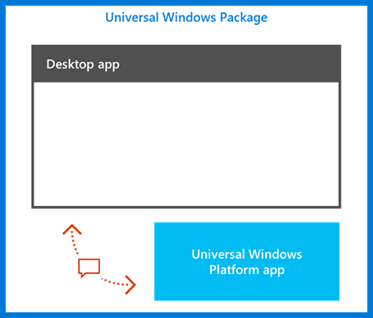
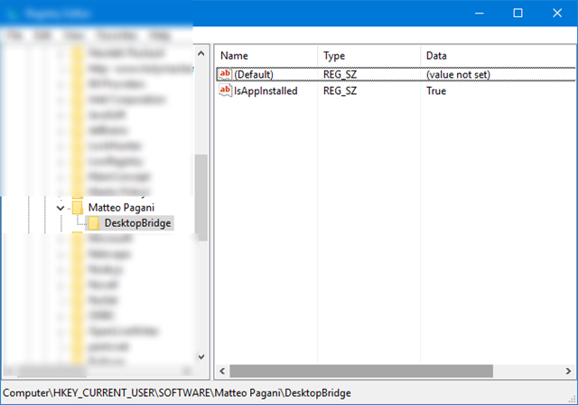

# Desktop Bridge: diversi processi, un solo container 

*Questo articolo è stato scritto da [Matteo
Pagani](http://twitter.com/qmatteoq), Windows AppConsult Engineer in
Microsoft*

[Nel corso del post
precedente](https://blogs.msdn.microsoft.com/italy/2016/10/27/guest-post-desktop-bridge-espandere-unapplicazione-desktop-con-un-componente-uwp/)
abbiamo visto come espandere un’applicazione desktop con un background
task della Universal Windows Platform. Per la prima volta, non avevamo
più solamente un unico processo in esecuzione come nei casi precedenti
(un’applicazione Windows Forms che, eventualmente, utilizzava alcune API
UWP), ma due veri e propri processi separati: l’applicazione Win32 e il
processo backgroundTaskHost.exe che gestisce il background task.

Lo scopo di questo articolo è quello di sottolineare e aiutarvi a capire con
due esempi concreti che, anche se si tratta di più processi separati,
quando girano come pacchetti AppX sono eseguiti in realtà all’interno
dello stesso container della Universal Windows Platform, come mostra
l’immagine seguente:



Questo significa che, anche se i processi sono separati, hanno accesso
allo stesso contesto e possono comunicare facilmente tra di loro. Ad
esempio, condividono lo stesso storage locale: l’area AppData, in cui le
applicazioni desktop e UWP possono scrivere, è comune, perciò i due
processi possono leggere e scrivere dagli stessi file. Facciamo un
esempio concreto, espandendo l’applicazione che avevamo usato come
esempio [nel post
precedente](https://blogs.msdn.microsoft.com/italy/2016/10/27/guest-post-desktop-bridge-espandere-unapplicazione-desktop-con-un-componente-uwp/)
e che trovate su GitHub:
<https://github.com/qmatteoq/DesktopBridge/tree/master/5.%20Extend>

Se ricordate, l’applicazione sfruttava due processi differenti:

Uno di tipo Win32, ovvero un’applicazione Win32 tradizionale che, usando
alcune API della Universal Windows Platform, registrava un background
task legato al trigger chiamato **TimeZoneTrigger**
Uno d tipo UWP, ovvero un Windows Runtime Component, che si faceva
carico di aggiornare la tile dell’applicazione e mostrare una notifica
toast
I due processi, combinati insieme, permettevano di ottenere
un’applicazione che era in grado di inviare una notifica all’utente e di
aggiornare la propria tile ogni qualvolta l’utente cambiava la propria
time zone nella configurazione del computer. Nel corso del post
espanderemo l’applicazione per sfruttare il fatto che entrambi i
processi girano all’interno dello stesso container, aggiungendo le
seguenti funzionalità:

Nell’applicazione Windows Forms, aggiungeremo una casella di testo, dove
l’utente potrà scrivere un messaggio.
Sfruttando la Universal Windows Platform, salveremo questo testo
all’interno dello storage locale, utilizzando le API apposite per
memorizzare informazioni nei setting.
Il background task cercherà la presenza di questo testo all’interno dei
setting: se lo troverà, lo includerà nella tile e nella notifica toast
che saranno mostrate all’utente.\
### L’applicazione Windows Forms

Il lavoro da fare nell’applicazione Windows Forms è estremamente
semplice: innanzitutto dobbiamo aggiungere, sopra al pulsante, un
controllo di tipo **TextBox,** nel quale l’utente potrà inserire il
proprio messaggio. Dopodiché, andremo a cambiare leggermente il codice
associato al pulsante di registrazione del task:

``` {.brush: .csharp;}
private async void OnRegisterTask(object sender, EventArgs e)
{
    if (!string.IsNullOrEmpty(txtMessage.Text))
    {
        ApplicationData.Current.LocalSettings.Values.Clear();
        ApplicationData.Current.LocalSettings.Values.Add("message", txtMessage.Text);
    }

    string triggerName = "TimeZoneTriggerTest";

    // Check if the task is already registered
    foreach (var cur in BackgroundTaskRegistration.AllTasks)
    {
        if (cur.Value.Name == triggerName)
        {
            // The task is already registered.
            return;
        }
    }

    BackgroundTaskBuilder builder = new BackgroundTaskBuilder();
    builder.Name = triggerName;
    builder.SetTrigger(new SystemTrigger(SystemTriggerType.TimeZoneChange, false));
    builder.TaskEntryPoint = "TileBackgroundTask.TileTask";
    var status = await BackgroundExecutionManager.RequestAccessAsync();
    if (status != BackgroundAccessStatus.DeniedByUser && status != BackgroundAccessStatus.DeniedBySystemPolicy)
    {
        builder.Register();
    }
}
```

La novità rispetto al codice che abbiamo visto nell'articolo precedente sta
nelle prime righe: se il contenuto della proprietà **Text** del
controllo di nome **txtMessage** non è vuoto, allora lo aggiungiamo
all’interno dei setting locali. Le API UWP per gestire i setting sono
molto semplici: possiamo accedere tramite la classe
**ApplicationData.Current.LocalSettings**, che contiene una collezione
di nome **Values** che è un semplice dizionario, ovvero un insieme di
coppie chiave / valore. In questo caso, aggiungiamo un elemento che ha,
come chiave, la stringa **message** e, come valore, il testo inserito
dall’utente. Il resto del codice è identico a quello dell'articolo precedente
ed è quello che si fa carico di registrare il background task.

### Il background task

All’interno del background task andremo ad effettuare l’operazione
opposta: andremo a controllare che, nei setting, esista un valore
identificato dalla chiave **message** e, in caso affermativo, lo
recuperiamo sotto forma di stringa. Ecco come appare la nuova
implementazione del metodo **Run()** all’interno della classe
**TileTask** del Windows Runtime Component:

``` {.brush: .plain;}
public sealed class TileTask : IBackgroundTask
{
    public void Run(IBackgroundTaskInstance taskInstance)
    {
        string message = string.Empty;
        if (ApplicationData.Current.LocalSettings.Values.ContainsKey("message"))
        {
            message = ApplicationData.Current.LocalSettings.Values["message"].ToString();
        }


        string tileXml = $@"<tile>
                        <visual>
                            <binding template='TileMedium' branding='logo'>
                                <group>
                                    <subgroup>
                                        <text hint-style='caption'>Time zone changed!</text>
                                        <text hint-style='captionSubtle' hint-wrap='true'>{message}</text>
                                        <text hint-style='captionSubtle' hint-wrap='true'>Last update at {DateTime.Now}</text>
                                    </subgroup>
                                </group>
                            </binding>
                        </visual>
                    </tile>";

        XmlDocument tileDoc = new XmlDocument();
        tileDoc.LoadXml(tileXml);

        TileNotification notification = new TileNotification(tileDoc);
        TileUpdateManager.CreateTileUpdaterForApplication().Update(notification);

        string toastXml = $@"<toast>
                        <visual>
                            <binding template='ToastGeneric'>
                                <text>Time zone changed!</text>
                                <text>{message}</text>
                                <text>Last update at {DateTime.Now}</text>
                            </binding>
                        </visual>
                    </toast>";

        XmlDocument toastDoc = new XmlDocument();
        toastDoc.LoadXml(toastXml);

        ToastNotification toast = new ToastNotification(toastDoc);
        ToastNotificationManager.CreateToastNotifier().Show(toast);
    }
}
```

Come potete notare, utilizzando le stesse API dell’applicazione desktop,
utilizziamo prima il metodo **ContainsKey()** sulla collezione
**ApplicationData.Current.LocalSettings.Values** per verificare che
esista veramente un elemento identificato dalla chiave **message.** In
caso affermativo, lo recuperiamo e lo salviamo in una variabile. Il
resto del codice è praticamente identico a quello dell'articolo precedente,
con una differenza: in entrambi i casi, nel payload XML della notifica
tile e toast abbiamo aggiunto un nuovo elemento di tipo **text** con, al
suo interno, il messaggio recuperato dai setting.

### 

### That’s all, folks!

Il gioco è fatto: ora ricompilate la soluzione, lanciate il progetto di
deploy di Visual Studio 15 Preview e, questa volta, prima di premere il
pulsante di registrazione del task scrivete un messaggio all’interno
della casella di testo. Ora ripetete l’esperimento dell'articolo precedente:
andate nei Setting di Windows e cambiate la time zone. Questa volta, sia
la tile che la notifica toast, oltre al titolo e alla data e ora di
ultimo aggiornamento, conterranno il messaggio personalizzato che avete
inserito nell’applicazione Windows Forms:


### Accedere al registro di sistema

Vediamo ora un altro esempio di gestione del container UWP, legato ad un
approccio più tradizionale: in questo caso non coinvolgeremo alcuna API
UWP, ma solo API standard del framework .NET. Come abbiamo imparato nei
primi articoli della serie, le applicazioni convertite tramite il Desktop
Bridge girano all’interno di un container, ovvero di un contesto
virtualizzato: file system e registro verranno astratti e uniti, in
tempo reale, con quello di sistema. In questo modo, l’applicazione avrà
accesso completo al registro, ma non sarà in grado di lasciare “scarti”
durante la disinstallazione che potrebbero rallentare il sistema: questo
perché la scrittura non avviene nel registro reale, ma nella versione
virtualizzata. Vediamo un semplice esempio, creando una soluzione con
Visual Studio (anche in questo caso, userò la versione Preview con
l’estensione per il deploy UWP).

Partiamo con la creazione di un’applicazione Windows Forms, con
all’interno un pulsante legato ad un evento che si fa carico, usando API
del framework .NET, di creare una nuova chiave di registro nel caso in
cui questa non esista:

``` {.brush: .csharp;}
private void OnCreateRegistryKey(Object sender, EventArgs e)
{
    var RegKey = Registry.CurrentUser.OpenSubKey(@"SOFTWARE\Matteo Pagani\DesktopBridge", true);

    if (RegKey == null)
    {
        RegKey = Registry.CurrentUser.CreateSubKey(@"SOFTWARE\Matteo Pagani\DesktopBridge", RegistryKeyPermissionCheck.ReadWriteSubTree);
        RegKey.SetValue("IsAppInstalled", true);
    }
}
```

Come vedete, il codice è piuttosto semplice: come prima cosa, si sfrutta
la classe **Registry** e il metodo **OpenSubKey()** per accedere ad una
chiave specifica all’interno dell’hive dell’utente corrente (in questo
modo, non sono necessari permessi di admin e quindi l’applicazione può
girare tranquillamente anche all’interno del container UWP). La chiave,
nello specifico, si chiama **IsAppInstalled** ed è contenuta all’interno
del percorso **HKEY\_CURRENT\_USER\\SOFTWARE\\Matteo
Pagani\\DesktopBridge**. Se questa non esiste, allora provvediamo a
crearla sfruttando il metodo **SetValue()**, passando come parametro il
nome della chiave e il valore che vogliamo assegnare **** (**true**).

Iniziamo con il lanciare l’applicazione normalmente, in maniera nativa:
clicchiamo sul pulsante, dopodiché apriamo il registro di sistema
(scriviamo **regedit** nel menu Start e premiamo Invio). Se tutto è
andato a buon fine, troveremo la chiave che abbiamo appena creato:



Ora eliminiamo l’intera chiave appena creata (nel mio caso, l’intera
cartella di nome **Matteo Pagani**) e, questa volta, aggiungiamo un
progetto di deployment UWP all’interno della nostra soluzione e
configuriamolo affinché ci permetta di lanciare l’applicazione Windows
Forms appena creata all’interno del container UWP (trovate tutte le
indicazioni su come farlo [in uno degli articoli precedenti della
serie](desktop-bridge-convertire-unapplicazione.md)).
Ora rilanciamo l’applicazione, questa volta impostando come progetto di
startup quello di deployment, e premiamo nuovamente il pulsante per
creare la chiave di registro. L’operazione andrà a buon fine e non
otterremo alcun errore. Se ora però aprissimo nuovamente il registro e
andassimo alla ricerca del percorso
**HKEY\_CURRENT\_USER\\SOFTWARE\\Matteo Pagani\\DesktopBridge**, ci
accorgeremmo di come questo non esista. Questo perché, questa volta,
l’applicazione sta girando all’interno del container UWP e, di
conseguenza, non scrive più all’interno del registro di sistema, ma in
quello virtualizzato specifico dell’applicazione.

Da questo esperimento emerge una considerazione importante: non possiamo
usare il registro come meccanismo di comunicazione tra applicazioni
differenti se queste non stanno girando all’interno dello stesso
contesto UWP. Possiamo testare facilmente questo scenario, aggiungendo
alla nostra soluzione un nuovo progetto Windows Forms che, questa volta,
conterrà un pulsante che, al click, invocherà un metodo di lettura della
chiave di registro:

``` {.brush: .csharp;}
private void OnReadRegistryKey(Object sender, EventArgs e)
{
    bool isAppInstalled = false;

    var RegKey = Registry.CurrentUser.OpenSubKey(@"SOFTWARE\Matteo Pagani\DesktopBridge", true);
    if (RegKey != null)
    {
        string result = RegKey.GetValue("IsAppInstalled").ToString();
        isAppInstalled = result == "True" ? true : false;
    }

    string message = isAppInstalled ? "The app is installed" : "The app isn't installed";
    MessageBox.Show(message);
}
```

Utilizzando le stesse API utilizzate in precedenza (ovvero la classe
**Registry.CurrentUser** e il metodo **OpenSubKey()**), andiamo a
verificare la presenza del percorso
**HKEY\_CURRENT\_USER\\SOFTWARE\\Matteo Pagani\\DesktopBridge.** Se
questo esiste, andiamo a verificare la presenza della chiave di nome
**IsAppInstalled** e mostriamo un messaggio all’utente in base al
risultato dell’operazione.

Se ora lanciassimo le due applicazioni in maniera nativa e, prima
creassimo la chiave di registro con la prima applicazione per poi
leggerla con la seconda, tutto funzionerebbe correttamente: comparirebbe
il messaggio che la chiave è stata trovata correttamente. Se, invece,
lanciassimo la prima applicazione tramite il progetto di deployment UWP
e la seconda come nativa, otterremmo il messaggio che la chiave non
esiste. Questo perché la prima applicazione, girando all’interno del
container, ha creato la chiave di registro all’interno del container e
non in quello di sistema. Di conseguenza, la seconda applicazione non
sarebbe in grado di trovarla.

Come gestire questo tipo di scenari? La risposta arriva da quanto
abbiamo appreso nell’introduzione di questo articolo: quando due o più
processi girano all’interno dello stesso container, condividono le
medesime risorse. Nel primo esempio, avevamo visto lo storage locale, ma
anche il registro è una di queste risorse. Di conseguenza, la soluzione
è configurare il progetto di deployment (e, di conseguenza, l’AppX che
andremo a generare) affinché entrambi gli eseguibili vengano contenuti
all’interno del pacchetto, esattamente come nel primo esempio
l’applicazione Windows Forms e il background task erano entrambi inclusi
all’interno della stessa cartella **PackageLayout**.

Ecco, perciò, come appare all’interno del progetto di deployment, il
file **AppXPackageFileList.xml**, che è quello che va a “recuperare” gli
eseguibili delle due applicazioni desktop che abbiamo creato in
precedenza e li va a copiare all’interno della cartella
**PackageLayout**:

``` {.brush: .xml;}
<?xml version="1.0" encoding="utf-8"?>
<Project ToolsVersion="14.0" xmlns="http://schemas.microsoft.com/developer/msbuild/2003">
  <PropertyGroup>
    <MyProjectOutputPath>$(PackageLayout)\..\..\..\Registry</MyProjectOutputPath>
  </PropertyGroup>
  <ItemGroup>
    <LayoutFile Include="$(MyProjectOutputPath)\DesktopApp.WriteRegistry\bin\Debug\DesktopApp.WriteRegistry.exe">
      <PackagePath>$(PackageLayout)\DesktopApp.WriteRegistry.exe</PackagePath>
    </LayoutFile>
    <LayoutFile Include="$(MyProjectOutputPath)\DesktopApp.ReadRegistry\bin\Debug\DesktopApp.ReadRegistry.exe">
      <PackagePath>$(PackageLayout)\DesktopApp.ReadRegistry.exe</PackagePath>
    </LayoutFile>
  </ItemGroup>
</Project>
```

L’approccio è simile a quello che avevamo visto [in un post
precedente](https://blogs.msdn.microsoft.com/italy/2016/09/22/guest-post-desktop-bridge-convertire-unapplicazione/),
con la differenza che in quel caso andavamo a includere nel pacchetto un
eseguibile (l’applicazione Windows Forms) e la DLL di JSON.NET. Questa
volta, invece, includiamo direttamente due eseguibili. Dato che
entrambi, ora, fanno parte dello stesso pacchetto, avranno accesso alle
stesse risorse, incluso il registro. Vediamo un esempio concreto,
aggiungendo un nuovo pulsante nella prima applicazione (quella che nella
soluzione di esempio si chiama **DesktopApp.WriteRegistry**), che
invocherà il seguente codice:

``` {.brush: .csharp;}
private void OnOpenReadApp(Object sender, EventArgs e)
{
    string result = System.Reflection.Assembly.GetExecutingAssembly().Location;
    int index = result.LastIndexOf("\\");
    string processPath = $"{result.Substring(0, index)}\\DesktopApp.ReadRegistry.exe";
    Process.Start(processPath);
}
```

Questo blocco di codice usa le API del framework .NET per recuperare
tramite reflection il percorso dell’eseguibile corrente e sfruttarlo per
poter creare il percorso, invece, dell’altro eseguibile, l’applicazione
**DesktopApp.ReadRegistry.exe.** Perché non abbiamo semplicemente usato
le API per recuperare la directory corrente (ovvero il metodo
**Directory.GetCurrentDirectory()**)? Perché, in un’applicazione che
gira all’interno di un container, questa API non funziona correttamente
e non restituisce il percorso reale dell’eseguibile, perciò dobbiamo
usare questo stratagemma per raggiungere la seconda applicazione
contenuta nel pacchetto. Infine, la avviamo sfruttando il metodo
**Process.Start()**.

A questo punto, la seconda applicazione si aprirà: questa volta, se
premiamo prima il pulsante per creare la chiave di registro nella prima
applicazione e poi quello per leggerla nella seconda, tutto funzionerà
alla perfezione e comparirà il messaggio che la chiave di registro è
stata trovata correttamente. Questo perché le due applicazioni stanno
girando all’interno dello stesso container UWP e, di conseguenza,
possono non solamente leggere e scrivere dallo stesso file system (come
avevamo visto nel primo esempio) ma anche nello stesso registro.

### In conclusione

Nel corso di questo articolo abbiamo approfondito il concetto di container
UWP all’interno del quale girano le applicazioni convertite tramite uno
qualsiasi degli approcci del desktop bridge. Nel primo caso, abbiamo
visto due processi differenti (un’applicazione Windows Forms e un
background task) accedere allo stesso file system: come demo, abbiamo
esteso il progetto su GitHub creato nell'articolo precedente e disponibile
all’indirizzo precedente
<https://github.com/qmatteoq/DesktopBridge/tree/master/5.%20Extend>. Nel
secondo caso, invece, abbiamo visto due applicazioni Windows Forms
girare all’interno del container UWP e, in grado, perciò, di scrivere e
leggere dallo stesso registro di sistema virtualizzato. Trovate il
progetto di esempio relativo a questo secondo approccio all’indirizzo
<https://github.com/qmatteoq/DesktopBridge/tree/master/Extras/Container>

Happy coding!


