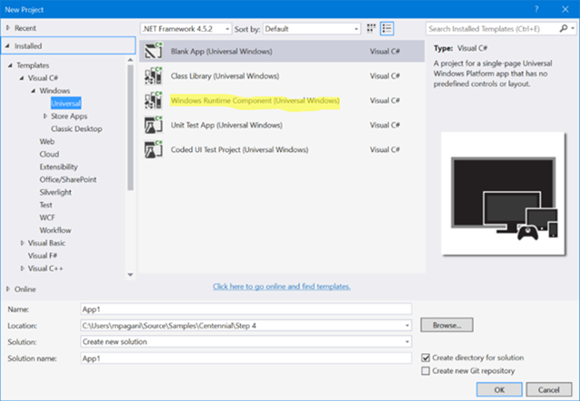
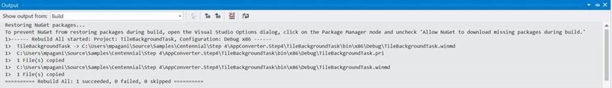
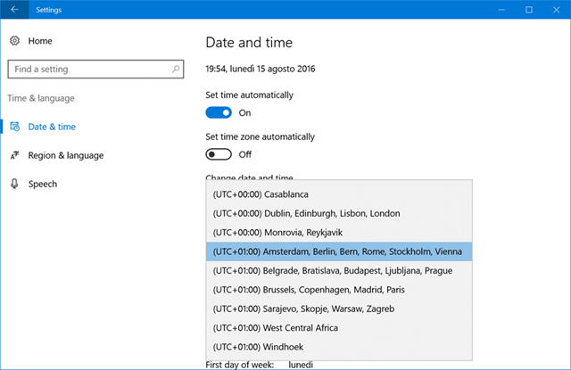
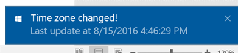
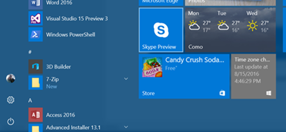

# Desktop Bridge: Espandere un’applicazione desktop con un componente UWP


*Questo articolo è stato scritto da [Matteo
Pagani](http://twitter.com/qmatteoq), Windows AppConsult Engineer in
Microsoft*

[In uno degli articoli
precedenti](desktop-bridge-espandere-unapplicazione-win32-con-la-universal-windows-platform.md)
abbiamo visto come sia possibile, grazie al Desktop Bridge, espandere
un’applicazione desktop tradizionale con le API della Universal Windows
Platform. Quando un’applicazione Win32, infatti, gira all’interno del
container UWP (nel nostro caso, si trattava di un’applicazione Windows
Forms), abbiamo la possibilità di sfruttare alcune delle API di nuova
generazione, come quelle per inviare notifiche toast o sfruttare i
servizi di speech.

Nel corso di questo articolo vedremo un’altra tipologia di espansione: non
più l’utilizzo di semplici API, ma di veri e propri componenti specifici
del mondo UWP, come i background task.

Come abbiamo citato nel corso [del primo
articolo](https://blogs.msdn.microsoft.com/italy/2016/09/15/guest-post-desktop-bridge-il-ponte-tra-le-applicazioni-win32-e-la-universal-windows-platform/)
con il quale abbiamo introdotto il Desktop Bridge, le applicazioni UWP
hanno un ciclo di vita differente da quello delle applicazioni desktop
tradizionali. In una tipica applicazione Win32, l’utente ha il controllo
completo del ciclo di vita di un’applicazione: può lanciarla, chiuderla,
minimizzarla, ecc. In nessuno di questi stati, però, il sistema
operativo ha la possibilità di intervenire: l’applicazione rimarrà
aperta ed in esecuzione fino a quando l’utente non la chiuderà
esplicitamente (o l’applicazione andrà in crash); se l’utente minimizza
l’applicazione, questa ha la possibilità di continuare ad eseguire
operazioni in background, indipendentemente da quanta memoria e CPU
abbia a disposizione il computer in quel momento per gestirla. Visual
Studio è un ottimo esempio di questo approccio nella gestione del ciclo
d vita: se date avvio al processo di compilazione di un progetto,
dopodiché lo minimizzate, Visual Studio continuerà a compilare
l’applicazione anche se, nel frattempo, doveste lanciare un gioco di
ultima generazione che richieda molta memoria e potenza di CPU.

Nel mondo delle applicazioni UWP, invece, le cose funzionano in maniera
differente: possono essere eseguite, infatti, su un’ampia gamma di
dispositivi, come telefoni e tablet, che possono avere requisiti più
restrittivi in termini di memoria disponibile e di consumo di batteria
rispetto ad un computer desktop tradizionale. Di conseguenza, il ciclo
di vita è molto differente, in quanto l’utente rimane sempre in
controllo, ma anche il sistema operativo ha la possibilità di
intervenire: ad esempio, quando un’applicazione UWP non è più in
foreground, viene sospesa dopo 10 secondi. Ciò significa che viene
mantenuta in memoria, così da garantire una veloce riapertura, ma
qualsiasi thread, connessione di rete, etc. viene interrotta, così che
tutte le risorse del dispositivo possano essere focalizzate sulla nuova
applicazione in foreground. Un altro scenario tipico del mondo UWP è
quando il sistema sta esaurendo le risorse disponibili: Windows 10 è in
grado di terminare le applicazioni aperte meno utilizzate, così da poter
assegnare più memoria a quelle che, invece, sono in uso in quel momento.
La principale conseguenza di questo approccio è che, rispetto alle
applicazioni desktop tradizionali, un’applicazione UWP non è in grado di
eseguire operazioni in background senza alcun limite, in quanto
potrebbero avere un impatto molto forte sulla durata della batteria e
sulla reattività del dispositivo. Se volete approfondire maggiormente il
ciclo di vita di un’applicazione UWP, potete fare riferimento a questo
post del team di Windows:
<https://blogs.windows.com/buildingapps/2016/04/28/the-lifecycle-of-a-uwp-app/>

Nonostante il ragionamento dietro a questo approccio sia corretto e
condivisible, non dare la possibilità allo sviluppatore di eseguire
alcun tipo di operazione in background sarebbe una limitazione molto
seria. Di conseguenza, la Universal Windows Platform ha introdotto il
concetto di background task: si tratta di Windows Runtime Component che
contengono del codice che può essere eseguito indipendentemente dallo
stato in cui si trova l’applicazione (in esecuzione, sospesa, chiusa,
ecc.) e che sono collegati al concetto di trigger, ovvero l’evento che
ne scatena l’esecuzione. In realtà, come vedremo nel prossimo post,
l’Anniversary Update di Windows 10 ha introdotto il concetto di **single
background process model**, che significa che il codice da eseguire in
background non deve più essere necessariamente contenuto all’interno di
un progetto separato, ma può essere incluso anche nell’applicazione UWP
stessa. Non è questa, però, la sede per approfondire l’argomento, dato
che non è un approccio che possiamo sfruttare nello scenario che andremo
a delineare in questo post. Potete approfondire il funzionamento dei
background task grazie alla documentazione ufficiale all’indirizzo
<https://msdn.microsoft.com/en-us/windows/uwp/launch-resume/support-your-app-with-background-tasks>

Se state leggendo questo articolo probabilmente siete sviluppatori desktop e
vi potreste stare chiedendo perché dovreste sentire il bisogno di
integrare un background task in un’applicazione Win32: dato che non
avete le limitazioni di un’app UWP, potete eseguire il vostro codice in
background in qualsiasi momento, senza affidarvi a componenti esterni.

Questa considerazione non è vera al 100%, dato che i background task
offrono una serie di feature che li rendono interessanti anche per
un’applicazione desktop tradizionale:

1.  Sono integrati e gestiti direttamente da Windows. Di conseguenza,
    possono essere eseguiti anche quando l’applicazione non è
    nemmeno aperta. Un’applicazione Win32, invece, se è chiusa, non ha
    questa opportunità: dovremmo sfruttare un altro approccio, come
    mantenere un processo sempre attivo oppure creare un
    servizio Windows. Entrambi gli scenari, però, non sono così semplici
    da implementare ed efficienti come un background task.
2.  I background task sono rispettosi della user experience e della
    reattività del sistema: Windows farà di tutto per evitare che
    l’esecuzione di un task possa degradare notevolmente le performance
    del sistema o dell’applicazione in esecuzione in quel momento.
3.  La Universal Windows Platform offre una scelta molto ampia di
    trigger a cui collegare i task, che vengono gestiti direttamente dal
    sistema operativo: ogni volta che si verifica uno di questi eventi,
    ci penserà Windows a lanciare il task collegato, senza che lo
    sviluppatore debba fare nulla di particolare. Se alcune tipologie di
    trigger (come il **TimeTrigger**, legato a ripetizioni cicliche
    nel tempo) sono facili da riprodurre anche in un’applicazione
    desktop, altre invece possono essere più complicati da gestire, come
    quelli legati alla connessone con dispostivi Bluetooth, al cambio di
    tipologia di connettività, al cambio di time zone, ecc.

Nel corso di questo articolo vedremo come implementare uno di questi
scenari: l’applicazione Windows Forms registrerà un background task, che
sarà invocato ogni volta che la time zone del device cambierà. Nel
momento in cui si verificherà questo evento, il task si farà carico di
aggiornare la tile dell’applicazione e di mostrare una notifica
all’utente.

### Il background task

Iniziamo a creare una nuova soluzione in Visual Studio. Anche in questo
caso sfrutteremo l’approccio di deploy e packaging automatico offerto
dalla Preview di Visual Studio 15 con l’apposita estensione per il
Desktop Bridge, che abbiamo imparato a conoscere [in uno dei post
precedenti](https://blogs.msdn.microsoft.com/italy/2016/09/22/guest-post-desktop-bridge-convertire-unapplicazione/).

La nostra soluzione, al termine del post, sarà composta da tre progetti:

1.  Il background task
2.  L’applicazione Windows Forms
3.  Il progetto di deployment, che si farà carico di far girare
    l’applicazione Win32 all’interno del container UWP, come se fosse
    stata convertita in un’AppX (maggiori dettagli sul suo funzionamento
    [li trovate in questo
    post](https://blogs.msdn.microsoft.com/italy/2016/09/22/guest-post-desktop-bridge-convertire-unapplicazione/),
    di conseguenza non ripeterò nuovamente i passi da seguire per
    crearlo e configurarlo).

Partiamo dal background task, che è il progetto che contiene il codice
che sarà eseguito in background quando il trigger che abbiamo scelto
sarà invocato. Un background task è composto semplicemente da un Windows
Runtime Component: troverete il template dedicato creando un nuovo
progetto nella sezione **Windows –&gt; Universal**.



Il requisito necessario affinché un Windows Runtime Component venga
utilizzato come un background task è molto semplice: deve contenere una
classe, la quale deve implementare un’interfaccia chiamata
**IBackgroundTask** (inclusa nel namespace
**Windows.ApplicationModel.Background**). L’interfaccia vi obbligherà ad
implementare un metodo chiamato **Run()**: è il metodo che viene
eseguito ogni volta che il task sarà invocato dal trigger e deve,
perciò, contenere il codice che vogliamo eseguire in background.

Ecco come appare il nostro background task:

```csharp
using System;
using Windows.ApplicationModel.Background;
using Windows.Data.Xml.Dom;
using Windows.UI.Notifications;

namespace TileBackgroundTask
{
    public sealed class TileTask : IBackgroundTask
    {
        public void Run(IBackgroundTaskInstance taskInstance)
        {
            string tileXml = $@"<tile>
                            <visual>
                                <binding template='TileMedium' branding='logo'>
                                    <group>
                                        <subgroup>
                                            <text hint-style='caption'>Time zone changed!</text>
                                            <text hint-style='captionSubtle' hint-wrap='true'>Last update at {DateTime.Now}</text>
                                        </subgroup>
                                    </group>
                                </binding>
                            </visual>
                        </tile>";

            XmlDocument tileDoc = new XmlDocument();
            tileDoc.LoadXml(tileXml);

            TileNotification notification = new TileNotification(tileDoc);
            TileUpdateManager.CreateTileUpdaterForApplication().Update(notification);

            string toastXml = $@"<toast>
                            <visual>
                                <binding template='ToastGeneric'>
                                    <text>Time zone changed!</text>
                                    <text>Last update at {DateTime.Now}</text>
                                </binding>
                            </visual>
                        </toast>";

            Windows.Data.Xml.Dom.XmlDocument toastDoc = new Windows.Data.Xml.Dom.XmlDocument();
            toastDoc.LoadXml(toastXml);

            ToastNotification toast = new ToastNotification(toastDoc);
            ToastNotificationManager.CreateToastNotifier().Show(toast);
        }
    }
}
```

Se avete un minimo di dimestichezza con lo sviluppo UWP, il codice
dovrebbe essere semplice da interpretare: le notifiche tile e toast
funzionano, infatti, allo stesso modo. In entrambi i casi, il contenuto
è definito da un payload XML: l’unica differenza è che, in caso di
notifiche vere e proprie, utilizziamo la classe **ToastNotification**
per definirle e la classe **ToastNotificationManager** per mostrarle
tramite il metodo **Show();** nel caso dell’aggiornamento della tile,
invece, ne definiamo il contenuto con la classe **TileNotification** e
sfruttiamo la classe **TileUupdateManager** per aggiornarla tramite il
metodo **Update()**.

Il gioco è fatto: come potete notare, un background task non ha alcuna
connessione con il trigger a cui andremo a collegarlo. Definisce
solamente il codice che vogliamo eseguire in background: sarà compito
dell’applicazione principale registrarlo e specificarne i requisiti. Nel
mondo UWP tradizionale, questo compito sarebbe demandato
all’applicazione UWP. Nel nostro caso, invece, sarà l’applicazione
Windows Forms a registrare il task e specificare il trigger a cui
vogliamo collegarlo.

### 

### L’applicazione Windows Forms

E’ giunto il momento di aggiungere, alla nostra soluzione, un progetto
di tipo Windows Forms. La prima operazione da fare è la medesima svolta
[in uno dei post
precedenti](https://blogs.msdn.microsoft.com/italy/2016/09/23/guest-post-desktop-bridge-espandere-unapplicazione-win32-con-la-universal-windows-platform/).
Siccome abbiamo la necessità di utilizzare alcune API asincrone
specifiche della Universal Windows Platform, dobbiamo aggiungere al
progetto due reference:

-   Al file **Windows.md**, memorizzato all’interno del percorso
    **C:\\Program Files (x86)\\Windows Kits\\10\\UnionMetadata**.
-   Alla DLL **System.Windows.Runtime.dll** memorizzata all’interno del
    percorso **C:\\Program Files (x86)\\Reference
    Assemblies\\Microsoft\\Framework\\.NETCore\\v4.5.1**

A questo punto possiamo aggiungere nell’interfaccia utente un pulsante,
del quale andremo a gestire l’evento **Click** con il seguente blocco di
codice:

```csharp
private async void OnRegisterTask(object sender, EventArgs e)
{
    string triggerName = "TimeZoneTriggerTest";

    // Check if the task is already registered
    foreach (var cur in BackgroundTaskRegistration.AllTasks)
    {
        if (cur.Value.Name == triggerName)
        {
            // The task is already registered.
            return;
        }
    }

    BackgroundTaskBuilder builder = new BackgroundTaskBuilder();
    builder.Name = triggerName;
    builder.SetTrigger(new SystemTrigger(SystemTriggerType.TimeZoneChange, false));
    builder.TaskEntryPoint = "TileBackgroundTask.TileTask";
    var status = await BackgroundExecutionManager.RequestAccessAsync();
    if (status != BackgroundAccessStatus.DeniedByUser && status != BackgroundAccessStatus.DeniedBySystemPolicy)
    {
        builder.Register();
    }
}
```

Anche in questo caso, se avete già esperienza di sviluppo UWP, non
troverete nulla di particolare: si tratta del codice standard per
inizializzare un background task. Innanzitutto, si assegna un nome
univoco al task (nel nostro caso, **TimeZoneTriggerTest**), per evitare
che venga registrato più volte: è questo lo scopo del primo blocco di
codice (il ciclo **foreach**), che verifica che il task non sia già
stato registrato in precedenza, sfruttando la collezione
**BackgroundTaskRegistration.AllTasks**, che contiene tutti i background
task registrati dall’applicazione stessa.

In caso negativo, si può procedere alla registrazione vera e propria,
sfruttando la classe **BackgroundTaskBuilder** che appartiene al
namespace **Windows.ApplicationModel.Background**. Ecco le varie
operazioni che vengono svolte:

1.  Tramite la proprietà **Name**, viene assegnato il nome al task.
2.  Tramite il metodo **SetTrigger()**, viene specificato quale trigger
    si vuole collegare al task. Nel nostro caso, il trigger legato al
    cambio di time zone è di tipo **SystemTrigger**. Dobbiamo, perciò,
    creare un nuovo oggetto di questo tipo e passare, come parametro,
    uno dei valori dell’enumeratore **SystemTriggerType** (nel nostro
    caso, **TimeZoneChange**). Il secondo valore è un booleano che
    rappresenta la frequenza di esecuzione: **false** significa che il
    task verrà eseguito ogni volta che il trigger sarà invocato,
    **true** invece che sarà eseguito una volta sola.
3.  Tramite la proprietà **TaskEntryPoint** dobbiamo specificare la
    firma completa della classe che implementa il background task
    (namespace + nome della classe). Nel nostro caso, specifichiamo il
    valore **TileBackgroundTask.TileTask**, che è la firma della classe
    contenuta all’interno del Windows Runtime Component che abbiamo
    creato nello step precedente.
4.  Dobbiamo chiedere a Windows l’autorizzazione a registrare il task
    tramite il metodo
    **BackgroundExecutionManager.RequestAccessAsync()**: dato che, nel
    nostro caso, parliamo di un’applicazione che girerà solamente su
    desktop, tale autorizzazione sarà praticamente concessa
    in automatico. La possibilità che ciò non avvenga, infatti, può
    verificarsi solo su dispositivi con poca memoria (come alcuni tipi
    di telefoni), che introducono un limite massimo al numero di
    background task che possono essere registrati dal sistema.
5.  Una volta che abbiamo ricevuto il permesso (verificando che il
    valore restituito dal metodo **RequestAccessAsync()** sia diverso da
    **DeniedByUser** o **DeniedBySystemPolicy**) possiamo registrare il
    task chiamando il metodo **Register()**.

Dal punto di vista dell’applicazione Windows Forms, abbiamo completato
il nostro compito: premendo il pulsante che abbiamo incluso
nell’interfaccia utente, il task sarà registrato in Windows 10. Il
nostro lavoro, però, non è ancora completo: ci sono alcuni passaggi
aggiuntivi che dobbiamo effettuare affinché il task venga effettivamente
registrato.

### Il file di manifest

I background task fanno parte dei componenti UWP definiti “estensioni” e
che, in quanto tali, devono essere registrati all’interno del file di
manifest, oltre che nel codice dell’applicazione come abbiamo fatto in
precedenza. Di conseguenza, dobbiamo spostarci ora dal mondo delle
applicazioni Win32 a quello UWP, modificando il file
**AppxManifest.xml** che è incluso all’interno della cartella che, alla
fine del nostro lavoro, diventerà il pacchetto AppX. Dato che stiamo
sfruttando VS15 Preview e l’estensione per il Desktop Bridge, troveremo
questo file all’interno della cartella **PackageLayout** che abbiamo
creato manualmente all’interno del progetto di deployment.

Sono due le modifiche da effettuare all’interno del file. La prima è
aggiungere un nuovo elemento di tipo **Extension** all’interno del nodo
**Application**, come nell’esempio seguente:

```xml
<Applications>
  <Application Id="Extend" Executable="Extend.exe" EntryPoint="Windows.FullTrustApplication">
    <uap:VisualElements DisplayName="Extend" Description="Extend" BackgroundColor="#777777"
    Square150x150Logo="Assets\SampleAppx.150x150.png" Square44x44Logo="Assets\SampleAppx.44x44.png" />
    <Extensions>
      <Extension Category="windows.backgroundTasks" EntryPoint="TileBackgroundTask.TileTask">
        <BackgroundTasks>
          <Task Type="systemEvent" />
        </BackgroundTasks>
      </Extension>
    </Extensions>
  </Application>
</Applications>
```

Tale elemento ha due proprietà importanti:

-   **Category** che specifica il tipo di estensione che vogliamo
    supportare (in questo caso, i background task sono identificati
    dalla parola chiave **windows.backgroundTasks**)
-   **EntryPoint**, che è lo stesso valore che avevamo specificato in
    precedenza nell’applicazione desktop, ovvero la firma completa della
    classe che implementa l’interfaccia **IBackgroundTask** (nel nostro
    caso, **TileBackgroundTask.TileTask**).

All’interno dell’estensione dobbiamo specificare quale tipo di trigger
vogliamo gestire con questo task, sfruttando un nuovo elemento di tipo
**Task** e specificandone la tipologia tramite l’attributo **Type**. In
questo caso, dato che il trigger **TimeZoneTrigger** fa parte della
famiglia degli eventi di sistema, dobbiamo specificare come valore
dell’attributo **systemEvent.**

Inoltre, nella parte finale del manifest, dobbiamo aggiungere il
seguente blocco XML:

```xml
<Extensions>
  <Extension Category="windows.activatableClass.inProcessServer">
    <InProcessServer>
      <Path>CLRHost.dll</Path>
      <ActivatableClass ActivatableClassId="TileBackgroundTask.TileTask" ThreadingModel="both" />
    </InProcessServer>
  </Extension>
</Extensions>
```

In una applicazione UWP tradizionale non avremmo bisogno di questo
blocco di codice ma, dato che ci troviamo in uno scenario particolare
(un’applicazione desktop che registra un background task), è
indispensabile affinché tutto funzioni correttamente.

### Operazioni post build

Rimane un’ultima operazione da fare: il background task che abbiamo
creato è un Windows Runtime Component e, in quanto tale, quando viene
compilato da Visual Studio produce un output. In questo caso, non
essendo una normale libreria .NET, non produce una normale DLL ma un
file con estensione .winmd, che deve essere incluso all’interno della
cartella **PackageLayout** che verrà convertita in un file AppX.

Il modo più semplice per raggiungere questo obiettivo è definire una
serie di operazioni post build: ogni volta che compileremo il progetto
che contiene il background task, i file di output (con estensione .winmd
e .pri) saranno copiati nella cartella **PacakageLayout**. Possiamo
definire questa operazione facendo click con il tasto destro sul
progetto del background task, scegliendo **Proprietà** e spostandoci
nella sezione **Build events.** Nell’area chiamata **post-build event
command line** possiamo aggiungere i seguenti comandi:

```plain
xcopy /y /s "$(TargetDir)TileBackgroundTask.pri" "$(SolutionDir)Extend.DesktopToUWP\PackageLayout"

xcopy /y /s "$(TargetDir)TileBackgroundTask.winmd" "$(SolutionDir)Extend\PackageLayout"
```

Ovviamente, in questo scenario non potrete fare un semplice copia e
incolla dei comandi precedenti, ma dovrete cambiare il nome dei file e
delle cartelle in base alla configurazione del vostro progetto. Le
operazioni di post build precedenti fanno riferimento alla soluzione di
esempio che ho pubblicato su GitHub all’indirizzo
<https://github.com/qmatteoq/DesktopBridge/tree/master/5.%20Extend>


### Testare il nostro lavoro

Ora che abbiamo messo in piedi tutti i pezzi del puzzle, è tempo di
controllare il risultato finale. Un primo test che possiamo fare è
compilare il progetto del background task. Se abbiamo configurato i
comandi di post build correttamente, dovremmo vedere un risultato simile
al seguente



Inoltre, all’interno della cartella **PackageLayout** del progetto di
deployment, dovreste trovare, insieme all’eseguibile dell’applicazione
Windows Forms, anche i file .winmd e .pri che sono stati generati dalla
compilazione del Windows Runtime Component.

 


Per verificare che il background task sia stato registrato
correttamente, lanciate il progetto di deploy UWP in Visual Studio e,
nell’applicazione Windows Forms, premete il pulsante che abbiamo
aggiunto in precedenza. Ora aprite i Settings di Windows e, nella
sezione **Time & Language –&gt; Date & Time** provate a cambiare la time
zone:


Nell’angolo inferiore destro dovreste vedere comparire una notifica
simile alla seguente:



Inoltre, se avete aggiunto alla Start screen la tile dell’applicazione
la vedrete aggiornarsi con il medesimo messaggio:



Potete, inoltre, immediatamente notare uno dei principali vantaggi
nell’utilizzare un background task per gestire questo scenario: provate
a chiudere completamente l’applicazione Win32 (controllate per scrupolo
che nel Task Manager il processo non sia più in esecuzione), dopodiché
cambiate la time zone del vostro PC. Vedrete nuovamente la tile
aggiornarsi e la notifica toast comparire, nonostante il processo non
sia più in esecuzione.

### In conclusione

Nel corso di questo post abbiamo visto un altro approccio nell’utilizzo
del Desktop Bridge, che ci permette di spostare sempre di più l’ago
della bilancia dal mondo Win32 a quello UWP: in questo caso, non abbiamo
“semplicemente” utilizzato API UWP, ma veri e proprio componenti che
fanno parte di un’altra tecnologia. In questo modo, possiamo iniziare a
“modernizzare” la nostra applicazione e muovere i primi passi nel mondo
UWP, senza per questo rinunciare al know how acquisito negli ultimi anni
(o decenni) nello sviluppo di applicazioni Win32.

Trovate il codice di esempio utilizzato in questo post sul mio
repository GitHub all’indirizzo:
<https://github.com/qmatteoq/DesktopBridge/tree/master/5.%20Extend>

Happy coding!


