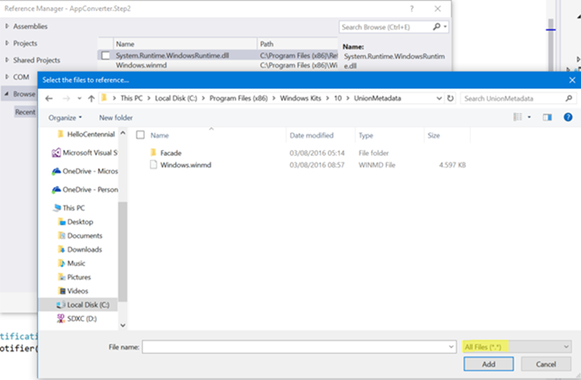
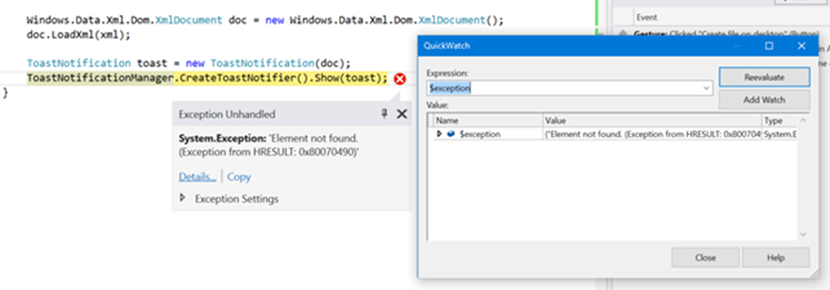
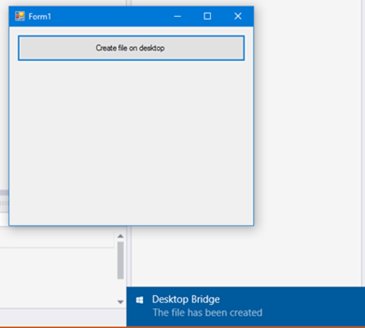
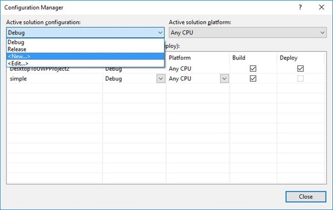
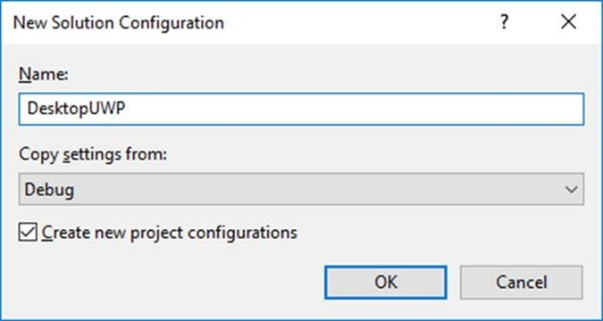
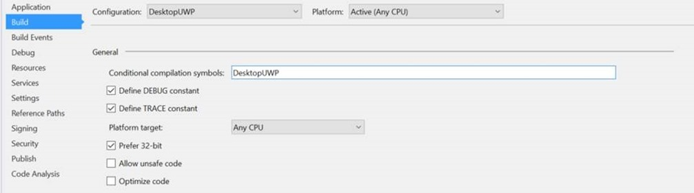
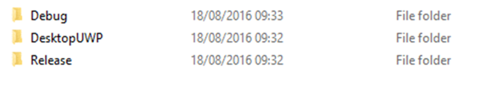

# Desktop Bridge: Espandere un’applicazione Win32 con la UWP


*Questo articolo è stato scritto da [Matteo
Pagani](http://twitter.com/qmatteoq), Windows AppConsult Engineer in
Microsoft*

[Nell'articolo
precedente](desktop-bridge-convertire-unapplicazione.md)
abbiamo imparato a sfruttare il Desktop Bridge per convertire
un’applicazione in maniera manuale, senza passare per il Desktop App
Converter e un installer: si tratta dell’approccio da utilizzare quando
il punto di partenza della conversione è un eseguibile o, più in
generale, un’applicazione Win32 da noi sviluppata, di cui possediamo il
codice sorgente. Negli articoli precedenti, avevamo usato, ad esempio, come
punto di partenza un’applicazione Windows Forms.

In questo articolo riprenderemo i concetti visti [nell'articolo
precedente](desktop-bridge-convertire-unapplicazione.md)
ma, questa volta, inizieremo ad espandere l’applicazione Win32 per
sfruttare alcune delle funzionalità offerte dalla Universal Windows
Platform. Uno sviluppatore desktop potrebbe chiedersi, a questo punto,
perché dovrebbe essere interessato a questo approccio: in virtù del
modello di sicurezza più chiuso, in molti scenari un’applicazione UWP
deve tenere conto di limitazioni maggiori rispetto ad un’applicazione
Win32, che potrebbero perciò rendere difficoltoso il lavoro dello
sviluppatore.

Abbiamo già visto [nel corso del primo
articolo](desktop-bridge-il-ponte-tra-le-applicazioni-win32-e-la-UWP.md)
i numerosi vantaggi portati dalla conversione del Desktop Bridge, come
la maggiore efficienza del meccanismo di deployment (installazione e
disinstallazione) e la maggiore sicurezza, dovuta al fatto che le app
girano all’interno di un container, che virtualizza molti degli aspetti
di Windows (come il file system o il registro di sistema) che
l’applicazione potrebbe usare come veicolo di attacco per scopi
malevoli. A questo, si aggiunge il fatto che il mondo IT sta
attraversando un cambiamento molto forte e, di conseguenza, sono sempre
di più gli utenti che non usano solamente un computer, ma anche
dispositivi come smartphone e tablet, con i quali interagiscono con
modalità differenti: comandi vocali, penne digitali, notifiche, touch
screen sono solo alcuni dei tanti esempi. Si tratta di scenari che si
sposano alla perfezione con la filosofia della Universal Windows
Platform e molte di queste funzionalità possono essere implementate in
maniera molto più semplice ed efficiente rispetto a quanto potremmo fare
con un’applicazione Win32 tradizionale.

Pensiamo, ad esempio, alle notifiche: le applicazioni desktop sono
sempre state in grado di avvisare l’utente di un evento, ad esempio
mostrando un popup o un messaggio nella task bar. Si tratta, però, di
approcci che non si integrano pienamente con l’ecosistema di Windows.
Una notifica toast generata dalla Universal Windows Platform, invece, ha
un look & feel consistente con quello del sistema operativo e delle
altre applicazioni; viene memorizzata all’interno dell’Action Center,
così che l’utente possa leggerla anche se non si trovava davanti al
computer nel momento in cui è stata inviata; offre la possibilità di
eseguire una serie di operazioni (come rispondere ad un messaggio)
direttamente dalla notifica stessa, senza neanche aprire l’applicazione.
E se aveste la necessità di ricevere notifiche anche quando
l’applicazione non è in esecuzione? In questo caso, nel mondo Win32 vi
servirebbe trovare un’alternativa, come sfruttare un servizio Windows o
mantenere l’applicazione sempre aperta ma, magari, nascosta nella barra
di sistema. Grazie alla Universal Windows Platform, invece, avete un
meccanismo nativo per gestire questi scenari molto più efficiente,
ovvero le notifiche push.

Come potete vedere, ci sono decine di scenari nei quali integrare API
della Universal Windows Platform all’interno di un’applicazione Win32
potrebbe semplificarvi parecchio la vita. Perciò, facciamolo! In questo
articolo partiremo dalla stessa applicazione Windows Forms dell'articolo
precedente, ma aggiungeremo una nuova feature: ogni volta che il file di
testo viene creato sul desktop, mostreremo una notifica toast all’utente
per confermare l’esito dell’operazione.

### Accedere alla Universal Windows Platform

Come appena citato, il punto di partenza per il nostro esperimento sarà
l’applicazione Windows Forms creata [nel precedente
articolo](desktop-bridge-convertire-unapplicazione.md),
che potete scaricare da GitHub all’indirizzo
<https://github.com/qmatteoq/DesktopBridge/tree/master/3.%20Convert>. Vi
ricordo solamente che, per lavorare su questa applicazione di esempio,
vi servirà [la versione Preview di Visual Studio
15](https://www.visualstudio.com/en-us/downloads/visual-studio-next-downloads-vs.aspx)
con installata [l’apposita estensione per il Desktop
Bridge](http://go.microsoft.com/fwlink/?LinkId=797871): in questo modo,
sarà molto più semplice per noi testare e deployare la versione
convertita dell’applicazione.

Per il momento, ci concentreremo sull’applicazione Windows Forms, nella
quale dobbiamo integrare le API UWP. La prima cosa da fare è rendere
visibile la Universal Windows Platform all’applicazione Windows Form:
come comportamento predefinito, infatti, essa gira appoggiandosi al
framework .NET e, di conseguenza, non ha accesso alle API UWP. Dobbiamo,
perciò, aggiungere un riferimento ai metadati che contengono tutte le
definizioni delle API supportate: il file si chiama **Windows.md** e lo
trovate all’interno della cartella **C:\\Program Files (x86)\\Windows
Kits\\10\\UnionMetadata.**

Il primo passo, perciò, è fare clic con il tasto destro sul progetto
Windows Forms in Visual Studio, scegliere **Add reference,** premere il
pulsante **Browse** e andare alla ricerca di questo file sul vostro
computer:



L’unica cosa importante da sottolineare, come evidenziato nell’immagine
precedente, è di selezionare nel menu a tendina che funge da filtro per
i file visualizzati la voce **All files**. Come comportamento
predefinito, infatti, la finestra di dialogo per gestire le reference di
un’applicazione Win32 mostra solamente componenti .NET standard, come
DLL o eseguibili, mentre i file con estensione .winmd fanno parte
dell’ecosistema del Windows Runtime, sul quale si appoggia la Universal
Windows Platform.

Ora che abbiamo accesso alla piattaforma, possiamo iniziare a scrivere
il codice necessario per generare una notifica toast, che dovrebbe
esservi famigliare se avete già avuto esperienza con lo sviluppo di
applicazioni UWP:

```csharp
public void ShowNotification()
{
    string xml = @"<toast>
                    <visual>
                        <binding template='ToastGeneric'>
                            <text>Desktop Bridge</text>
                            <text>The file has been created</text>
                        </binding>
                    </visual>
                </toast>";

    Windows.Data.Xml.Dom.XmlDocument doc = new Windows.Data.Xml.Dom.XmlDocument();
    doc.LoadXml(xml);

    ToastNotification toast = new ToastNotification(doc);
    ToastNotificationManager.CreateToastNotifier().Show(toast);
}
```

Nel mondo UWP le notifiche toast sono rappresentate da un payload XML,
che definisce la struttura e il contenuto della notifica. In questo
esempio, abbiamo utilizzato un template molto semplice, che mostra
solamente un titolo e un messaggio (tramite due elementi di tipo
**text**). Dopo aver definito l’XML, possiamo iniziare ad utilizzare sul
serio le API della Universal Windows Platform: potete notare, infatti,
come, per creare la notifica, dobbiamo prima convertire la stringa in un
oggetto di tipo **XmlDocument**. Si tratta, però, di un tipo che non
appartiene al framework .NET, ma alla Universal Windows Platform: lo si
può notare dal fatto che il namespace di appartenenza è
**Windows.Data.Xml.Dom**.

Il passaggio successivo è creare un oggetto di tipo
**ToastNotification** (di nuovo, una classe specifica della Universal
Windows Platform, che appartiene al namespace
**Windows.UI.Notifications**) e passare, come parametro, l’oggetto di
tipo **XmlDocument** appena creato. Come ultima operazione, utilizziamo
la classe **ToastNotificationManager** per creare un oggetto che espone
il metodo **Show()**, che ci serve per mostrare la notifica vera e
propria che abbiamo appena creato.

Ora che abbiamo creato questo metodo, siamo pronti per modificare il
codice che avevamo scritto nell'articolo precedente per creare il file di
testo sul desktop dell’utente:

```csharp
private void OnCreateFile(object sender, EventArgs e)
{
    string userPath = Environment.GetFolderPath(Environment.SpecialFolder.DesktopDirectory);
    string fileName = $"{userPath}\\centennial.txt";
    File.WriteAllText(fileName, "This file has been created by a Centennial app");
    ShowNotification();
}
```

Al termine della creazione del file, abbiamo aggiunto la chiamata al
metodo **ShowNotification()** che abbiamo appena creato. E’ importante,
a questo punto, sottolineare una cosa. L’accesso alle API della
Universal Windows Platform non è legato solamente alla versione del
sistema operativo su cui sta girando l’app (che, ovviamente, deve essere
Windows 10), ma è reso possibile dal container della Universal Windows
Platform all’interno del quale viene inclusa l’applicazione Win32 nel
momento in cui la convertiamo. Possiamo renderci conto di questo legame
semplicemente lanciando l’applicazione Windows Forms direttamente da
Visual Studio, senza passare per il progetto di deployment. Nel momento
in cui premiamo il pulsante presente nel form, il file sarà
correttamente creato sul desktop, ma subito dopo comparirà un’eccezione
nel momento in cui sarà chiamato il metodo **ShowNotification()**:



Il motivo è che l’applicazione, girando in maniera nativa Win32, non è
in grado di accedere alle API della Universal Windows Platform. Se,
invece, impostassimo come progetto di startup quello di deployment
(**Convert.DeployToUWP**), lanciassimo il debug e premessimo nuovamente
il pulsante nell’interfaccia grafica, questa volta, oltre a creare il
file sul desktop, vedremmo correttamente comparire la notifica:
l’applicazione, infatti, ora non sta più girando come nativa ma
all’interno del container della Universal Windows Platform.




### Un unico progetto, due mondi differenti

Il codice che abbiamo visto in precedenza ha un difetto: è stimolante
poter iniziare ad usare API della Universal Windows Platform senza dover
necessariamente riscrivere la nostra applicazione da capo come UWP
nativa ma, allo stesso tempo, potremmo non essere ancora pronti per
rilasciare un’applicazione in grado di girare solamente su Windows 10.
Al momento, Windows 10 è il sistema operativo con il tasso di diffusione
più alto nella storia di Microsoft, sia nel mondo consumer che in quello
enterprise, ma è altamente probabile (soprattutto in ambito aziendale)
che vi troviate ancora nella condizione di dover gestire clienti che
utilizzano versioni precedenti del sistema operativo, come Windows 7 o
Windows 8.

In questo scenario, dovremmo perciò mantenere due branch separate della
nostra applicazione Windows Forms: una che si limita a scrivere il file
sul desktop e un’altra che, invece, invii la notifica toast. Abbiamo
appena visto, infatti, come lanciando l’applicazione Win32 nativa, senza
passare tramite il container del Desktop Bridge, sia sia scatenata
un’eccezione appena abbiamo provato ad inviare la notifica. Questa è la
stessa esperienza a cui si troverebbe di fronte un utente Windows 7 o
Windows 8: l’applicazione sarebbe andata in crash, dato che le versioni
precedenti a Windows 10 non includono la Universal Windows Platform.

Fortunatamente, in questo caso ci viene in aiuto la compilazione
condizionale, che ci permette di evitare di mantenere due branch
separate: possiamo mantenere un’unica base di codice comune e fare sì
che le API UWP vengano utilizzate solo nel momento in cui l’applicazione
viene eseguita all’interno del container, mantenendo invece il regolare
flusso di esecuzione in caso di utilizzo della versione Win32 nativa.

Vediamo come fare: innanzitutto dobbiamo creare una nuova configurazione
di build, che utilizzeremo solo quando dovremo compilare l’app Win32 per
includerla nel progetto di deployment UWP. Apriamo perciò Visual Studio
e, dal menu **Build –&gt; Configuration Manager**, clicchiamo sul menu a
tendina di nome **Active solution configuration** e selezioniamo
**New**:

**** 



Date un nome significativo alla nuova configurazione (ad esempio,
**DesktopUWP**) e selezionate dal menu a tendina di copiare le stesse
impostazioni della configurazione di **Debug**.

 



 

Ora cliccate con il tasto destro sul progetto Windows Forms e scegliete
la voce **Properties.** Nella sezione **Build**, assicuratevi di
selezionare la configurazione **DesktopUWP** che abbiamo appena creato
dal menu a tendina **Configuration** e aggiungete, nella sezione
denominata **General**, un nuovo simbolo di compilazione condizionale
(per rendere le cose più semplici, utilizzeremo lo stesso nome della
configurazione, ovvero **DesktopUWP**).

 



 

Ora dobbiamo modificare leggermente il nostro codice, aggiungendo un
attributo particolare al metodo **ShowNotification()** che abbiamo
creato in precedenza:

```csharp
[Conditional("DesktopUWP")]
public void ShowNotification()
{
    string xml = @"<toast>
            <visual>
                <binding template='ToastGeneric'>
                    <text>Desktop Bridge</text>
                    <text>The file has been created</text>
                </binding>
            </visual>
        </toast>";

    Windows.Data.Xml.Dom.XmlDocument doc = new Windows.Data.Xml.Dom.XmlDocument();
    doc.LoadXml(xml);

    ToastNotification toast = new ToastNotification(doc);
    ToastNotificationManager.CreateToastNotifier().Show(toast);
}
```

Grazie a questo attributo, il metodo **ShowNotification()** sarà
compilato ed eseguito solamente se stiamo compilando l’applicazione
usando la configurazione **DesktopUWP.**

Da questo momento in poi:

-   Ogni volta che dovete creare una versione dell’applicazione da
    utilizzare su Windows 7 o su Windows 8, compilate l’applicazione
    Windows Forms usando la configurazione **Debug** o **Release**
-   Ogni volta che dovete creare un nuovo pacchetto sfruttando il
    Desktop Bridge, compliate l’applicazione Windows Forms usando la
    configurazione **DesktopUWP**

C’è un ultimo passaggio da fare: nel momento in cui abbiamo creato la
configurazione **DesktopUWP**, Visual Studio ha creato una nuova
sottocartella all’interno della cartella **bin**, nella quale viene
incluso l’output della build (quindi l’eseguibile e le eventuali DLL).
Di conseguenza, al suo interno non avremo più solamente le classiche
cartelle **Debug** e **Release**, ma anche una nuova cartella chiamata
**DesktopUWP:**

**** 



E’ l’eseguibile contenuto all’interno di questa nuova cartella che
contiene le API UWP che abbiamo utilizzato per inviare la notifica
toast, di conseguenza è quello che deve essere copiato all’interno della
cartella **PackageLayout** del progetto di deployment, dalla quale viene
poi generato l’AppX. Dobbiamo, perciò, fare una modifica al file
**AppXPackageFileList.xml** del progetto di deployment per riflettere
questa nuova configurazione:

```xml
<?xml version="1.0" encoding="utf-8"?>
<Project ToolsVersion="14.0" xmlns="http://schemas.microsoft.com/developer/msbuild/2003">
  <PropertyGroup>
    <MyProjectOutputPath>$(PackageLayout)\..\..\Enhance\bin</MyProjectOutputPath>
  </PropertyGroup>
  <ItemGroup>
    <LayoutFile Include="$(MyProjectOutputPath)\DesktopUWP\Enhance.exe">
      <PackagePath>$(PackageLayout)\Enhance.exe</PackagePath>
    </LayoutFile>
  </ItemGroup>
</Project>
```

Come potete notare, nell’elemento **LayoutFile** abbiamo sostituito la
cartella **Debug** con **DesktopUWP**. Se volete testare il
funzionamento della compilazione condizionale, è sufficiente mettere un
breakpoint all’interno dell’event handler **OnCreateFile()** legato alla
pressione del pulsante:

-   Se impostate come progetto di avvio quello Windows Forms nativo e
    lanciate il debugging, noterete che il file sul desktop sarà creato
    ma il metodo **ShowNotification()** sarà completamente saltato.
-   Se impostate come progetto di avvio quello di deployment UWP e
    lanciate il debugging, noterete questa volta che il metodo
    **ShowNotification()** sarà correttamente invocato e la notifica
    toast sarà mostrata a video.

Abbiamo raggiunto il nostro obiettivo! Ora avete la stessa identica base
di codice, in grado di funzionare su qualsiasi versione di Windows, ma
che, allo stesso tempo, quando gira su Windows 10 come applicazione UWP
è in grado di sfruttare delle funzionalità aggiuntive del sistema
operativo.

### Utilizzare metodi asincroni

Se avete un minimo di esperienza con lo sviluppo utilizzando il Windows
Runtime o la Universal Windows Platform, saprete per certo che uno degli
obiettivi di queste piattaforme è quello di rendere semplice la
creazione di applicazioni veloci e reattive: di conseguenza, qualsiasi
API che impieghi più di 50 millisecondi per completare la sua operazione
è stata implementata usando il pattern async / await. In questo modo, è
più semplice per lo sviluppatore scrivere codice asincrono, in grado
cioè di mantenere il thread della UI il più libero possibile (e quindi
l’interfaccia utente fluida e reattiva), indipendentemente da quanto
tempo richieda l’operazione che l’applicazione deve eseguire.

Se, però, provaste ad usare un metodo asincrono esposto dalla Universal
Windows Platform in un’applicazione Win32 vi accorgerete di come Visual
Studio non sia in grado di compilare il progetto. Vediamo un esempio
reale, aggiungendo un’altra funzionalità alla nostra applicazione che la
Universal Windows Platform rende molto semplice implementare: la sintesi
vocale. Aggiungiamo un altro metodo nella nostra applicazione Windows
Forms con la seguente definizione:

```csharp
[Conditional("DesktopUWP")]
private async void GenerateAudio()
{
    SpeechSynthesizer speech = new SpeechSynthesizer();
    var result = await speech.SynthesizeTextToStreamAsync("Hello cenntennial");

    string userPath = Environment.GetFolderPath(Environment.SpecialFolder.DesktopDirectory);
    string fileName = $"{userPath}\\speech.wav";

    using (FileStream stream = File.Create(fileName))
    {
        await result.AsStreamForRead().CopyToAsync(stream);
        await stream.FlushAsync();
    }
}
```

Dopodichè inseriamo un altro pulsante nell’interfaccia dell’applicazione
a, all’evento **Click**, invochiamo tale evento:

```csharp
private async void OnGenerateAudio(object sender, EventArgs e)
{
    GenerateAudio();
}
```

Come potete vedere, grazie alle API UWP, è molto semplice raggiungere il
nostro scopo: sfruttiamo la classe **SpeechSynthesizer** (che appartiene
al namespace della Universal Windows Platform
**Windows.Media.SpeechSynthesis**) a il metodo
**SynthesizeTextToStreamAsync()**, che prende in input una stringa e ne
restituisce l’elaborazione vocale sotto forma di stream audio. Il resto
del codice fa uso di API standard del framework .NET: creiamo un file
sul desktop dell’utente chiamato **speech.wav**, lo apriamo in scrittura
e, al suo interno, copiamo lo stream audio appena ottenuto. Potete
notare come il metodo sia stato impostato per sfruttare il pattern async
/ await: nella firma dell’event handler abbiamo aggiunto la parola
chiave **async**, mentre abbiamo aggiunto il prefisso **await** a tutti
i metodi asincroni che abbiamo utilizzato, come
**SynthesizeTextToStreamAsync() o CopyToAsync().** Noterete, però,
immediatamente che Visual Studio vi mostrerà un errore, lamentandosi
della mancanza dell’implementazione del metodo **GetAwaiter().**

###  


 

Per risolvere questo problema, è necessario aggiungere un’altra
reference alla nostra applicazione Windows Forms, la quale non viene
aggiunta in maniera predefinita dato che fa parte del framework .NET
Core e non di quello tradizionale. Il nome della libreria è
**System.Runtime.WindowsRuntime.dll** e la trovate nel percorso
**C:\\Program Files (x86)\\Reference
Assemblies\\Microsoft\\Framework\\.NETCore\\v4.5.1**

Dopo aver aggiunto tale reference, noterete immediatamente il messaggio
di errore scomparire e sarete in grado di compilare l’applicazione
Windows Forms senza problemi. Se volete testare questa funzionalità,
ricordatevi che anche in questo caso non potete lanciare l’applicazione
Windows Forms nativa, ma il progetto di deploy UWP incluso nella
soluzione, dato che stiamo usando alcune API della Universal Windows
Platform. Se avete fatto tutto correttamente, al termine della procedura
troverete sul vostro desktop un file audio di nome **speech.wav,** con
uno spezzone audio di una voce sintetizzata che pronuncerà la frase
“Hello centennial”.

### 

### In conclusione

In questo articolo abbiamo visto come possiamo iniziare a integrare
alcune funzionalità della Universal Windows Platform all’interno di
un’applicazione Win32. Vi segnalo due link importanti:

-   Nel mio repository GitHub, all’indirizzo
    <https://github.com/qmatteoq/DesktopBridge/tree/master/4.%20Enhance>,
    troverete l’applicazione di esempio utilizzata in questo articolo.
-   All’indirizzo
    <https://msdn.microsoft.com/en-us/windows/uwp/porting/desktop-to-uwp-supported-api>
    troverete l’elenco ufficiale di tutte le API della Universal Windows
    Platform che possono essere utilizzate all’interno di
    un’applicazione Win32 convertita

Happy coding!


