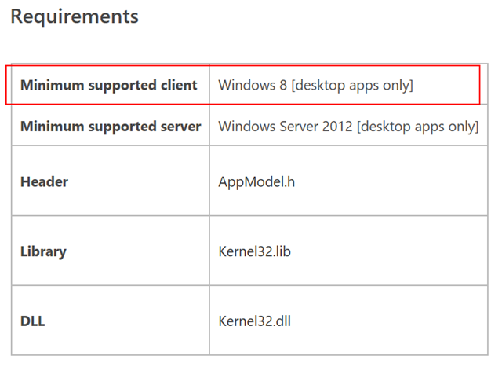
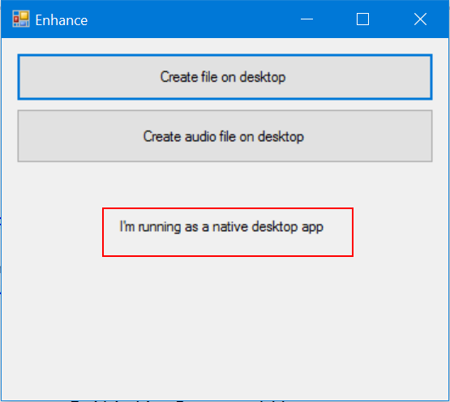
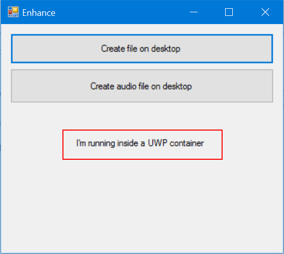

# Desktop Bridge – Identificare il contesto dell’applicazione 


*Questo articolo è stato scritto da [Matteo
Pagani](http://twitter.com/qmatteoq), Windows AppConsult Engineer in
Microsoft*

[Nell'articolo
precedente](desktop-bridge-espandere-unapplicazione-win32-con-la-universal-windows-platform.md)
abbiamo visto come il Desktop Bridge ci offra la possibilità non solo di
includere la nostra applicazione desktop tradizionale così com’è
all’interno di un container UWP ed, eventualmente, di pubblicarla sullo
Store, ma anche di iniziare a integrare funzionalità di Windows 10
all’interno della stessa, senza per questo doverla immediatamente
riscrivere come applicazione UWP nativa.

Questo, però, potrebbe portarci a dover mantenere due versioni separate
(a livello di codice) della stessa applicazione: una tradizionale, per
gli utenti che non hanno ancora migrato i loro PC a Windows 10, e una
“moderna”, in grado invece di sfruttare le nuove API della UWP.
Ovviamente, sappiamo tutti come il mantenimento di più branch della
stessa base di codice abbia un costo non indifferente: ogni volta che
vogliamo aggiungere una nuova feature (soprattutto nel caso in cui non
sia legata a Windows 10, quindi necessaria per entrambe le versioni)
dobbiamo duplicare i nostri sforzi.

Nel corso [dell'articolo
precedente](desktop-bridge-espandere-unapplicazione-win32-con-la-universal-windows-platform.md)
abbiamo visto un primo approccio per evitare di dover mantenere due
branch completamente separate: la compilazione condizionale. Grazie ad
essa, possiamo usare le keyword **\#if** e **\#endif** oppure marcare
alcuni metodi con l’attributo **Conditional** per far si che alcuni
metodi e funzionalità vengano richiamati solamente nel momento in cui
l’applicazione viene compilata per essere poi inclusa all’interno di un
pacchetto AppX.

Avevamo implementato un caso reale di questa funzionalità
nell’applicazione utilizzata come esempio per l'articolo precedente,
disponibile su GitHub all’indirizzo
<https://github.com/qmatteoq/DesktopBridge/tree/master/4.%20Enhance>
L’applicazione includeva un pulsante per creare un file sul desktop
dell’utente utilizzando le API tradizionali del framework .NET ma,
grazie alla compilazione condizionale, solo nel momento in cui veniva
eseguita all’interno del container della Universal Windows Platform
veniva richiamato anche un metodo chiamato **ShowNotification()**, che
mostrava all’utente una notifica toast sfruttando le API UWP apposite.

Esistono alcuni scenari, però, in cui la compilazione condizionale non è
in grado di risolvere tutti i nostri requisiti. Pensiamo alla necessità
di modificare l’interfaccia utente dell’applicazione in base al contesto
in cui sta girando. Se, ad esempio, abbiamo previsto una funzionalità di
auto aggiornamento dell’applicazione, con un pulsante dedicato per
controllare la presenza di nuove versioni, tale pulsante dovrà essere
disabilitato nella versione AppX che distribuiamo sullo Store: gli
aggiornamenti, infatti, saranno pubblicati direttamente tramite il Dev
Center, quindi non avremo più bisogno di gestire noi in maniera
personalizzata la parte di update.

In questo caso, non possiamo sfruttare la compilazione condizionale, ma
abbiamo la necessità di determinare, in fase di esecuzione, il contesto
in cui sta girando l’applicazione e decidere se mostrare o meno il
pulsante di aggiornamento.

Per raggiungere questo scopo, possiamo sfruttare una API nativa di
Windows, contenuta all’interno della libreria di sistema
**kernel32.dll**, che espone un metodo di nome
**GetCurrentPackageFullName()**, il quale ci permette di recuperare
l’identità dell’applicazione. Il concetto di identità, però, è qualcosa
che appartiene solo al mondo degli AppX e delle Windows Store app prima
(in Windows 8.x) e delle Universal Windows Platform app (in Windows 10).
Nel momento in cui l’applicazione desktop sta girando come nativa, al di
fuori del container, invece, l’applicazione non ha alcuna identità e, di
conseguenza, l’utilizzo di questa API ritornerà un errore. Potete
trovare un esempio di utilizzo di questa API nella documentazione
ufficiale all’indirizzo
<https://msdn.microsoft.com/en-us/library/windows/desktop/hh446599(v=vs.85).aspx>

```cpp
#define _UNICODE 1
#define UNICODE 1

#include <Windows.h>
#include <appmodel.h>
#include <malloc.h>
#include <stdio.h>

int __cdecl wmain()
{
    UINT32 length = 0;
    LONG rc = GetCurrentPackageFullName(&length, NULL);
    if (rc != ERROR_INSUFFICIENT_BUFFER)
    {
        if (rc == APPMODEL_ERROR_NO_PACKAGE)
            wprintf(L"Process has no package identity\n");
        else
            wprintf(L"Error %d in GetCurrentPackageFullName\n", rc);
        return 1;
    }

    PWSTR fullName = (PWSTR) malloc(length * sizeof(*fullName));
    if (fullName == NULL)
    {
        wprintf(L"Error allocating memory\n");
        return 2;
    }

    rc = GetCurrentPackageFullName(&length, fullName);
    if (rc != ERROR_SUCCESS)
    {
        wprintf(L"Error %d retrieving PackageFullName\n", rc);
        return 3;
    }
    wprintf(L"%s\n", fullName);

    free(fullName);

    return 0;
}
```

Come vedete, se il contesto in cui state lavorando è quello di
un’applicazione .NET scritta in C\# (come quella di esempio utilizzata
negli articoli precedenti), sorge una complessità: non si tratta di una API
resa disponibile dal framework .NET, ma di un metodo nativo offerto da
Windows in C++. Di conseguenza, utilizzarlo all’interno di
un’applicazione managed non è così semplice utilizzarla: bisogna
ricorrere a meccanismi di interop per far parlare questi due mondi, come
l’uso di P/Invoke o di librerie C++ / CLI. Inoltre, c’è un altro aspetto
da considerare: l’utilizzo del codice visto in precedenza, su sistemi
precedenti a Windows 7, non sarebbe in grado di funzionare, dato che il
concetto di identità e di AppX è stato introdotto a partire da Windows 8
in poi con il Windows Runtime.

Potete notare questo requisito anche nella documentazione indicata in
precedenza:



Per semplificare il lavoro degli sviluppatori .NET ho deciso di
includere il codice C++ visto in precedenza all’interno di una libreria
.NET compatibile a partire dal framework .NET 4 in poi, che sfrutta:

-   Il meccanismo di P/Invoke per richiamare il metodo
    **GetPackageFullName()**
-   Le API native del framework .NET per determinare se l’applicazione
    stia girando su un sistema operativo dove questa API non è
    supportata, come Windows 7

La libreria è open source è disponibile sul mio repository GitHub
all’indirizzo <https://github.com/qmatteoq/DesktopBridgeHelpers/>,
nonché come pacchetto NuGet identificato dall’id
[DesktopBridge.Helpers](https://www.nuget.org/packages/DesktopBridge.Helpers/).

Una volta installata la libreria nel vostro progetto .NET (sia essa
un’applicazione console, Windows Forms o WPF), è sufficiente creare una
istanza della classe **DesktopBridge.Helpers** e chiamare il metodo
**IsRunningAsUwp()**. Vi sarà restituito un valore di tipo booleano, che
sarà pari a **true** se l’applicazione sta girando all’interno del
container UWP o **false** nel caso in cui, invece, stia girando come
desktop nativa.

Potete trovare diversi esempi di codice (uno per ogni tecnologia .NET)
all’interno del repository stesso all’indirizzo
<https://github.com/qmatteoq/DesktopBridgeHelpers/tree/master/Samples>

Anche il [progetto
originale](https://github.com/qmatteoq/DesktopBridge/tree/master/4.%20Enhance)
usato [nell'articolo
precedente](desktop-bridge-espandere-unapplicazione-win32-con-la-universal-windows-platform.md)
è stato aggiornato per sfruttare questa libreria: all’interno della
finestra dell’applicazione Windows Forms, infatti, è stato aggiunto un
controllo **Label,** nel quale viene mostrato un testo diverso a seconda
del contesto di esecuzione, che viene determinato in fase di caricamento
del form.

```csharp
private bool IsRunningAsUwp()
{
   UwpHelpers helpers = new UwpHelpers();
   return helpers.IsRunningAsUwp();
}

private void Form1_Load(object sender, EventArgs e)
{
   if (IsRunningAsUwp())
   {
       txtUwp.Text = "I'm running inside a UWP container";
   }
   else
   {
       txtUwp.Text = "I'm running as a native desktop app";
   }
}
```

Se ora impostaste come progetto di startup quello Windows Forms (di nome
**Enhance**), potrete notare come il messaggio mostrato nella finestra
sarà *I’m running as a native desktop app***.** Se, però, lanciaste il
progetto di deploy **Enhance.DesktopToUWP** oppure provaste a convertire
l’applicazione in un pacchetto AppX, allora otterreste a schermo il
messaggio *I’m running inside a UWP container*.

  ---------------------------------------------------------------------------------------------------------------------------------------------------------------------------------------------- ----------------------------------------------------------------------------------------------------------------------------------------------------------------------------------------------
  


  
  ---------------------------------------------------------------------------------------------------------------------------------------------------------------------------------------------- ----------------------------------------------------------------------------------------------------------------------------------------------------------------------------------------------

### 

 

### Evitare errori in fase di deployment

Questa libreria può essere utile anche per un altro scenario: evitare
errori in fase di deployment quando utilizzate la compilazione
condizionale. [Se avete letto l'articolo precedente con
attenzione](desktop-bridge-espandere-unapplicazione-win32-con-la-universal-windows-platform.md),
ricorderete infatti che, lanciando direttamente l’applicazione Windows
Forms utilizzando, però, la configurazione **DesktopUWP**, si otteneva
in fase di creazione del file su desktop un’eccezione: questo perché,
con tale configurazione, viene chiamato il metodo **ShowNotification()**
che, facendo uso delle API della UWP, mostra la notifica toast
all’utente. L’utilizzo delle API UWP, però, vi ricordo non essere legato
alla versione del sistema operativo, ma all’esecuzione all’interno del
container: anche se l’applicazione Windows Forms è in esecuzione su un
PC con Windows 10 Anniversary Update, non è comunque in grado di
utilizzare le API della Universal Windows Platform se sta girando come
nativa, perciò al di fuori del container UWP.

Se non fate attenzione, perciò, potreste correre il rischio di creare
una versione tradizionale della vostra applicazione (da distribuire, ad
esempio, agli utenti con una versione di Windows precedente
all’Anniversary Update) con, al suo interno, un eseguibile compilato in
modalità **DesktopUWP,** che andrebbe in crash nel momento in cui
provaste ad utilizzare una API UWP. Il problema è che non è detto che
siate in grado di accorgervi di questo problema immediatamente: ad
esempio, nel caso della nostra applicazione di esempio, tutto
funzionerebbe correttamente fino a che non premeremmo il pulsate
**Create file on desktop**. A questo punto, dato che l’applicazione, al
termine della creazione del file, invocherebbe il metodo
**ShowNotification()**, questa andrebbe in crash.

Possiamo evitare errori di deployment di questo tipo sfruttando la
libreria descritta in precedenza ed aggiungendo, in fase di caricamento
della nostra applicazione, un codice simile al seguente:

```csharp
private void OnFormLoaded(object sender, EventArgs e)
{
    DesktopBridge.Helpers helpers = new DesktopBridge.Helpers();
    bool isUwp = helpers.IsRunningAsUwp();
#if DesktopUWP
        if (!isUwp)
        {
            MessageBox.Show("You're compiling the app with the wrong configuration!");
            this.Close();
        }
#endif  
    }
}
```

Facendo uso delle parole chiave **\#if** e **\#endif**, andiamo a
verificare il contesto in cui sta girando l’applicazione solo nel caso
in cui è stata compilata in modalità **DesktopUWP.** In questo modo, nel
momento in cui tentaste di avviare l’applicazione Windows Forms in
modalità nativa, ma compilata con la configurazione specifica per il
deployment AppX, ce ne accorgeremmo immediatamente, grazie al messaggio
di avviso e alla chiusura dell’applicazione, senza dover necessariamente
attivare una funzione che faccia uso di API UWP. In questo modo, sarà
più semplice per noi, come sviluppatori, evitare errori di questo tipo
ed essere sicuri:

-   Di compilare l’applicazione in modalità **Debug** o **Release**
    quando vogliamo distribuirla come applicazione desktop tradizionale
-   Di compilare l’applicazione in modalità **DesktopUWP** quando
    vogliamo convertirla e distribuirla come pacchetto AppX

### In conclusione

Spero che questa libreria, nella sua semplicità, possa comunque essere
utile per ottimizzare le vostre applicazioni e raggiungere, insieme
all’utilizzo della compilazione condizionale, lo scopo di non dover
mantenere più branch differenti del codice sorgente della vostra
applicazione in base al tipo di distribuzione che volete utilizzare.
Happy coding!

P.S. = un ringraziamento speciale a [Raffaele
Rialdi](https://twitter.com/raffaeler), per il supporto nel capire in
maniera più approfondita il meccanismo P/Invoke e implementarlo
all’interno della libreria.


