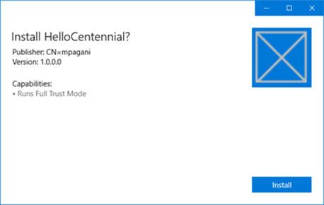
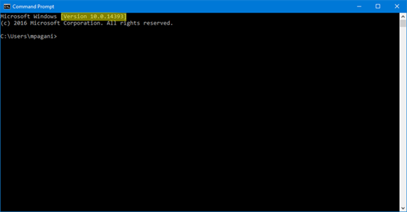
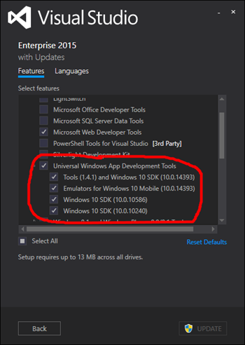

# Desktop Bridge: il ponte tra le applicazioni Win32 e la UWP

*Questo post è stato scritto da [Matteo
Pagani](http://twitter.com/qmatteoq), Windows App Consult Engineer in
Microsoft*

Se vi interessate di sviluppo Windows avrete sicuramente già sentito
parlare di **Project Centennial**, ora conosciuto ufficialmente come
**Desktop Bridge**. Come dice il nome stesso, si tratta di una
tecnologia che nasce con l’obiettivo di creare un ponte tra il nuovo
approccio allo sviluppo di applicazioni Windows (la Universal Windows
Platform) e quello più tradizionale, basato sul framework .NET e su
tecnologie come Windows Forms o WPF.

Il Desktop Bridge non è una vera e propria novità: annunciato due anni
fa a BUILD, nel corso degli ultimi mesi si sono susseguite le prime
preview, per dare la possibilità agli sviluppatori di iniziare a fare i
primi test e a muovere i primi passi con i vari tool. Perché torniamo a
parlarne? Perché, finalmente, con l’uscita dell’Anniversary Update, il
Desktop Bridge diventa un prodotto ufficiale a tutti gli effetti e,
nella giornata di ieri, sono state annunciate una serie di novità molto
importanti.

### Lo Store apre le porte alle prime applicazioni Centennial

Da oggi, dallo Store di Windows 10, potrete scaricare le prime
applicazioni Win32 convertite sfruttando il Desktop Bridge e non più
solamente applicazioni UWP native. A dimostrazione dell’efficacia del
Desktop Bridge, seppur si tratti di una tecnologia in preview e in
continua evoluzione ed espansione, troviamo diversi nomi di un certo
peso tra le prime applicazioni disponibili, come Evernote. Trovate
l’elenco delle prime applicazioni disponibili all’indirizzo
<https://www.microsoft.com/en-us/store/collections/fullsoftwareapplications/pc> 

### Il Desktop App Converter è ora disponibile sullo Store

Il Desktop App Converter è ora disponibile non solamente tramite i
canali tradizionali, ma anche come app UWP vera e propria scaricabile
dallo Store. Piccola curiosità (che ridefinisce il concetto di
ricorsività per il sottoscritto
: l’app disponibile sullo Store, infatti, non è altro
che il Desktop App Converter originale, convertito nel formato AppX
tramite il tool stesso. Potete scaricarlo direttamente dallo Store
seguendo l’indirizzo <https://www.microsoft.com/store/apps/9nblggh4skzw>

### Supporto al formato AppX da parte dei principali tool di creazione di installer

Applicazioni molto popolari per la creazione di installer come
InstallShield, Wix e Advanced Installer hanno annunciato il loro
supporto al Desktop Bridge: tra i vari formati di esportazione di un
processo di setup, oltre ai classici MSI o EXE, è stato affiancato anche
il formato AppX.

### Come funziona il Desktop Bridge?

Come anticipato all’inizio del post, il Desktop Bridge non identifica
uno specifico tool, ma una serie di tecnologie che consentono di creare
un punto di collegamento tra il mondo Win32 e la Universal Windows
Platform. Come probabilmente saprete già, le Universal Windows Platform
app girano nel contesto di una sandbox che, se da una parte garantisce
maggiore sicurezza all’utente, dall’altra può introdurre alcune
limitazioni che sono difficili da gestire nell’ambito di un progetto
enterprise. Perché uno sviluppatore .NET tradizionale dovrebbe, perciò,
essere interessato a sfruttare e distribuire le proprie applicazioni
usando il nuovo formato AppX e a sfruttare la Universal Windows
Platform? Vediamo alcune motivazioni:

1.  Il mondo tecnologico è fortemente cambiato negli ultimi anni: si è
    passati da un approccio PC-centrico (molto diffuso, ma che fa ancora
    fatica a penetrare in alcune fasce della popolazione, come gli
    anziani o i giovanissimi) ad un mondo in mobilità, dove grazie a
    smartphone e tablet la maggior parte delle persone ora è sempre
    connessa e abituata a navigare in Internet, a scaricare app, ecc. Di
    conseguenza, si è creato un divario molto forte nelle modalità di
    distribuzione di applicazioni tra il mondo mobile e il mondo PC: da
    un lato, tutte le principali piattaforme offrono uno Store, che
    permette in maniera semplice di cercare applicazioni e di
    installarle con un semplice tocco del dito. Dall’altra, l’utente è
    ancora costretto ad aprire il browser, cercare il nome
    dell’applicazione su un motore di ricerca, scaricare manualmente un
    file di installazione ed eseguirlo. Tutto ciò, nella speranza che
    l’utente non si sia fatto trarre in inganno da qualche sito
    malevolo, che lo abbia portato a scaricare un installer che, in
    realtà, sia un veicolo di malware o spyware. La distribuzione di
    applicazioni tramite lo Store ha, perciò, un duplice vantaggio:
    maggiore sicurezza e semplicità per l’utente finale; maggiore
    visibilità e semplicità di monetizzazione e di gestione del ciclo di
    vita dell’applicazione (pubblicazione,
    aggiornamento, disinstallazione) per lo sviluppatore.
2.  Il framework .NET è nato in un contesto tecnologico molto diverso da
    quello attuale: mobilità, cloud, IoT, microservizi sono solo alcune
    delle tecnologie che si stanno diffondendo sempre di più negli
    ultimi anni. Da questo punto di vista, la Universal Windows Platform
    ha parecchi assi nella manica: è una piattaforma di sviluppo
    moderna, in grado di supportare una gran varietà di dispositivi
    (telefoni, tablet, pc, Xbox, IoT, ecc.), e con un forte accento
    sull’ottimizzazione delle performance e dell’esperienza utente;
    offre strumenti visuali (come gli Adaptive Trigger dello XAML e le
    Composition API) che permettono di realizzare interfacce utente
    moderne e in grado di adattarsi a qualsiasi schermo e device; offre
    API per implementare in maniera semplice scenari come l’interazione
    vocale, l’uso di penne digitali, la gestione delle notifiche
    push, ecc.

Questi numerosi mutamenti, spesso e volentieri, non sono semplicemente
conseguenza di una moda, ma hanno portato un cambiamento tangibile nel
modo di lavorare da parte di aziende e professionisti: è sempre più
difficile trovare società che non abbiano perlomeno iniziato un processo
di modernizzazione della loro infrastruttura IT, nella quale, alla
classica applicazione desktop tradizionale, vengono spesso affiancate
applicazioni da usare su smartphone o tablet in situazioni di mobilità e
che sfruttano il cloud per gestire il backend e la sincronizzazione dei
dati. In tutti questi contesti, Windows 10 e la Universal Windows
Platform possono offrire sicuramente una marcia in più rispetto alle
tradizionali applicazioni Win32.

### Quali sono gli approcci offerti dal Desktop Bridge?

Esistono tre approcci differenti per utilizzare il Desktop Bridge, in
base allo scenario di partenza e ai requisiti. Nel corso dei prossimi
mesi vedremo alcuni post più dettagliati in cui analizzeremo in
profondità il loro funzionamento. Per ora, mi limiterò a darvi una
panoramica generale, per aiutarvi a capire le sue potenzialità:

1.  **Desktop App Converter**, ovvero il già citato tool che consente di
    prendere un installer e di convertirlo in un pacchetto AppX,
    distribuibile su altri PC Windows o pubblicabile sullo Store. Questo
    approccio non richiede alcuna modifica al vostro codice, anche se ci
    sono una serie di requisiti che il vostro installer deve rispettare
    (come il poter supportare una modalità di installazione
    “silenziosa”, senza intervento dell’utente, o il non dover
    richiedere l’installazione di driver di sistema). Trovate tutti i
    requisiti nella documentazione ufficiale:
    <https://msdn.microsoft.com/windows/uwp/porting/desktop-to-uwp-root>
    Come sviluppatori, il vantaggio principale di questo approccio è che
    vi consente di raggiungere un pubblico più ampio (grazie alla
    maggiore visibilità dello Store di Windows 10) e di semplificare
    notevolmente tutta una serie di scenari (la vendita dell’app e la
    gestione delle transazioni, il rilascio di aggiornamenti, l’offerta
    di prodotti in-app purchase) che, in un’applicazione Win32
    tradizionale, sarebbero completamente a vostro carico. Gli utenti,
    invece, potranno beneficiare di una maggiore semplicità di
    installazione e di disinstallazione, grazie al fatto che il Desktop
    App Converter non si limita a pacchettizzare l’app in un AppX, ma la
    fa girare all’interno del contesto di un container. Ciò significa
    che l’applicazione potrà mantenere intatte tutte le sue funzionalità
    (anche quelle tipicamente non consentite ad un’app UWP, come
    scrivere o leggere dal registro di sistema), ma lo farà all’interno
    di un ambiente virtualizzato. In questo modo, quando l’applicazione
    sarà disinstallata, non lascerà alcuno “scarto” (come file e chiavi
    di registro orfane), cosa che invece spesso succede con gli
    installer tradizionali e che, a lungo termine, può diventare una
    delle principali cause del degrado delle performance di Windows.
2.  **Espandere un’applicazione Win32 con le funzionalità della
    Universal Windows Platform**: il secondo approccio nasce quando, al
    posto di un installer, abbiamo un vero e proprio eseguibile od un
    progetto di cui possediamo il codice sorgente. In questo caso,
    possiamo sfruttare alcuni tool presenti nell’SDK di Windows 10
    (descritti su
    <https://msdn.microsoft.com/en-us/windows/uwp/porting/desktop-to-uwp-manual-conversion>),
    per convertire manualmente un progetto Win32 in un AppX. In
    alternativa, abbiamo anche la possibilità di sfruttare un approccio
    più semplice e automatizzato grazie ad un’estensione di Visual
    Studio che, però, al momento è disponibile solo per la versione
    Preview di VS15 (la prossima versione di Visual Studio, da non
    confondere con la 2015, che è quella attuale). Questa modalità è,
    invece, descritta all’indirirzzo
    <https://msdn.microsoft.com/en-us/windows/uwp/porting/desktop-to-uwp-deploy-and-debug>.
    Il punto di forza di questo approccio, rispetto all’uso del Desktop
    App Converter, è che siamo in grado non solo di convertire
    l’applicazione Win32 così com’è, ma anche di iniziare ad integrare
    alcune API della Universal Windows Platform: in questo modo, la
    nostra applicazione potrà continuare ad eseguire operazioni tipiche
    del mondo Win32 (come la già citata lettura e scrittura di chiavi
    di registro) ma, allo stesso tempo, iniziare a sfruttare
    funzionalità come l’aggiornamento della tile, l’invio di notifiche
    toast o l’integrazione con i servizi vocali di Cortana.
3.  **Integrare un processo Win32 all’interno di un’applicazione UWP**:
    questo terzo è ultimo approccio nasce per scenari in cui, per una
    serie di requisiti, siete già passati allo stadio successivo, ovvero
    avete già iniziato a sviluppare una versione UWP della vostra
    applicazione Win32 (ad esempio, perché il vostro cliente vuole una
    versione dell’applicazione in grado di girare in mobilità anche su
    tablet o device 2-in-1, con un’interfaccia in grado di adattarsi
    senza problemi a differenti tipologie di interazione, come mouse e
    tastiera, touch e penna). Durante lo sviluppo, però, vi potrebbe
    capitare di incontrare alcuni scenari in cui i vincoli di sicurezza
    della Universal Windows Platform vi possano stare stretti e vi serva
    necessariamente eseguire alcune operazioni che solo un’applicazione
    Win32 è in grado di compiere. In questo caso, questo terzo approccio
    vi consente di richiamare, all’interno di una Universal Windows
    Platform app, un processo Win32 (come una Console application) e,
    tramite gli App Service (ovvero un tipo speciale di background task
    che funge da canale di comunicazione tra due applicazioni
    differenti), scambiare dati tra i due. In questo modo, ad esempio,
    l’utente potrebbe usare la versione UWP per tutto ciò che riguarda
    l’inserimento dei dati o la gestione dell’interfaccia utente, per
    poi demandare ad un processo Win32 l’esecuzione di alcune operazioni
    attualmente non consentite (come la comunicazione diretta con un
    database o la scrittura di file in determinate cartelle di sistema).
    Potete approfondire il funzionamento degli App Service con questo
    articolo:
    <https://msdn.microsoft.com/en-us/windows/uwp/launch-resume/how-to-create-and-consume-an-app-service> 

### Distribuire applicazione convertite

L’Anniversary Update, insieme al Desktop Bridge, ha portato una serie di
novità importanti relative alla distribuzione di applicazioni di nuova
generazione sfruttando il formato AppX. Lo Store è sempre stato il punto
di riferimento, ma spesso e volentieri società e sviluppatori si sono
trovati nella necessità (ad esempio, in ambienti enterprise) di
distribuire le applicazioni in modalità differenti, senza passare da uno
Store pubblico. Con le versioni precedenti di Windows era già possibile,
ma spesso la strada non era così semplice come con lo Store: in Windows
8 era necessario acquistare delle licenze ad hoc per consentire il side
loading; la prima versione di Windows 10 ha rimosso questo requisito
introducendo una nuova opzione direttamente nel sistema, ma bisognava
comunque passare tramite l’esecuzione di script Powershell; il November
Update ha introdotto lo Store For Business, che semplifica notevolmente
questo scenario, ma richiede comunque un certo tipo di configurazione
all’interno dell’azienda (come l’adozione di Azure Active Directory).
L’Anniversary Update introduce un nuovo e importante passo avanti nella
semplificazione: **ora i pacchetti con estensione .appx sono, a tutti
gli effetti, dei file eseguibili veri e propri**, che possono essere
installati con un semplice doppio clic su un qualsiasi computer in cui
sia abilitata l’installazione di applicazione enterprise (funzionalità
gestibile dalle Impostazioni di Windows 10 e abilitata di default a
partire dal November Update). Lo screenshot sottostante vi mostra un
esempio di interfaccia di installazione:



L’unico requisito che continua a persistere per questioni di sicurezza
(ma non è una novità in senso assoluto, dato che si applica da diverso
tempo anche agli installer e agli eseguibili tradizionali) è la
necessità di firmare digitalmente il pacchetto con un certificato
valido, che può essere sia generato internamente dallo sviluppatore o
dalla società (e, in questo caso, andrà aggiunto tra le Certification
Authority autorizzate su tutti i pc su cui si vuole installare il
pacchetto), oppure acquistato da una Certification Authority pubblica.
In questo caso, essendo il certificato noto e autorizzato a livello
globale, sarà già incluso tra quelli predefiniti di Windows, abilitando
automaticamente l’installazione del pacchetto. Se, fino ad oggi, avete
lavorato con applicazioni UWP e non eravate a conoscenza di questi
requisiti, sappiate che le applicazioni distribuite tramite lo Store non
sono esenti da questa procedura: la differenza è che, se utilizzate lo
Store come canale di distribuzione, ci pensa lui a “fare il lavoro
sporco”; a voi sarà richiesto, semplicemente, di fornire il pacchetto
AppX, il quale verrà convalidato e firmato digitalmente una volta
superato il processo di certificazione.

Il punto di forza di questa nuova funzionalità dell’Anniversary Update è
che ora l’utilizzo del formato AppX lascia allo sviluppatore e alle
aziende la massima libertà possibile nella distribuzione delle
applicazioni:

-   Potete pubblicarle sullo Store, che vi garantisce maggiore
    visibilità e una maggiore semplicità nella gestione delle
    transazioni e del rilascio di aggiornamenti.
-   Potete usare degli script di distribuzione sui vostri PC aziendali
    se sono in dominio.
-   Potete utilizzare strumenti MDM come Intune o Airwatch per gestire i
    device aziendali e distribuire le applicazioni in
    maniera centralizzata.
-   Potete caricare il pacchetto AppX su un sito web o su una intranet e
    comunicarne l’indirizzo ai vostri utenti.
-   Potete anche copiare il pacchetto AppX su un CD o su una chiavetta
    USB e installarli manualmente su ogni singolo PC.

E’ importante sottolineare, comunque, che in questa prima fase di
apertura dello Store la pubblicazione di applicazione Win32 convertite
non è ancora abilitata a tutti gli sviluppatori, ma è necessario
ottenere un permesso speciale da parte di Microsoft. Questo
principalmente per due motivi:

-   **Di sicurezza:** le applicazioni convertite, infatti, pur girando
    nel contesto di una sandbox, vengono eseguite in modalità full
    trust, il che consente loro di effettuare operazioni potenzialmente
    malevoli rispetto ad una normale applicazione UWP, che invece non ha
    alcuna possibilità di uscire dalla propria sandbox se non dietro
    esplicito consenso dell’utente e solamente per alcune operazioni.
-   **Di legalità**: Il Desktop App Converter, infatti, può essere
    utilizzato con qualsiasi installer, dato che ovviamente non è in
    grado di determinare se l’applicazione che state convertendo sia di
    vostra proprietà o meno. Di conseguenza, come Microsoft, vogliamo
    assicurarci che se state pubblicando un’applicazione convertita
    sullo Store, siate effettivamente i proprietari della versione
    Win32 originale.

Se avete un gioco o un’applicazione Win32 che vorreste portare sullo
Store tramite il Desktop Bridge, potete compilare il form all’indirizzo
<https://developer.microsoft.com/en-us/windows/projects/campaigns/desktop-bridge>.
Un team di Microsoft si farà carico di valutare la vostra applicazione e
contattarvi, sia per supportarvi dal punto di vista tecnico che per
concedervi l’eccezione sul Dev Center necessaria per pubblicare
applicazioni convertite (richiesta dal fatto che le stesse fanno usa di
una capability privata, chiamata **runFullTrust**).

Insomma, come vedete il Desktop Bridge e, nello specifico, il Desktop
App Converter, portano innumerevoli vantaggi di sicurezza e di
semplificazione della gestione delle applicazioni, senza per questo
limitarvi in alcun modo sulla modalità che preferite per distribuirle ai
vostri utenti e clienti.

### 

### Iniziare ad utilizzare il Desktop App Converter

Se state leggendo questo post, è altamente probabile che siate
sviluppatori, perciò un articolo solamente teorico probabilmente sarebbe
troppo noioso per i vostri interessi

Come già anticipato, nel prossimo futuro troverete
una serie di post che che analizzeranno in profondità i vari approcci
descritti in precedenza ma, giusto per iniziare a solleticare il vostro
interesse, vediamo brevemente come possiamo installare il **Desktop App
Converter** per convertire un installer in un pacchetto AppX.

La prima cosa che vi serve è essere allineati con l’ultima versione
ufficiale di Windows 10, ovvero l’Anniversary Update, identificato dal
numero di build **10.0.14393.** Il Desktop Bridge, infatti, si appoggia
a diverse funzionalità della UWP che sono state aggiunte in questa nuova
versione del sistema operativo. Potete controllare velocemente se siete
sulla versione corretta aprendo un qualsiasi prompt dei comandi: in alto
vi verrà mostrato il numero di build esatto della vostra versione di
Windows, come potete vedere nella figura sottostante.



Una volta fatta questa verifica, dovete installare due componenti:

1.  Uno è il tool vero e proprio, che potete scaricare da
    <https://www.microsoft.com/en-us/download/details.aspx?id=53428>
    oppure direttamente dallo Store al link
    <https://www.microsoft.com/store/apps/9nblggh4skzw>.
2.  La seconda componente è l’immagine di Windows che viene utilizzata
    come container nella generazione dell’installer. Ad ogni versione di
    Windows corrisponde un’immagine specifica perciò, se siete iscritti
    al programma Insider, fate attenzione perché non sempre vengono
    rilasciate immagini per ogni build, soprattutto se sono quelle del
    ramo Fast. Nel corso del post darò per scontato che stiate
    utilizzando la versione ufficiale dell’Anniversary Update (la già
    citata build 14393), di conseguenza all’indirizzo
    <https://www.microsoft.com/en-us/download/details.aspx?id=53428>
    dovrete scaricare il file chiamato **BaseImage-14393.wim**. Dotatevi
    di una linea piuttosto veloce o di un po’ di pazienza, perché il
    file ha una dimensione di circa 3.3 GB.

Sia che abbiate installato il Desktop App Converter manualmente, sia che
lo abbiate scaricato dallo Store, non c’è alcuna differenza
nell’utilizzo: si tratta di un tool a riga di comando, che richiede una
serie di parametri sia per l’inizializzazione (che vedremo a breve) sia
per l’uso vero e proprio (che vedremo nel prossimo post). L’unica
differenza è che la versione scaricabile manualmente è basata su uno
script Powershell e, di conseguenza, dovrete aprire una console di
Powershell con diritti di amministratore per usarlo; nel caso della
versione proveniente dallo Store, invece, si tratta di un eseguibile
tradizione (DesktopAppConverter.exe) ma, anche in questo caso,
l’applicazione va eseguita con diritti di amministratore.

Tutti gli esempi successivi e nel prossimo post saranno basati sulla
versione Powershell, ma i parametri e i comandi sono assolutamente
identici: se volete usare la versione proveniente dallo Store, dovrete
semplicemente sostituire **DesktopAppConverter.ps1** con
**DesktopAppConverter.exe**.

Una volta in possesso di entrambi i file, scompattateli in una cartella
a piacimento del vostro computer, dopodiché aprite tramite il menu Start
una console di Powershell con diritti di amministratore ed eseguite il
seguente comando, che servirà a bypassare le policy di sicurezza di
Windows che non vi consentirebbero di installare l’immagine:

``` {.brush: .plain;}
PS C:\> Set-ExecutionPolicy bypass
```

A questo punto potete installare l’immagine appena scaricata eseguendo
il seguente comando:

``` {.brush: .plain;}
PS C:\> .\DesktopAppConverter.ps1 -Setup -BaseImage .\BaseImage-14393.wim -Verbose
```

L’operazione potrebbe richiedere un po’ di tempo e un riavvio del
computer, dato che il Desktop App Converter fa uso di una nuova feature
di Windows (chiamata Container) che, di base, non viene installata. Per
usare i vari tool del Desktop Bridge, infine, vi serve l’SDK 14393 di
Windows 10: il modo più semplice per ottenerla è installare Visual
Studio 2015, effettuare l’installazione di tipo personalizzato e
assicurarvi di includere i tool di sviluppo per la Universal Windows
Platform.



A questo punto, siete pronti per iniziare il processo di conversione: il
Desktop App Converter è in grado di lavorare con qualsiasi file di
installazione, sia esso un .exe o un .msi. L’unico requisito è che
vengano rispettati i vincoli già citati in precedenza ed elencati
all’indirizzo
<https://msdn.microsoft.com/windows/uwp/porting/desktop-to-uwp-root>. A
tal proposito, per iniziare a fare qualche esperimento potete prendere
un installer qualsiasi, anche quello di applicazioni popolari come
[7-Zip](http://www.7-zip.org/) o
[Paint.net](http://www.getpaint.net/index.html). Se volete, ho messo a
disposizione [sul mio repository
GitHub](https://github.com/qmatteoq/DesktopBridge/blob/master/1.%20Desktop%20App%20Converter/HelloCentennial.msi)
l’installer in formato MSI di una semplice applicazione Windows Forms
(chiamata **Hello Centennial**) che offre semplicemente un pulsante che
si fa carico di creare un file di testo sul desktop del computer. Si
tratta di un’applicazione estremamente banale, ma è comunque utile per
darvi un’idea delle potenzialità del tool dato che si tratta di
un’azione che un’applicazione UWP nativa non sarebbe in grado di
compiere (in quanto, per motivi di sicurezza, non può creare file sul
desktop senza esplicito consenso dell’utente tramite una finestra di
dialogo). L’installer vi permetterà di fare esperimenti in tutta
tranquillità, dato che rispetta i requisiti richiesti dal Desktop App
Converter.

Nei prossimi post vedremo, passo per passo, come ottenere un pacchetto
AppX a partire da questa applicazione (o da qualsiasi altro installer).
Nel frattempo, se volete un’anteprima potete fare riferimento alla
documentazione presente sul sito ufficiale
<https://developer.microsoft.com/en-us/windows/bridges/desktop> Oppure
seguite le attività e gli eventi organizzati in collaborazione con
Microsoft nei prossimi mesi, come Future Decoded: ci troverete sia per
raccontarvi in maniera dettagliata il funzionamento del Desktop Bridge,
sia per darvi la possibilità di provare a convertire le vostre
applicazioni, ricevere supporto o fare qualche esercizio guidato.

Happy coding!


