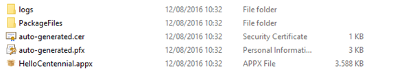
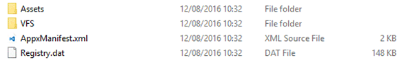
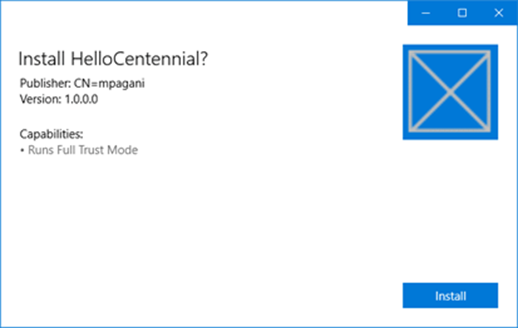
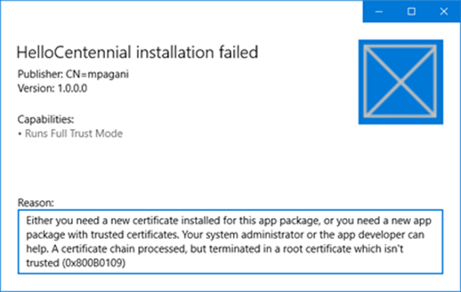
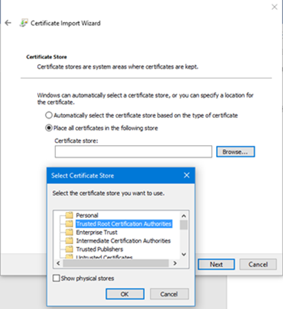
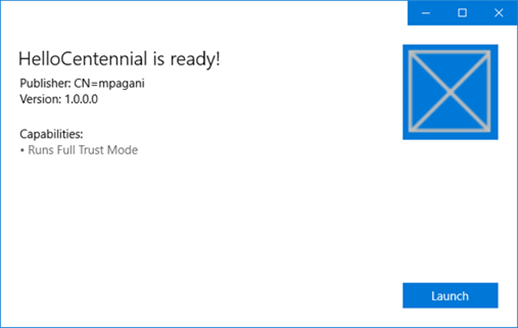
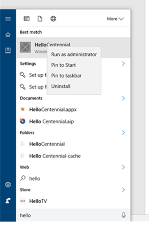
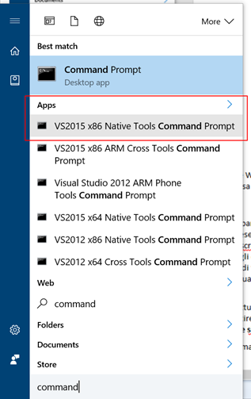
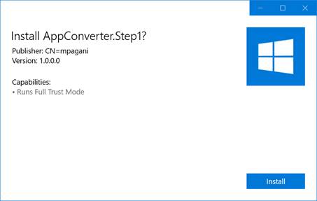

# Desktop Bridge: utilizzare il Desktop App Converter 

*Questo articolo è stato scritto da [Matteo
Pagani](http://twitter.com/qmatteoq), Windows AppConsult Engineer in
Microsoft*

In uno degli articoli precedenti abbiamo introdotto il Desktop Bridge, ovvero
la serie di tool rilasciati con l’Anniversary Update di Windows 10 che
consentono di creare un ponte tra le applicazioni Win32 e la Universal
Windows Platform, permettendoci di sfruttare i vantaggi di entrambi i
mondi. Non ripeterò quali sono i vantaggi nell’adozione di questa
tecnologia o quali sono i meccanismi di conversione supportati al
momento: queste (e altre) domande trovano risposta nell'articolo precedente.

Al termine dell'articolo avevamo iniziato ad avviare la procedura di
installazione del Desktop App Converter, ovvero uno degli strumenti
messi a disposizione dal bridge, che ci permette di prendere
un installer (come un exe o un msi) e convertirlo in un’applicazione
UWP, che può essere poi pacchettizzata e distribuita tramite un file
AppX. Ancora una volta, vi rimando all'articolo precedente per seguire i vari
passaggi di configurazione, che vi porteranno ad avere il Desktop App
Converter (insieme ai tool di sviluppo per la Universal Windows
Platform) installato e pronto per essere utilizzato. Per testare il
processo di conversione è possibile utilizzare qualsiasi installer, a
patto che rispetti i requisiti già descritti in precedenza e che, vi
ricordo, sono elencati nella documentazione ufficiale MSDN:
<https://msdn.microsoft.com/en-us/windows/uwp/porting/desktop-to-uwp-root>

Per semplificare la procedura di conversione di cui andrò a parlarvi in
questo articolo, partiremo dall’installer di una semplice applicazione
Windows Forms che ho realizzato e che è scaricabile da GitHub
all’indirizzo
<https://github.com/qmatteoq/DesktopBridge/blob/master/1.%20Desktop%20App%20Converter/HelloCentennial.msi>

Questo installer ha il duplice vantaggio:

1.  Di essere un file MSI e, di conseguenza, supportare in automatico
    l’installazione silenziosa, ovvero senza la necessità di intervento
    da parte dell’utente.
2.  L’applicazione, pur nella sua semplicità, è un buon esempio di
    fusione tra i due mondi: l’app sarà convertita e distribuita come
    AppX, ma esegue un’operazione (ovvero la scrittura di un file di
    testo sul desktop dell’utente) che in un’applicazione UWP nativa non
    sarebbe consentita, se non dietro esplicito consenso dell’utente
    tramite una finestra di dialogo (generata usando la classe
    **FileSavePicker**).

Ora che siamo in possesso di un installer con cui poter fare qualche
esperimento, possiamo iniziare il processo di conversione. Vi ricordo
che tutti gli esempi riportati di seguito saranno basati sulla versione
standard del tool, che si scarica manualmente e che è basata su uno
script Powershell di nome **DesktopAppConverter.ps1** (e, di
conseguenza, tutte le operazioni che andremo a fare richiederanno una
console Powershell con diritti di amministratore). In alternativa,
[potete scaricare il tool direttamente dallo
Store](https://www.microsoft.com/store/apps/9nblggh4skzw): in questo
caso, dovremo comunque lanciare l’applicazione con diritti di
amministratore, ma utilizzeremo un normale prompt dei comandi con un
eseguibile chiamato **DesktopAppConverter.exe**.  Iniziamo perciò il
processo aprendo la nostra console Powershell con diritti di
amministratore, nella quale dobbiamo posizionarci, come percorso, nella
cartella in cui abbiamo scompattato il Desktop App Converter. Ecco il
comando da eseguire che ci permetterà di effettuare la conversione:

```ps
PS C:\>.\DesktopAppConverter.ps1 -Installer C:\Installer\HelloCentennial.msi -Destination C:\Output\HelloCentennial -PackageName "HelloCentennial" -Publisher "CN=<publisher_name>" -Version 1.0.0.0 -MakeAppx -Verbose -Sign
```

Di seguito trovate una descrizione dettagliata dei vari parametri
richiesti:

-   **-Installer** rappresenta il percorso del file di setup che
    vogliamo convertire.
-   **-Destination** rappresenta la cartella dove vogliamo che il tool
    memorizzi tutti i file che saranno creati al termine del’operazione
-   **-PackageName** è il nome del pacchetto che vogliamo creare
-   **-Publisher** è il publisher name della società che
    pubblicherà l’applicazione. Se avete esperienza con lo sviluppo di
    applicazioni UWP, ricorderete di aver già visto questo valore
    all’interno del file di manifest: viene assegnato direttamente dal
    Dev Center nel momento in cui aprite un account sviluppatori. Se il
    vostro obiettivo è pubblicare l’applicazione sullo Store, deve
    coincidere con quello che trovate nella vostra Dashboard del
    Dev Center.
-   **-Version** è il numero di versione dell’applicazione.
-   **-MakeAppx:** come vedremo, lo scopo principale del Desktop App
    Converter è quello di creare una cartella con, al suo interno, la
    struttura in formato UWP dell’applicazione Win32. Abilitando questo
    parametro, il tool si farà carico anche dello step successivo (che,
    altrimenti, dovremmo fare a mano), ovvero creare direttamente il
    pacchetto AppX per la distribuzione.
-   –**Sign**: anche in questo caso, questo comando non è strettamente
    legato al processo di conversione, ma al fatto che un pacchetto
    AppX, per poter essere installato su un device, debba essere firmato
    digitalmente con un certificato valido. Questo parametro farà si che
    il tool generi in automatico un certificato autentico e lo utilizzi
    per firmare l’AppX prodotto.
-   **-Verbose** è semplicemente un parametro di logging: abilitandolo,
    potremo vedere in dettaglio le operazioni svolte dal tool durante il
    processo di conversione.

Esiste un altro parametro opzionale, che qui non ho specificato,
chiamato –**InstallerArguments**, che consente di passare dei parametri
aggiuntivi all’installer che deve essere convertito. Questo parametro
risulta utile per tutti quegli installer che, di base, richiedono
l’intervento dell’utente durante il processo di installazione (ad
esempio, tramite la pressione di una serie di pulsanti Next piuttosto
che la conferma del percorso dove sarà installata l’applicazione) ma che
offrono anche la possibilità di eseguire un’installazione silenziosa
(requisito indispensabile affinché il Desktop App Converter sia in grado
di completare il processo), previa specifica, per l’appunto, di un
parametro in fase di avvio del setup. Nel caso dell’installer di prova
che ho messo a disposizione, questo parametro non è necessario perché,
di base, essendo un MSI, supporta già una modalità di installazione
silenziosa. Ipotizzando, invece, che non sia questo il caso e che
l’installer vada lanciato con il comando **Setup.exe /s**, il comando
Powershell da eseguire sarebbe:

```ps
PS C:\>.\DesktopAppConverter.ps1 -Installer C:\Installer\Setup.exe -Destination C:\Output\HelloCentennial -PackageName "HelloCentennial" -Publisher "CN=<publisher_name>" -Version 1.0.0.0 -MakeAppx -Verbose -Sign -InstallerArguments "/s"
```

Ma cosa succede durante il processo di conversione vero e proprio? Il
tool si fa carico di catturare tutte le modifiche effettuate dal
processo di setup (file copiati, chiavi di registro create, ecc.) e di
memorizzarle, così che possano essere replicate all’interno del
container in cui sarà eseguita l’applicazione. Questa è la motivazione
per cui un’applicazione distribuita tramite AppX è in grado di offrire
un maggior grado di sicurezza e affidabilità: tutte le operazioni di
lettura verranno effettuate sull’infrastruttura di Windows nativa (come,
ad esempio, il registro di sistema), ma quelle di scrittura saranno
effettuate, invece, su una versione virtualizzata che, in tempo reale,
sarà unita con quella reale.

Di conseguenza, quando l’applicazione sarà disinstallata, la procedura
sarà la stessa di un’applicazione UWP tradizionale: la cartella
dell’applicazione e i relativi dati saranno semplicemente eliminati,
senza lasciare alcuno “scarto” nel sistema (come file o chiavi di
registro orfane), cosa che invece spesso avviene con gli installer
tradizionali e che è una delle principali cause del degrado delle
performance di Windows nel corso del tempo.

Al termine del processo, otterrete una cartella simile alla seguente:



Il fatto che ci sia già un pacchetto con estensione .appx e una serie di
certificati è dovuto all’utilizzo dei parametri –**MakeAppx** e
–**Sign** in fase di utilizzo del comando. Il vero cuore del processo di
conversione è contenuto nella cartella **PackageFiles**, che rappresenta
la struttura di un progetto UWP, ma adattato per contenere
un’applicazione Win32, come potete vedere nell’immagine seguente:



Come potete vedere, la struttura della cartella è molto simile a quella
che Visual Studio crea quando si crea un nuovo progetto UWP. C’è una
cartella chiamata **Assets**, che contiene le immagini predefinite che
vengono usate per la tile e per le varie icone del menu Start; c’è un
file di manifest, chiamato **AppxManifest.xml**, che permette di
configurare le informazioni e le capability che sfrutta l’applicazione.

Se aprite il file con un editor di testo, noterete che è praticamente lo
stesso di un’applicazione UWP tradizionale, con però un paio di
differenze:

-   Tra le capability, ne troverete una che consente all’applicazione di
    essere eseguita in modalità full trust, ovvero avere accesso a
    funzionalità che normalmente sono precluse ad un’applicazione UWP
    tradizionale:

```xml
<Capabilities>
  <rescap:Capability Name="runFullTrust" />
</Capabilities>
```

-   Trovere una sezione chiamata **Application** che contiene tutte le
    informazioni relative al processo Win32 che il container UWP
    eseguirà:

```xml
<Application Id="HelloCentennial" Executable="Hello Centennial\HelloCentennial.exe" EntryPoint="Windows.FullTrustApplication">
```

Infine, troverete una serie di file e cartelle che sono stati
“catturati” dal tool durante il processo di conversione. Ad esempio, il
file **Registry.dat** contiene tutte le modifiche effettuate al registro
di sistema. Oppure, se provate ad esplorare il contenuto della cartella
**VFS**, troverete tutti i file che vengono copiati dall’installer
durante il setup, come il collegamento che viene incluso nel menu Start.

Il fatto di aver aggiunto, nello script di conversione, il parametro
–**MakeAppx** ci ha risparmiato un passaggio manuale (che, più avanti,
vedremo comunque in dettaglio), generando per noi il pacchetto AppX
partendo dal contenuto della cartella **PackageFiles** che abbiamo
appena visto. Questo è il pacchetto che possiamo condividere con altri
utenti, distribuire all’interno di un ambiente enterprise o pubblicare
sullo Store, previa autorizzazione da parte di Microsoft.

Facendo doppio clic sul file **HelloCentennial.appx** potrete vedere in
azione la novità dell’Anniversary Update riportata nell'articolo precedente:
ora i pacchetti AppX possono essere installati direttamente con un setup
visuale, senza dover passare per l’esecuzione di script Powershell, come
potete vedere nell’immagine seguente:



Se, però, provaste a premere il pulsante **Install** vi accorgerete
subito che c’è qualcosa che non va:



Se ricordate quanto detto nell'articolo precedente, dovreste capirne il
motivo: le nuove funzionalità dell’Anniversary Update consentono una
distribuzione e installazione molto più semplice dei pacchetti AppX ma,
per una questione di sicurezza dell’utente finale, questo non vi esenta
dal dover firmare digitalmente i pacchetti. La firma digitale, infatti,
attesta l’originalità dell’installer e che non si tratti, ad esempio,
del tentativo di uno sviluppatore malevolo di distribuire un malware
spacciandolo per un’altra applicazione. E’ lo stesso livello di
protezione che viene applicato oggi agli installer tradizionali: se
cercate di installare un’applicazione che non è stata firmata con un
certificato valido, Windows la identificherà come non sicura e vi
chiederà di seguire una serie di passaggi extra se volete procedere a
vostro rischio e pericolo.

In realtà, se ricordate, abbiamo applicato il parametro –**Sign**
durante il processo di conversione: il pacchetto, perciò, è stato già
firmato con un certificato digitale. Il motivo dell’errore, infatti, è
un altro: il pacchetto è stato firmato con un certificato auto generato
dal tool, non con un certificato rilasciato da una Certification
Authority autorizzata. Di conseguenza, l’installazione fallisce perchè
il certificato con cui è stato firmato il pacchetto non è presente tra
quelli autorizzati all’interno di Windows. Dobbiamo, perciò, procedere
ad installare tale certificato, che troveremo all’interno della cartella
di output del tool **PackageFiles**: il nome del file è
**auto-generated.cer.** Fate doppio clic sul file, scegliete l’opzione
**Install certificate** e, quando vi viene richiesto dove installarlo,
selezionate **Local machine** e poi la voce **Place all certificates in
the following store**. Premendo il pulsante **Browse**, Windows vi farà
scegliere in quale store memorizzare il certificato: affinché sia
riconosciuto come valido, dove salvarlo nello store di nome **Trusterd
Root Certification Authorities**.



Se ora riprovaste a lanciare il pacchetto **HelloCentennial.appx** e a
premere il pulsante **Install,** vedrete che questa volta
l’installazione andrà a buon fine e, al termine del processo, il
pulsante cambierà la sua funzione in **Launch** per avviare l’app:




A questo punto avete installato, a tutti gli effetti, un’applicazione
UWP che, in realtà, funge da container di un’applicazione Win32. Se la
cercate all’interno del menu Start, vedrete che avrà il classico aspetto
di un’applicazione UWP: l’icona mostrata sarà quella di default (che era
contenuta nella cartella **Assets**) e, facendoci clic sopra con il
tasto destro, avrete accesso ad una serie di opzioni, tra le quali
**Uninstall** che, tipicamente, le applicazioni Win32 non hanno (o che,
se disponibile, vi rimanda semplicemente al classico pannello di
controllo per la disinstallazione delle applicazioni).



Se la eseguite, vedrete però che si tratterà di un’applicazione Windows
Forms a tutti gli effetti e, premendo il pulsante presente
nell’interfaccia utente, sarà creato sul vostro desktop un file di nome
**centennial.txt**, operazione che ad un’applicazione UWP tradizionale
non sarebbe concessa se non tramite l’uso dell’API **FileSavePicker**
(che, però, avrebbe richiesto all’utente tramite una finestra di dialogo
di selezionare la posizione in cui salvare il file).

### Creare e firmare il pacchetto in maniera manuale

Nell’esempio precedente, non abbiamo dovuto fare nulla di particolare
per ottenere un pacchetto AppX debitamente firmato, se non aggiungere
alcuni parametri allo script del Desktop App Converter. In alcuni casi,
però, si ha la necessità di intervenire manualmente. Abbiamo visto, ad
esempio, che il tool ha generato per noi una cartella **Assets**
contenente delle immagini di default per le icone e per le tile che,
difficilmente, saranno quelle che useremo per l’applicazione reale: come
potete vedere dallo screenshot precedente, si tratta infatti della
classica X su sfondo trasparente. Una delle prime operazioni da fare,
perciò, sarà quella di generare delle immagini più idonee e sostituirle
a quelle già esistenti. Inoltre, trattandosi a tutti gli effetti di
un’applicazione UWP, abbiamo la possibilità di agire sul file di
manifest per aggiungere ulteriori funzionalità, come l’aggiornamento
della tile in maniera periodica o la registrazione di protocolli e
associazioni di tipi di file. Inoltre, le applicazioni convertite hanno
accesso ad una serie di estensioni e capability riservate, che
un’applicazione UWP tradizionale non può sfruttare, come la possibilità
di aggiungere delle voci nel menu contestuale di File Explorer. Trovate
l’elenco completo di queste estensioni all’indirizzo
<https://msdn.microsoft.com/en-us/windows/uwp/porting/desktop-to-uwp-extensions>

Una volta che abbiamo effettuato qualsiasi modifica alla struttura o al
contenuto della cartella **PackageFiles**, però, ci troviamo di fronte
alla necessità di dover ricreare un nuovo pacchetto. In questo caso,
l’utilizzo del Desktop App Converter non ci sarebbe d’aiuto: non
dobbiamo più partire, infatti, da un installer tradizionale, ma da un
progetto già convertito e pronto per essere trasformato in un pacchetto.
Per questo scopo, dobbiamo affidarci a due tool inclusi nell’SDK di
Windows 10, chiamati **makeappx.exe e signtool.exe** che, dietro le
quinte, sono gli stessi utilizzati dal Desktop App Converter nel momento
in cui abbiamo aggiunto i parametri –**MakeAppx** e –**Sign**.

Per accedere a questi tool, possiamo aprire un prompt dei comandi di
Visual Studio, che ha già le variabile d’ambiente impostate nella
maniera corretta per poterli richiamare da qualsiasi cartella:



In alternativa, se preferite utilizzare un prompt dei comandi
tradizionale, li trovate inclusi all’interno del percorso **C:\\Program
Files (x86)\\Windows Kits\\10\\bin\\x64\\.**

Per poter ricreare il pacchetto AppX partendo dalla cartella
**PackageFiles** dobbiamo eseguire il seguente comando:

```
makeappx pack -d "C:\Output\HelloCentennial\PackageFiles" -p "C:\Output\HelloCentennial\HelloCentennial.appx"
```

I parametri richiesti sono:

-   **pack**, che rappresenta l’azione di creare un pacchetto partendo
    da una cartella
-   **-d**, che rappresenta il percorso della cartella che vogliamo
    convertire in un pacchetto (la nostra **PackageFiles**, nel
    nostro esempio)
-   **-p**, che rappresenta il percorso e il nome del file che vogliamo
    dare al file AppX

Al termine del processo, otterrete un nuovo pacchetto AppX, aggiornato
con le modifiche apportate al contenuto della cartella **PackageFiles**.
L’immagine seguente vi mostra, ad esempio, un nuovo pacchetto creato
partendo da una cartella **PackageFiles** nella quale sono stati
sostituiti gli asset predefiniti:



Manca però un passaggio: se provaste a procedere con l’installazione, vi
imbattereste nel seguente errore:


Il motivo è che abbiamo eseguito solo uno dei due step che, in
precedenza, erano a carico del Desktop App Converter: la creazione del
pacchetto, ma non l’applicazione della firma digitale. A questo scopo ci
serve il tool **signtool.exe** e i file **.cer** e **.pfx** che sono
stati generati in precedenza insieme al pacchetto. A questo punto,
possiamo procedere a firmare il file AppX con il seguente comando:

```
signtool.exe sign /a /v /fd SHA256 /f "C:\Output\HelloCentennial\auto-generated.pfx" /p "123456" "C:\Output\HelloCentennial\HelloCentennial.appx"
```

I principali parametri richiesti sono:

-   **/f**, che rappresenta il percorso del file **.pfx**
-   **/p**, che rappresenta la password con cui è stato generato il
    file .pfx. Nel caso dei certificati auto generati dal Desktop App
    Converter, la password predefinita è **123456**.
-   L’ultimo parametro è il percorso del file AppX che vogliamo firmare.

Il gioco è fatto: se abbiamo fatto tutto correttamente, ora dovremmo
essere in grado di installare senza problemi la nuova versione del
pacchetto (dato che avevamo già installato in precedenza il certificato
**auto-generated.cer** e, di conseguenza, è già riconosciuto come
valido).

Il certificato di test è ottimo per i nostri esperimenti ma, nel mondo
reale, difficilmente li useremo in scenari di produzione: in questi
casi, il pacchetto sarà firmato con un certificato aziendale o
acquistato tramite una Certification Authority globale. In questo caso,
è possibile generare i file .cer e .pfx necessari al tool
**signtool.exe** utilizzando altri due strumenti inclusi nell’SDK,
ovvero **MakeCert.exe** (per creare il certificato) e
**pvk2pfx.exe**(che serve per includere, all’interno del certificato, le
chiavi pubbliche e private). Trovate la procedura completa da seguire
all’indirizzo
<https://msdn.microsoft.com/en-us/windows/uwp/porting/desktop-to-uwp-signing>

Una nota molto importante: nel momento in cui usate il tool
**MakeCert.exe** per generare il certificato, vi sarà richiesta tra le
informazioni il publisher name, come nell’esempio seguente:

```
C:\> MakeCert.exe -r -h 0 -n "CN=<publisher_name>" -eku 1.3.6.1.5.5.7.3.3 -pe -sv <my.pvk> <my.cer>
```

Tale publisher name deve coincidere con quello specificato nel file di
manifest contenuto nella cartella **PackageFiles**, che è stato indicato
in fase di utilizzo del Desktop App Converter tramite il parametro
–**Publisher**. Tale valore viene incluso all’interno dell’attributo
**Publisher** della sezione **Identity**, come evidenziato nell’esempio
seguente:

```xml
<Identity Name="HelloCentennial" ProcessorArchitecture="x64" Publisher="CN=mpagani" Version="1.0.0.0" />
```

A questo punto, al termine della procedura, otterremo un file **.pfx** e
un file **.cer,** con i quali dovremo ripetere i passaggi visti in
precedenza con l’utilizzo dello strumento **signtool.exe**

### In conclusione

Nel corso di questo articolo abbiamo visto come utilizzare, in maniera più
approfondita, il Desktop App Converter per trasformare una classica
applicazione Win32 in un pacchetto AppX, dandoci la possibilità perciò
di espanderla aggiungendo alcune funzionalità tipiche del mondo UWP
(come l’utilizzo di una tile o di estensioni) e introducendo nuove
modalità di distribuzione (come lo Store) a quelle classiche. Nelle
prossime settimane continueremo l’esplorazione del Desktop Bridge
analizzando gli altri tool disponibili, che ci permetteranno non solo di
convertire l’applicazione così com’è, ma anche di aggiungere nuove
funzionalità utilizzando API della Universal Windows Platform.

Vi ricordo che potete trovare il materiale di esempio utilizzato nel
corso dell’articolo sul mio repository GitHub all’indirizzo
<https://github.com/qmatteoq/DesktopBridge>

Happy coding!


