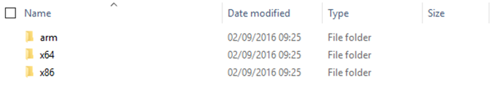
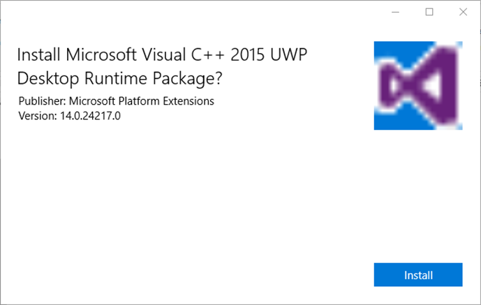

# Desktop Bridge: gestire le dipendenze da librerie C e C++ con il Desktop App Converter


*Questo post è stato scritto da [Matteo
Pagani](http://twitter.com/qmatteoq), Windows AppConsult Engineer in
Microsoft*

[Nel post
precedente](https://blogs.msdn.microsoft.com/italy/2016/09/16/guest-post-desktop-bridge-utilizzare-il-desktop-app-converter/)
abbiamo imparato a convertire l’installer di un’applicazione desktop
tradizionale (basata su tecnologie Win32 come il framework .NET, C,
Delphi, Java, ecc.) in un pacchetto AppX, così da poter iniziare a
sfruttare il meglio dei due mondi: la stabilità e la maturità del mondo
Win32 e la maggiore sicurezza e le potenzialità offerte dal nuovo
meccanismo di deployment della Universal Windows Platform. In alcuni
casi, vi potrebbe capitare di lavorare con applicazioni sviluppate in
codice nativo o che hanno dipendenze da componenti scritti in C / C++.
Per accorgervi di questi scenari, è sufficiente tenere sotto controllo
l’output del Desktop App Converter: se vi trovate in questo scenario, al
termine del processo di conversione, troverete un messaggio di avviso
simile al seguente.

>"Warning Summary:
W_PACKAGE_DEPENDENCY_ADDED a dependency on framework package 'Microsoft.VCLibs.140.00.UWPDesktop' was added to the AppxManifest.xml. See 'http://go.microsoft.com/fwlink/?LinkId=821959' for guidance on installing the package prior to local deployment. Otherwise, if th
is is in error, remove the corresponding entry from Dependencies in the AppxManifest.xml before packaging and deploying
your application. "

Il messaggio è piuttosto auto esplicativo: il Desktop App Converter ha
trovato una dipendenza dalla versione 14.0 delle librerie VCLibs
(necessarie per l’uso di componenti Visual C / C++) e, di conseguenza,
ha modificato il file di manifest dell’applicazione per supportarla. Se
ora, infatti, provaste ad aprire il file **AppxManifest.xml** contenuto
all’interno della cartella **PackageFiles** creata dal tool, troverete
la seguente definizione nella sezione **Dependencies:**

```xml
<Dependencies>
  <TargetDeviceFamily Name="Windows.Desktop" MinVersion="10.0.14393.0" MaxVersionTested="10.0.14393.0" />
  <PackageDependency Name="Microsoft.VCLibs.140.00.UWPDesktop" MinVersion="12.0.40652.5" Publisher="CN=Microsoft Corporation, O=Microsoft Corporation, L=Redmond, S=Washington, C=US" />
</Dependencies>
```

Come potete notare, oltre alla dipendenza standard dalla versione
Desktop della Universal Windows Platform nella versione 14393
(l’Anniversary Update), è stata aggiunta una nuova dipendenza ad un
pacchetto di nome **Microsoft.VCLibs.140.00.UWPDesktop** pubblicato da
Microsoft.

Il problema è che se ora cercaste di installare l’AppX appena generato
sul vostro computer, otterreste un errore relativo al fatto che il
pacchetto non è in grado di soddisfare le dipendenze necessarie oppure è
stato compilato per un architettura differente. La motivazione è che,
come comportamento predefinito, la versione UWP delle librerie di Visual
C/C++ richieste dal Desktop Bridge non sono preinstallate in Windows 10.
Il messaggio di avviso mostrato al termine della conversione, infatti,
vi rimanda alla seguente pagina:
<https://blogs.msdn.microsoft.com/vcblog/2016/07/07/using-visual-c-runtime-in-centennial-project/>
Si tratta di un post del blog del team di Visual Studio che spiega il
funzionamento di queste dipendenze ma, soprattutto, contiene i link per
le varie versioni UWP delle librerie:

-   [VC 14.0 framework packages for Desktop
    Bridge](https://www.microsoft.com/en-us/download/details.aspx?id=53175)
-   [VC 12.0 framework packages for Desktop
    Bridge](https://www.microsoft.com/en-us/download/details.aspx?id=53176)
-   [VC 11.0 framework packages for Desktop
    Bridge](https://www.microsoft.com/en-us/download/details.aspx?id=53340&WT.mc_id=DX_MVP4025064)

Dovete scaricare la versione corretta in base al messaggio di avviso che
vi ha mostrato il Desktop App Converter e alla dipendenza che è stata
aggiunta all’interno del file di manifest. Nell’esempio, precedente, il
tool ha aggiunto una dipendenza al pacchetto di nome
**Microsoft.VCLibs.140.00.UWPDesktop**, di conseguenza dovrete scaricare
la versione disponibile al primo dei tre link.

In tutti i casi, il setup andrà a creare una cartella all’interno del
percorso *C:\\Program Files (x86)\\Microsoft SDKs\\Windows
Kits\\10\\ExtensionSDKs\\,* dove troverete una sotto cartella per ognuna
delle versioni da voi installate. Ad esempio, nel caso della versione
14.0, troverete le versioni UWP della libreria che vi servono
all’interno del percorso *C:\\Program Files (x86)\\Microsoft
SDKs\\Windows
Kits\\10\\ExtensionSDKs\\Microsoft.VCLibs.Desktop\\14.0\\Appx\\Retail*



All’interno della cartella troverete una versione per ogni architettura:
nel nostro caso, ci interessa installare solamente quelle relative a x86
e x64, dato che le applicazione convertite tramite Desktop Bridge non
possono essere eseguite su dispositivi dotati di processori ARM (come un
telefono o una Raspberry Pi). Entrate perciò sia nelle cartelle x64 e
x86, dove troverete un file .appx con un nome del tipo
**Microsoft.VCLibs.x86.14.00.Desktop.appx** (ovviamente, al posto di
14.00 ci potrebbe essere 12.00 o 11.00 a seconda della versione di
Visual C usata dalla vostra applicazione). Fate doppio clic sul file e
procedete ad installarlo come se fosse un pacchetto AppX qualsiasi:



L’unica differenza è che, al termine dell’installazione, non dovrete
premere il pulsante **Launch:** trattandosi di librerie e non di
un’applicazione vera e propria, non è possibile eseguirle nel senso
tradizionale del termine. Dietro le quinte, però, la procedura avrà
installato le dipendenze richieste dall’applicazione originale che
avevate convertito: ciò significa che ora potrete ripetere
l’installazione del’AppX originale ma, a questo punto, non otterrete più
alcun errore ma l’installazione andrà regolarmente a buon fine.

**Importante!** Questa procedura è necessaria solamente in fase di
testing / deploy manuale, ovvero quando dovete installare manualmente il
pacchetto AppX sul vostro PC o su quello di altri utenti. Nel caso di
distribuzione tramite lo Store, non avrete questo problema: ci penserà
lo Store, infatti, a risolvere la dipendenza e ad installare la versione
richiesta della libreria insieme all’applicazione vera e propria.


